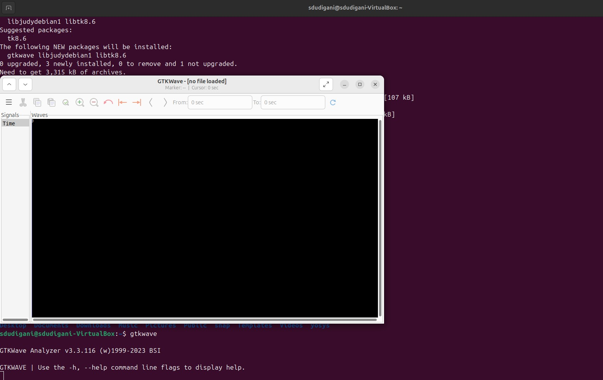
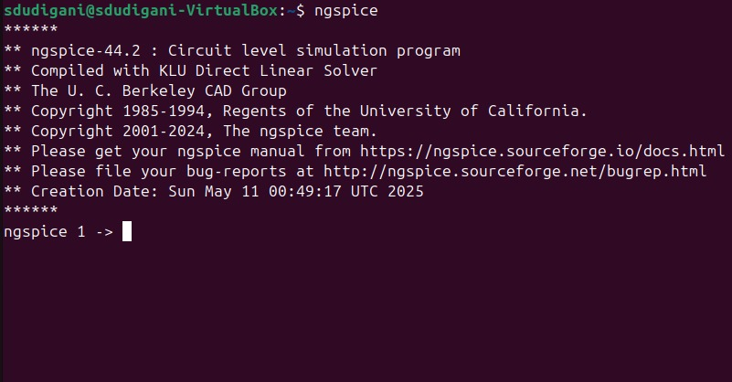
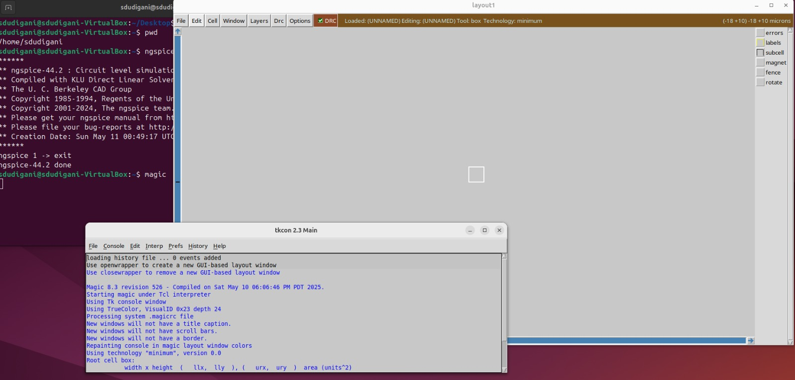

# VSD Hardware Design Program

<details>
  <Summary><strong> Week 0 - Day 0 - Tools Installation</strong></summary>
  
#### All the instructions for installation of required tools can be found here:

## 📚 Contents
1. [System Check](#-system-check)
2. [Tool Check](#-tool-check)
3. [Tool Versions](#-tool-versions)
   
## <ins> System Check</ins>
       - 6 GB RAM  
       - 50 GB HDD  
       - Ubuntu 20.04+  
       - 4 vCPU  
       
#### Resizing the Ubuntu window to fit the screen
  ```bash
    $ sudo apt update
    $ sudo apt install build-essential dkms linux-headers-$(uname -r)
    $ cd /media/sdudigani/VBox_GAs_7.1.8/
    $ ./autorun.sh
  ```

## <ins> Tool Check</ins>
  #### 1. Yosys
  ```bash
      $ sudo apt-get update
      $ git clone https://github.com/YosysHQ/yosys.git
      $ cd yosys
      $ sudo apt install make  # If make is not installed
      $ sudo apt-get install build-essential clang bison flex \
          libreadline-dev gawk tcl-dev libffi-dev git \
          graphviz xdot pkg-config python3 libboost-system-dev \
          libboost-python-dev libboost-filesystem-dev zlib1g-dev
      $ make config-gcc
      $ make
      $ sudo make install
  ```


  #### 2. iverilog
  ```bash
      $ sudo apt-get update
      $ sudo apt-get install iverilog
  ```


  #### 3. gtkwave
  ```bash
    $ sudo apt-get update
    $ sudo apt install gtkwave
  ```


  #### 4. ngspice
  ##### After downloading the tarball from https://sourceforge.net/projects/ngspice/files/ to a local directory, unpack it using:
  ```bash
    $ tar -zxvf ngspice-37.tar.gz
    $ cd ngspice-37
    $ mkdir release
    $ cd release
    $ ../configure --with-x --with-readline=yes --disable-debug
    $ make
    $ sudo make install
  ```


  #### 5. magic
  ##### Install the required dependencies:
  ```bash
    $ sudo apt-get install m4
    $ sudo apt-get install tcsh
    $ sudo apt-get install csh
    $ sudo apt-get install libx11-dev
    $ sudo apt-get install tcl-dev tk-dev
    $ sudo apt-get install libcairo2-dev
    $ sudo apt-get install mesa-common-dev libglu1-mesa-dev
    $ sudo apt-get install libncurses-dev
   ```
  ##### Clone and build Magic:
  ```bash
    $ git clone https://github.com/RTimothyEdwards/magic
    $ cd magic
    $ ./configure
    $ make
    $ sudo make install
  ```


## <ins> Tool Versions</ins>
```bash
  $ git --version
  $ docker --version
  $ python3 --version
  $ python3 -m pip --version
  $ make --version
```

</details>  

  
