# Day 1: Introduction to Verilog RTL design and Synthesis

## Contents
1. [Introduction to open-source simulator iverilog](#1-introduction-to-open-source-simulator-iverilog)
2. [Labs Using iverilog and gtkwave](#2-labs-using-iverilog-and-gtkwave)
3. [Introduction to Yosys and Logic Synthesis](#3-introduction-to-yosys-and-logic-synthesis)
4. [Labs Using yosys and sky130 PDKs](#4-labs-using-yosys-and-sky130-pdks)

## 1. Introduction to open-source simulator iverilog

### Introduction to iverilog design test bench

#### Simulator
- RTL design is checked for adherence to the spec by simulating the design.
- Simulator is the tool used for simulating the design : iverilog is the tool used for this course.

#### Design
- The design refers to the actual Verilog code or a collection of Verilog modules that implement the intended digital functionality.
- This code is written to satisfy the design specifications and meet the required behavior defined in the project or problem statement.

#### TestBench
- A TestBench is a setup used to apply stimulus (also called test vectors) to the design in order to verify its functionality.
- It mimics the input environment and checks whether the design behaves as expected under different conditions.

#### How Simulator Works?
- Simulator looks for the changes on the input signals.
- Upon change to the input, the output is evaluated.
   - If no change to the input, no change to the output!
- Simulator is looking for change in the values of input!

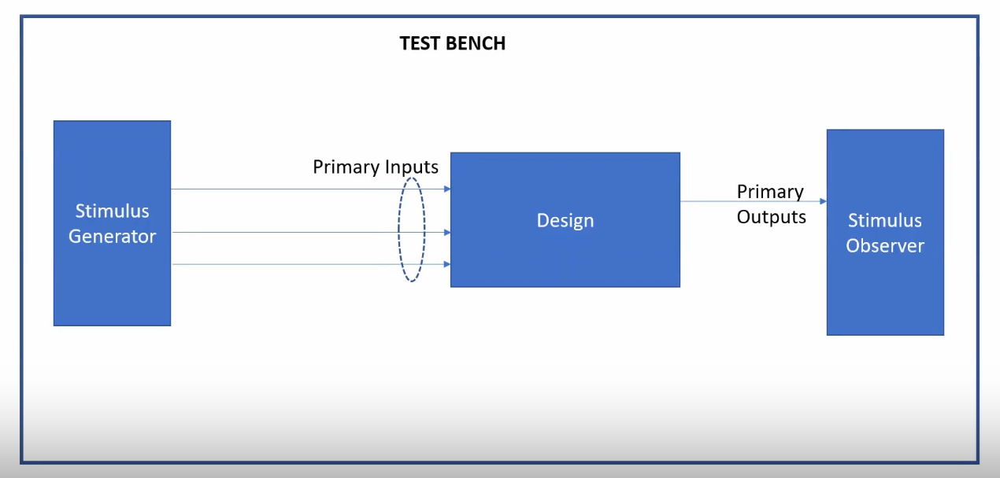

#### iverilog - Based Simulation Flow
The simulation process involves the following steps:
  1. Design File: Contains the RTL code written in Verilog.
  2. Testbench File: Stimulates the design with input vectors and monitors output.
  3. Both files are compiled using the iverilog tool.
  4. The simulation generates a <strong> .vcd (Value Change Dump)</strong> file that logs all signal transitions over time.
  5. The .vcd file is then visualized using <strong> gtkwave</strong>, a waveform viewer.

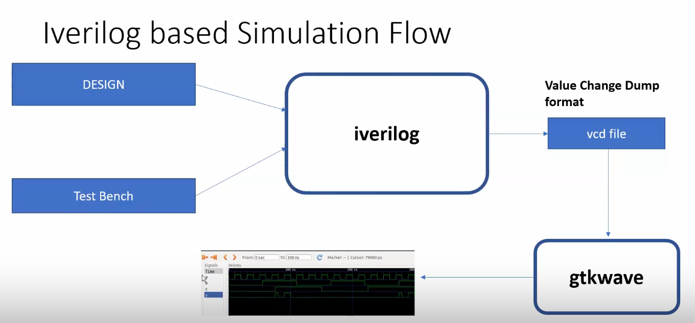

## 2. Labs Using iverilog and gtkwave

### Lab 1 - Introduction
#### Setup
- cd ~
- mkdir VLSI
- cd VLSI
- mkdir vsdflow
- git clone https://github.com/kunalg123/sky130RTLDesignAndSynthesisWorkshop.git

### Lab 2 - iverilog gtkwave part1
#### Steps:
1. Navigate to the verilog_files directory
```bash
cd /home/sdudigani/VLSI/sky130RTLDesignAndSynthesisWorkshop/verilog_files
```

2. Compile the Design and Testbench using Icarus Verilog --> This will generate an executable output file named a.out.
```bash
iverilog good_mux.v tb_good_mux.v
```


3. Run the Simulation
```bash
./a.out
```
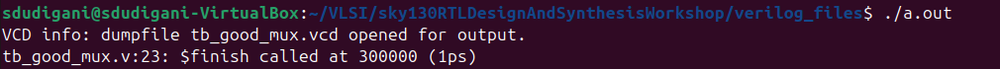

4. View the waveform using gtkwave
```bash
gtkwave tb_good_mux.vcd
```
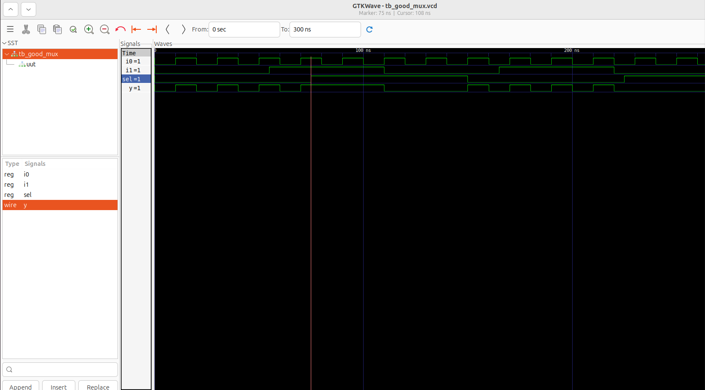


### Lab 2 - iverilog gtkwave part2
#### File Structure of 2:1 MUX Design and Testbench
<strong> <ins> good_mux.v</ins> </strong>
- Implements a 2:1 multiplexer using behavioral Verilog.
- Accepts three inputs: ```i0```, ```i1```, and ```sel```, and produces a single output ```y```.
- Uses an always @(*) block to assign the output:
   - If sel = 0, output follows i0.
   - If sel = 1, output follows i1.
- Output is defined using non-blocking assignment (<=) to mimic sequential behavior in simulation.

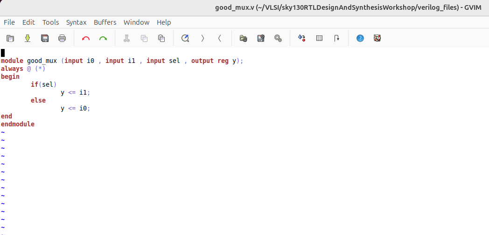

<strong> <ins> tb_good_mux.v</ins> </strong>
- Instantiates the ``` good_mux ``` module and drives it with test signals.
- Declares inputs (i0, i1, sel) as reg and the output (y) as wire.
- Applies periodic toggling to inputs using always blocks with different delays.
- Uses:
   - ```$dumpfile("tb_good_mux.vcd")``` to create a VCD file.
   - ```$dumpvars``` to record value changes during simulation.

The VCD file can be opened with GTKWave for waveform inspection and verification.

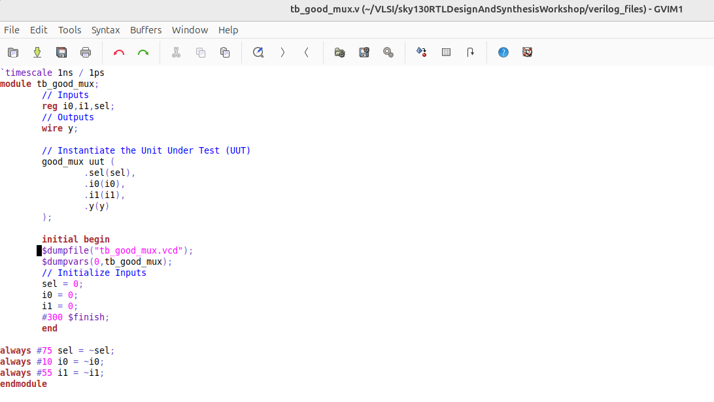

 
## 3. Introduction to Yosys and Logic Synthesis
### Introduction to Yosys
- <strong> Synthesizer</strong> : Tool used for converting the RTL to netlist
- <strong> Yosys</strong> is the synthesizer used here.

#### Yosys Flow
   - ```read_veriog``` : Reads the RTL design.
   - ```read_liberty``` : Loads the timing and cell information from the .lib file.
   - ```write_verilog``` : Writes the synthesized metlist to technology-specific cells.

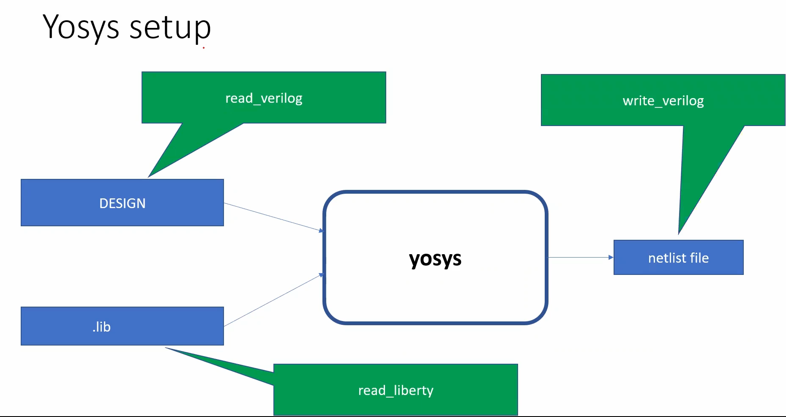

#### How to verify the synthesis?
- After synthesizing the RTL using Yosys, it is important to validate the netlist to ensure its behavior matches the original RTL design. This can be done using the same testbench and simulation flow as used for RTL.

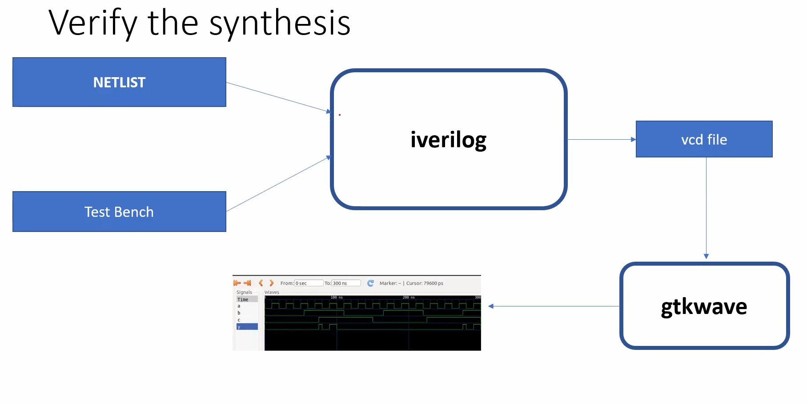

   ##### Flow Summary:
      1. Use the netlist generated from Yosys instead of the RTL.
      2. Reuse the same testbench file used for RTL verification.
      3. Compile both using iverilog to generate the simulation executable.
      4. Run the simulation and produce a .vcd file.
      5. Open the .vcd waveform using GTKWave.

<strong> Note:</strong> The primary inputs and outputs remain the same between RTL and the synthesized netlist. ✔️ Therefore, the same testbench can be reused to verify both! The waveform generated from the synthesized netlist should match the one observed during RTL simulation.

### Logic Synthesis part1 & part2
#### What is Synthesis?
Synthesis is the process of converting RTL (Register Transfer Level) Verilog code into a gate-level netlist using a standard cell library.
##### Key Steps:
- <strong> RTL Input</strong> : Behavioral Verilog code (Eg: ```good_mux.v```)
- <strong> Front-End Library</strong>: Contains technology-specific gate definitions like and2, or3, mux2, etc.
- <strong> Syntheis Tool (Yosys)</strong> : Maps RTL constructs to equivalent logic gates and establishes connections between gates based on design logic.
- <strong> Netlist Output</strong>: A structural Verilog file containing only standard cells and wires. Ready for downstream flows like logic simulation, timing analysis, or physical design.

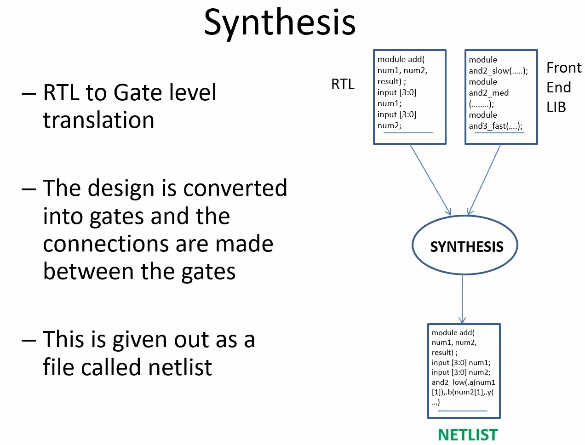

#### What is ```.lib``` ?
- A timing library (```.lib file```) is an ASCII-based representation of timing, power, and area information associated with standard cells in a given technology.
- Generated by characterizing cells under different PVT (Process, Voltage, Temperature) conditions.
- The delay calculation happens based on ```input transition``` (Slew) and the ```output capacitance``` (Load).
- Provides multiple variants (flavors) of each logic gate optimized for PPA:
   - Fast
   - Slow
   - Medium
- Example: A 2-input AND gate can have: ```and2_slow```, ```and2_med``` & ```and2_fast```.

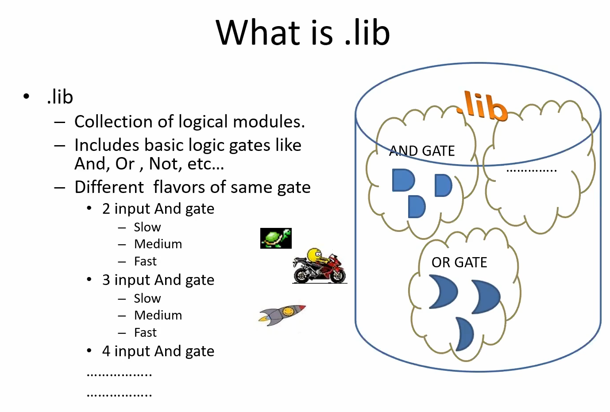
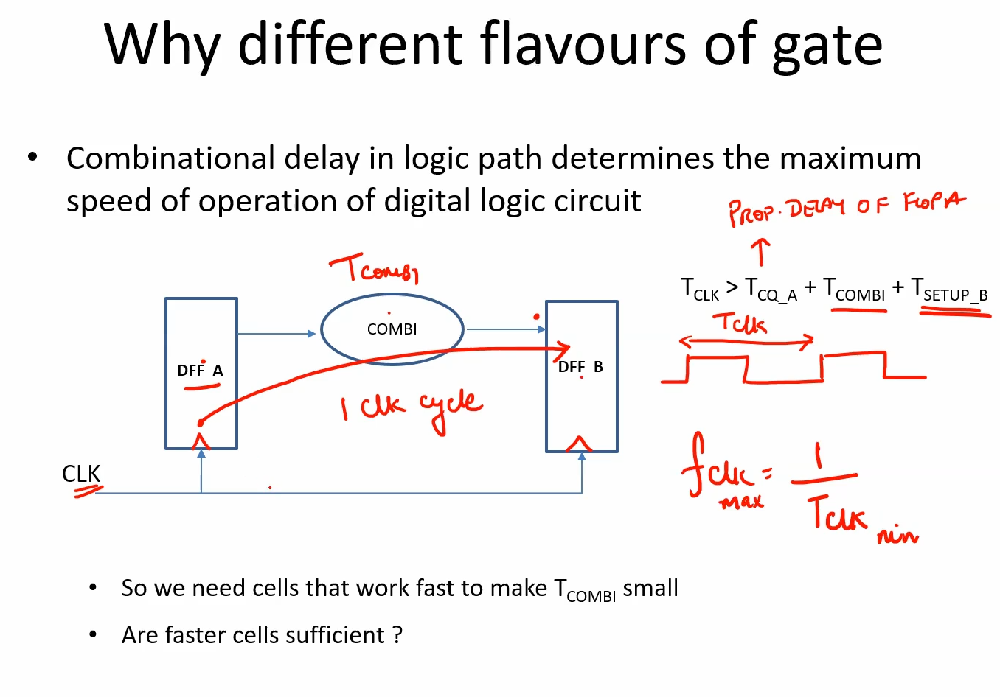


## 4. Labs Using yosys and sky130 PDKs
### L1 [good_mux Part1]

### L2 [good_mux Part2]

### L3 [good_mux Part3]


