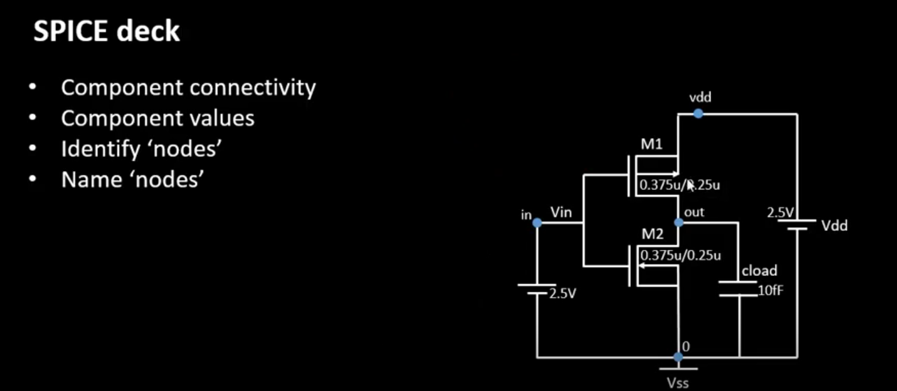
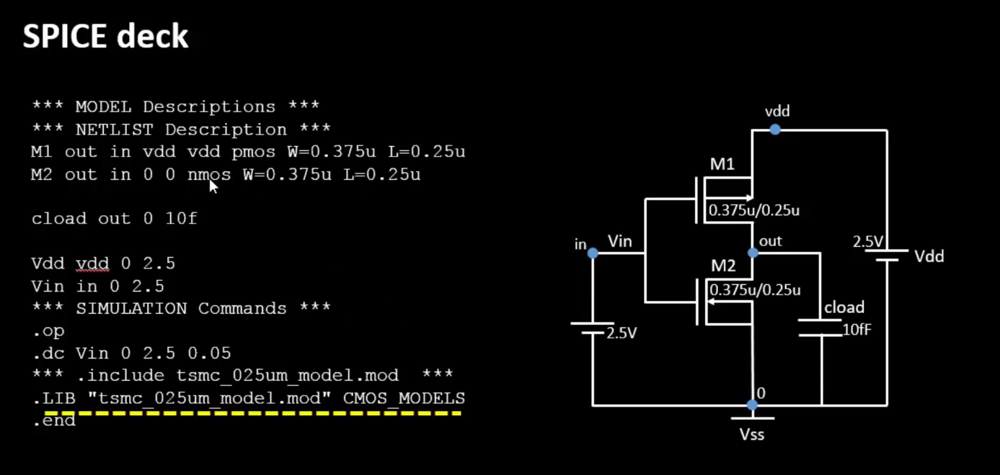

  
<strong> Day 10 : CMOS Switching Threshold and and Dynamic Simulations</strong>

# Contents
- [Voltage Transfer Charcateristics SPICE Simulations](#volatge-transfer-characteristics-spice-simulations)
  - [SPICE Deck Creation for CMOS inverter](#spice-deck-creation-for-cmos-inverter)
  - [SPICE Simulation for CMOS inverter](#spice-simulation-for-cmos-inverter)
  - [Labs Sky130 SPICE Simulation for CMOS](#labs-sky130-spice-simulation-for-cmos)   
- [Static Behavior Evaluation](#static-behavior-evaluation)
- [Switching Threshold Vm](#switching-threshold-v_m)
- [Analytical Expression of (W/L)p and (W/L)n as a function of Vm](#analytical-expression-of-w-l-and-w-l-as-a-function-of-v-m)
- [Static and Dyanamic Simulation of CMOS Inverter](#static-and-dynamic-simulation-of-cmos-inverter)
- [Static & Dynamic Simulation with Increased PMOS Width](#dynamic-simulation-with-increased-pmos-width)
- [Applications of CMOS Inverter in Clock Network and STA](#applications-of-cmos-inverter-in-clock-network-and-sta)
  

# Voltage Transfer Charcateristics SPICE Simulations

## SPICE Deck Creation for CMOS inverter

This image illustrates how to construct a SPICE deck for a CMOS inverter.
The SPICE input file contains following contents for writing an accurate and functional SPICE netlist for CMOS circuit simulations:

1. **Component Connectivity**  
   - How devices (transistors, capacitors, sources) interconnect node-to-node.  
   - Every terminal (drain/gate/source for MOSFETs) must reference a named node.  

2. **Component Values**  
   - Physical parameters: transistor W/L ratios, capacitances, resistor values, voltage levels, etc.  
   - Choose widths, lengths, and loads appropriate for your technology and performance goals.  

3. **Identify “Nodes”**  
   - Assign each distinct electrical junction a unique node name (e.g., `in`, `out`, `vdd`, `0`/`vss`).  
   - Ground is typically node `0`; supply rails use descriptive labels.  

4. **Name “Nodes”**  
   - Use consistent, human-readable node names to simplify debugging and post-processing.  
   - Example: label the input pin `Vin`, output node `out`, supply `Vdd`, and ground `Vss`. 

## SPICE Simulation for CMOS inverter

This image shows a complete SPICE deck and corresponding CMOS inverter circuit.

## Labs Sky130 SPICE Simulation for CMOS
    
  

      
<strong> day3_inv_vtc_Wp084_Wn036.spice</strong>

          
      *Model Description
      .param temp=27
      
      
      *Including sky130 library files
      .lib "sky130_fd_pr/models/sky130.lib.spice" tt
      
      
      *Netlist Description
      
      
      XM1 out in vdd vdd sky130_fd_pr__pfet_01v8 w=0.84 l=0.15
      XM2 out in 0 0 sky130_fd_pr__nfet_01v8 w=0.36 l=0.15
      
      
      Cload out 0 50fF
      
      Vdd vdd 0 1.8V
      Vin in 0 1.8V
      
      *simulation commands
      
      .op
      
      .dc Vin 0 1.8 0.01
      
      .control
      run
      setplot dc1
      display
      .endc
      
      .end
  

    

# Static Behavior Evaluation

## Switching Threshold Vm

<a id="analytical-expression-of-w-l-and-w-l-as-a-function-of-v-m>"></a>
## Analytical Expression of (W/L)p and (W/L)n as a function of Vm

## Static & Dynamic Simulation of CMOS Inverter

## Static & Dynamic Simulation with Increased PMOS Width

## Applications of CMOS Inverter in Clock Network and STA

