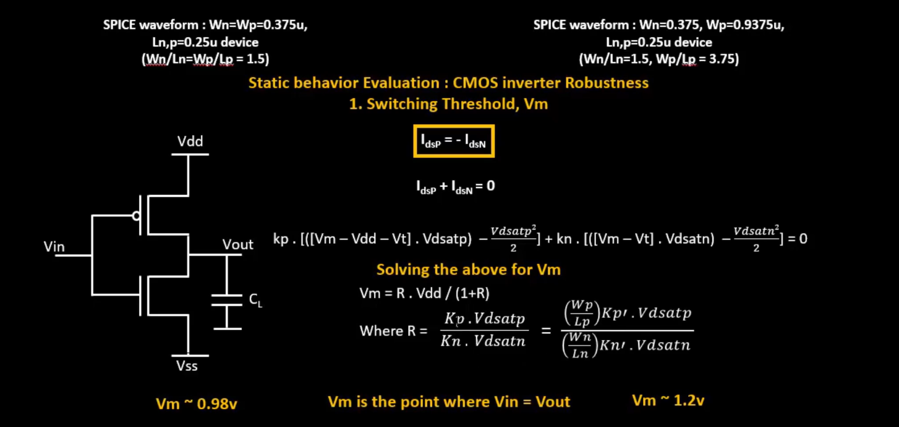

<details>
  <Summary><strong> Day 10 : CMOS Switching Threshold and and Dynamic Simulations</strong></summary>

# Contents
- [Voltage Transfer Charcateristics SPICE Simulations](#volatge-transfer-characteristics-spice-simulations)
  - [SPICE Deck Creation for CMOS inverter](#spice-deck-creation-for-cmos-inverter)
  - [SPICE Simulation for CMOS inverter](#spice-simulation-for-cmos-inverter)
  - [Labs Sky130 SPICE Simulation for CMOS](#labs-sky130-spice-simulation-for-cmos)   
- [Static Behavior Evaluation](#static-behavior-evaluation)
  - [Switching Threshold V<sub>m</sub>](#switching-threshold-v_m)
  - [Analytical Expression of V<sub>m</sub> as a function of (W/L)<sub>p</sub> and (W/L)<sub>n</sub>](#analytical-expression-of-v-m-as-a-function-of-w-l-and-w-l)
  - [Analytical Expression of (W/L)<sub>p</sub> and (W/L)<sub>n</sub> as a function of V<sub>m</sub>](#analytical-expression-of-w-l-and-w-l-as-a-function-of-v-m)
  - [Static and Dyanamic Simulation of CMOS Inverter](#static-and-dynamic-simulation-of-cmos-inverter)
  - [Static & Dynamic Simulation with Increased PMOS Width](#dynamic-simulation-with-increased-pmos-width)
  - [Applications of CMOS Inverter in Clock Network and STA](#applications-of-cmos-inverter-in-clock-network-and-sta)
    

<a id="volatge-transfer-characteristics-spice-simulations"></a>
# Voltage Transfer Charcateristics SPICE Simulations
<a id="spice-deck-creation-for-cmos-inverter"></a>
## SPICE Deck Creation for CMOS inverter

This image illustrates how to construct a SPICE deck for a CMOS inverter.
The SPICE input file contains following contents for writing an accurate and functional SPICE netlist for CMOS circuit simulations:

1. **Component Connectivity**  
   - How devices (transistors, capacitors, sources) interconnect node-to-node.  
   - Every terminal (drain/gate/source for MOSFETs) must reference a named node.  

2. **Component Values**  
   - Physical parameters: transistor W/L ratios, capacitances, resistor values, voltage levels, etc.  
   - Choose widths, lengths, and loads appropriate for your technology and performance goals.  

3. **Identify “Nodes”**  
   - Assign each distinct electrical junction a unique node name (e.g., `in`, `out`, `vdd`, `0`/`vss`).  
   - Ground is typically node `0`; supply rails use descriptive labels.  

4. **Name “Nodes”**  
   - Use consistent, human-readable node names to simplify debugging and post-processing.  
   - Example: label the input pin `Vin`, output node `out`, supply `Vdd`, and ground `Vss`. 

<a id="spice-simulation-for-cmos-inverter"></a>
## SPICE Simulation for CMOS inverter

This image shows a complete SPICE deck and corresponding CMOS inverter circuit.

<a id="labs-sky130-spice-simulation-for-cmos"></a>
## Labs Sky130 SPICE Simulation for CMOS
    
  <details>
      <Summary><strong> day3_inv_vtc_Wp084_Wn036.spice</strong></summary>
          
      *Model Description
      .param temp=27
      
      
      *Including sky130 library files
      .lib "sky130_fd_pr/models/sky130.lib.spice" tt
      
      
      *Netlist Description
      
      
      XM1 out in vdd vdd sky130_fd_pr__pfet_01v8 w=0.84 l=0.15
      XM2 out in 0 0 sky130_fd_pr__nfet_01v8 w=0.36 l=0.15
      
      
      Cload out 0 50fF
      
      Vdd vdd 0 1.8V
      Vin in 0 1.8V
      
      *simulation commands
      
      .op
      
      .dc Vin 0 1.8 0.01
      
      .control
      run
      setplot dc1
      display
      .endc
      
      .end
  </details>

**to plot the waveforms in ngspice:**
```bash
ngspice day3_inv_vtc_Wp084_Wn036.spice
plot out vs in
```

Following image shows the Voltage Transfer Characteristics (VTC) of a CMOS Inverter:


  <details>
      <Summary><strong> day3_inv_tran_Wp084_Wn036.spice</strong></summary>
          
      *Model Description
      .param temp=27
            
      *Including sky130 library files
      .lib "sky130_fd_pr/models/sky130.lib.spice" tt
            
      *Netlist Description
            
      XM1 out in vdd vdd sky130_fd_pr__pfet_01v8 w=0.84 l=0.15
      XM2 out in 0 0 sky130_fd_pr__nfet_01v8 w=0.36 l=0.15
            
      Cload out 0 50fF
      
      Vdd vdd 0 1.8V
      Vin in 0 PULSE(0V 1.8V 0 0.1ns 0.1ns 2ns 4ns)
      
      *simulation commands
      
      .tran 1n 10n
      
      .control
      run
      .endc
      
      .end
  </details>

**to plot the waveforms in ngspice:**
```bash
ngspice day3_inv_tran_Wp084_Wn036.spice
plot out vs time in
```

Following image shows the output waveform of transient analysis of a CMOS inverter, illustrating rise time delay and fall time delay:

How to calculate rise time and fall time from the transient analysis:
- Output rise time delay = Time at 50% of rising edge − Time at 50% of falling edge
- Output fall time delay = Time at 50% of falling edge − Time at 50% of rising edge

<a id="static-behavior-evaluation"></a>
# Static Behavior Evaluation
The characteristics that define the CMOS inverter robustness are:
- Switching Threshold Voltage (V<sub>m</sub>)
- Noise Margin
- Power Supply Variation
- Device Variations

<a id="switching-threshold-v_m"></a>
## Switching Threshold V<sub>m</sub>
**Switching Threshold Voltage of CMOS Inverter (V<sub>m</sub>):** V<sub>m</sub> is the voltage at which the input voltage equals the output voltage (V<sub>in</sub> = V<sub>out</sub>)
- It is an important parameter that impacts the noise margin and robustness of the inverter.
- At V<sub>m</sub>, both the NMOS and PMOS transistors are operating in the saturation region, and both are turned ON, giving high voltage gain.

The image compares two CMOS inverters with different PMOS/NMOS sizing:

In the left plot, (W<sub>n</sub>/L<sub>n</sub> = W<sub>p</sub>/L<sub>p</sub> = 0.375 µm/0.25 µm)
- **Device sizing:** both NMOS and PMOS have the same W/L
- Measured V<sub>m</sub> ≈ 0.98 V (Because the NMOS and PMOS strengths are equal, the threshold falls just below half the supply (1.25 V), here at ≈ 0.98 V)

In the right plot, W<sub>n</sub>/L<sub>n</sub> = 0.375 µm/0.25 µm, W<sub>p</sub>/L<sub>p</sub> = 0.9375 µm/0.25 µm
- PMOS widened by 2.5× relative to NMOS
- Measured V<sub>m</sub> ≈ 1.20 V (The stronger pull-up shifts the balance point higher, so the inverter switches at a higher input voltage)


The above image shows the CMOS inverter regions of operation and where V<sub>m</sub> is located.
- Different regions of the curve correspond to the transistor operating regions:
  - PMOS Linear and NMOS OFF
  - PMOS Linear and NMOS Saturation
  - PMOS Saturation and NMOS Saturation — This is where V<sub>m</sub> is located.
  - PMOS Saturation and NMOS Linear
  - PMOS OFF and NMOS Linear

<a id="analytical-expression-of-v-m-as-a-function-of-w-l-and-w-l>"></a>
## Analytical Expression of V<sub>m</sub> as a function of (W/L)<sub>p</sub> and (W/L)<sub>n</sub>




<a id="analytical-expression-of-w-l-and-w-l-as-a-function-of-v-m>"></a>
## Analytical Expression of (W/L)<sub>p</sub> and (W/L)<sub>n</sub> as a function of V<sub>m</sub>


<a id="static-and-dynamic-simulation-of-cmos-inverter"></a>
## Static & Dynamic Simulation of CMOS Inverter


<a id="dynamic-simulation-with-increased-pmos-width"></a>
## Static & Dynamic Simulation with Increased PMOS Width


**Conclusion**
- This table shows how varying the Wp/Wn ratio affects:
  - Rise Delay
  - Fall Delay
  - Switching Threshold (V<sub>m</sub>)

- When W<sub>p</sub>/L<sub>p</sub> ≈ 2 × W<sub>n</sub>/L<sub>n</sub>, the inverter achieves balanced rise and fall delays (≈ 80 ps each).
- At this point, the switching threshold V<sub>m</sub> ≈ 1.2 V.


<a id="applications-of-cmos-inverter-in-clock-network-and-sta"></a>
## Applications of CMOS Inverter in Clock Network and STA
If the rise delay and fall delay of the clock buffer are well-matched, no duty cycle distortion correction is needed. However, if they are imbalanced due to PMOS/NMOS Ron mismatch, duty cycle correction circuits are used in the clock tree to maintain a 50% duty cycle.


</details>
