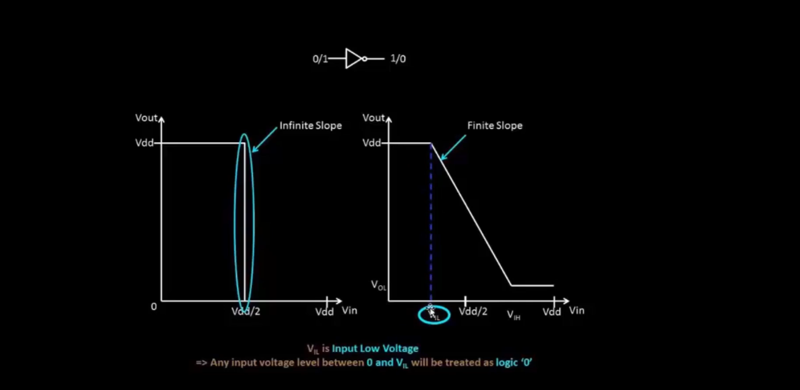
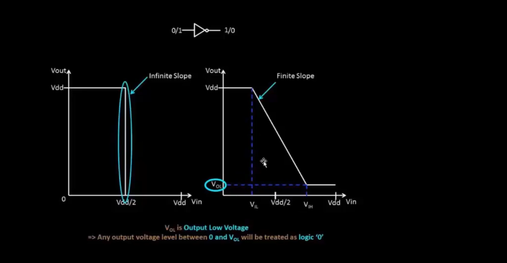
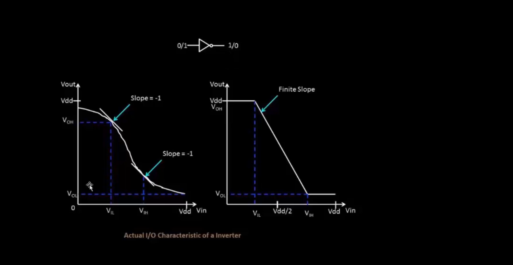
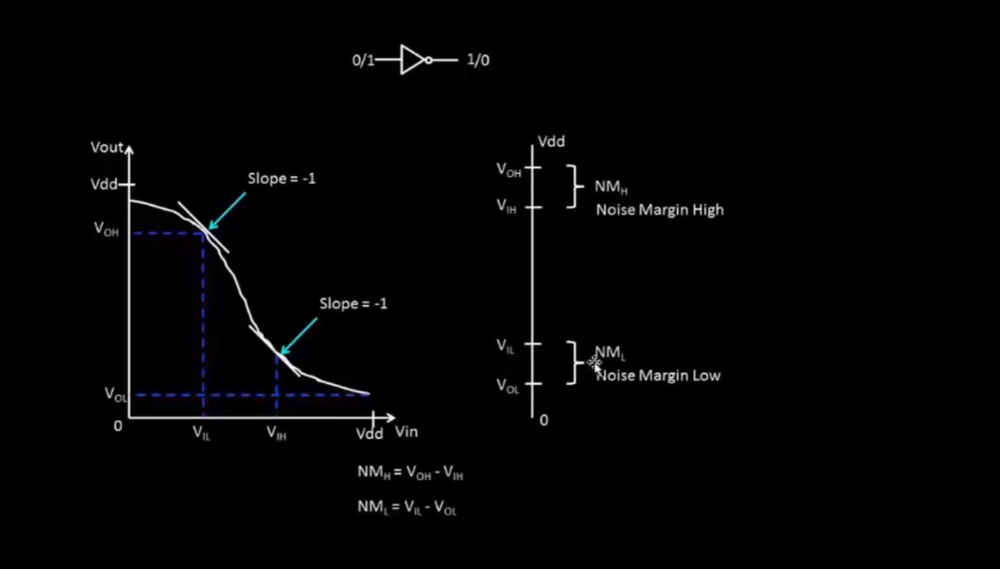
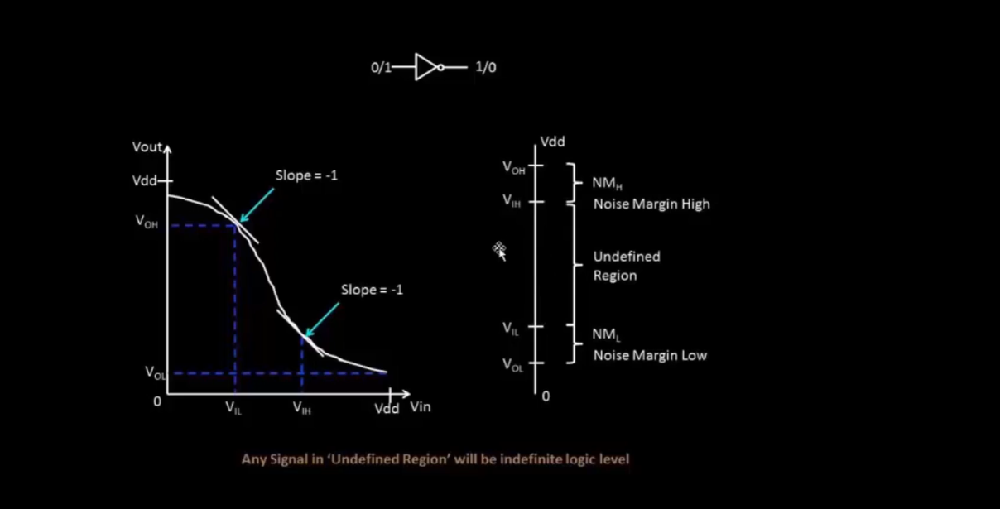
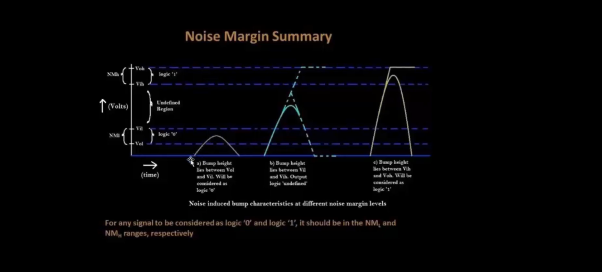
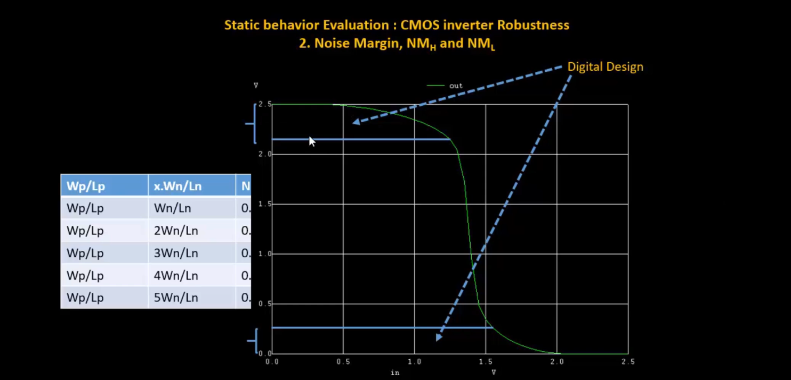
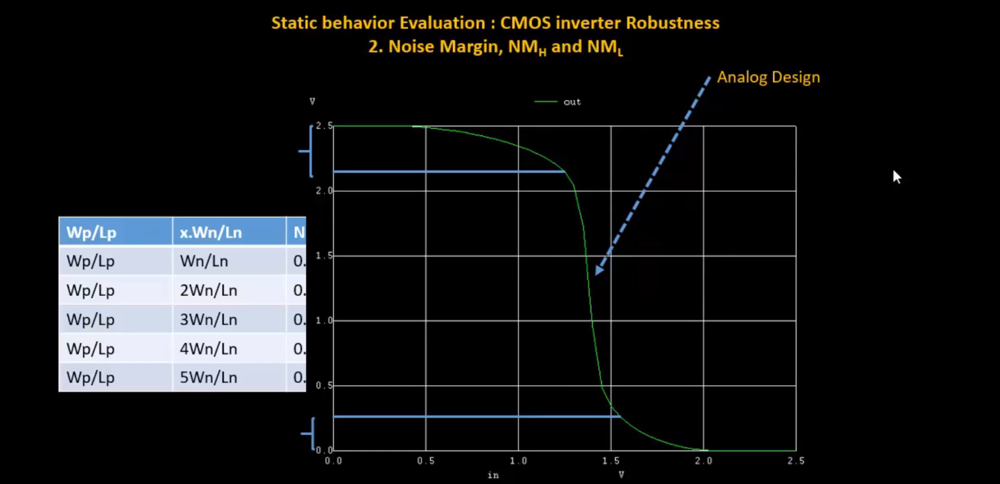
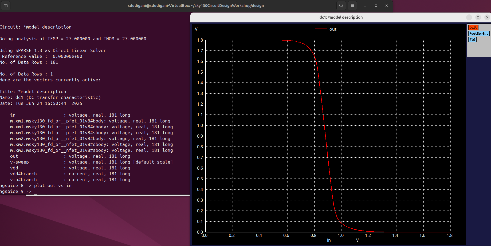

<details>
  <Summary><strong> Day 11 : CMOS Noise Margin Robustness Evaluation</strong></summary>

# Contents
- [Static Behavior Evaluation - CMOS Inverter Robustness - Noise Margin](#static-behavior-evaluation--cmos-inverter-robustness--noise-margin)
  - [Introduction to Noise Margin](#introduction-to-noise-margin)
  - [Noise Margin Volatge Parameters](#noise-margin-voltage-parameters)
  - [Noise Margin Equation and Summary](#noise-margin-equation-and-summary)
  - [Noise Margin Variation with respect to PMOS width](#noise-margin-variation-with-respect-to-pmos-width)
  - [Sky130 Noise margin Labs](#sky130-noise-margin-labs)   
  

<a id="static-behavior-evaluation--cmos-inverter-robustness--noise-margin"></a>
# Static Behavior Evaluation - CMOS Inverter Robustness - Noise Margin

<a id="introduction-to-noise-margin"></a>
## Introduction to Noise Margin
**Noise margin** is the maximum noise voltage a CMOS circuit can tolerate without logic errors.
- i.e Noise margin is the amount of noise that a CMOS circuit could withstand without compromising the operation of circuit.
- Noise margin makes sure that:
  - any signal which is logic 1 with finite noise added to it, is still recognized as logic 1 and not logic 0.
  - similarly, any signal which is logic 0 with finite noise added to it, is still recognized as logic 0 and not logic 1.

The following images show an ideal and a piece-wise linear VTC of a CMOS inverter:


The images compares:
- Ideal I/O characteristic of an inverter with infinite slope — abrupt switching at Vdd/2 (left side)
- Actual inverter characteristic with finite slope — gradual transition region (right side)

<a id="noise-margin-voltage-parameters"></a>
## Noise Margin Volatge Parameters
This figure illustrates how Noise Margin is derived from the Voltage Transfer Characteristic (VTC) of a CMOS inverter.




The left plot shows:
- The slope of the VTC = −1 at two critical points:
  - **V<sub>IL</sub>**: Input Low Threshold Voltage
  - **V<sub>IH</sub>**: Input High Threshold Voltage

The right diagram shows:
- V<sub>OH</sub> and V<sub>OL</sub>: Valid output high/low voltage levels
- V<sub>IL</sub> and V<sub>IH</sub>: Input thresholds where the slope = −1

<a id="noise-margin-equation-and-summary"></a>
## Noise Margin Equation and Summary
**Noise Margins:**
- NM<sub>H</sub> = V<sub>OH</sub> − V<sub>IH</sub>: Noise Margin High — tolerance for noise on logic 1
- NML = V<sub>IL</sub> − V<sub>OL</sub>: Noise Margin Low — tolerance for noise on logic 0

**Summary**
This figure summarizes how Noise Margins help handle noisy "bumps" on signals — ensuring correct logic detection.


**Input thresholds:**
- V<sub>IL</sub>: Input voltage < V<sub>dd</sub>/2 (~10% of V<sub>dd</sub>) — treated as logic '0'
- V<sub>IH</sub>: Input voltage > V<sub>dd</sub>/2 (~90% of V<sub>dd</sub>) — treated as logic '1'

**Output thresholds:**
- V<sub>OL</sub>: Output voltage near 0V — treated as logic '0' for next gate input
- V<sub>OH</sub>: Output voltage near V<sub>dd</sub> — treated as logic '1' for next gate input

**Noise Bump Scenarios:**
- **Case (a):** Bump height lies between V<sub>OL</sub> and V<sub>IL</sub> → signal still treated as logic '0'.
- **Case (b):** Bump height lies between V<sub>IL</sub> and V<sub>IH</sub> → output becomes undefined (logic unstable).
- **Case (c):** Bump height lies between V<sub>IH</sub> and V<sub>OH</sub> → signal treated as logic '1'.

For any signal to be reliably interpreted as logic '0' or logic '1', it must stay within the corresponding Noise Margin (NML or NMH) range — outside the undefined region.

<a id="noise-margin-variation-with-respect-to-pmos-width"></a>
## Noise Margin Variation with respect to PMOS width



<a id="sky130-noise-margin-labs"></a>
## Sky130 Noise margin Labs

<details> <summary><strong>day3_inv_vtc_Wp084_Wn036.spice </strong></summary>

```
*Model Description
.param temp=27


*Including sky130 library files
.lib "sky130_fd_pr/models/sky130.lib.spice" tt


*Netlist Description


XM1 out in vdd vdd sky130_fd_pr__pfet_01v8 w=1 l=0.15
XM2 out in 0 0 sky130_fd_pr__nfet_01v8 w=0.36 l=0.15


Cload out 0 50fF

Vdd vdd 0 1.8V
Vin in 0 1.8V

*simulation commands

.op

.dc Vin 0 1.8 0.01

.control
run
setplot dc1
display
.endc

.end

```
</details>

**to plot the waveforms in ngspice**:
```bash
ngspice day4_inv_noisemargin_wp1_wn036.spice
plot out vs in
```




