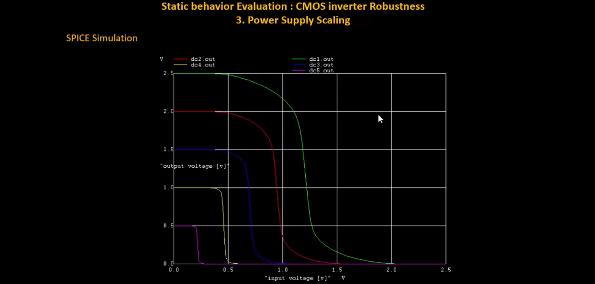
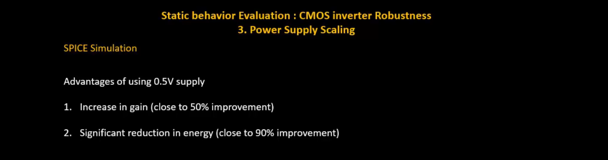
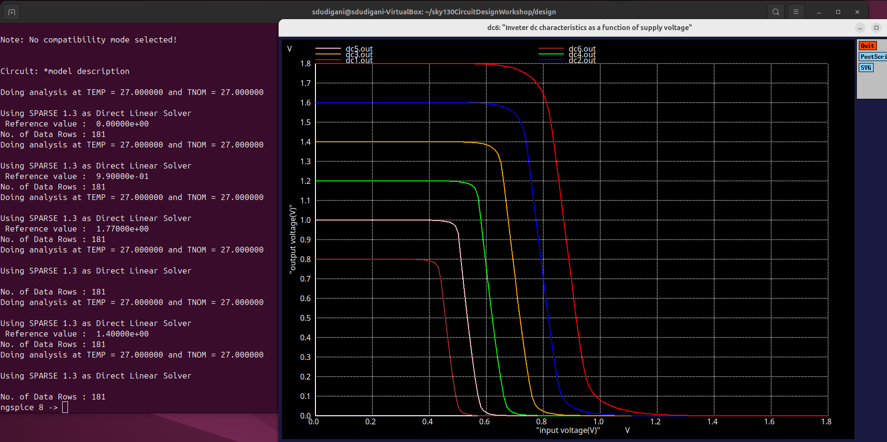
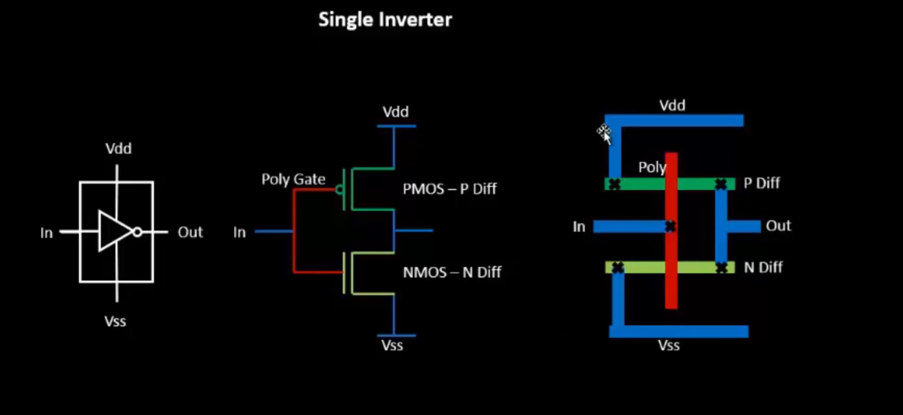
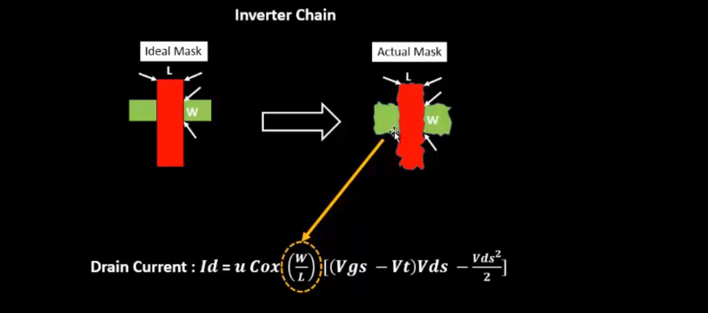
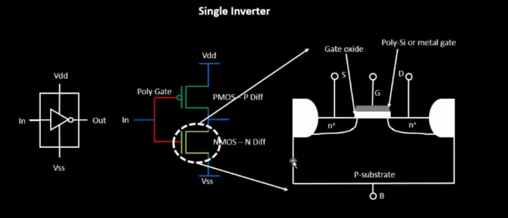
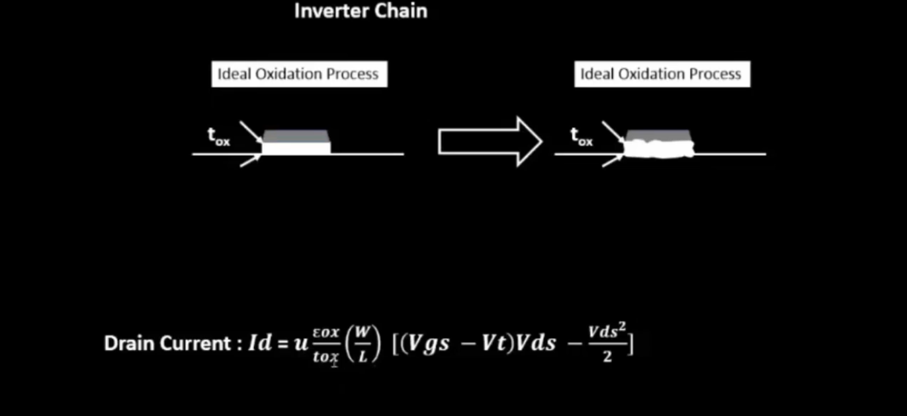

<details>
  <Summary><strong> Day 12 : CMOS Power Supply and device variation robustness evaluation</strong></summary>

# Contents
- [Static Behavior Evaluation-CMOS Inverter-Power Supply Variation](#static-behavior-evaluation--cmos-inverter--power-supply-variation)
  - [Smart SPICE simulation for power supply variations](#smart-spice-simulation-for-power-supply-variations)
  - [Advantages and Disadvantages using low supply voltage](#advantages-and-disadvantages-using-low-supply-voltage)
  - [Sky130 supply variation Labs](#sky130-supply-variation-labs)   
- [Static Behavior Evaluation-CMOS Inverter-Device Variation](#static-behavior-evaluation--cmos-inverter--device-variation)
  - [Sources of Variation-Etching Process](#sources-of-variation--etching-process)
  - [Sources of Variation-Oxide Thickness](#sources-of-variation--oxide-thickness)
  - [Smart SPICE simulation for device variations](#smart-spice-simulation-for-device-variations)
  - [Conclusion](#conclusion)
  - [Sky130 device variation Labs](#sky130-device-variation-labs)   
    

<a id="static-behavior-evaluation--cmos-inverter--power-supply-variation"></a>
# Static Behavior Evaluation-CMOS Inverter-Power Supply Variation
Power supply scaling directly affects the static behavior of a CMOS inverter — changing its switching threshold (Vm), noise margins, and overall robustness.
<a id="smart-spice-simulation-for-power-supply-variations"></a>
## Smart SPICE simulation for power supply variations
**SPICE Simulation**

- The CMOS inverter is simulated at two different supply voltages: Vdd = 2.5V → scaled down to Vdd = 1V
- PMOS and NMOS sizes remain constant: Wp = 0.9375 μm, Wn = 0.375 μm
- As **V<sub>dd</sub> ↓**, inverter's **switching threshold V<sub>m</sub>** tends to move towards the center pf the supply voltage but the noise margin shrink.
- **Lower V<sub>dd</sub>** results in **reduced noise immunity** and circuit becomes more sensitive to noise and supply variations.
  
<a id="advantages-and-disadvantages-using-low-supply-voltage"></a>
## Advantages and Disadvantages using low supply voltage


**Gain Factor:** 
The inverter’s gain is defined as the ratio of the change in output voltage to the change in input voltage:
- **Gain Factor = ΔV<sub>out</sub> / ΔV<sub>in</sub>**

**Advantages of using 0.5V supply:** Using lower V<sub>dd</sub> (0.5V) provides benefits like ~50% gain improvement and ~90% reduction in energy consumption, demonstrating the efficiency of power supply scaling in CMOS inverters.
**Disadvantage of using 0.5V supply:** While lowering Vdd improves gain and energy efficiency, it introduces performance impact — circuits may switch slower due to reduced drive strength.


<a id="sky130-supply-variation-labs"></a>
## Sky130 supply variation Labs

<details> <summary><strong>day5_inv_supplyvariation_Wp1_Wn036.spice</strong></summary>

```
*Model Description
.param temp=27

*Including sky130 library files
.lib "sky130_fd_pr/models/sky130.lib.spice" tt

*Netlist Description

XM1 out in vdd vdd sky130_fd_pr__pfet_01v8 w=1 l=0.15
XM2 out in 0 0 sky130_fd_pr__nfet_01v8 w=0.36 l=0.15

Cload out 0 50fF

Vdd vdd 0 1.8V
Vin in 0 1.8V

.control

let powersupply = 1.8
alter Vdd = powersupply
let voltagesupplyvariation = 0
dowhile voltagesupplyvariation < 6
    dc Vin 0 1.8 0.01
    let powersupply = powersupply - 0.2
    alter Vdd = powersupply
    let voltagesupplyvariation = voltagesupplyvariation + 1
end

plot dc1.out vs in dc2.out vs in dc3.out vs in dc4.out vs in dc5.out vs in dc6.out vs in xlabel "input voltage(V)" ylabel "output voltage(V)" title "Inverter dc characteristics as a function of supply voltage"

.endc

.end
```
</details>

**plot the waveforms in ngspice**
```bash
ngspice day5_inv_supplyvariation_Wp1_Wn036.spice
```

Following image is waveform for different supplies:



<a id="static-behavior-evaluation--cmos-inverter--device-variation"></a>
# Static Behavior Evaluation-CMOS Inverter-Device Variation
- While we design a gate for nominal operation conditions and typical device parameters, the actual operating temperatures might very over a large range, and the device parameters after fabrication will deviate from the nominal values used in the design process.
- The DC characteristics of the static CMOS inverter turn out to be rather insensitive to these variations, and the gate remains functional over a wide range of operating conditions.
- Sources of device variation:
  - Etching Process
  - Oxide Thickness
  
<a id="sources-of-variation--etching-process"></a>
## Sources of Variation-Etching Process
**Etching Process Variation**: 



<a id="sources-of-variation--oxide-thickness"></a>
## Sources of Variation-Oxide Thickness



<a id="smart-spice-simulation-for-device-variations"></a>
## Smart SPICE simulation for device variations

<a id="conclusion"></a>  
## Conclusion

<a id="sky130-device-variation-labs"></a>  
## Sky130 device variation Labs
