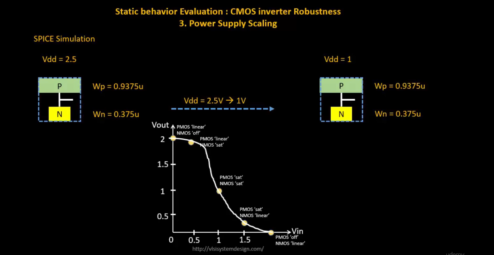

  
<strong> Day 12 : CMOS Power Supply and device variation robustness evaluation</strong>

# Contents
- [Static Behavior Evaluation-CMOS Inverter-Power Supply Variation](#static-behavior-evaluation--cmos-inverter--power-supply-variation)
  - [Smart SPICE simulation for power supply variations](#smart-spice-simulation-for-power-supply-variations)
  - [Advantages and Disadvantages using low supply voltage](#advantages-and-disadvantages-using-low-supply-voltage)
  - [Sky130 supply variation Labs](#sky130-supply-variation-labs)   
- [Static Behavior Evaluation-CMOS Inverter-Device Variation](#static-behavior-evaluation--cmos-inverter--device-variation)
  - [Sources of Variation-Etching Process](#sources-of-variation--etching-process)
  - [Sources of Variation-Oxide Thickness](#sources-of-variation--oxide-thickness)
  - [Smart SPICE simulation for device variations](#smart-spice-simulation-for-device-variations)
  - [Conclusion](#conclusion)
  - [Sky130 device variation Labs](#sky130-device-variation-labs)   
    

# Static Behavior Evaluation-CMOS Inverter-Power Supply Variation
Power supply scaling directly affects the static behavior of a CMOS inverter — changing its switching threshold (Vm), noise margins, and overall robustness.

## Smart SPICE simulation for power supply variations
**SPICE Simulation**

- The CMOS inverter is simulated at two different supply voltages: Vdd = 2.5V → scaled down to Vdd = 1V
- PMOS and NMOS sizes remain constant: Wp = 0.9375 μm, Wn = 0.375 μm

## Advantages and Disadvantages using low supply voltage

## Sky130 supply variation Labs

# Static Behavior Evaluation-CMOS Inverter-Device Variation

## Sources of Variation-Etching Process

## Sources of Variation-Oxide Thickness

## Smart SPICE simulation for device variations

  
## Conclusion

  
## Sky130 device variation Labs
