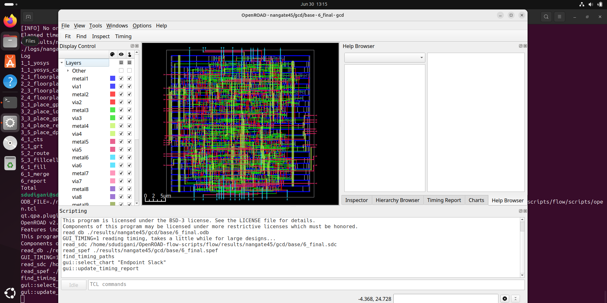

<details>
  <Summary><strong> Day 13 : OpenRoad Installation</strong></summary>

# Contents
- [Steps to Install OpenROAD and Run GUI](#steps-to-install-openroad-and-run-gui)

<a id="steps-to-install-openroad-and-run-gui"></a>
# Steps to Install OpenROAD and Run GUI
- Step1: Clone the OpenRoad Repository
```bash
  git clone --recursive https://github.com/The-OpenROAD-Project/OpenROAD-flow-scripts
  cd OpenROAD-flow-script
```


- Step 2: Run the Setup Script
```bash
sudo ./setup.sh
```


- Step 3: Build OpenROAD
```bash
./build_openroad.sh --local
```


- Step 4: Verify Installation
```bash
source ./env.sh
yosys -help  
openroad -help
```


- Step 5: Run the OpenROAD Flow
```bash
cd flow
make
```


- Step 6: Launch the graphical user interface (GUI) to visualize the final layout:
```bash
make gui_final
```



OpenRoad tool installation complete! You can now explore the full RTL-to-GDSII flow using OpenROAD.

## OpenRoad Flow Scripts Directory Structure


