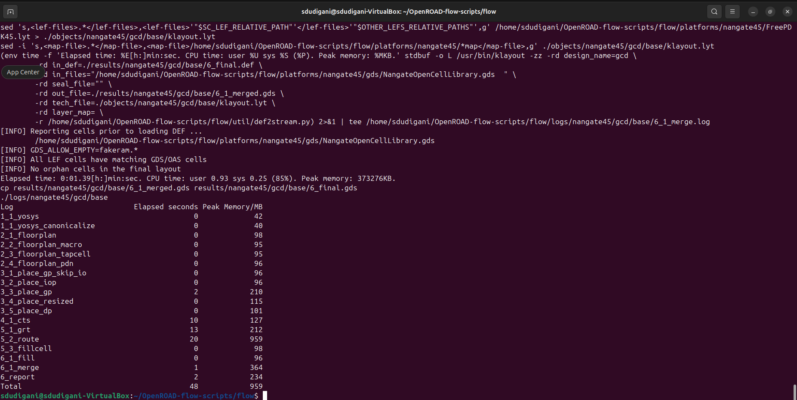

<details>
  <Summary><strong> Day 13 : OpenRoad Installation</strong></summary>

# Contents
- [Steps to Install OpenROAD and Run GUI](#steps-to-install-openroad-and-run-gui)
  - [Step1: Clone the OpenRoad Repository](#step1)
  - [Step 2: Run the Setup Script](#step2)
  - [Step 3: Build OpenROAD](#step3)
  - [Step 4: Verify Installation](#step4)
  - [Step 5: Run the OpenROAD Flow](#step5)
  - [Step 6: Launch the graphical user interface (GUI) to visualize the final layout](#step6)
- [OpenRoad Flow Scripts Directory Structure](#openroad-flow-scripts-directory-and-run-gui)
<a id="steps-to-install-openroad-and-run-gui"></a>
# Steps to Install OpenROAD and Run GUI

<a id="step1"></a>
- **Step1: Clone the OpenRoad Repository**
```bash
  git clone --recursive https://github.com/The-OpenROAD-Project/OpenROAD-flow-scripts
  cd OpenROAD-flow-script
```


<a id="step2"></a>
- **Step 2: Run the Setup Script**
```bash
sudo ./setup.sh
```


<a id="step3"></a>
- **Step 3: Build OpenROAD**
```bash
./build_openroad.sh --local
```


<a id="step4"></a>
- **Step 4: Verify Installation**
```bash
source ./env.sh
yosys -help  
openroad -help
```


<a id="step5"></a>
- **Step 5: Run the OpenROAD Flow**
```bash
cd flow
make
```


<a id="step6"></a>
- **Step 6: Launch the graphical user interface (GUI) to visualize the final layout**
```bash
make gui_final
```


OpenRoad tool installation complete! You can now explore the full RTL-to-GDSII flow using OpenROAD.

<a id="openroad-flow-scripts-directory-and-run-gui"></a>
## OpenRoad Flow Scripts Directory Structure


