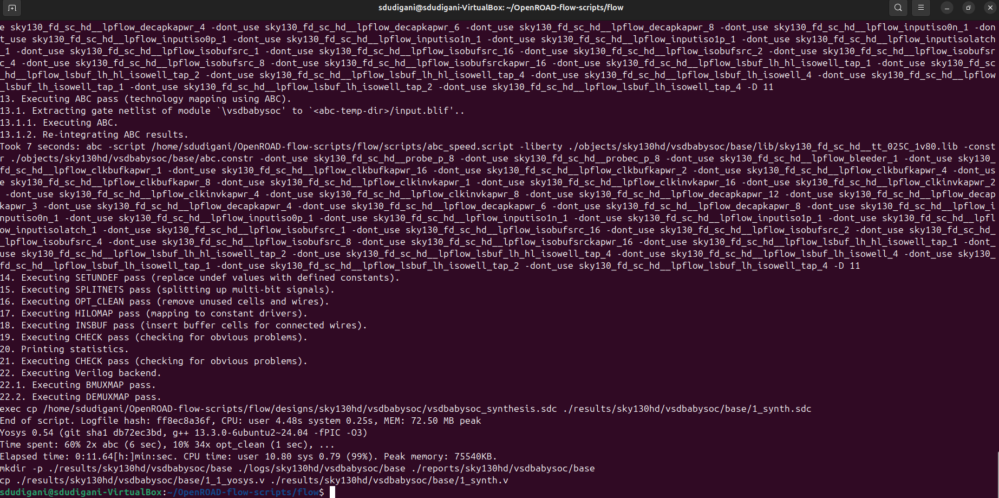
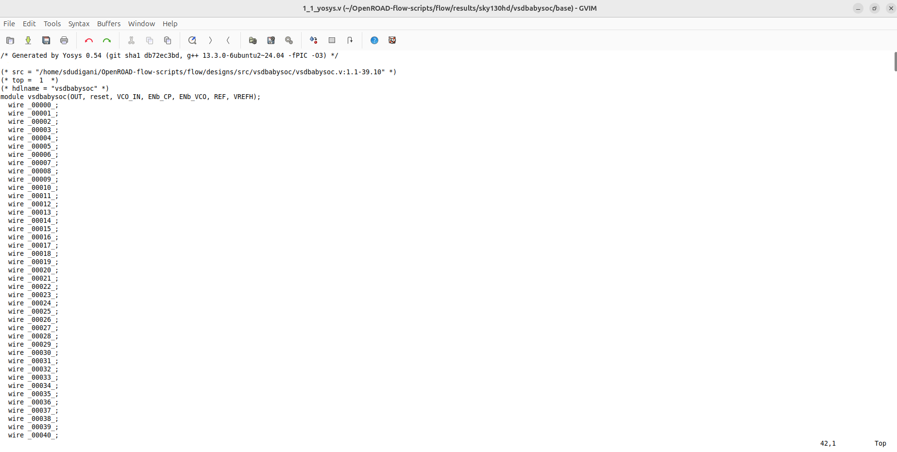

<details>
  <Summary><strong> Day 14 : Floorplan and Placement for VSDBabySoC</strong></summary>

# Contents
- [RTL2GDS Flow for VSDBabySoC: Initial Steps](#rtl2gds-flow-for-vsdbabysoc)

**Structure of OpenROAD-flow-scripts**
```bash
├── OpenROAD-flow-scripts             
│   ├── docker           
│   ├── docs               
│   ├── flow               
|   ├── jenkins          
│   ├── tools           
│   ├── etc              
│   ├── setup.sh    
```
**flow directory**
```bash
 ├── flow           
 │   ├── designs         
 │   ├── makefile       
 │   ├── platforms         
 |   ├── tutorials        
 │   ├── util            
 │   ├── scripts    
```

<a id="rtl2gds-flow-for-vsdbabysoc"></a>
# RTL2GDS Flow for VSDBabySoC : Initial Steps
1. **Create Directories:**
   - Inside `OpenROAD-flow-scripts/flow/designs/sky130hd/`, create a folder named `vsdbabysoc`.
   - Create another folder named `vsdbabysoc` in `OpenROAD-flow-scripts/flow/designs/src/` and place all Verilog files here.

2. **Copy Folders:**
   - From your `VSDBabySoC` folder, copy the following folders into `sky130hd/vsdbabysoc`:
     - **gds:** Contains `avsddac.gds`, `avsdpll.gds`.
     - **include:** Contains `sandpiper.vh`, `sandpiper_gen.vh`, `sp_default.vh`, `sp_verilog.vh`.
     - **lef:** Contains `avsddac.lef`, `avsdpll.lef`.
     - **lib:** Contains `avsddac.lib`, `avsdpll.lib`.

3. **Copy Constraint and Configuration Files:**
   - Copy `vsdbabysoc_synthesis.sdc` into `sky130hd/vsdbabysoc`.
   - Copy `macro.cfg` and `pin_order.cfg` into `sky130hd/vsdbabysoc`.

4. **Create Config File:**
   - Create a `config.mk` file in `sky130hd/vsdbabysoc` with the required configuration details. 

##### the file details are given below
```bash
# Design and Platform Configuration
export DESIGN_NICKNAME = vsdbabysoc
export DESIGN_NAME = vsdbabysoc
export PLATFORM    = sky130hd

# Design Paths
export vsdbabysoc_DIR = /home/sdudigani/OpenROAD-flow-scripts/flow/designs/sky130hd/$(DESIGN_NICKNAME)

# Explicitly list Verilog files for synthesis
export VERILOG_FILES = /home/sdudigani/OpenROAD-flow-scripts/flow/designs/src/vsdbabysoc/vsdbabysoc.v \
                    /home/sdudigani/OpenROAD-flow-scripts/flow/designs/src/vsdbabysoc/rvmyth.v \
                    /home/sdudigani/OpenROAD-flow-scripts/flow/designs/src/vsdbabysoc/clk_gate.v


# Include Directory for Verilog Header Files
export VERILOG_INCLUDE_DIRS = $(vsdbabysoc_DIR)/include

# Constraints File
export SDC_FILE = $(vsdbabysoc_DIR)/vsdbabysoc_synthesis.sdc

# Additional GDS Files
export ADDITIONAL_GDS = $(vsdbabysoc_DIR)/gds/avsddac.gds \
                       $(vsdbabysoc_DIR)/gds/avsdpll.gds

# Additional LEF Files
export ADDITIONAL_LEFS = $(vsdbabysoc_DIR)/lef/avsddac.lef \
                       $(vsdbabysoc_DIR)/lef/avsdpll.lef

# Additional LIB Files
export ADDITIONAL_LIBS = $(vsdbabysoc_DIR)/lib/avsddac.lib \
                       $(vsdbabysoc_DIR)/lib/avsdpll.lib

# Pin Order and Macro Placement Configurations
export FP_PIN_ORDER_CFG = $(vsdbabysoc_DIR)/pin_order.cfg
export MACRO_PLACEMENT_CFG = $(vsdbabysoc_DIR)/macro.cfg

# Clock Configuration
export CLOCK_PORT = CLK
export CLOCK_NET  = $(CLOCK_PORT)
export CLOCK_PERIOD = 20.0

# Floorplanning Configuration
export DIE_AREA   = 0 0 1600 1600
export CORE_AREA  = 20 20 1590 1590

# Placement Configuration
export PLACE_PINS_ARGS = -exclude left:0-600 -exclude left:1000-1600 -exclude right:* -exclude top:* -exclude bottom:*

# Tuning for Timing and Buffers
export TNS_END_PERCENT     = 100
export REMOVE_ABC_BUFFERS  = 1
export CTS_BUF_DISTANCE    = 600
export SKIP_GATE_CLONING   = 1

# Magic Tool Configuration
export MAGIC_ZEROIZE_ORIGIN = 0
export MAGIC_EXT_USE_GDS    = 1
```
**File structure after the setup**
```bash
sdudigani@sdudigani-VirtualBox:~/OpenROAD-flow-scripts/flow/designs/src/vsdbabysoc$ ls -ltrh
total 3.1M
-rw-rw-r-- 1 sdudigani sdudigani  947 Jun 30 14:05 avsdpll.v
-rw-rw-r-- 1 sdudigani sdudigani 1.1K Jun 30 14:05 avsddac.v
-rwxrwxr-x 1 sdudigani sdudigani 1.3K Jun 30 14:05 testbench.v
-rw-rw-r-- 1 sdudigani sdudigani  603 Jun 30 14:05 testbench.rvmyth.post-routing.v
-rw-rw-r-- 1 sdudigani sdudigani 2.3M Jun 30 14:05 sky130_fd_sc_hd.v
-rw-rw-r-- 1 sdudigani sdudigani  17K Jun 30 14:05 rvmyth.v
-rw-rw-r-- 1 sdudigani sdudigani  11K Jun 30 14:05 rvmyth.tlv
-rw-rw-r-- 1 sdudigani sdudigani  19K Jun 30 14:05 rvmyth_gen.v
-rw-rw-r-- 1 sdudigani sdudigani 3.1K Jun 30 14:05 pseudo_rand.sv
-rw-rw-r-- 1 sdudigani sdudigani  908 Jun 30 14:05 pseudo_rand_gen.sv
-rw-rw-r-- 1 sdudigani sdudigani 1.7K Jun 30 14:05 clk_gate.v
-rw-rw-r-- 1 sdudigani sdudigani  590 Jun 30 14:05 vsdbabysoc.v
-rw-rw-r-- 1 sdudigani sdudigani 743K Jun 30 14:05 vsdbabysoc.synth.v
lrwxrwxrwx 1 sdudigani sdudigani   90 Jun 30 14:06 primitives.v -> /home/sdudigani/VLSI/sky130RTLDesignAndSynthesisWorkshop/my_lib/verilog_model/primitives.v
```

```bash
sdudigani@sdudigani-VirtualBox:~/OpenROAD-flow-scripts/flow/designs/sky130hd/vsdbabysoc$ ls -ltrh
total 28K
drwxrwxr-x 2 sdudigani sdudigani 4.0K Jun 30 14:09 gds
drwxrwxr-x 2 sdudigani sdudigani 4.0K Jun 30 14:09 include
drwxrwxr-x 2 sdudigani sdudigani 4.0K Jun 30 14:09 lef
drwxrwxr-x 2 sdudigani sdudigani 4.0K Jun 30 14:09 lib
lrwxrwxrwx 1 sdudigani sdudigani   58 Jun 30 14:10 macro.cfg -> /home/VLSI/VSDBabySoC/src/layout_conf/vsdbabysoc/macro.cfg
lrwxrwxrwx 1 sdudigani sdudigani   62 Jun 30 14:10 pin_order.cfg -> /home/VLSI/VSDBabySoC/src/layout_conf/vsdbabysoc/pin_order.cfg
-rw-rw-r-- 1 sdudigani sdudigani 2.0K Jun 30 14:12 config.mk
-rw-rw-r-- 1 sdudigani sdudigani   73 Jun 30 14:14 vsdbabysoc_synthesis.sdc
sdudigani@sdudigani-VirtualBox:~/OpenROAD-flow-scripts/flow/designs/sky130hd/vsdbabysoc$ 
```

#### Now go to terminal and run the following commands:
```bash
cd OpenROAD-flow-scripts
source env.sh
cd flow
```


#### Commands to run synthesis:
```bash
make DESIGN_CONFIG=./designs/sky130hd/vsdbabysoc/config.mk synth
```


**Synthesis netlist**
```bash
sdudigani@sdudigani-VirtualBox:~/OpenROAD-flow-scripts/flow$ gvim results/sky130hd/vsdbabysoc/base/1_1_yosys.v 
```



