

  
<strong> Day 15 : Inception of open-source EDA - OpenLANE and Sky130PDK</strong>

# Contents
- [How to Talk to Computers](#how-to-talk-to-computers)
  - [Introduction to QFN-48 Package - Chip - Pads - Core - Die and IPs](#introduction-to-qfn--48-package--chip--pads--core--die-and-ips)
  - [Introduction to RISC-V](#introduction-to-risc--v)
    - [ISA (instruction Set Architecture)](#isa)
  - [From Software Applications to Hardware](#from-software-applications-to-hardware)   
- [SoC Design and OpenLANE](#soc-design-and-openlane)
  - [Introduction to all Components of open-source digital ASIC design](#introduction-to-all-components-of-open--source-digital-asic-design)
  - [Simplified RTL2GDS flow](#simplified-rtl2gds-flow)
  - [Introduction to OpenLANE and strive chipsets](#strive-chipsets)
  - [Introduction to OpenLANE detailed ASIC design flow](#openlane-detailed-asic-design-flow)

# How to Talk to Computers

## Introduction to QFN-48 Package - Chip - Pads - Core - Die and IPs

**Package:** In any embedded board we have seen, the part of the board we consider as the chip is only the PACKAGE of the chip which is nothing but a protective layer or packet bound over the actual chip and the actual manufatured chip is usually present at the center of a package wherein, the connections from package is fed to the chip by WIRE BOUND method which is none other than basic wired connection.

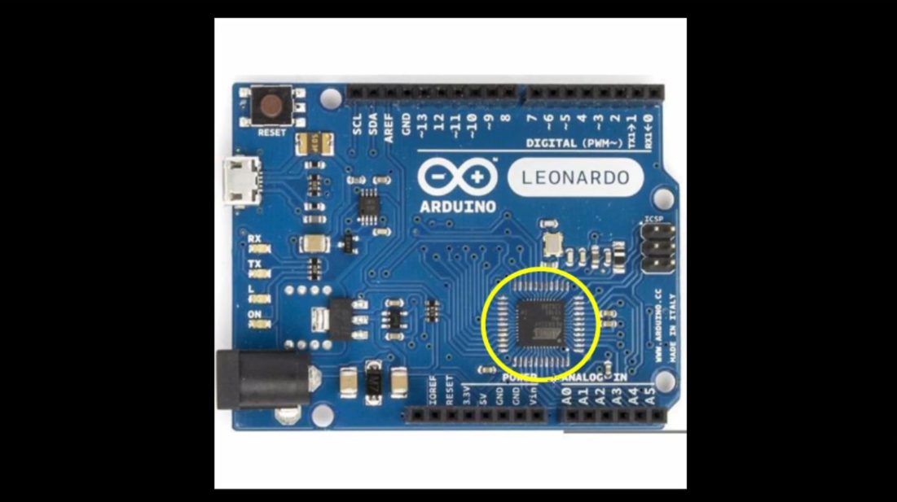

The architecture inside the arduino chip is shown below

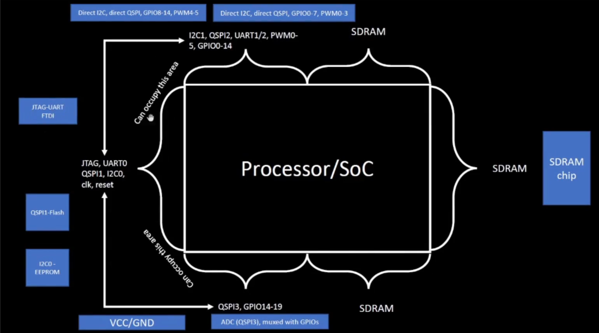

### QFN-48 (Quad Flat No-Leads) Package
The QFN-48 is a compact, high-performance IC package offering 48 solder-able pads on a 7 mm × 7 mm footprint. Its leadless “no-leads” design minimizes PCB real estate while providing excellent thermal and electrical characteristics.

The architecture inside the processor/ Soc is shown below. Various packages are available and the chip is present inside the package as shown in the diagram below.
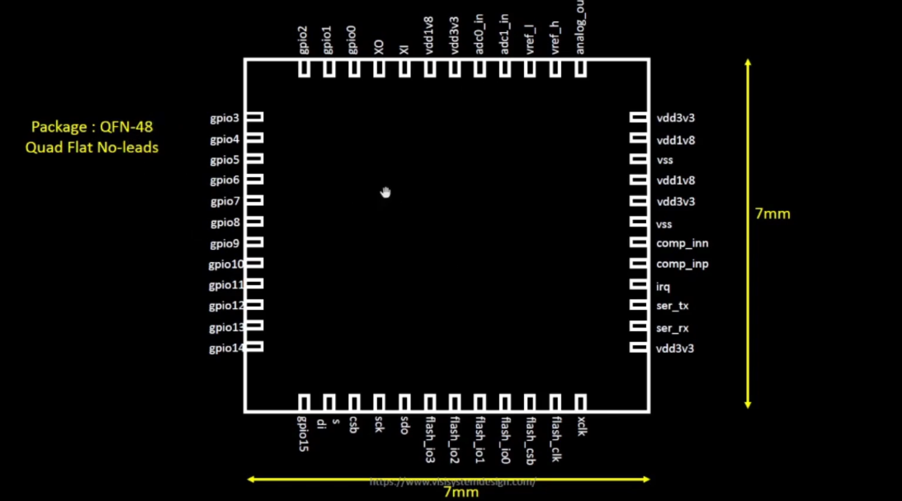

**Key Features:**
- Leadless Design: Ultra-low profile; ideal for space-constrained PCBs
- 48 Connection Pads: Rich I/O for complex systems
- Compact Size: 7 mm × 7 mm footprint
- Thermal Efficiency: Exposed pad and copper slug optimize heat dissipation
- Electrical Performance: Low parasitic inductance and resistance

**Common Applications:**
- Microcontroller and microprocessor modules
- Wireless RF front-ends
- Power-management ICs
- High-density sensor interfaces
- Precision data-converter packages

**Chip Overview**
Beneath the package sits the bare silicon die - a landscape of transistors and interconnects implementing everything from logic to memory to analog front-ends. This single piece of silicon handles computation, storage, and I/O.

**Core Functional Blocks:**
- Processing Units: One or more CPU cores (e.g., RISC-V, ARM) execute instructions and control data flow.
- Memory: SRAM, ROM, or flash cells store code, data, and configuration.
- I/O Interfaces: Digital GPIOs, high-speed serial links (QSPI, UART), and analog converters connect to the outside world.

The boundaries of the chip is connected to the pins present in the boundaries of the package.
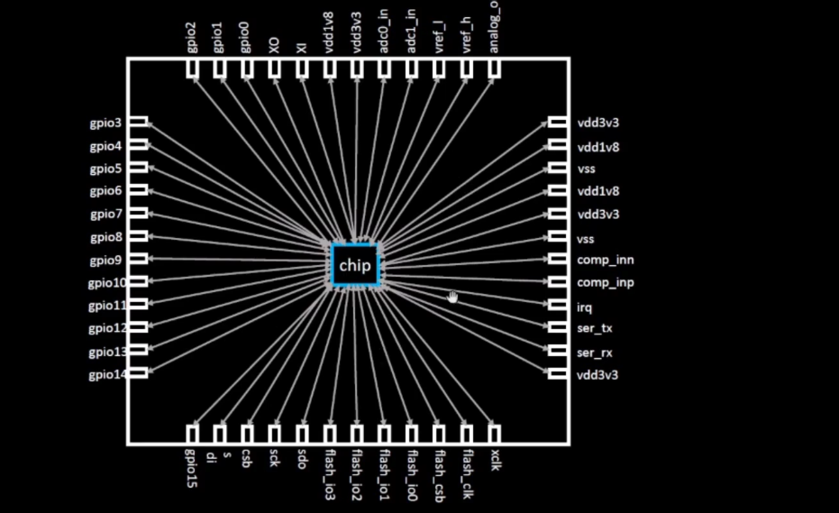
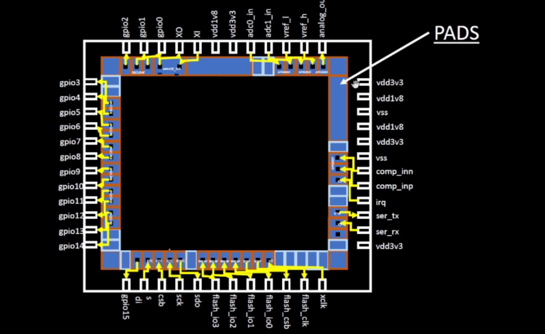

**Chip Components Overview**
1. **Pads:** Small metal lands on the package periphery. Serve as the electrical interface between PCB traces and on-die interconnect
2. **Core:** Central silicon region containing CPU, bus fabric, and on-chip peripherals. Floorplanned for optimal timing, power, and area
3. **Die:** The complete silicon piece before packaging. Contains all active circuits, passive components, and metal routing layers

  
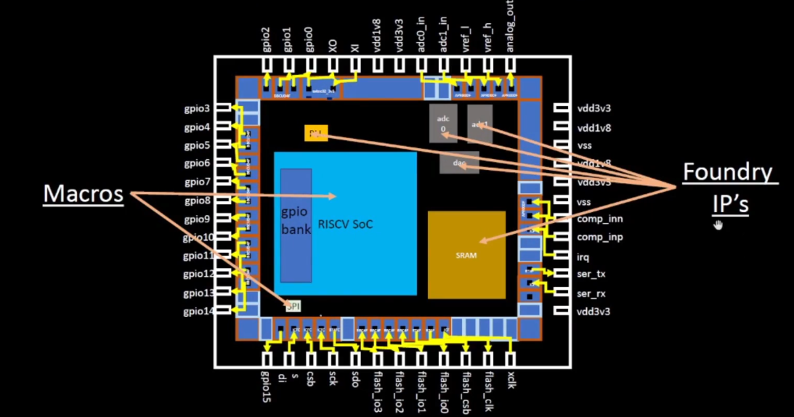

**Foundry IPs:** Pre-characterized circuit blocks supplied by the foundry. Delivered as GDSII, LEF/DEF and timing libraries, these IPs accelerate design by providing plug-and-play analog and mixed-signal functionality.

**Macros:** Macros are large functional blocks designed by the SoC team (or third-party vendors) to meet specific on-chip requirements - such as custom SRAM banks, DMA controllers, or specialized accelerators.

### Macros vs. Foundry IPs Comparison

Below is a side-by-side comparison of in-house **macros** and **foundry IPs**, formatted as a GitHub-friendly Markdown table.

| **Feature**           | **Macros**                                                                                                                                  | **Foundry IPs**                                                                                                                           |
|-----------------------|----------------------------------------------------------------------------------------------------------------------------------------------|--------------------------------------------------------------------------------------------------------------------------------------------|
| **Definition**        | Pre-implemented functional blocks (e.g., custom SRAM banks, DMA controllers, accelerators) integrated at the subsystem level                  | Pre-characterized, silicon-proven blocks (e.g., ADC, PLL, high-speed PHYs) provided by the foundry                                           |
| **Source**            | Designed in-house or by third-party IP vendors                                                                                               | Developed, validated, and licensed directly by semiconductor foundries (e.g., TSMC, GlobalFoundries)                                        |
| **Complexity**        | Medium to high (e.g., custom logic, large memories, specialized accelerators)                                                                 | Can range from basic I/O cells to complex analog/digital subsystems (e.g., USB PHY, DDR PHY, PLL)                                           |
| **Customization**     | Highly configurable—parameters and micro-architecture can be tuned for specific power, performance, or area (PPA) goals                        | Limited parameterization—typically voltage range, bit-width, or process corner settings                                                      |
| **Integration Scope** | Integrated and verified at the SoC-level context (requires SoC-wide DRC/LVS, STA, and co-simulation with surrounding logic)                 | Delivered as “black-box” models (GDSII, LEF/DEF, Liberty) ready for drop-in use, requiring minimal SoC-level integration effort             |
| **Verification**      | Must be validated within the SoC—DRC/LVS, STA, power analysis, and functional verification in target use-cases                                | Pre-verified by the foundry across multiple PVT corners, including DRC, LVS, timing, and reliability tests                                   |
| **Purpose**           | Tailored to unique design requirements—e.g., low-power accelerators, custom memories, on-chip bus controllers                                 | Accelerate time-to-market by reusing proven, reusable building blocks, reducing design risk and development time                             |

## Introduction to RISC-V

### ISA (instruction Set Architecture)
The ISA is the “language” of the computer - the interface through which software talks to hardware. When you write C code, it must be executed on a specific processor layout. First, the compiler translates your C into RISC-V assembly; next, an assembler converts that into binary machine code, which is then fed to the processor to produce the required output.

Between the abstract RISC-V specification and the physical layout, we use a hardware description language (HDL) such as Verilog or VHDL. In this flow, the RTL description implements the RISC-V ISA, and that RTL is then synthesized and placed-and-routed to generate the final silicon layout.
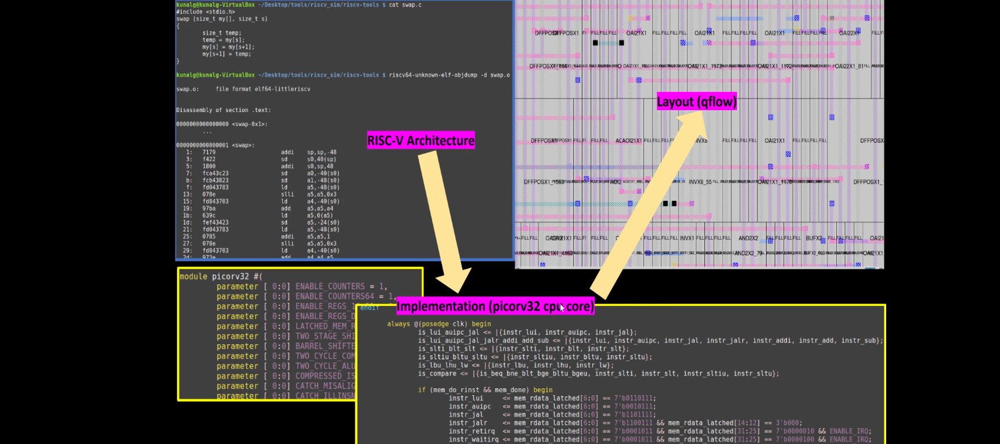

## From Software Applications to Hardware
To run a software application on real silicon, high-level code must be transformed—step by step—into transistor-switching signals.  In modern systems this chain looks like:
1. **Application Software**  
   Written in C, C++, Java, etc., and used to implement user-facing functionality (e.g., a web browser or stopwatch).

2. **System Software**  
   Acts as the bridge between your app and the bare metal:
   - **Operating System (OS)**  
     Manages I/O, memory allocation, system calls, and resource scheduling.  
   - **Compiler**  
     Translates your high-level source into target-specific assembly (e.g., RISC-V instructions).  
   - **Assembler**  
     Converts that assembly into binary machine code, ready for the processor.  

3. **Instruction Set Architecture (ISA)**  
   The ISA (here, **RISC-V**) defines the exact binary opcodes your CPU core understands—this is the “language” in which your compiled code speaks to the hardware.

4. **Hardware Description & RTL**  
   A Hardware Description Language (HDL) like Verilog implements the ISA at the register-transfer level (RTL), describing how each instruction maps to flip-flops, adders, and control logic.

5. **Physical Design**  
   RTL is synthesized into a gate-level netlist, then placed, routed, and finally taped out in silicon.

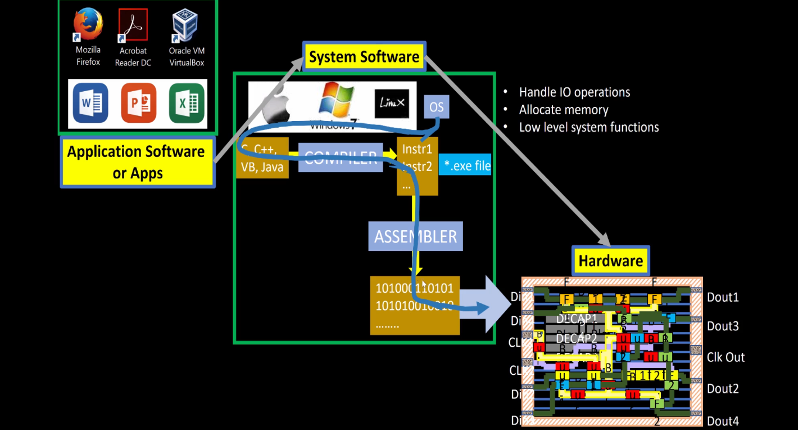

**Example: Stopwatch App on RISC-V**
For example, consider a **stopwatch app** running on a **RISC-V core**. The user writes a simple function in C to implement timekeeping logic (hours, minutes, seconds). This high-level application code is first handled by the **system software**, including:

- **Operating System (OS)**:  
  Manages low-level operations like memory allocation, I/O handling, and system calls (e.g., `sleep()` and `clear()` in the C code).

- **Compiler**:  
  Translates the high-level C code into **RISC-V-specific assembly instructions** tailored to the target architecture.

- **Assembler**:  
  Converts the human-readable assembly code into **binary machine instructions**.

- **Linker**:  
  Combines all object files and dependencies into the final **`.exe` or binary executable**.

This **machine-level binary** is then fed to the **hardware layer**, where it is executed by the RISC-V processor. In physical design workflows, these binary instructions are synthesized and mapped into a **chip layout** using tools like:

- **OpenLane** – For RTL-to-GDSII flow
- **Sky130 PDK** – A 130nm open-source process design kit

Finally, the generated **layout is fabricated into silicon**, producing a chip that can independently execute the stopwatch functionality at the hardware level.

This demonstrates the full-stack hardware design flow:  
**from software → to compiler → to silicon.**

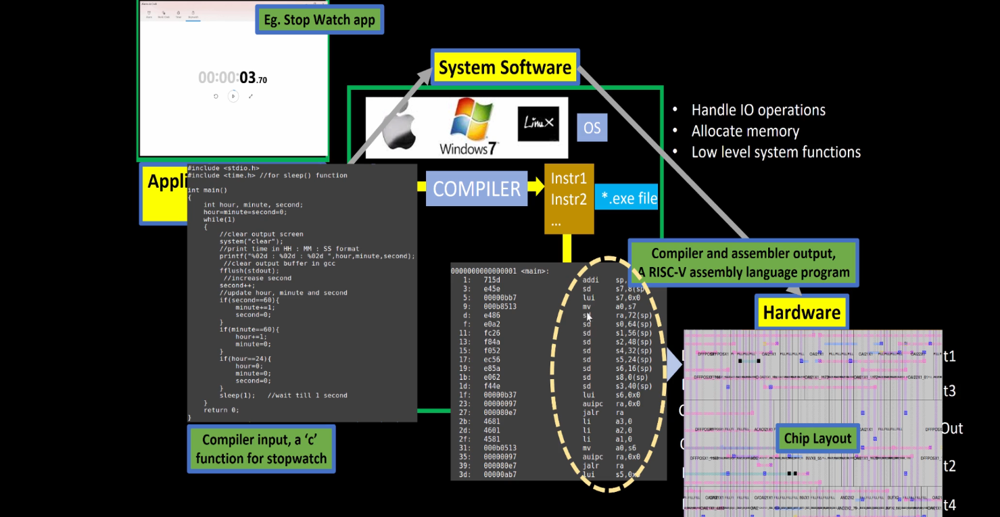

For the above stopwatch the below figure shows the input and output of the compiler and assembler.

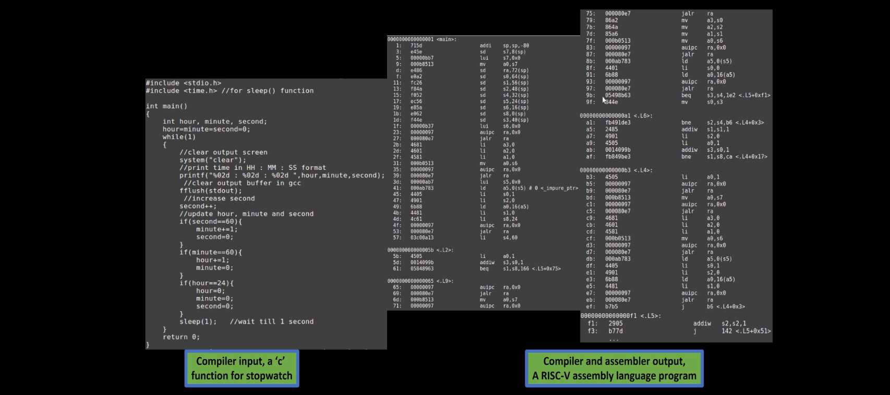

This image demonstrates the complete transformation of a machine instruction (e.g., add x6, x10, x6) into real, executable hardware logic. At the top, the instruction is part of a RISC-V program defined by the Instruction Set Architecture (ISA) — the abstract interface between software and hardware. The assembler converts these instructions into binary machine code (e.g., 010001101...), which is then interpreted by the RTL (Register Transfer Level) hardware description written in Verilog. This RTL is synthesized into a gate-level netlist, comprising logic gates like NAND, NOR, and flip-flops. Finally, the logic is placed and routed into a physical layout on silicon — shown at the bottom right — where real transistors switch to implement the behavior defined by the instruction. This showcases how a single line of code flows from abstract software into concrete hardware functionality.

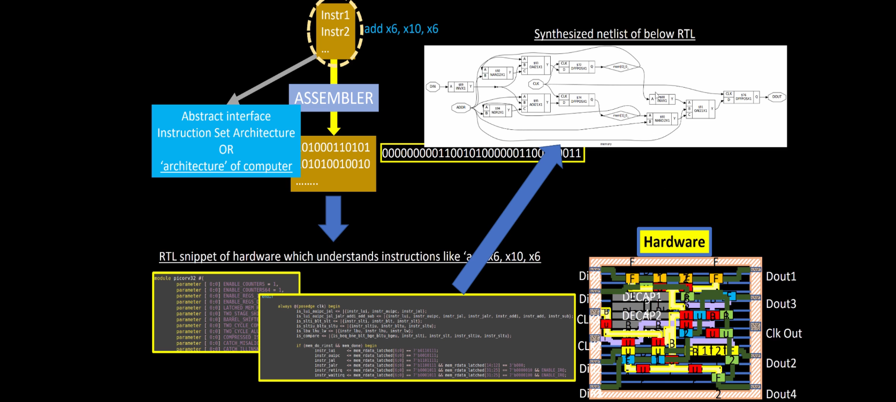

# SoC Design and OpenLANE

## Introduction to all Components of open-source digital ASIC design

In a state-of-the-art digital ASIC design methodology, three categories of inputs converge within EDA toolchains to yield a manufacturable layout and GDSII database:
- RTL IP's
- EDA Tools
- PDK Data

**What is PDK?**
- Process Design Kit (PDK) is the collection of files used to model a fabrication process for the EDA tools used to design an IC. Typical PDK components include:
  - Process design rules: DRC, LVS, PEX
  - Device Models : SPICE models for transistors, diodes, capacitors, resistors, etc.  
  - Digital Standard Cell Libraries: Liberty (.lib) timing models, LEF abstract views, GDSII layouts for each cell  
  - I/O libraries: Specialized cells for pads, ESD protection, level shifters, SERDES PHYs, etc.
- PDK serves as the interface between the FAB and the designers.

## Simplified RTL2GDS flow

## Introduction to OpenLANE and strive chipsets

## Introduction to OpenLANE detailed ASIC design flow

# Get Familiar to open-source EDA tools

## OpenLANE Directory structure in detail

## Design Preparation Step

## Review files after design prep and run synthesis

## OpenLANE Project Git Link Description

## Steps to Characterize synthesis results
