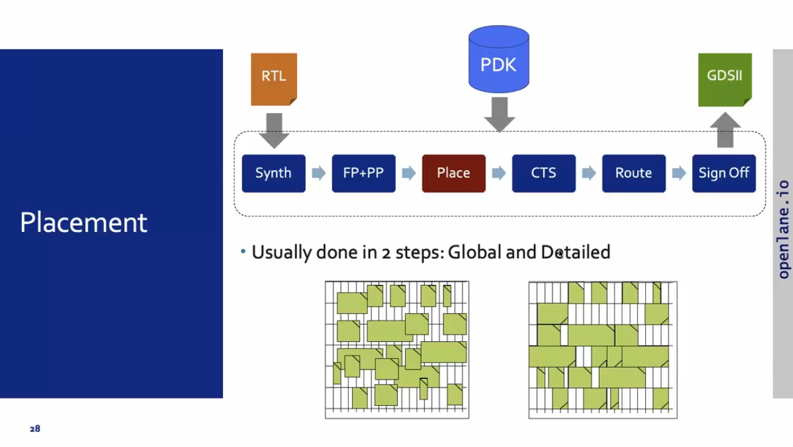
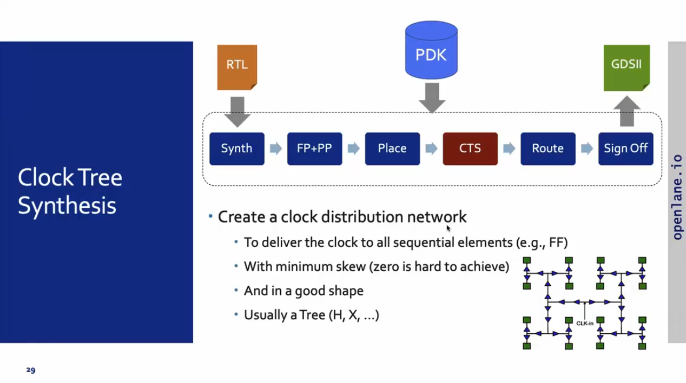
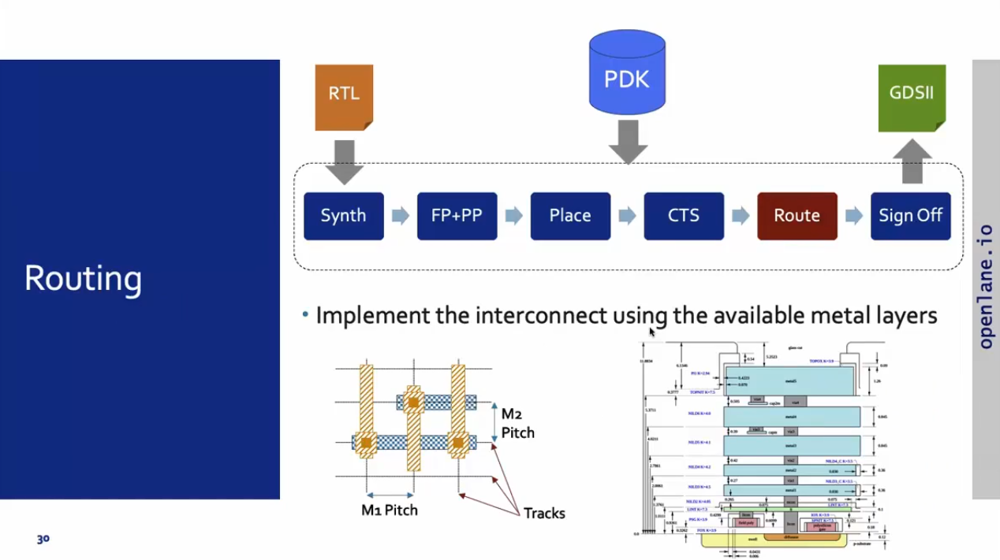
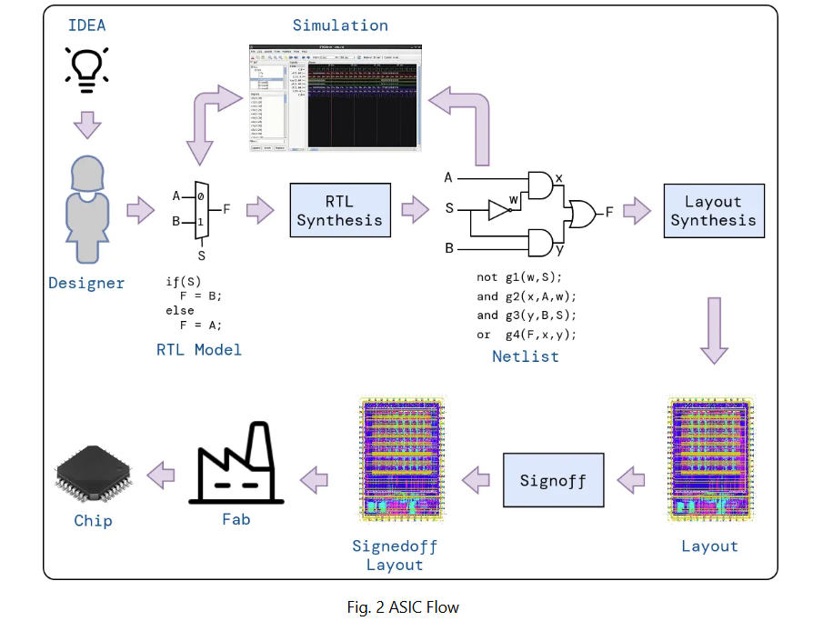
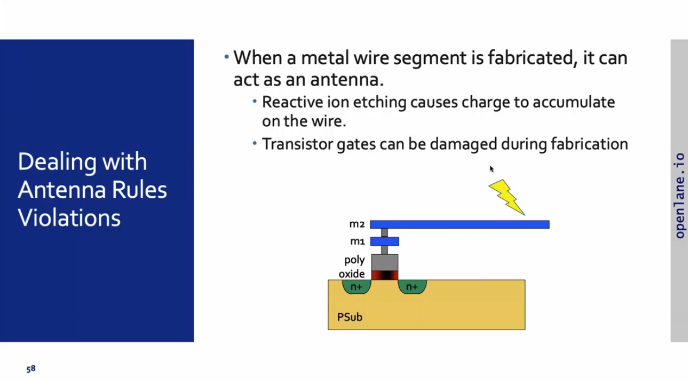

<details>
  <Summary><strong> Day 15 : Inception of open-source EDA - OpenLANE and Sky130PDK</strong></summary>

# Contents
- [How to Talk to Computers](#how-to-talk-to-computers)
  - [Introduction to QFN-48 Package - Chip - Pads - Core - Die and IPs](#introduction-to-qfn--48-package--chip--pads--core--die-and-ips)
  - [Introduction to RISC-V](#introduction-to-risc--v)
    - [ISA (instruction Set Architecture)](#isa)
  - [From Software Applications to Hardware](#from-software-applications-to-hardware)   
- [SoC Design and OpenLANE](#soc-design-and-openlane)
  - [Introduction to all Components of open-source digital ASIC design](#introduction-to-all-components-of-open--source-digital-asic-design)
  - [Simplified RTL2GDS flow](#simplified-rtl2gds-flow)
  - [OpenLANE ASIC design flow](#openlane-detailed-asic-design-flow)
- [Openlane Installation](#openlane-installation)
  - [Steps to build OpenLANE](#steps-to-build-openlane)
  - [Steps to run OpenLANE for spm design](#steps-to-run-openlane)
- [Openlane Flow for picorv32a design](#openlane-flow-for-picorv32a-design)
  - [Directory Structure](#directory-structure)
  - [Clone the Repo](#clone-repo)
  - [Build PDKs from Source](#build-pdks)
  - [OpenLANE Synthesis for picorv32a](#openlane-synthesis)
- [Chip Floor planning considerations](#chip-floor-planning-considerations)
  - [Utilization factor and aspect ratio](#utilization-factor-and-aspect-ratio)
  - [Pre-placed cells](#cencept-of-pre--placed-cells)
  - [De-coupling Capacitors](#de--coupling-capacitors)
  - [Power planning](#power-planning)
  - [Pin-placement and logical cell placement blockage](#pin--placement-and-logical-cell-placement-blockage)

<a id="how-to-talk-to-computers"></a>
# How to Talk to Computers

<a id="introduction-to-qfn--48-package--chip--pads--core--die-and-ips"></a>
## Introduction to QFN-48 Package - Chip - Pads - Core - Die and IPs

**Package:** In any embedded board we have seen, the part of the board we consider as the chip is only the PACKAGE of the chip which is nothing but a protective layer or packet bound over the actual chip and the actual manufatured chip is usually present at the center of a package wherein, the connections from package is fed to the chip by WIRE BOUND method which is none other than basic wired connection.


The architecture inside the arduino chip is shown below


### QFN-48 (Quad Flat No-Leads) Package
The QFN-48 is a compact, high-performance IC package offering 48 solder-able pads on a 7 mm × 7 mm footprint. Its leadless “no-leads” design minimizes PCB real estate while providing excellent thermal and electrical characteristics.

The architecture inside the processor/ Soc is shown below. Various packages are available and the chip is present inside the package as shown in the diagram below.


**Key Features:**
- Leadless Design: Ultra-low profile; ideal for space-constrained PCBs
- 48 Connection Pads: Rich I/O for complex systems
- Compact Size: 7 mm × 7 mm footprint
- Thermal Efficiency: Exposed pad and copper slug optimize heat dissipation
- Electrical Performance: Low parasitic inductance and resistance

**Common Applications:**
- Microcontroller and microprocessor modules
- Wireless RF front-ends
- Power-management ICs
- High-density sensor interfaces
- Precision data-converter packages

**Chip Overview**
- Integrated circuit is the one in which thousand of gates ,resistors and capacitors are fabricated into it.An IC act as a memory,timer,counter ,amplifier etc.The main advantage of Ic is they are small in size and when comes to the functionality they does the best job.They are availabel in the form of packages.

**Core Functional Blocks:**
- Processing Units: One or more CPU cores (e.g., RISC-V, ARM) execute instructions and control data flow.
- Memory: SRAM, ROM, or flash cells store code, data, and configuration.
- I/O Interfaces: Digital GPIOs, high-speed serial links (QSPI, UART), and analog converters connect to the outside world.

The boundaries of the chip is connected to the pins present in the boundaries of the package.


**Chip Components Overview**
1. **Pads:** Small metal lands on the package periphery. Serve as the electrical interface between PCB traces and on-die interconnect
2. **Core:** Central silicon region containing CPU, bus fabric, and on-chip peripherals. Floorplanned for optimal timing, power, and area
3. **Die:** The complete silicon piece before packaging. Contains all active circuits, passive components, and metal routing layers

  


- In the above figure IP represents the Intellectual Property (IP) which are specific foundary. RISC-V and SRAM are the macros which are placed inside core. In the area surrounding the core I/O cells are placed. Physical design is the step which is used to place Intellectual Property (IP) and macros inside the core area.

- **Foundry IPs:** Pre-characterized circuit blocks supplied by the foundry. Delivered as GDSII, LEF/DEF and timing libraries, these IPs accelerate design by providing plug-and-play analog and mixed-signal functionality.

- **Macros:** Macros are large functional blocks designed by the SoC team (or third-party vendors) to meet specific on-chip requirements - such as custom SRAM banks, DMA controllers, or specialized accelerators.

### Macros vs. Foundry IPs Comparison

Below is a side-by-side comparison of in-house **macros** and **foundry IPs**, formatted as a GitHub-friendly Markdown table.

| **Feature**           | **Macros**                                                                                                                                  | **Foundry IPs**                                                                                                                           |
|-----------------------|----------------------------------------------------------------------------------------------------------------------------------------------|--------------------------------------------------------------------------------------------------------------------------------------------|
| **Definition**        | Pre-implemented functional blocks (e.g., custom SRAM banks, DMA controllers, accelerators) integrated at the subsystem level                  | Pre-characterized, silicon-proven blocks (e.g., ADC, PLL, high-speed PHYs) provided by the foundry                                           |
| **Source**            | Designed in-house or by third-party IP vendors                                                                                               | Developed, validated, and licensed directly by semiconductor foundries (e.g., TSMC, GlobalFoundries)                                        |
| **Complexity**        | Medium to high (e.g., custom logic, large memories, specialized accelerators)                                                                 | Can range from basic I/O cells to complex analog/digital subsystems (e.g., USB PHY, DDR PHY, PLL)                                           |
| **Customization**     | Highly configurable—parameters and micro-architecture can be tuned for specific power, performance, or area (PPA) goals                        | Limited parameterization—typically voltage range, bit-width, or process corner settings                                                      |
| **Integration Scope** | Integrated and verified at the SoC-level context (requires SoC-wide DRC/LVS, STA, and co-simulation with surrounding logic)                 | Delivered as “black-box” models (GDSII, LEF/DEF, Liberty) ready for drop-in use, requiring minimal SoC-level integration effort             |
| **Verification**      | Must be validated within the SoC—DRC/LVS, STA, power analysis, and functional verification in target use-cases                                | Pre-verified by the foundry across multiple PVT corners, including DRC, LVS, timing, and reliability tests                                   |
| **Purpose**           | Tailored to unique design requirements—e.g., low-power accelerators, custom memories, on-chip bus controllers                                 | Accelerate time-to-market by reusing proven, reusable building blocks, reducing design risk and development time                             |


<a id="introduction-to-risc--v"></a>
## Introduction to RISC-V
<a id="isa"></a>
### ISA (instruction Set Architecture)
The ISA is the “language” of the computer - the interface through which software talks to hardware. When you write C code, it must be executed on a specific processor layout. First, the compiler translates your C into RISC-V assembly; next, an assembler converts that into binary machine code, which is then fed to the processor to produce the required output.

Between the abstract RISC-V specification and the physical layout, we use a hardware description language (HDL) such as Verilog or VHDL. In this flow, the RTL description implements the RISC-V ISA, and that RTL is then synthesized and placed-and-routed to generate the final silicon layout.


<a id="from-software-applications-to-hardware"></a>
## From Software Applications to Hardware
To run a software application on real silicon, high-level code must be transformed—step by step—into transistor-switching signals.  In modern systems this chain looks like:
1. **Application Software**  
   Written in C, C++, Java, etc., and used to implement user-facing functionality (e.g., a web browser or stopwatch).

2. **System Software**  
   Acts as the bridge between your app and the bare metal:
   - **Operating System (OS)**  
     Manages I/O, memory allocation, system calls, and resource scheduling.  
   - **Compiler**  
     Translates your high-level source into target-specific assembly (e.g., RISC-V instructions).  
   - **Assembler**  
     Converts that assembly into binary machine code, ready for the processor.  

3. **Instruction Set Architecture (ISA)**  
   The ISA (here, **RISC-V**) defines the exact binary opcodes your CPU core understands—this is the “language” in which your compiled code speaks to the hardware.

4. **Hardware Description & RTL**  
   A Hardware Description Language (HDL) like Verilog implements the ISA at the register-transfer level (RTL), describing how each instruction maps to flip-flops, adders, and control logic.

5. **Physical Design**  
   RTL is synthesized into a gate-level netlist, then placed, routed, and finally taped out in silicon.


**Example: Stopwatch App on RISC-V**
For example, consider a **stopwatch app** running on a **RISC-V core**. The user writes a simple function in C to implement timekeeping logic (hours, minutes, seconds). This high-level application code is first handled by the **system software**, including:

- **Operating System (OS)**:  
  Manages low-level operations like memory allocation, I/O handling, and system calls (e.g., `sleep()` and `clear()` in the C code).

- **Compiler**:  
  Translates the high-level C code into **RISC-V-specific assembly instructions** tailored to the target architecture.

- **Assembler**:  
  Converts the human-readable assembly code into **binary machine instructions**.

- **Linker**:  
  Combines all object files and dependencies into the final **`.exe` or binary executable**.

This **machine-level binary** is then fed to the **hardware layer**, where it is executed by the RISC-V processor. In physical design workflows, these binary instructions are synthesized and mapped into a **chip layout** using tools like:

- **OpenLane** – For RTL-to-GDSII flow
- **Sky130 PDK** – A 130nm open-source process design kit

Finally, the generated **layout is fabricated into silicon**, producing a chip that can independently execute the stopwatch functionality at the hardware level.

This demonstrates the full-stack hardware design flow:  
**from software → to compiler → to silicon.**


For the above stopwatch the below figure shows the input and output of the compiler and assembler.


This image demonstrates the complete transformation of a machine instruction (e.g., add x6, x10, x6) into real, executable hardware logic. At the top, the instruction is part of a RISC-V program defined by the Instruction Set Architecture (ISA) — the abstract interface between software and hardware. The assembler converts these instructions into binary machine code (e.g., 010001101...), which is then interpreted by the RTL (Register Transfer Level) hardware description written in Verilog. This RTL is synthesized into a gate-level netlist, comprising logic gates like NAND, NOR, and flip-flops. Finally, the logic is placed and routed into a physical layout on silicon — shown at the bottom right — where real transistors switch to implement the behavior defined by the instruction. This showcases how a single line of code flows from abstract software into concrete hardware functionality.


<a id="soc-design-and-openlane"></a>
# SoC Design and OpenLANE

<a id="introduction-to-all-components-of-open--source-digital-asic-design"></a>
## Introduction to all Components of open-source digital ASIC design

In a state-of-the-art digital ASIC design methodology, three categories of inputs converge within EDA toolchains to yield a manufacturable layout and GDSII database:
- RTL IP's
- EDA Tools
- PDK Data

**What is PDK?**
- Process Design Kit (PDK) is the collection of files used to model a fabrication process for the EDA tools used to design an IC. Typical PDK components include:
  - Process design rules: DRC, LVS, PEX
  - Device Models : SPICE models for transistors, diodes, capacitors, resistors, etc.  
  - Digital Standard Cell Libraries: Liberty (.lib) timing models, LEF abstract views, GDSII layouts for each cell  
  - I/O libraries: Specialized cells for pads, ESD protection, level shifters, SERDES PHYs, etc.
- PDK serves as the interface between the FAB and the designers.


<a id="simplified-rtl2gds-flow"></a>
## Simplified RTL2GDS flow

This diagram illustrates the core steps in a typical RTL-to-GDSII ASIC implementation flow, using your RTL source and the foundry’s PDK as primary inputs:


1. **RTL Synthesis:** Map RTL (Verilog/VHDL) into a gate-level netlist using the standard-cell library from the PDK. Perform technology mapping, logic optimization, and area/timing trade-offs.


3. **Floor & Power Planning:** Partitions the chip area, places key components (macros/IPs), and defines the power grid and I/O pad placement. This step aims to reduce power consumption and improve signal integrity by optimizing physical layout.


4. **Placement:** Assigns physical locations to standard cells, targeting minimal wirelength, low signal delay, and better area utilization. A well-placed design improves performance, reduces congestion, and eases routing complexity.


Global placement provide approximate locations for all cells based on connectivity but in this stage the cells may be overlapped on each other and in detailed placement the positions obtained from global placements are minimally altered to make it legal (non-overlapping and in site-rows)



6. **Clock Tree Synthesis (CTS):** Builds a clock distribution network to deliver the clock signal uniformly to all sequential elements like flip-flops and registers. CTS ensures minimal skew, balanced paths, and robust clock propagation.



8. **Routing:** Connects all placed components based on netlist connectivity. The router optimizes wire paths for signal integrity, avoids congestion, and satisfies design rule constraints set by the foundry.



skywater PDK has 6 routing layers in which the lowest layer is called the local interconnect layer which is a Titanium Nitride layer the following 5 layers are all Aluminium layers.


9. **Sign-off:** Final validation stage - Timing analysis, Power analysis and Physical verification


11. **GDSII File Generation:** Produces the GDSII file containing all physical layout data. This file is used by foundries to generate photomasks and manufacture the silicon chip. The GDSII is essentially the final blueprint for chip fabrication.

<a id="openlane-detailed-asic-design-flow"></a>
## OpenLANE ASIC design flow


OpenLANE flow is an automated RTL2GDSII flow where all required tools are embedded into it and you have complete control of each process. We control them by using env variables which will be discussed at each stage since they are unique for each of them. This OpenLANE flow is specially designed for no human interaction based RTL2GDSII flow. Hence we have automated mode and interactive mode to run the OpenLANE flow. 

- Designing an ASIC is a complex and fascinating process that entails various steps, from idea to the fabrication data.
- This process is filled with engineering challenges that require expertise and attention to detail. The entire process requires significant expertise and experience in chip design and can take several months to complete.
- The ASIC design flow is crucial to ensure successful ASIC design. It is based on a comprehensive understanding of ASIC specifications, requirements, low-power design, and performance.
- Engineers can streamline the process and meet crucial time-to-market goals by following a proven ASIC design flow.
- Each stage of the ASIC design cycle is supported by powerful EDA (Electronic Design Automation) tools that facilitate the implementation of the design. The following are examples of steps needed to realize an ASIC.

- **Design Entry**: In this step, the logic design is described using a Hardware Description Language (HDL) like System Verilog. Typically, the description is done at the data flow (Register Transfer) or behavioral levels.

- **Functional Verification**: It is essential to catch design errors early on. The description must be checked against the requirements, which can be done through simulation or formal methods. Functional verification is performed on the RTL description as well as the netlists generated by the following steps.

- **Synthesis:** In this step, the HDL description is converted into a circuit of the logic cells called the Netlist.

- **Layout/Physical Synthesis:** Also called Physical Implementation. In this step, the logic circuit is converted into a layout of the photo masks used for fabrication. This complex step involves several sub-steps typically automated using its flow. These steps include Floorplanning, Placement, Clock-tree synthesis and Routing. Because Placement and Routing are the most time-consuming operations, sometimes we refer to this step as “Placement and Routing”, or PnR.

- **Signoff:** marks the final stage in the rigorous journey of an ASIC’s design; it ensures your creation functions flawlessly, operates efficiently, and ultimately delivers on its promise before sending your chip blueprint off to be carved in silicon.







<details>
  <Summary><strong> Openlane Installation and spm</strong></summary>

<a id="openlane-installation"></a>
# Openlane Installation

- Steps to install OpenLane and all its dependencies on an Ubuntu system using an automated build script.
- The scripts in this repo are :
  - `openlane_script.sh` : It is a standalone script that installs OpenLane (latest version) and all its dependencies.
  - `openlane_script_wo_depends.sh` : It is a lighter version that works alongside the [vsdflow script](https://github.com/kunalg123/vsdflow), assuming some tools are already pre-installed.

<a id="steps-to-build-openalne"></a>
## Steps to build OpenLANE

1. `git clone https://github.com/nickson-jose/openlane_build_script`
2. `sudo -i` #switch to root user (or have root user password ready).
3. Change directory to where openlane_build_script folder was cloned. `cd /path/to/openlane_build_script`
4. Execute the script as below:

      - **For standalone build**
       
        - `chmod 775 openlane_script.sh`
        - `./openlane_script.sh`
     
      - **For build in conjunction with vsdflow**
       
        -  Copy the `openlane_script_wo_depends.sh` to vsdflow folder.
        - `chmod 775  openlane_script_wo_depends.sh`
        - `./openlane_script_wo_depends.sh`
      
5. This script would create following directory structure:

- **For build in conjunction with vsdflow**
```bash 
vsdflow/
  └── work
     └── tools
      ├── cmake-3.13.0
      ├── cmake-3.13.0.tar.gz
      ├── graywolf
      ├── magic-8.3.50
      ├── magic-8.3.50.tgz
      ├── netgen-1.5.134
      ├── netgen-1.5.134.tgz
      ├── openlane_working_dir
      ├── OpenSTA
      ├── OpenTimer
      ├── qflow-1.3.17
      ├── qflow-1.3.17.tgz
      ├── qrouter-1.4.59
      ├── qrouter-1.4.59.tgz

```
- **For standalone build**
 ```bash  
 Desktop/
 ...
  └── work
    └── tools 
        └── openlane_working_dir
         |__ Openlane
                       
```              


<a id="steps-to-run-openalne"></a>
## Steps to run OpenLANE

1. Go to /path/to/openlane (i.e., ~/work/tools/openlane_working_dir/Openlane)
2. There are two ways of invoking openlane. The easiest of the two would be:
   - `make mount`

   The second way would be to explicitly specify the path to PDK_ROOT and OPENLANE_IMAGE_NAME and invoking docker with these inputs
   - `export PDK_ROOT=<absolute path to where skywater-pdk and open_pdks reside>`
   - `export OPENLANE_IMAGE_NAME=<docker image name>`
   - `docker run -it -v $(pwd):/openlane -v $PDK_ROOT:$PDK_ROOT -e PDK_ROOT=$PDK_ROOT -u $(id -u $USER):$(id -g $USER) $OPENLANE_IMAGE_NAME`
   
3. **Note:** If you face "permission denied" during docker invocation in setup or in above step, do refer below link to resolve:
   - [Fix Docker Permission Denied Issue](https://stackoverflow.com/questions/48957195/how-to-fix-docker-got-permission-denied-issue)

4. `./flow.tcl -design spm`
(the above flow.tcl command will run RTL2GDS flow for design named "spm". Same can be done for other designs which are present in ~/work/tools/openlane_working_dir/Openlane/designs)

5. Refer to: https://github.com/efabless/openlane for detailed instructions.


### Calculation of Flop Ratio and DFF % from synthesis statistics report file

```math
Flop\ Ratio = \frac{63}{253} = 0.249011
```
```math
Percentage\ of\ DFF's = 0.249011 * 100 = 24.9011\ \%
```


</details>

<a id="openlane-flow-for-picorv32a-design"></a>
# OpenLANE flow for picorv32a Design

<a id="directory-structure"></a>
## OpenLANE Directory Structure:
```bash
├── OpenLane             -> directory where the tool can be invoked (run docker first)
│   ├── designs          -> All designs must be extracted from this folder
│   │   │   ├── picorv32a -> Design used as case study for this workshop
│   |   |   ├── ...
|   |   ├── ...
├── pdks                 -> contains pdk related files 
│   ├── skywater-pdk     -> all Skywater 130nm PDKs
│   ├── open-pdks        -> contains scripts that makes the commerical PDK (which is normally just compatible to commercial tools) to also be compatible with the open-source EDA tool
│   ├── sky130A          -> pdk variant made especially compatible for open-source tools
│   │   │  ├── libs.ref  -> files specific to node process (timing lib, cell lef, tech lef) for example is `sky130_fd_sc_hd` (Sky130nm Foundry Standard Cell High Density)  
│   │   │  ├── libs.tech -> files specific for the tool (klayout,netgen,magic...)
```

<a id="clone-repo"></a>
**Step 1: Clone the Repo**
- To get started, clone the required files and project setup from the following GitHub repository:

```bash
git clone https://github.com/fayizferosh/soc-design-and-planning-nasscom-vsd
```
- This repository contains all the necessary resources, scripts, and design files to follow along with the OpenLANE-based Advanced Physical Design flow, including the picorv32a case study.

<a id="build-pdks"></a>
**Step 2: Build PDKs from Source**
- To build and [install the OpenPDKs](https://github.com/RTimothyEdwards/open_pdks) (Process Design Kits) for the Sky130 process node, follow these steps:

```bash
git clone https://github.com/RTimothyEdwards/open_pdks.git
cd open_pdks
./configure --enable-sky130-pdk
make
sudo make install
```


<a id="openlane-synthesis"></a>
**Step 3: Run OpenLANE Synthesis Flow for `picorv32a` design**
1. Export the PDK_ROOT variable to point to your sky130A PDK
```bash
export PDK_ROOT=/home/sdudigani/soc-design-and-planning-nasscom-vsd/Desktop/work/tools/openlane_working_dir/pdks/
```
2. Change directory to the OpenLANE flow working directory
```bash
cd ~/soc-design-and-planning-nasscom-vsd/Desktop/work/tools/openlane_working_dir/openlane/
```
3. (Optional) Alias the docker command to simplify OpenLANE invocation
```bash
alias docker='docker run -it -v $(pwd):/openLANE_flow -v $PDK_ROOT:$PDK_ROOT -e PDK_ROOT=$PDK_ROOT -u $(id -u $USER):$(id -g $USER) efabless/openlane:v0.21'
```
4. Launch the Docker container (OpenLANE interactive shell)
```bash
docker
```
5. Once inside the Docker container, launch the OpenLANE interactive shell using:
```bash
./flow.tcl -interactive
```


6. Run the OpenLANE Synthesis Flow Commands from the Interactive Shell for picorv32a design
  - Load the required OpenLANE package for proper functionality and prepare the design (creates necessary directory structure, config files, and copies RTL files)
  
  ```bash
  package require openlane 0.9
  prep -design picorv32a
  ```
  

  -  Run `synthesis`
  
  ```bash
  run_synthesis
  ```

**Error:**
You may encounter the following error:
```bash
% run_synthesis
[INFO]: Running Synthesis...
[INFO]: current step index: 1
ERROR: TCL interpreter returned an error: can't read "::env(SYNTH_CAP_LOAD)": no such variable
[ERROR]: during executing: "yosys -c /openLANE_flow/scripts/synth.tcl -l /openLANE_flow/designs/picorv32a/runs/17-07_20-29/logs/synthesis/1-yosys.log |& tee >&@stdout"
[ERROR]: Exit code: 1
[ERROR]: Last 10 lines:
child process exited abnormally

[ERROR]: Please check yosys  log file
[ERROR]: Dumping to /openLANE_flow/designs/picorv32a/runs/17-07_20-29/error.log
[INFO]: Calculating Runtime From the Start...
[INFO]: Flow failed for picorv32a/17-07_20-29 in 0h8m41s
[INFO]: Generating Final Summary Report...
[INFO]: Design Name: picorv32a
Run Directory: /openLANE_flow/designs/picorv32a/runs/17-07_20-29
Source not found.
----------------------------------------

LVS Summary:
Source: /openLANE_flow/designs/picorv32a/runs/17-07_20-29/results/lvs/picorv32a.lvs_parsed.gds.log
Source not found.
----------------------------------------

Antenna Summary:
No antenna report found.
[INFO]: check full report here: /openLANE_flow/designs/picorv32a/runs/17-07_20-29/reports/final_summary_report.csv
[ERROR]: Flow Failed.
```


**Reason:** OpenLane’s synthesis script expected an environment variable called `SYNTH_CAP_LOAD` but didn’t find it in the design’s `config.tcl`. That variable is used to size cells based on a target load capacitance (in fF) during Yosys synthesis.

**Fix:**
Inside interactive session run the following:
```bash
# inside the interactive prompt, before "run_synthesis"
set ::env(SYNTH_CAP_LOAD) 5.0
run_synthesis
```

Note: Here `5.0` means “target `5 fF` per output pin.” We can tune that up or down depending on the speed/area goals.

[OR]

Add the env variable to /openlane/designs/picorv32a/config.tcl, save and re-run the flow.

`set ::env(SYNTH_CAP_LOAD) 5.0`


`set ::env(SYNTH_CAP_LOAD) 10.0`


`set ::env(SYNTH_CAP_LOAD) 30.0`


9. View the Yosys Synthesis Report
```bash
gvim ~/soc-design-and-planning-nasscom-vsd/Desktop/work/tools/openlane_working_dir/openlane/designs/picorv32a/runs/17-07_20-29/results/synthesis/picorv32a.synthesis.v
```

**Synthesized Netlist**


```bash
cd ~/soc-design-and-planning-nasscom-vsd/Desktop/work/tools/openlane_working_dir/openlane/designs/picorv32a/runs/17-07_20-29/reports/synthesis/
gvim 2-1-yosys_4.stat.rpt
```
**Statistics**


### Flop Ratio and DFF % Calculation from Synthesis Statistics Report File

Total Cells = 14871
DFF Cells = 1613

```math
Flop\ Ratio = \frac{DFFs}{Total Cells}   =   \frac{1613}{14871} = 0.10846
```

# Good Floorplan vs Bad Floorplan - Library cells 

<details>
  <Summary><strong> Chip Floor planning considerations</strong></summary>
  
<a id="chip-floor-planning-considerations"></a>
# Chip Floor planning considerations

<a id="utilization-factor-and-aspect-ratio"></a>
## Utilization factor and aspect ratio
**Define width and height of core and die:**
- Let us consider a minimal design consisting of two flip-flops (FF) feeding two standard-cell gates (A1, O1). The netlist defines connectivity but says nothing about physical dimensions.


- Enclose each logical element in a rectangular “footprint.” For rough estimation, we assume every cell (FF or gate) is a 1 unit × 1 unit square.


By convention:
- Standard cell = 1 unit × 1 unit → 1 unit²
- Flip-flop = 1 unit × 1 unit → 1 unit²


- Tile the four 1 unit² blocks into a 2×2 array.
  - Core width = 2 units
  - Core height = 2 units
  - Core area = 4 unit²


The above figure shows the rough calculation of minimum area that is occupied bu the netlist.

- **Core:** the region containing all standard cells (our 2×2 tile).
- **Die:** the die includes the core plus I/O pads, power rings, and metal guard-bands.
- **Wafer:** multiple dice are fabricated together on a circular wafer.


- In this example, the four blocks completely occupy the core area (4 unit² occupied / 4 unit² total = 1.0 → 100 %).


**Note:** Real designs typically target 60–80 % utilization to leave room for routing nets, filler cells, and power straps etc.

- **Aspect ratio** wiil decide the size and shape of the chip. It is the ratio of vertical routing resources to the horizontal routing resources. If its value is 1 then the chip is in square shape and if it is greater than 1 then the chip is in rectangular shape.

$$  
\text{Aspect Ratio}
\=\
\frac{\text{Height of the core area}}
     {\text{Width of the core area}}
$$


- **Core Utilization** defines the area occupied by macros, standard cells and other cells. If Core utilisation is 70% - 70% of core area is used for placing the standard cells, macros and other cells while remaining 30% can be used for routing. In other words it is the area occupied by the netlist.

$$  
\text{Utilization Factor}
\=\
\frac{\text{Area Occupied by Netlist}}
     {\text{Total Core Area}}
$$


<a id="cencept-of-pre--placed-cells"></a>
## Pre-placed cells
- Before running automated placement & routing (APR), we often “pre-place” large or critical blocks (IPs) at fixed locations.
- **Pre-placed cells** are large timing-critical blocks (like memories, clock-gating cells, or custom macros) that are fixed at specific locations in design floorplan before running automated placement and routing. By “black-boxing” each block - exposing only its I/O pins and hiding its internal gates they are ensured that APR treats it as a fixed macro, giving us predictable timing, power-grid alignment, and routing channels around those anchored blocks.


- Functionality of pre-placed cells is implemented only once and APR tools do not alter their locations.
- The location of pre-placed cells are defined depending upon the design scenario or background.


<a id="de--coupling-capacitors"></a>
## De-coupling Capacitors

- Decouples the circuit from the V<sub>DD</sub> rail.
- Reduce Zpdn for the required frequencies of operation
- Serve as a charge reservoir for the switching current demands that the VDD rail cannot satisfy.
- Surround pre-placed cells with Decaps to compensate for the switching current demands (di/dt)


<a id="power-planning"></a>
## Power planning

 - SSN
   - L*di/dt
     * Discharging : Ground bounce
     * Charging    : Voltage Droop
   - **Solution:** Reduce the Vdd/ Vss parasitics ->
     * Power grid
     * Multiple VDD, VSS pins/ balls 


<a id="pin--placement-and-logical-cell-placement-blockage"></a>
## Pin-placement and logical cell placement blockage


<a id="die-area-in-microns"></a>
**Calculate the die area in microns from the values in floorplan def**


- Die Area from spm.def 
    unit to micron scale: 1000 units = 1 micron
    Die area: (0 0) to (101850 112570)

- Calculated dimensions:
    Die width = 101850/1000 = 101.85 μm
    Die height = 112570/1000 = 112.57 μm
    Die Area = 101.85 μm × 112.57 μm = 11465.2545 µm²

<a id="view-test-design-outputs"></a>
**Viewing Test Design Outputs**
- Open the spm.gds using KLayout

```bash
klayout /home/sdudigani/openlane_build_script/work/tools/openlane_working_dir/OpenLane/designs/spm/runs/RUN_2025.07.12_21.05.18/results/final/gds/spm.gds
```


</details>

<a id="floorplan-using-openlane-for-picorv32a"></a>
# Floorplanning using OpenLANE for `picorv32a`

floorplan.tcl
config.tcl

1. Run floorplan using OpenLANE and view the def in magic
```bash
run_floorplan
```


**Errors during Floorplan**


**View Floorplan DEF in Magic**
Run the following in a new terminal:

```bash
cd ~/soc-design-and-planning-nasscom-vsd/Desktop/work/tools/openlane_working_dir/openlane/designs/picorv32a/runs/18-07_00-11/results/floorplan/
magic -T ~/soc-design-and-planning-nasscom-vsd/Desktop/work/tools/openlane_working_dir/pdks/sky130A/libs.tech/magic/sky130A.tech lef read ../../tmp/merged.lef def read picorv32a.floorplan.def &
```


- Slect an object in the floorplan from magic window.
- Go to the tkcon main window.
- Type `what` as shown in the image below.
- The tkcon window will show the details of the selected object.


2. Calculate the die area in microns from the values in floorplan def


From floorplan def we can say that-

```math
1000\ Unit\ Distance = 1\ Micron
```
```math
Die\ width\ in\ unit\ distance = 660640 - 0 = 660640
```
```math
Die\ height\ in\ unit\ distance = 671360 - 0 = 671360
```
```math
Distance\ in\ microns = \frac{Value\ in\ Unit\ Distance}{1000}
```
```math
Die\ width\ in\ microns = \frac{660640}{1000} = 660.640\ Microns
```
```math
Die\ height\ in\ microns = \frac{671360}{1000} = 671.360\ Microns
```
```math
Area\ of\ die\ in\ microns = 660.640 * 671.360 = 443527.27\ Square\ Microns
```

```math
Percentage\ of\ DFF's = \frac{DFFs} {Total cells} X 100 = 0.108846 X 100 = 10.846%
```

