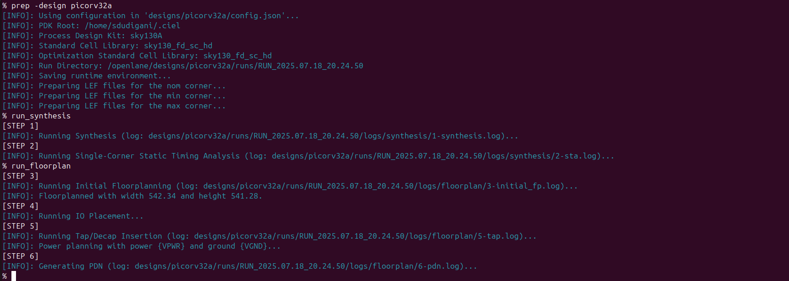
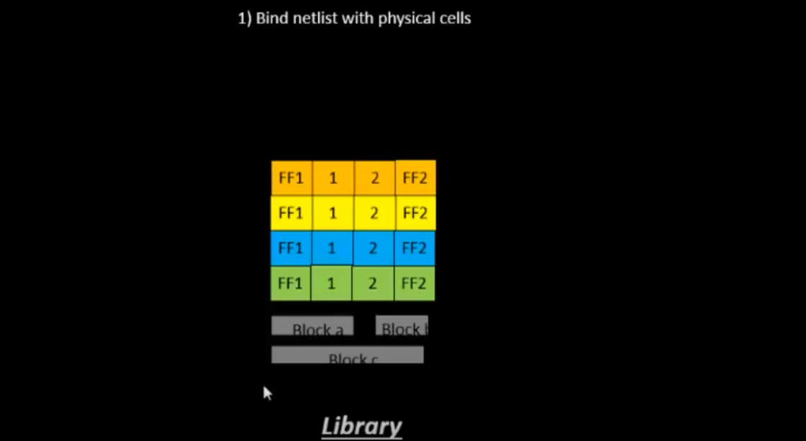
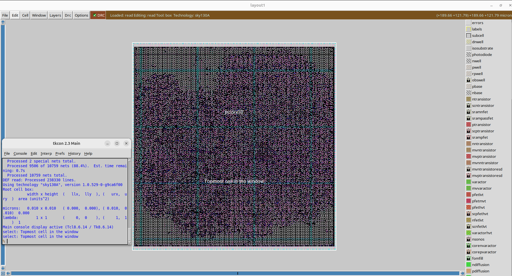

<details>
  <Summary><strong> Day 16 : Advanced Physical Design using OpenLANE for picorv32a</strong></summary>

# Contents
- [Physical Design Flow for picorv32a Using OpenLANE](#openlane-flow-for-picorv32a)
	- [Install OpenLane and PDKs](#install-openlane-and-pdks)
	- [`run_synthesis`](#run-synthesis)
 		- [Chip Floor planning considerations](#chip-floor-planning-considerations)
	- [`run_floorplan`](#run-floorplan)
	- [`run_placement`](#run-placement)
 		- [Library Binidng and Placement](#lib-binding-and-plc)
		- [run_placement](#plc)
	- [`run_cts`](#run-cts)
	- [`run_routing`](#run-routing)

<a id="openlane-flow-for-picorv32a"></a>
# Physical Design Flow for picorv32a Using OpenLANE

<a id="install-openlane-and-pdks"></a>
## Install OpenLane and PDKs:
```bash
cd ~
git clone https://github.com/The-OpenROAD-Project/OpenLane --recurse-submodules 
cd OpenLane
make
make test
cd /home/sdudigani/OpenLane/designs/ci
cp -r * ../
```


<details>
  <Summary><strong> make test</strong></summary>
  
```bash
sdudigani@sdudigani-VirtualBox:~/OpenLane$ make test
cd /home/sdudigani/OpenLane && \
	docker run --rm -v /home/sdudigani/OpenLane:/openlane -v /home/sdudigani/OpenLane/designs:/openlane/install -v /home/sdudigani:/home/sdudigani -v /home/sdudigani/.ciel:/home/sdudigani/.ciel -e PDK_ROOT=/home/sdudigani/.ciel -e PDK=sky130A  --user 1000:1000 -e DISPLAY=:0 -v /tmp/.X11-unix:/tmp/.X11-unix --network host --security-opt seccomp=unconfined -v /home/sdudigani/.Xauthority:/.Xauthority ghcr.io/the-openroad-project/openlane:413d301090a476f8d34cf24dc2447da17dfab187-amd64 sh -c "./flow.tcl -design spm -tag openlane_test -overwrite"
OpenLane v1.0.1 (413d301090a476f8d34cf24dc2447da17dfab187)
All rights reserved. (c) 2020-2025 Efabless Corporation and contributors.
Available under the Apache License, version 2.0. See the LICENSE file for more details.

[INFO]: Using configuration in 'designs/spm/config.json'...
[INFO]: PDK Root: /home/sdudigani/.ciel
[INFO]: Process Design Kit: sky130A
[INFO]: Standard Cell Library: sky130_fd_sc_hd
[INFO]: Optimization Standard Cell Library: sky130_fd_sc_hd
[INFO]: Run Directory: /openlane/designs/spm/runs/openlane_test
[INFO]: Saving runtime environment...
[INFO]: Preparing LEF files for the nom corner...
[INFO]: Preparing LEF files for the min corner...
[INFO]: Preparing LEF files for the max corner...
[INFO]: Running linter (Verilator) (log: designs/spm/runs/openlane_test/logs/synthesis/linter.log)...
[INFO]: 0 errors found by linter
[WARNING]: 1 warnings found by linter
[STEP 1]
[INFO]: Running Synthesis (log: designs/spm/runs/openlane_test/logs/synthesis/1-synthesis.log)...
[STEP 2]
[INFO]: Running Single-Corner Static Timing Analysis (log: designs/spm/runs/openlane_test/logs/synthesis/2-sta.log)...
[STEP 3]
[INFO]: Running Initial Floorplanning (log: designs/spm/runs/openlane_test/logs/floorplan/3-initial_fp.log)...
[WARNING]: Current core area is too small for the power grid settings chosen. The power grid will be scaled down.
[INFO]: Floorplanned with width 90.62 and height 89.76.
[STEP 4]
[INFO]: Running IO Placement (log: designs/spm/runs/openlane_test/logs/floorplan/4-place_io.log)...
[STEP 5]
[INFO]: Running Tap/Decap Insertion (log: designs/spm/runs/openlane_test/logs/floorplan/5-tap.log)...
[INFO]: Power planning with power {VPWR} and ground {VGND}...
[STEP 6]
[INFO]: Generating PDN (log: designs/spm/runs/openlane_test/logs/floorplan/6-pdn.log)...
[STEP 7]
[INFO]: Running Global Placement (log: designs/spm/runs/openlane_test/logs/placement/7-global.log)...
[STEP 8]
[INFO]: Running Single-Corner Static Timing Analysis (log: designs/spm/runs/openlane_test/logs/placement/8-gpl_sta.log)...
[STEP 9]
[INFO]: Running Placement Resizer Design Optimizations (log: designs/spm/runs/openlane_test/logs/placement/9-resizer.log)...
[STEP 10]
[INFO]: Running Detailed Placement (log: designs/spm/runs/openlane_test/logs/placement/10-detailed.log)...
[STEP 11]
[INFO]: Running Single-Corner Static Timing Analysis (log: designs/spm/runs/openlane_test/logs/placement/11-dpl_sta.log)...
[STEP 12]
[INFO]: Running Clock Tree Synthesis (log: designs/spm/runs/openlane_test/logs/cts/12-cts.log)...
[STEP 13]
[INFO]: Running Single-Corner Static Timing Analysis (log: designs/spm/runs/openlane_test/logs/cts/13-cts_sta.log)...
[STEP 14]
[INFO]: Running Placement Resizer Timing Optimizations (log: designs/spm/runs/openlane_test/logs/cts/14-resizer.log)...
[STEP 15]
[INFO]: Running Global Routing Resizer Design Optimizations (log: designs/spm/runs/openlane_test/logs/routing/15-resizer_design.log)...
[STEP 16]
[INFO]: Running Single-Corner Static Timing Analysis (log: designs/spm/runs/openlane_test/logs/routing/16-rsz_design_sta.log)...
[STEP 17]
[INFO]: Running Global Routing Resizer Timing Optimizations (log: designs/spm/runs/openlane_test/logs/routing/17-resizer_timing.log)...
[STEP 18]
[INFO]: Running Single-Corner Static Timing Analysis (log: designs/spm/runs/openlane_test/logs/routing/18-rsz_timing_sta.log)...
[STEP 19]
[INFO]: Running Global Routing (log: designs/spm/runs/openlane_test/logs/routing/19-global.log)...
[INFO]: Starting OpenROAD Antenna Repair Iterations...
[STEP 20]
[INFO]: Writing Verilog (log: designs/spm/runs/openlane_test/logs/routing/19-global_write_netlist.log)...
[STEP 21]
[INFO]: Running Single-Corner Static Timing Analysis (log: designs/spm/runs/openlane_test/logs/routing/21-grt_sta.log)...
[STEP 22]
[INFO]: Running Fill Insertion (log: designs/spm/runs/openlane_test/logs/routing/22-fill.log)...
[STEP 23]
[INFO]: Running Detailed Routing (log: designs/spm/runs/openlane_test/logs/routing/23-detailed.log)...
[INFO]: No DRC violations after detailed routing.
[STEP 24]
[INFO]: Checking Wire Lengths (log: designs/spm/runs/openlane_test/logs/routing/24-wire_lengths.log)...
[STEP 25]
[INFO]: Running SPEF Extraction at the min process corner (log: designs/spm/runs/openlane_test/logs/signoff/25-parasitics_extraction.min.log)...
[STEP 26]
[INFO]: Running Multi-Corner Static Timing Analysis at the min process corner (log: designs/spm/runs/openlane_test/logs/signoff/26-rcx_mcsta.min.log)...
[STEP 27]
[INFO]: Running SPEF Extraction at the max process corner (log: designs/spm/runs/openlane_test/logs/signoff/27-parasitics_extraction.max.log)...
[STEP 28]
[INFO]: Running Multi-Corner Static Timing Analysis at the max process corner (log: designs/spm/runs/openlane_test/logs/signoff/28-rcx_mcsta.max.log)...
[STEP 29]
[INFO]: Running SPEF Extraction at the nom process corner (log: designs/spm/runs/openlane_test/logs/signoff/29-parasitics_extraction.nom.log)...
[STEP 30]
[INFO]: Running Multi-Corner Static Timing Analysis at the nom process corner (log: designs/spm/runs/openlane_test/logs/signoff/30-rcx_mcsta.nom.log)...
[STEP 31]
[INFO]: Running Single-Corner Static Timing Analysis at the nom process corner (log: designs/spm/runs/openlane_test/logs/signoff/31-rcx_sta.log)...
[WARNING]: Module sky130_fd_sc_hd__tapvpwrvgnd_1 blackboxed during sta
[WARNING]: Module sky130_ef_sc_hd__decap_12 blackboxed during sta
[WARNING]: Module sky130_fd_sc_hd__fill_1 blackboxed during sta
[WARNING]: Module sky130_fd_sc_hd__fill_2 blackboxed during sta
[STEP 32]
[INFO]: Creating IR Drop Report (log: designs/spm/runs/openlane_test/logs/signoff/32-irdrop.log)...
[WARNING]: VSRC_LOC_FILES is not defined. The IR drop analysis will run, but the values may be inaccurate.
[STEP 33]
[INFO]: Running Magic to generate various views...
[INFO]: Streaming out GDSII with Magic (log: designs/spm/runs/openlane_test/logs/signoff/33-gdsii.log)...
[INFO]: Generating MAGLEF views...
[INFO]: Generating lef with Magic (/openlane/designs/spm/runs/openlane_test/logs/signoff/33-lef.log)...
[STEP 34]
[INFO]: Streaming out GDSII with KLayout (log: designs/spm/runs/openlane_test/logs/signoff/34-gdsii-klayout.log)...
[STEP 35]
[INFO]: Running XOR on the layouts using KLayout (log: designs/spm/runs/openlane_test/logs/signoff/35-xor.log)...
[INFO]: No XOR differences between KLayout and Magic gds.
[STEP 36]
[INFO]: Running Magic Spice Export from LEF (log: designs/spm/runs/openlane_test/logs/signoff/36-spice.log)...
[STEP 37]
[INFO]: Writing Powered Verilog (logs: designs/spm/runs/openlane_test/logs/signoff/37-write_powered_def.log, designs/spm/runs/openlane_test/logs/signoff/37-write_powered_verilog.log)...
[STEP 38]
[INFO]: Writing Verilog (log: designs/spm/runs/openlane_test/logs/signoff/37-write_powered_verilog.log)...
[STEP 39]
[INFO]: Running LVS (log: designs/spm/runs/openlane_test/logs/signoff/39-lvs.lef.log)...
[STEP 40]
[INFO]: Running Magic DRC (log: designs/spm/runs/openlane_test/logs/signoff/40-drc.log)...
[INFO]: Converting Magic DRC database to various tool-readable formats...
[INFO]: No DRC violations after GDS streaming out.
[STEP 41]
[INFO]: Running OpenROAD Antenna Rule Checker (log: designs/spm/runs/openlane_test/logs/signoff/41-arc.log)...
[STEP 42]
[INFO]: Running Circuit Validity Checker ERC (log: designs/spm/runs/openlane_test/logs/signoff/42-erc_screen.log)...
[INFO]: Saving current set of views in 'designs/spm/runs/openlane_test/results/final'...
[INFO]: Saving runtime environment...
[INFO]: Generating final set of reports...
[INFO]: Created manufacturability report at 'designs/spm/runs/openlane_test/reports/manufacturability.rpt'.
[INFO]: Created metrics report at 'designs/spm/runs/openlane_test/reports/metrics.csv'.
[WARNING]: There are max fanout violations in the design at the typical corner. Please refer to 'designs/spm/runs/openlane_test/reports/signoff/31-rcx_sta.checks.rpt'.
[INFO]: There are no hold violations in the design at the typical corner.
[INFO]: There are no setup violations in the design at the typical corner.
[SUCCESS]: Flow complete.
[INFO]: Note that the following warnings have been generated:
[WARNING]: 1 warnings found by linter
[WARNING]: Current core area is too small for the power grid settings chosen. The power grid will be scaled down.
[WARNING]: Module sky130_fd_sc_hd__tapvpwrvgnd_1 blackboxed during sta
[WARNING]: Module sky130_ef_sc_hd__decap_12 blackboxed during sta
[WARNING]: Module sky130_fd_sc_hd__fill_1 blackboxed during sta
[WARNING]: Module sky130_fd_sc_hd__fill_2 blackboxed during sta
[WARNING]: VSRC_LOC_FILES is not defined. The IR drop analysis will run, but the values may be inaccurate.
[WARNING]: There are max fanout violations in the design at the typical corner. Please refer to 'designs/spm/runs/openlane_test/reports/signoff/31-rcx_sta.checks.rpt'.

Basic test passed

```
</details>

- When you run make test you will have a Basic test passed on your terminal. At this step when openlane is running, include the picorv32a. In order to start open lane and run synthesis follow the next steps.

<a id="run-synthesis"></a>
## `run_synthesis`

```bash
cd ~/OpenLane
make mount
./flow.tcl -interactive
package require openlane 1.0.1
prep -design picorv32a
run_synthesis
```




### view nelist:

```bash
cd ~/OpenLanedesigns/picorv32a/runs/RUN_2025.07.18_20.24.50/results/synthesis/
gvim picorv32a.v
```


### view the statistics report:

```bash
cd ~/OpenLane/designs/picorv32a/runs/RUN_2025.07.18_20.24.50/reports/synthesis
gvim 1-synthesis.AREA_0.stat.rpt
```


### Flop ratio:
Number of cells = 10104
Number of flops = 1596

Flop ratio = Number of D- flip flops / total number of cells = 1596/10104 = 0.1579 = 15.7957%

<details>
  <Summary><strong> Chip Floor planning considerations</strong></summary>
  
<a id="chip-floor-planning-considerations"></a>
# Chip Floor planning considerations

<a id="utilization-factor-and-aspect-ratio"></a>
## Utilization factor and aspect ratio
**Define width and height of core and die:**
- Let us consider a minimal design consisting of two flip-flops (FF) feeding two standard-cell gates (A1, O1). The netlist defines connectivity but says nothing about physical dimensions.


- Enclose each logical element in a rectangular “footprint.” For rough estimation, we assume every cell (FF or gate) is a 1 unit × 1 unit square.


By convention:
- Standard cell = 1 unit × 1 unit → 1 unit²
- Flip-flop = 1 unit × 1 unit → 1 unit²


- Tile the four 1 unit² blocks into a 2×2 array.
  - Core width = 2 units
  - Core height = 2 units
  - Core area = 4 unit²


The above figure shows the rough calculation of minimum area that is occupied bu the netlist.

- **Core:** the region containing all standard cells (our 2×2 tile).
- **Die:** the die includes the core plus I/O pads, power rings, and metal guard-bands.
- **Wafer:** multiple dice are fabricated together on a circular wafer.


- In this example, the four blocks completely occupy the core area (4 unit² occupied / 4 unit² total = 1.0 → 100 %).


**Note:** Real designs typically target 60–80 % utilization to leave room for routing nets, filler cells, and power straps etc.

- **Aspect ratio** wiil decide the size and shape of the chip. It is the ratio of vertical routing resources to the horizontal routing resources. If its value is 1 then the chip is in square shape and if it is greater than 1 then the chip is in rectangular shape.


\text{Aspect Ratio}
\=\
\frac{\text{Height of the core area}}
     {\text{Width of the core area}}


- **Core Utilization** defines the area occupied by macros, standard cells and other cells. If Core utilisation is 70% - 70% of core area is used for placing the standard cells, macros and other cells while remaining 30% can be used for routing. In other words it is the area occupied by the netlist.

\text{Utilization Factor}
\=\
\frac{\text{Area Occupied by Netlist}}
     {\text{Total Core Area}}


<a id="cencept-of-pre--placed-cells"></a>
## Pre-placed cells
- Before running automated placement & routing (APR), we often “pre-place” large or critical blocks (IPs) at fixed locations.
- **Pre-placed cells** are large timing-critical blocks (like memories, clock-gating cells, or custom macros) that are fixed at specific locations in design floorplan before running automated placement and routing. By “black-boxing” each block - exposing only its I/O pins and hiding its internal gates they are ensured that APR treats it as a fixed macro, giving us predictable timing, power-grid alignment, and routing channels around those anchored blocks.


- Functionality of pre-placed cells is implemented only once and APR tools do not alter their locations.
- The location of pre-placed cells are defined depending upon the design scenario or background.


<a id="de--coupling-capacitors"></a>
## De-coupling Capacitors

- Decouples the circuit from the V<sub>DD</sub> rail.
- Reduce Zpdn for the required frequencies of operation
- Serve as a charge reservoir for the switching current demands that the VDD rail cannot satisfy.
- Surround pre-placed cells with Decaps to compensate for the switching current demands (di/dt)


<a id="power-planning"></a>
## Power planning

 - SSN
   - L*di/dt
     * Discharging : Ground bounce
     * Charging    : Voltage Droop
   - **Solution:** Reduce the Vdd/ Vss parasitics ->
     * Power grid
     * Multiple VDD, VSS pins/ balls 


<a id="pin--placement-and-logical-cell-placement-blockage"></a>
## Pin-placement and logical cell placement blockage


</details>

<a id="run-floorplan"></a>
## `run_floorplan`

<details>
  <Summary><strong> floorplan.tcl</strong></summary>
	
```bash
set ::env(DESIGN_IS_CORE) 1

# Floorplan defaults
set ::env(FP_SIZING) relative
set ::env(FP_CORE_UTIL) 50
# PL_TARGET_DENSITY default value set in all.tcl because of the order of sourcing.
set ::env(FP_ASPECT_RATIO) 1

set ::env(FP_PDN_SKIPTRIM) 0

set ::env(FP_PDN_AUTO_ADJUST) 1

set ::env(FP_PDN_CORE_RING) 0
set ::env(FP_PDN_ENABLE_RAILS) 1

set ::env(FP_PDN_CHECK_NODES) 1
set ::env(FP_PDN_IRDROP) 1

set ::env(FP_IO_MODE) 1; # 0 matching mode - 1 random equidistant mode
set ::env(FP_IO_HLENGTH) 4
set ::env(FP_IO_VLENGTH) 4
set ::env(FP_IO_VEXTEND) 0
set ::env(FP_IO_HEXTEND) 0
set ::env(FP_IO_VTHICKNESS_MULT) 2
set ::env(FP_IO_HTHICKNESS_MULT) 2
set ::env(FP_IO_MIN_DISTANCE) 3
set ::env(FP_IO_UNMATCHED_ERROR) 1

set ::env(BOTTOM_MARGIN_MULT) 4
set ::env(TOP_MARGIN_MULT) 4
set ::env(LEFT_MARGIN_MULT) 12
set ::env(RIGHT_MARGIN_MULT) 12

set ::env(FP_PDN_HORIZONTAL_HALO) 10
set ::env(FP_PDN_VERTICAL_HALO) $::env(FP_PDN_HORIZONTAL_HALO)
set ::env(FP_TAP_HORIZONTAL_HALO) 10
set ::env(FP_TAP_VERTICAL_HALO) $::env(FP_TAP_HORIZONTAL_HALO)
set ::env(FP_PDN_ENABLE_GLOBAL_CONNECTIONS) 1
set ::env(FP_PDN_ENABLE_MACROS_GRID) 1
```

</details>


```bash
run_floorplan
```


### view the floorplan def in magic:

```bash
cd ~/OpenLane/designs/picorv32a/runs/RUN_2025.07.18_20.24.50/results/floorplan
magic -T ~/soc-design-and-planning-nasscom-vsd/Desktop/work/tools/openlane_working_dir/pdks/sky130A/libs.tech/magic/sky130A.tech lef read ../../tmp/merged.nom.lef def read picorv32.def &
```


<a id="run-placement"></a>
## `run_placement`

<a id="lib-binding-and-plc"></a>
<details>
  <Summary><strong> Library Binidng and Placement</strong></summary>

## Bind the Netlist with physical cells

### Netlist binding and initial place
- There are no intrinsic shapes defined for gates; in reality, each one is represented as a box with physical dimensions. Every component in the netlist is assigned a specific width and height.
- These boxes come from a standard‑cell library, which also supplies timing models, pin locations, noise data, and multiple cell “flavors” (e.g. different drive strengths, speeds, threshold voltages).
- Larger cells typically have lower resistance paths and can switch faster, trading area for performance.
- After defining the core floorplan, we bind the RTL netlist to these physical cells so that every logical instance inherits its actual dimensions and timing characteristics.
- Placement then positions those sized “boxes” within the floorplan according to the netlist connectivity.
- Good placement isn’t random, it clusters cells that communicate heavily (or with I/O ports) to minimize interconnect length.





- Correctly positioned the blocks inside the floorplan.


### Optimize placement using estimated wire-length and capacitance


- Placement involves arranging blocks inside the floorplan to minimize interconnect distance.
- The “placement optimization” step estimates each net’s wire length and capacitance, then inserts repeaters accordingly.
- Repeaters are buffers that regenerate the original signal and drive the next wire segment. This maintains **signal integrity** but incurs an area overhead.
- From the estimated wire length, we calculate capacitance, derive the resulting waveform, and ensure its transition (slew) remains within acceptable limits.
- Slew depends on load capacitance: higher capacitance requires more charge to switch, which increases the transition time. 


From the above image:
- Orange path: Both FF1's input pin and FF2's output pin sit on the same horizontal track. Minimal net length; easily packed with no routing detours.


- Yellow Path: Similar to the orange path: input and output pins align on one row. Routing congestion is low, and timing slack is generous.


- Blue path: FF1’s input pin and FF2’s output pin are diagonally opposite. Net crosses multiple rows, increasing wire length and RC parasitics. Requires careful routing or repeater insertion to meet setup targets.


- Green Path: Diagonal pin placement plus pre‑placed macros blocking the straight wire. Net must detour around the macro, further lengthening the route.

</details>

<a id="plc"></a>
### Placement

```bash
run_placement
```


### view the placement def in magic:

```bash
cd ~/OpenLane/designs/picorv32a/runs/RUN_2025.07.18_20.24.50/results/placement
magic -T ~/soc-design-and-planning-nasscom-vsd/Desktop/work/tools/openlane_working_dir/pdks/sky130A/libs.tech/magic/sky130A.tech lef read ../../tmp/merged.nom.lef def read picorv32.def &
```


<a id="cell-design-and-char-flows"></a>
<details>
  <Summary><strong> Cell Design and Characterization Flows</strong></summary>


</details>

<a id="run-cts"></a>
## `run_cts`

```bash
run_cts
```


### view sta log:

```bash
gvim ~/OpenLane/designs/picorv32a/runs/RUN_2025.07.18_20.24.50/logs/cts/17-cts_sta.log
```


<a id="run-routing"></a>
## `run_routing`

```bash
run_routing
```


### view the routing def in magic:

```bash
cd ~/OpenLane/designs/picorv32a/runs/RUN_2025.07.18_20.24.50/results/routing
magic -T ~/soc-design-and-planning-nasscom-vsd/Desktop/work/tools/openlane_working_dir/pdks/sky130A/libs.tech/magic/sky130A.tech lef read ../../tmp/merged.nom.lef def read picorv32.def &
```




