<details>
  <Summary><strong> Day 17 : Library Cell Design using Magic Layout and ngspice Characterization</strong></summary>

# Contents
- [Cell Design and Characterization Flows](#cell-design-and-char-flow)
  - [Standard Cell Design Flow](#standard-cell-design-flow)
- [Standard Cell Characterization Flow](#sta-cell-char-flow)
- [Timing Characterization](#timing-char)
  - [Propogation Delay](#prop-delay)
  - [Transition Time](#transition-time)
- [Design Library Cell using magic layout and ngspice charcterization](#design-lib-cell-using-magic-and-ngspice-char)


<a id="cell-design-and-char-flow"></a>
# Cell Design and Characterization Flows

In an IC design flow, a **library** is a collection of standard cells, each defined by its size, functionality, threshold voltage, and other electrical/physical properties. These libraries are fundamental to the ASIC flow for synthesis, placement, and timing analysis.

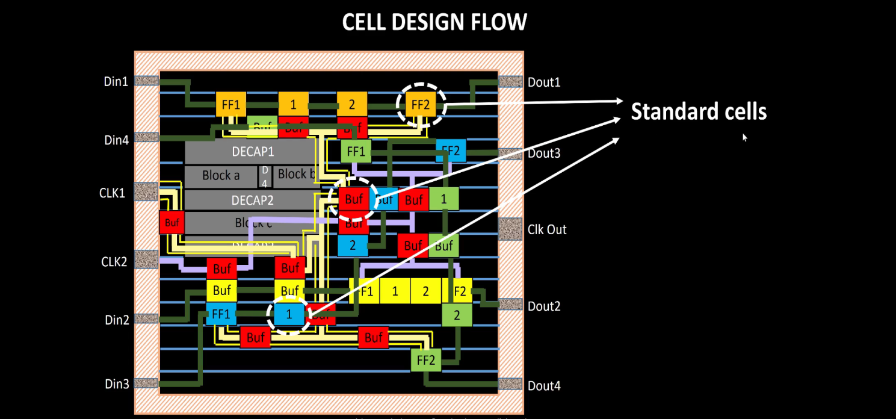

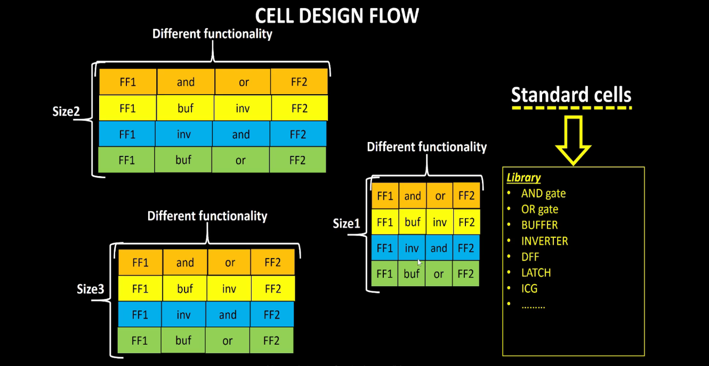


**Inputs:**
- PDKs (Process Design Kits)  
  - DRC & LVS rules
  - SPICE Models
- Library & User-Defined specs  
  - eg: cell height, supply voltage, metal layers, pin location, drawn gate-length

<a id="standard-cell-design-flow"></a>
**Standard Cell Design Flow**
1. Circuit Design 
2. Layout Design 
3. Parasitic Extraction
4. Characterization  

**Outputs**
- `CDL` Circuit Description Language (Netlist from circuit design)
- `LEF` Library Exchange Format
- `GDSII` Final Layout Database
- `.cir` Extracted SPICE NEtlist
- Characterized `.lib` files (Timing, Power and Noise) 

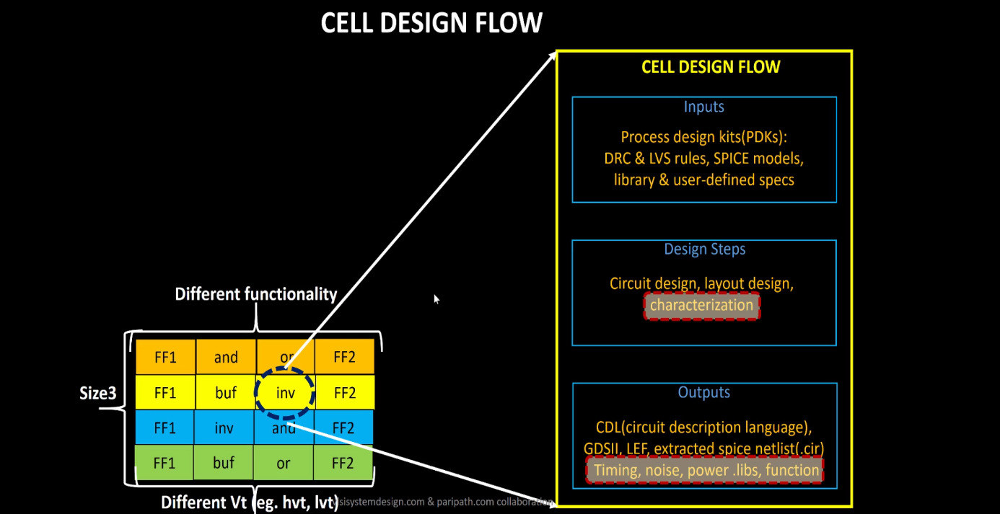

<a id="sta-cell-char-flow"></a>
# Standard Cell Characterization Flow
A typical standard cell char process include:
1. Read in SPICE models and tech files
2. Load the extracted SPICE netlist
3. Recognize cell behavior
4. Identify subcircuits
5. Attach power sources
6. Apply stimulus to the setup
7. Set output cap loads
8. Provide necessary simulation commands

consider following char setup:
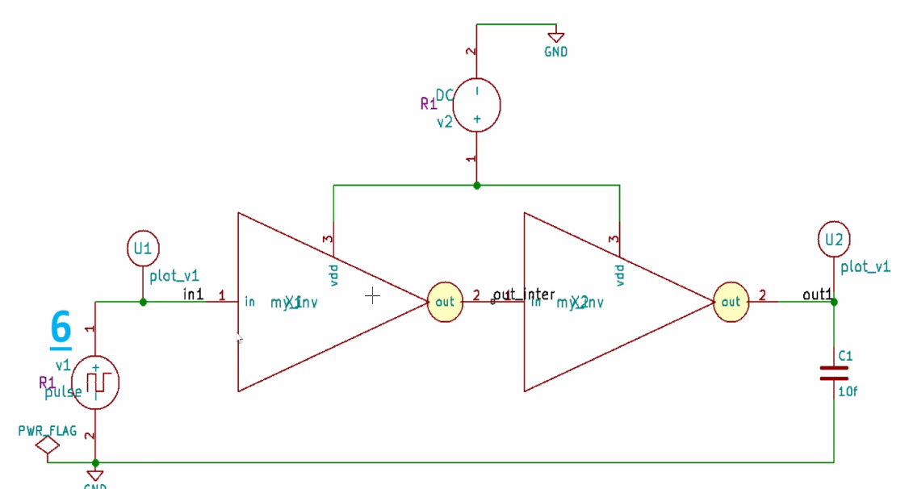

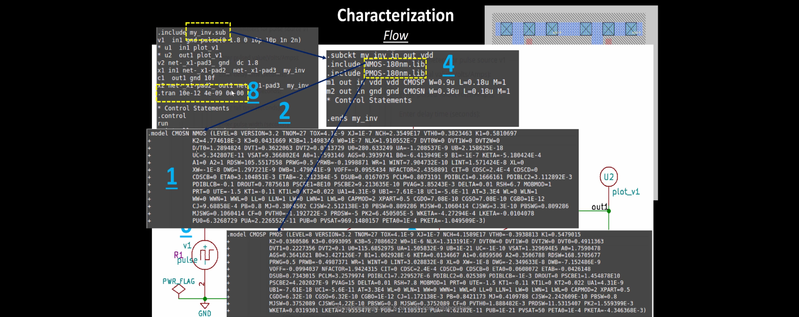

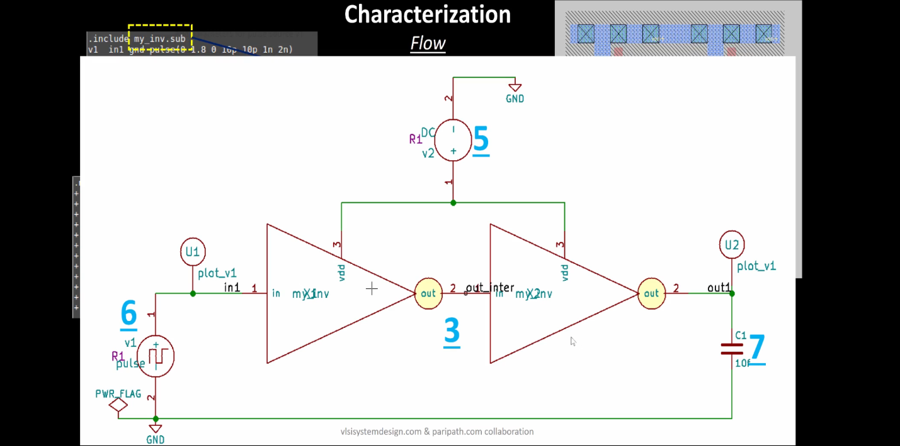

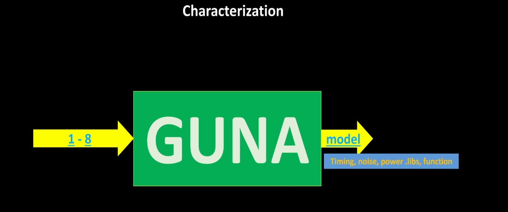

All these steps are described in a configuration file and passed to a characterization tool such as GUNA. The tool simulates the cells and generates:
- Timing models
- Power models
- Noise models

These are exported in .lib format and used in synthesis and static timing analysis flows.

<a id="timing-char"></a>
# Timing Characterization
Defines how a cell behaves with respect to input signal changes over time.

### Timing Threshold Definitions

| **Timing Definition**     | **Value**       |
|---------------------------|-----------------|
| `slew_low_rise_thr`       | 20% of signal   |
| `slew_high_rise_thr`      | 80% of signal   |
| `slew_low_fall_thr`       | 20% of signal   |
| `slew_high_fall_thr`      | 80% of signal   |
| `in_rise_thr`             | 50% of signal   |
| `in_fall_thr`             | 50% of signal   |
| `out_rise_thr`            | 50% of signal   |
| `out_fall_thr`            | 50% of signal   |

<a id="prop-delay"></a>
### Propogation Delay

The time difference between the input signal reaching 50% of its final value and the output reaching 50% of its final value.

```bash
Propagation Delay = time(out_thr) - time(in_thr)
```

where,
`in_thr` is the input threshold time
- The time at which the input signal crosses its defined threshold voltage during a transition.
- For delay measurement, this is typically the 50% point of the input voltage swing.

`out_thr` is the output threshold time
- The time at which the output signal crosses its threshold voltage during the response to the input transition.
- Also typically measured at the 50% point for consistency with in_thr.

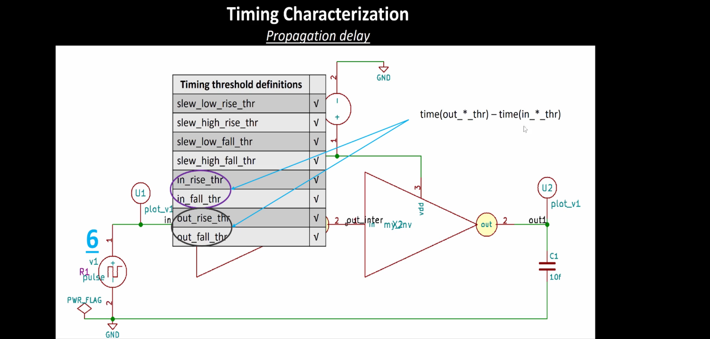

**Example 1:**
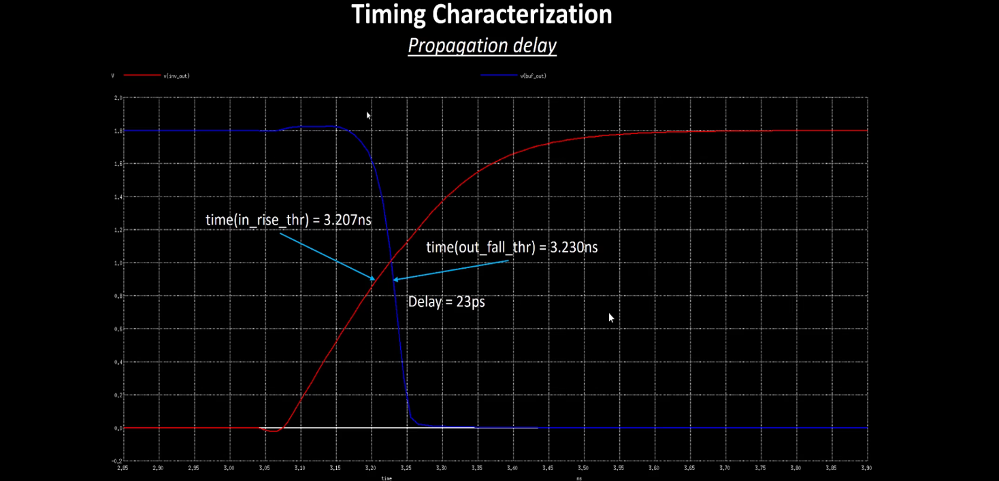

**Example 2:**
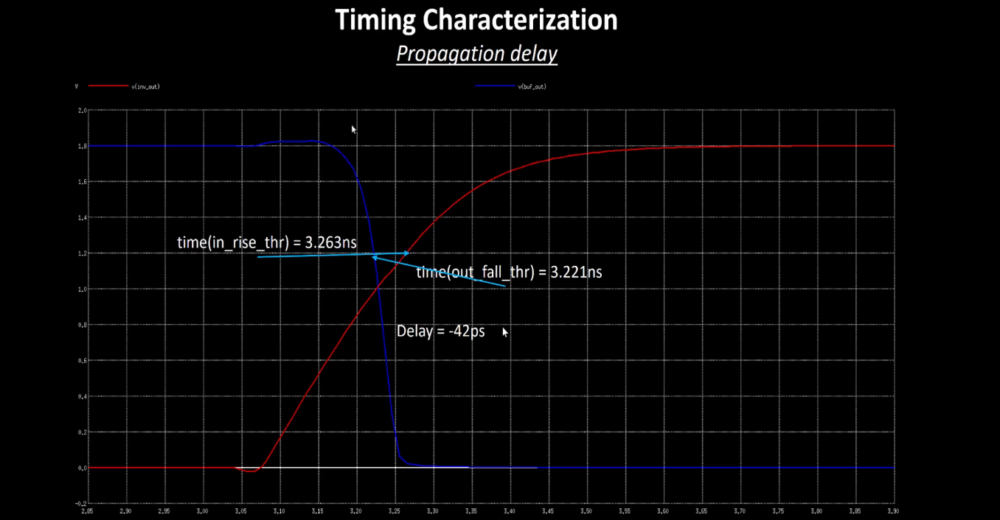

Poor choice of threshold values lead to negative delay values. Even though you have taken good threshold values, sometimes depending upon how good or bad the slew, the dealy might be still +ve or -ve.

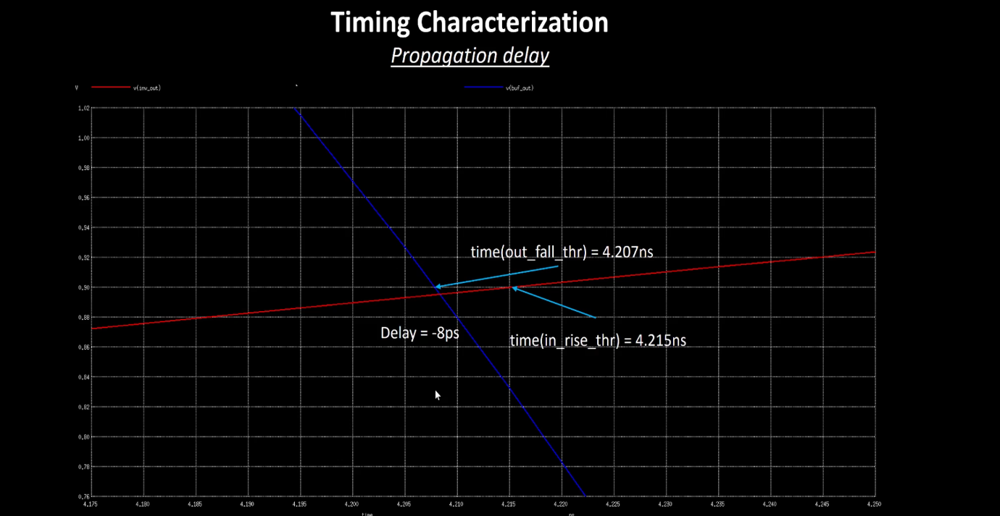

<a id="transition-time"></a>
### Transition Time

The time it takes for a signal to transition between logic states, typically measured between 10–90% or 20–80% of the voltage levels.

```bash
Rise Transition Time = time(slew_high_rise_thr) - time(slew_low_rise_thr)
Fall Transition Time = time(slew_high_fall_thr) - time(slew_low_fall_thr)
```

where,
- `slew_low_rise_thr`: The time when the rising input or output crosses the lower threshold, usually 20% of the voltage swing.
- `slew_high_rise_thr`: The time when the rising input or output crosses the upper threshold, usually 80% of the voltage swing.
- `slew_high_fall_thr`: The time when the falling input or output crosses the upper threshold, typically 80%.
- `slew_low_fall_thr`: The time when the falling input or output crosses the lower threshold, typically 20%.


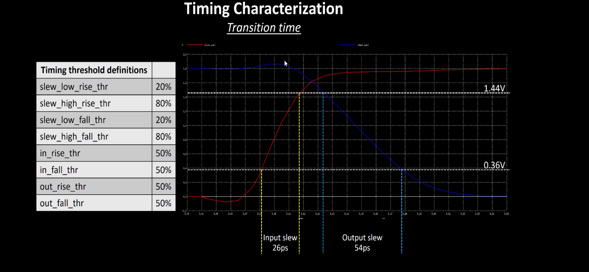

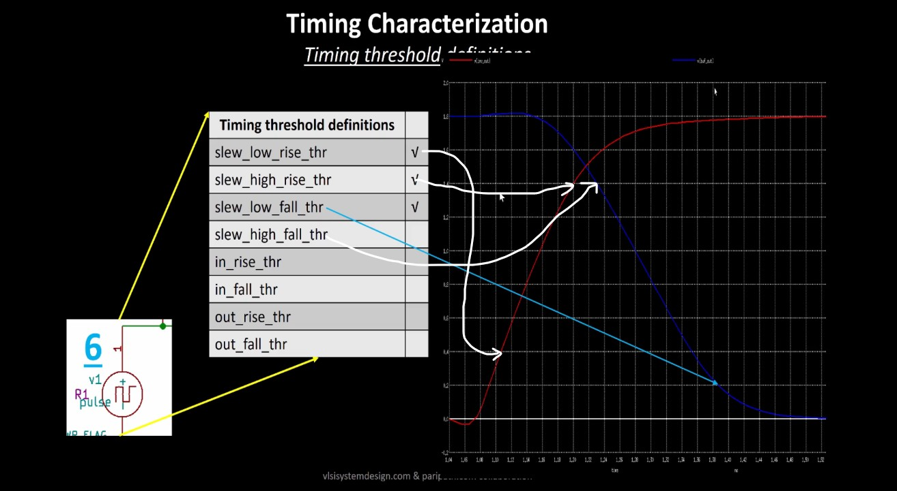


<a id="design-lib-cell-using-magic-and-ngspice-char"></a>
# Design Library Cell using magic layout and ngspice charcterization

**Objective:**
The goal of the project is to design a single height standard cell and plug this custom cell into a more complex design and perform it's PnR in the openlane flow. The standard cell chosen is a basic CMOS inverter and the design into which it's plugged into is a pre-built picorv32a core.

- clone the required mag files and spice models of inverter, pmos and nmos sky130.

```bash
cd ~/soc-design-and-planning-nasscom-vsd/Desktop/work/tools/openlane_working_dir/openlane/
git clone https://github.com/nickson-jose/vsdstdcelldesign.git
```

- View the inverter layout in magic:

```bash
magic -T sky130A.tech sky130_inv.mag &
```

**CMOS Inverter in magic**

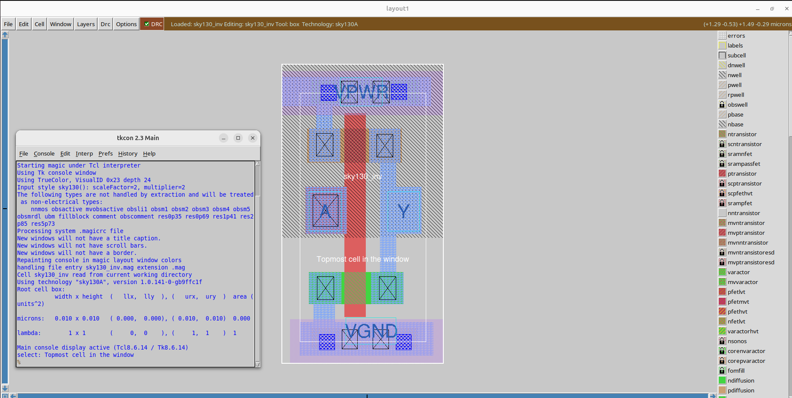

PMOS source connectivity to VDD (here VPWR) verified

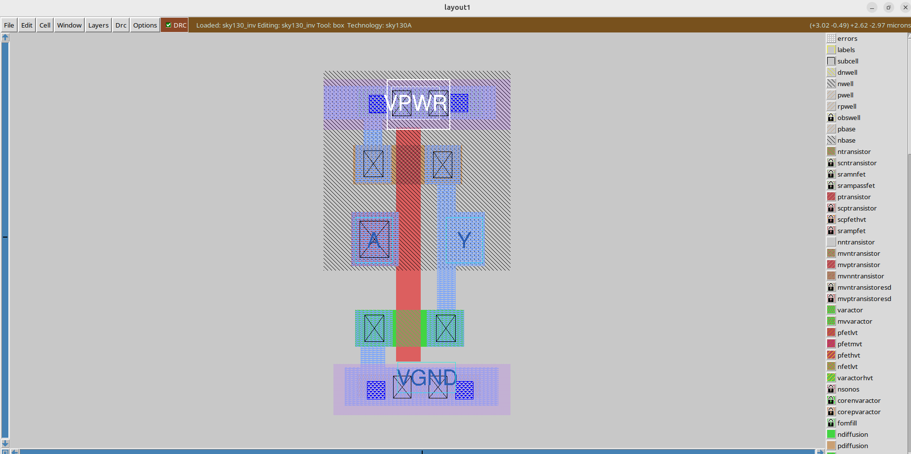

NMOS source connectivity to VSS (here VGND) verified

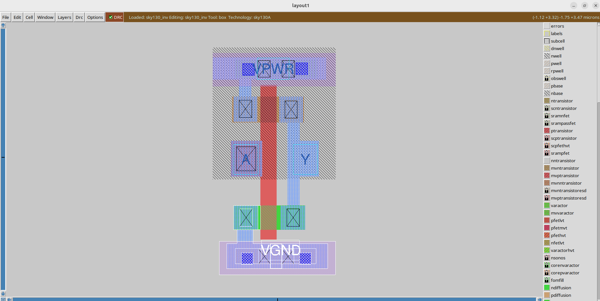

</details>
