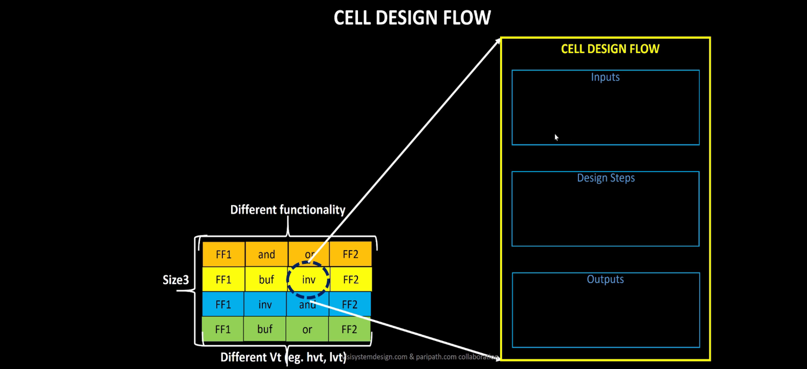
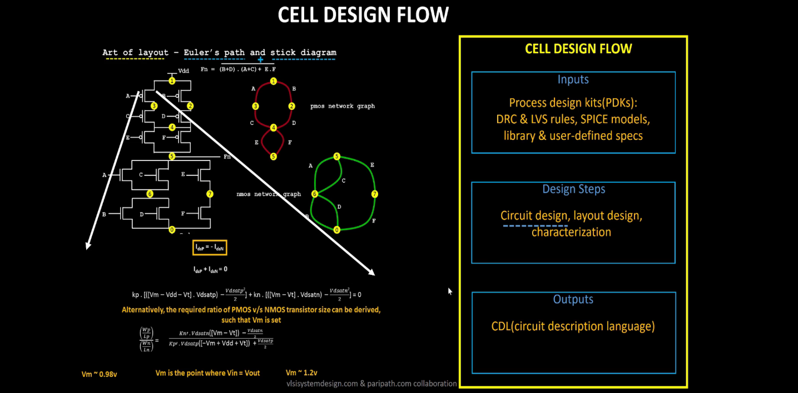

  
<strong> Day 17 : Cell Design and Characterization Flows</strong>

# Contents
- [Cell Design and Characterization Flows](#cell-design-and-char-flow)
  - [Standard Cell Design Flow](#standard-cell-design-flow)
- [

# Cell Design and Characterization Flows

In an IC design flow, a **library** is a collection of standard cells, each defined by its size, functionality, threshold voltage, and other electrical/physical properties. These libraries are fundamental to the ASIC flow for synthesis, placement, and timing analysis.

**Inputs:**
- PDKs (Process Design Kits)  
  - DRC & LVS rules
  - SPICE Models
- Library & User-Defined specs  
  - eg: cell height, supply voltage, metal layers, pin location, drawn gate-length

**Standard Cell Design Flow**

1. Circuit Design - 
2. Layout Design
3. Characterization

