<details>
  <Summary><strong> Day 17 : Library Cell Design using Magic Layout and ngspice Characterization</strong></summary>

# Contents
- [Cell Design and Characterization Flows](#cell-design-and-char-flow)
  - [Standard Cell Design Flow](#standard-cell-design-flow)
- [Standard Cell Characterization Flow](#sta-cell-char-flow)
- [Timing Characterization](#timing-char)
  - [Propogation Delay](#prop-delay)
  - [Transition Time](#transition-time)
- [Design Library Cell using magic layout and ngspice charcterization](#design-lib-cell-using-magic-and-ngspice-char)
- [16-Mask CMOS Process summary](#mask-cmos-process-summary)
- [Spice extraction for Inverter in Magic](#spice-extraction)
- [Rise Transition Time Calculation](#rise-transition-time-cal)
- [Fall Transition Time Calculation](#fall-transition-time-cal)
- [Rise Cell Delay Calculation](#rise-cell-delay-cal)
- [Fall Cell delay Calculation](#fall-cell-delay-cal)
- [Lab to Find and Fix Problem in DRC Section of Old Magic tech file for skywater Process](#drc-lab)

<a id="cell-design-and-char-flow"></a>
# Cell Design and Characterization Flows

In an IC design flow, a **library** is a collection of standard cells, each defined by its size, functionality, threshold voltage, and other electrical/physical properties. These libraries are fundamental to the ASIC flow for synthesis, placement, and timing analysis.


**Inputs:**
- PDKs (Process Design Kits)  
  - DRC & LVS rules
  - SPICE Models
- Library & User-Defined specs  
  - eg: cell height, supply voltage, metal layers, pin location, drawn gate-length

<a id="standard-cell-design-flow"></a>
**Standard Cell Design Flow**
1. Circuit Design 
2. Layout Design 
3. Parasitic Extraction
4. Characterization  

**Outputs**
- `CDL` Circuit Description Language (Netlist from circuit design)
- `LEF` Library Exchange Format
- `GDSII` Final Layout Database
- `.cir` Extracted SPICE NEtlist
- Characterized `.lib` files (Timing, Power and Noise) 

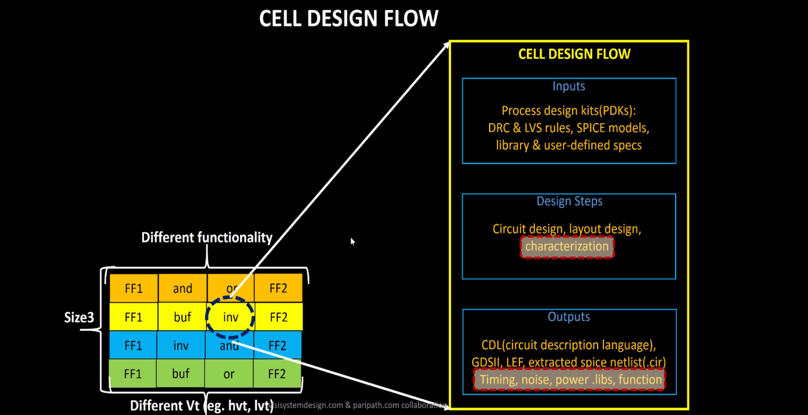

<a id="sta-cell-char-flow"></a>
# Standard Cell Characterization Flow
A typical standard cell char process include:
1. Read in SPICE models and tech files
2. Load the extracted SPICE netlist
3. Recognize cell behavior
4. Identify subcircuits
5. Attach power sources
6. Apply stimulus to the setup
7. Set output cap loads
8. Provide necessary simulation commands

consider following char setup:
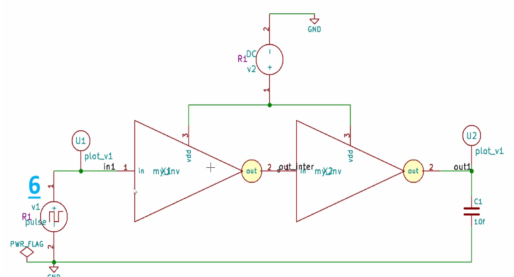


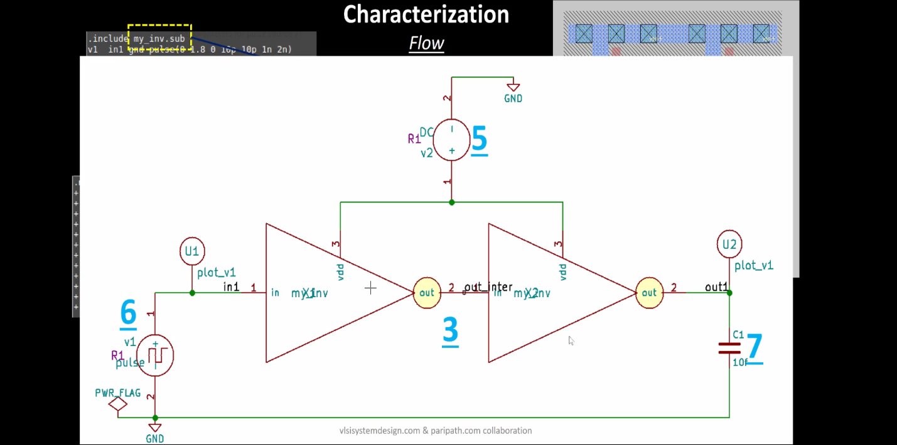


All these steps are described in a configuration file and passed to a characterization tool such as GUNA. The tool simulates the cells and generates:
- Timing models
- Power models
- Noise models

These are exported in .lib format and used in synthesis and static timing analysis flows.

<a id="timing-char"></a>
# Timing Characterization
Defines how a cell behaves with respect to input signal changes over time.

### Timing Threshold Definitions

| **Timing Definition**     | **Value**       |
|---------------------------|-----------------|
| `slew_low_rise_thr`       | 20% of signal   |
| `slew_high_rise_thr`      | 80% of signal   |
| `slew_low_fall_thr`       | 20% of signal   |
| `slew_high_fall_thr`      | 80% of signal   |
| `in_rise_thr`             | 50% of signal   |
| `in_fall_thr`             | 50% of signal   |
| `out_rise_thr`            | 50% of signal   |
| `out_fall_thr`            | 50% of signal   |

<a id="prop-delay"></a>
### Propogation Delay

The time difference between the input signal reaching 50% of its final value and the output reaching 50% of its final value.

```bash
Propagation Delay = time(out_thr) - time(in_thr)
```

where,
`in_thr` is the input threshold time
- The time at which the input signal crosses its defined threshold voltage during a transition.
- For delay measurement, this is typically the 50% point of the input voltage swing.

`out_thr` is the output threshold time
- The time at which the output signal crosses its threshold voltage during the response to the input transition.
- Also typically measured at the 50% point for consistency with in_thr.

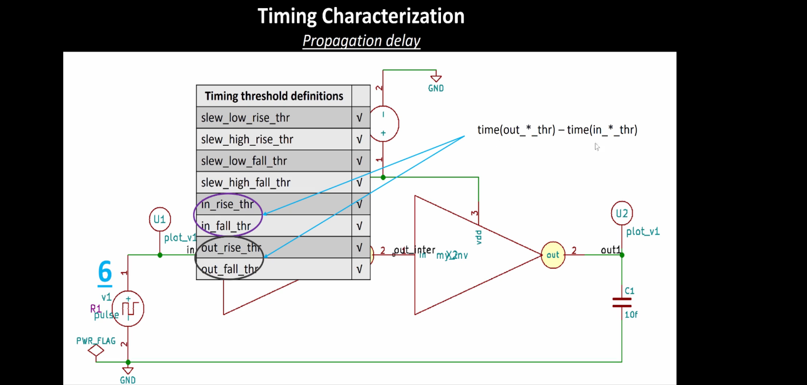

**Example 1:**
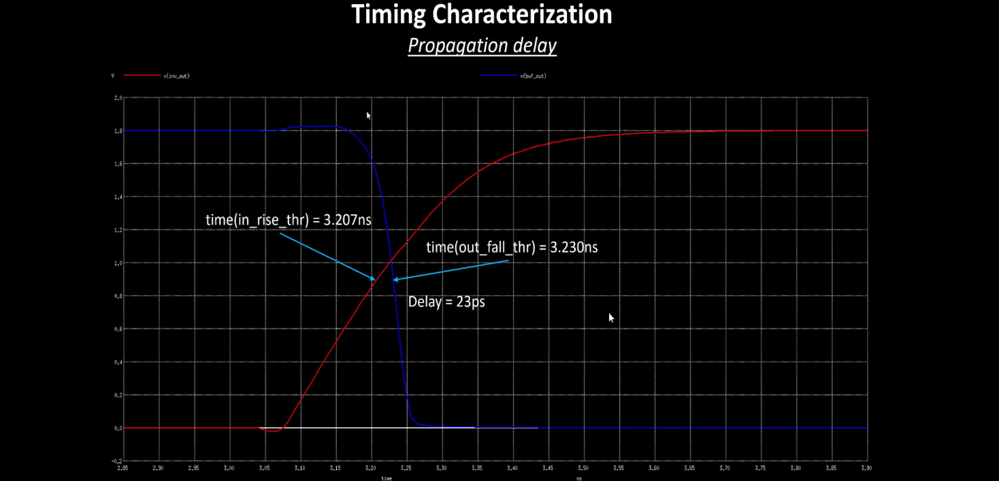

**Example 2:**
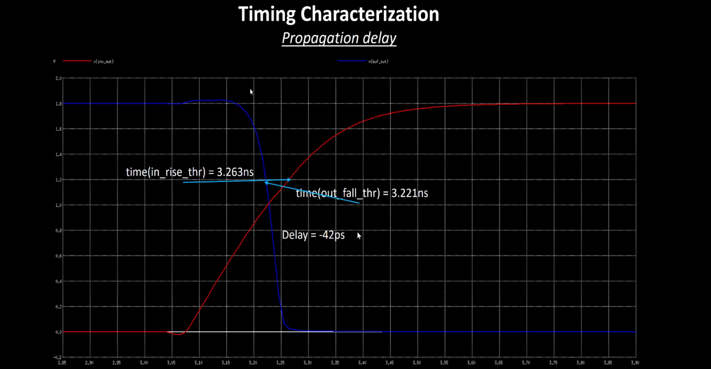

Poor choice of threshold values lead to negative delay values. Even though you have taken good threshold values, sometimes depending upon how good or bad the slew, the dealy might be still +ve or -ve.

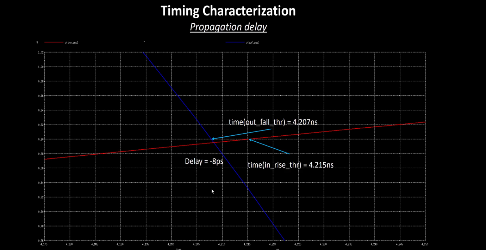

<a id="transition-time"></a>
### Transition Time

The time it takes for a signal to transition between logic states, typically measured between 10–90% or 20–80% of the voltage levels.

```bash
Rise Transition Time = time(slew_high_rise_thr) - time(slew_low_rise_thr)
Fall Transition Time = time(slew_high_fall_thr) - time(slew_low_fall_thr)
```

where,
- `slew_low_rise_thr`: The time when the rising input or output crosses the lower threshold, usually 20% of the voltage swing.
- `slew_high_rise_thr`: The time when the rising input or output crosses the upper threshold, usually 80% of the voltage swing.
- `slew_high_fall_thr`: The time when the falling input or output crosses the upper threshold, typically 80%.
- `slew_low_fall_thr`: The time when the falling input or output crosses the lower threshold, typically 20%.


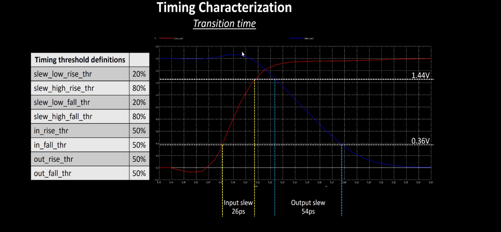


<a id="design-lib-cell-using-magic-and-ngspice-char"></a>
# Design Library Cell using magic layout and ngspice charcterization

**Objective:**
The goal of the project is to design a single height standard cell and plug this custom cell into a more complex design and perform it's PnR in the openlane flow. The standard cell chosen is a basic CMOS inverter and the design into which it's plugged into is a pre-built picorv32a core.

- clone the required mag files and spice models of inverter, pmos and nmos sky130.

```bash
cd ~/soc-design-and-planning-nasscom-vsd/Desktop/work/tools/openlane_working_dir/openlane/
git clone https://github.com/nickson-jose/vsdstdcelldesign.git
```

- View the inverter layout in magic:

```bash
cd ~/soc-design-and-planning-nasscom-vsd/Desktop/work/tools/openlane_working_dir/openlane/vsdstdcelldesign.git
magic -T sky130A.tech sky130_inv.mag &
```

**CMOS Inverter in magic**

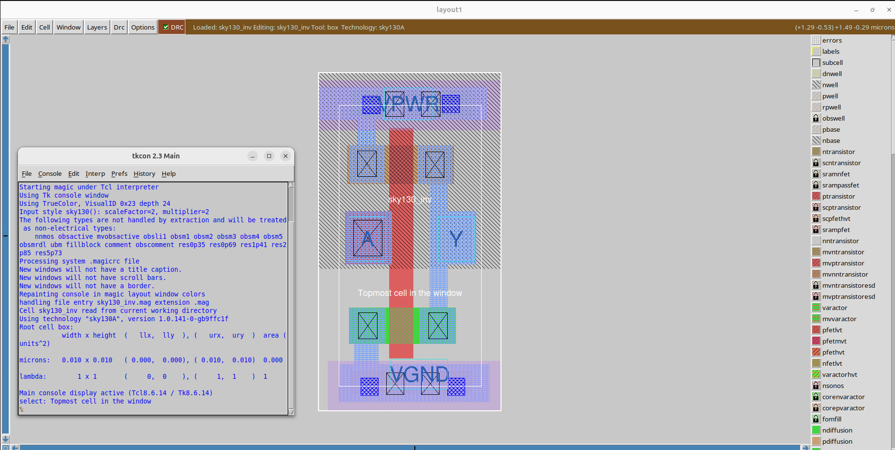

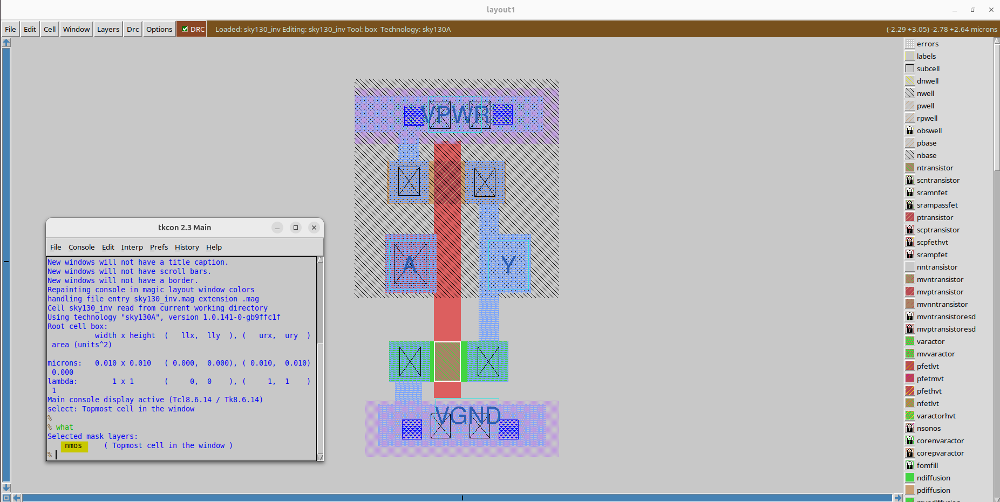

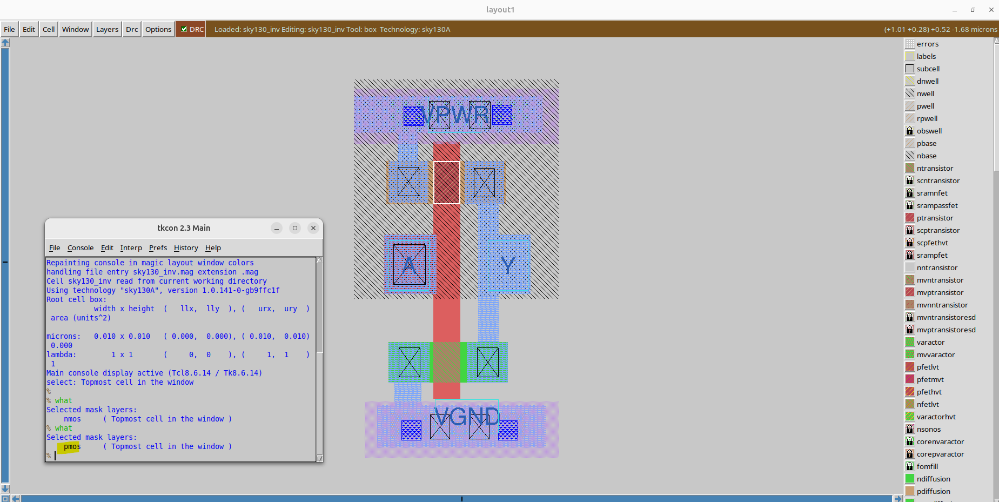

PMOS source connectivity to VDD (here VPWR) verified


NMOS source connectivity to VSS (here VGND) verified


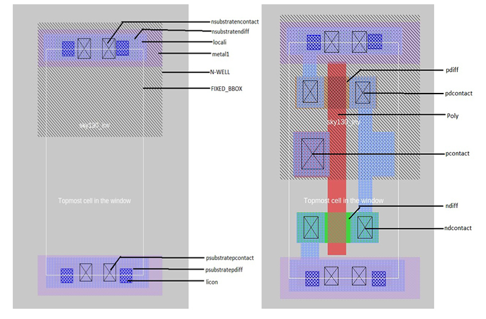

<a id="mask-cmos-process-summary"></a>
## 16-Mask CMOS Process summary

- Selecting a substrate.
- Creating active region for transistors
- N-Well and P-Well formation
- Formation of `gate`
- Lightly doped drain(LDD) formation
- Source and drain formation
- Steps to form contacts and interconnects(local)
- Higher level metal formation

The 16-mask CMOS fabrication process is a standard method used in the semiconductor industry to manufacture integrated circuits (ICs). This process involves a series of photolithography, doping, deposition, and etching steps that define the active and passive components of a CMOS circuit. Each mask step is critical in shaping specific layers or features of the chip, ensuring proper device functionality and integration.

1. **Substrate Preparation:** The process begins with a high-quality silicon wafer. This wafer acts as the base substrate on which all devices are built. It is thoroughly cleaned to remove any impurities that could affect device performance.

2. **N-Well Formation:** N-well regions are formed by introducing n-type dopants such as phosphorus into specific areas of the substrate using ion implantation or diffusion. These regions serve as the body for PMOS transistors.

3. **P-Well Formation:** P-well regions are created using ion implantation or diffusion of p-type dopants such as boron. These regions form the body for NMOS transistors. In a twin-well process, both N-well and P-well regions are used to independently optimize NMOS and PMOS performance.

4. **Gate Oxide Deposition:** A thin insulating layer of silicon dioxide is thermally grown or deposited over the surface of the wafer. This layer electrically isolates the gate electrode from the underlying silicon channel.

5. **Polysilicon Deposition:** A layer of polysilicon is deposited over the entire wafer surface. This will later be patterned to form the gate electrodes of the transistors.

6. **Polysilicon Masking and Etching:** A photoresist mask is applied to define the gate regions. The exposed polysilicon is etched away, leaving the gate structures in place over the gate oxide.

7. **N-Well Masking and Implantation:** A mask is used to expose only the regions where additional N-well doping is needed. Phosphorus or arsenic is implanted to adjust the doping concentration and improve PMOS characteristics.

8. **P-Well Masking and Implantation:** Similar to N-well masking, a mask is used to define regions for P-well adjustment. Boron is implanted into the exposed regions to enhance NMOS performance.

9. **Source/Drain Implantation:** Using another photolithography step, openings are created to define the source and drain regions for both NMOS and PMOS transistors. Appropriate dopants (e.g., arsenic or phosphorus for NMOS, boron or BF₂ for PMOS) are implanted.

10. **Gate Formation Finalization:** The gate electrode pattern is refined, and any alignment steps are performed to ensure that the gate overlaps properly with the channel region between source and drain.

11. **Source/Drain Masking and Etching:** A photoresist mask is applied again to define the contact regions. Etching is performed to remove the insulating oxide over the source and drain terminals.

12. **Contact/Via Formation:** Contact holes or vias are etched through the insulating oxide to expose source, drain, and gate terminals. These vias will later be filled with metal to establish electrical connections.

13. **Metal Deposition:** A metal layer, typically aluminum or copper, is deposited across the wafer. This layer forms the interconnects that connect transistors and other circuit components.

14. **Metal Masking and Etching:** Photolithography is used to define the desired interconnect patterns. Unwanted metal is etched away, leaving only the functional routing and connections.

15. **Passivation Layer Deposition:** A passivation layer of silicon dioxide or silicon nitride is deposited over the entire wafer to protect the circuit from mechanical damage, moisture, and contamination.

16. **Final Testing and Packaging:** The completed wafer is tested to identify functional and defective chips. The functional chips are then diced, packaged into individual components, and prepared for use in electronic systems.

<a id="spice-extraction"></a>
## Spice extraction for Inverter in Magic

```bash
pwd

#extraction command to extract .ext format
extract all

# Before converting ext to spice this command enable the parasitic extraction also
ext2spice cthresh 0 rthresh 0

#convert ext to spice
ext2spice
```

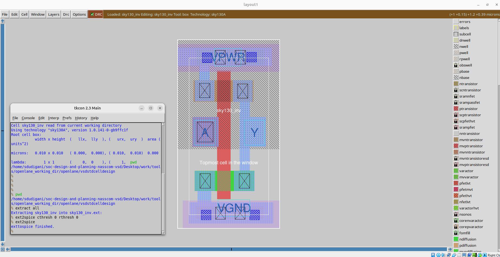

.ext and spice files created--
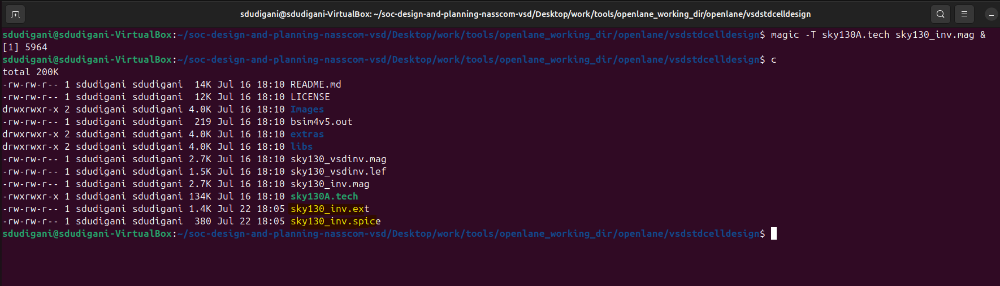

extracted spice file contents:
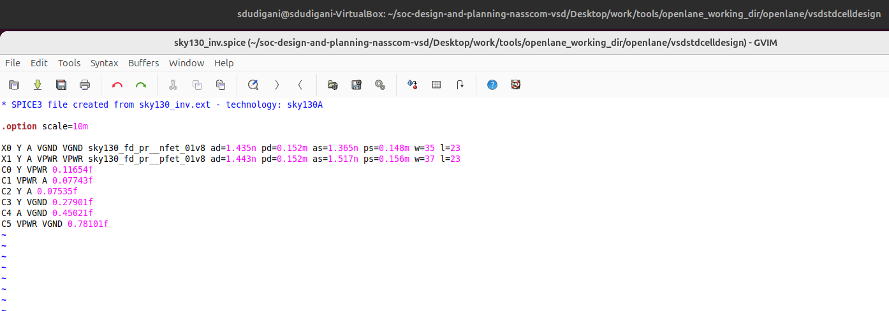


**Editing the spice model file for analysis through simulation**

Measuring unit distance in layout grid:
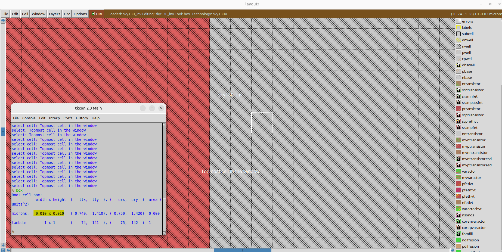


Final edited spice file ready for ngspice simulation:

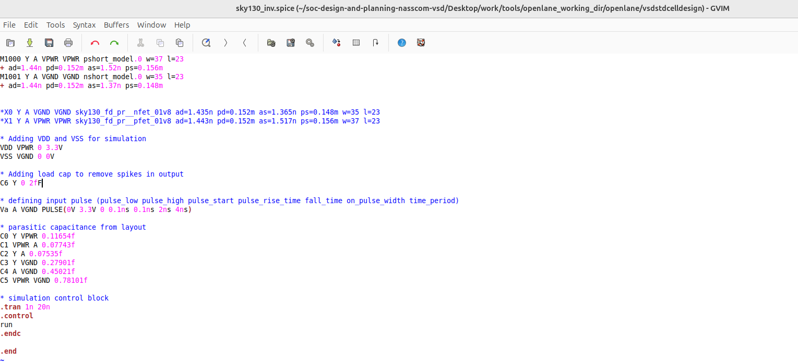

**Post-layout ngspice simulations**

```bash
# Command to directly load spice file for simulation to ngspice
ngspice sky130_inv.spice

# Now that we have entered ngspice with the simulation spice file loaded we just have to load the plot
plot y vs time a
```

**ngspice run:**


**generated plot:**
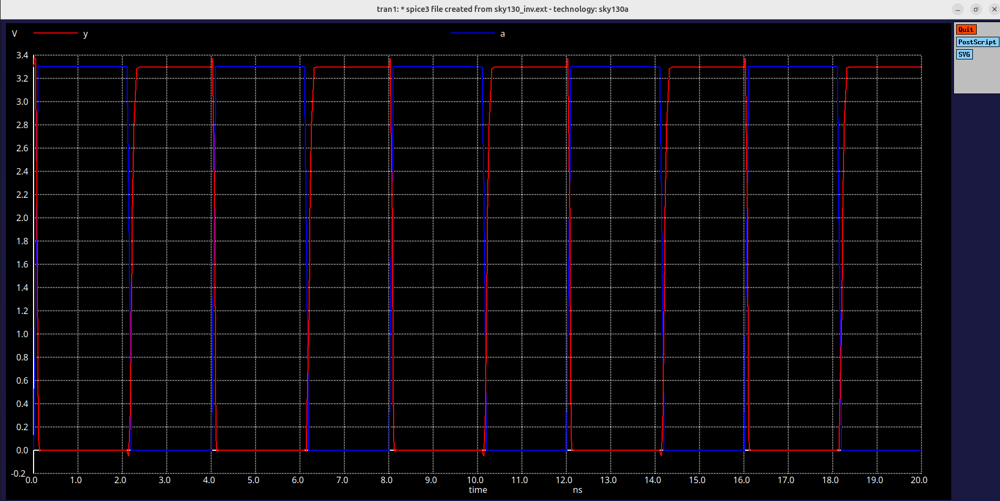


<a id="rise-transition-time-cal"></a>
## `Rise Transition Time Calculation`

- The rise transition time is the difference in time between the output reaching 2.64 V and 660 mV during the rising edge of the signal.

- **Formula:** `Rise transition time = Time taken for output to rise to 80% − Time taken for output to rise to 20%`

- **Rise Time = T<sub>80%</sub> − T<sub>20%</sub>**

- Reference values for VDD = 3.3V
  - 20% of output voltage = 0.20 x 3.3V = 660 mV
  - 80% of output voltage = 0.80 x 3.3V = 2.64 V

**output rising to 20%:**

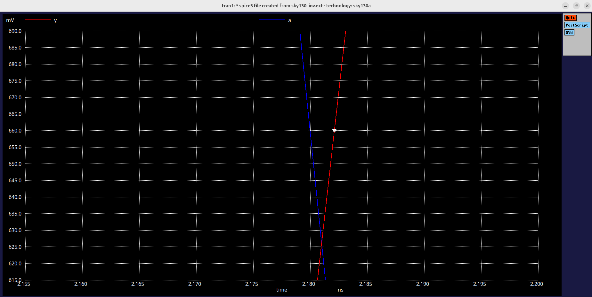

**output rising to 80%:**

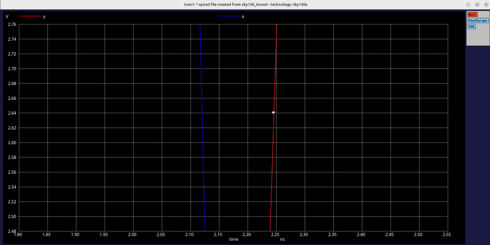

**Terminal Values**

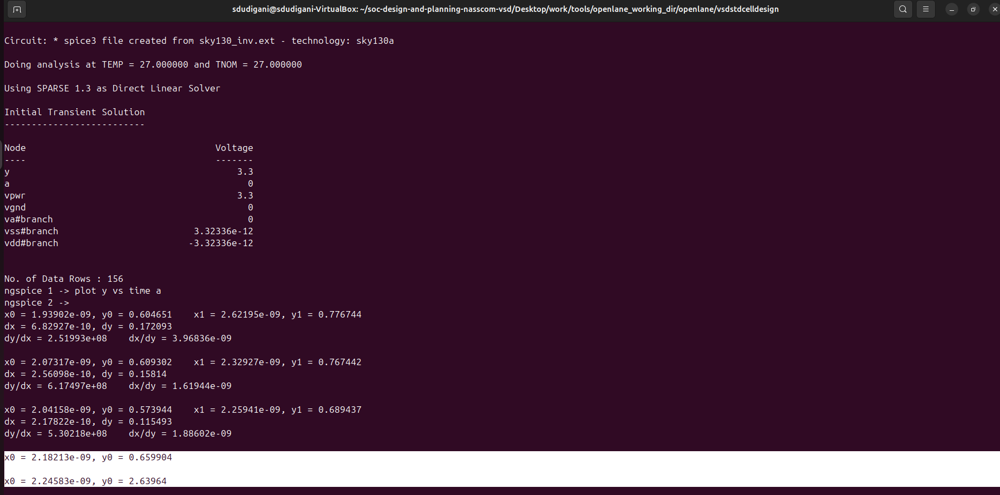

**Rise Transition Time Calculation from ngspice:**
Time at 20% of V<sub>out</sub> (0.66 V): t_20 = 2.1821 ns
Time at 80% of V<sub>out</sub> (2.64 V): t_80 = 2.2463 ns

Formula = t_80 - t_20 
= 2.2463 ns - 2.1821 ns = 0.0642 ns
= 64.2 ps

Rise Transition = 64.2 ps

<a id="fall-transition-time-cal"></a>
## `Fall Transition Time Calculation`

- The fall transition time is the difference in time between the output falling from 2.64 V to 660 mV during the falling edge of the signal.

- **Formula:** `Fall transition time = Time taken for output to fall to 20% − Time taken for output to fall to 80%`

- **Fall Time = T<sub>20%</sub> − T<sub>80%</sub>**

- Reference values (for VDD = 3.3 V)
  - 20% of output voltage: 0.20 x 3.3V = 660 mV
  - 80% of output voltage: 0.80 x 3.3V = 2.64 V

**output falling to 20%:**
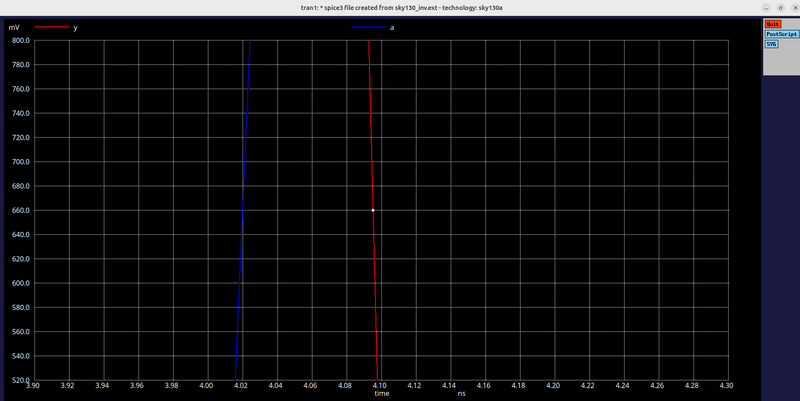

**output falling to 80%:**
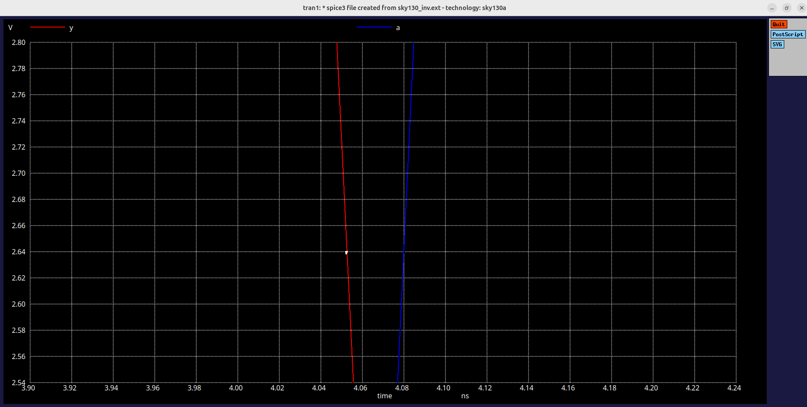

**terminal values**
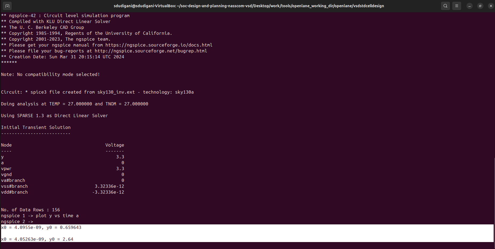

**Fall Transition Time Calculation from ngspice:**
Time at 80% of V<sub>out</sub> (0.66 V): t_20 =  4.0955 ns
Time at 80% of V<sub>out</sub> (2.64 V): t_80 =  4.0526 ns

Formula = t_20 - t_80 
=  4.0955 ns -  4.0526 ns =  0.0429 ns
=  42.9 ps

Fall Transition = 42.9 ps

<a id="rise-cell-delay-cal"></a>
## `Rise Cell Delay Calculation`
- `Rise Cell Delay` is the time it takes for the output to reach 50% of VDD after the input begins transitioning.
- **Formula:** `Rise Cell Delay = Time(output rises to 50%) − Time(input falls to 50%)`
- For V<sub>DD</sub> = 3.3 V --> 50% of V<sub>DD</sub> = **1.65V**

**output rising to 50% and input falling to 50%:**
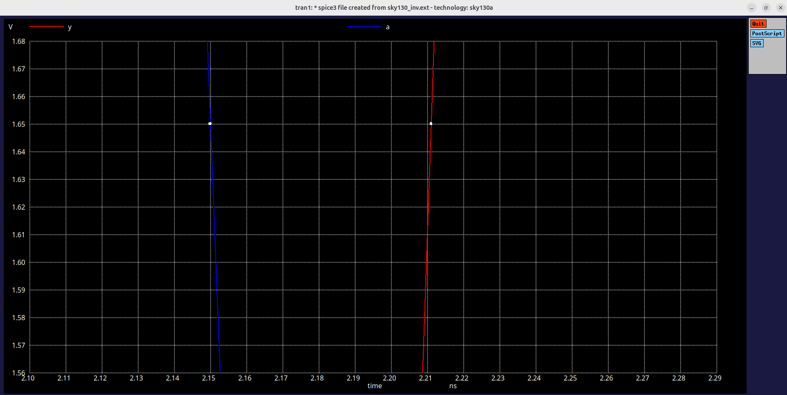

**terminal values**


Rise Cell Delay = time(output@50%) - time(input@50%)
= 2.2111 ns - 2.15 ns
= 0.0611 ns = 61.1 ps

Rise Cell Delay = 61.1 ps

<a id="fall-cell-delay-cal"></a>
## `Fall Cell Delay Calculation`
- `Fall Cell Delay` is the time it takes for the output to fall to 50% of VDD after the input begins transitioning.
- **Formula:** `Fall Cell Delay = Time(output falls to 50%) − Time(input rises to 50%)`

For V<sub>DD</sub> = 3.3 V --> 50% of V<sub>DD</sub> = **1.65 V**

**output falling to 50% and input rising to 50%:**
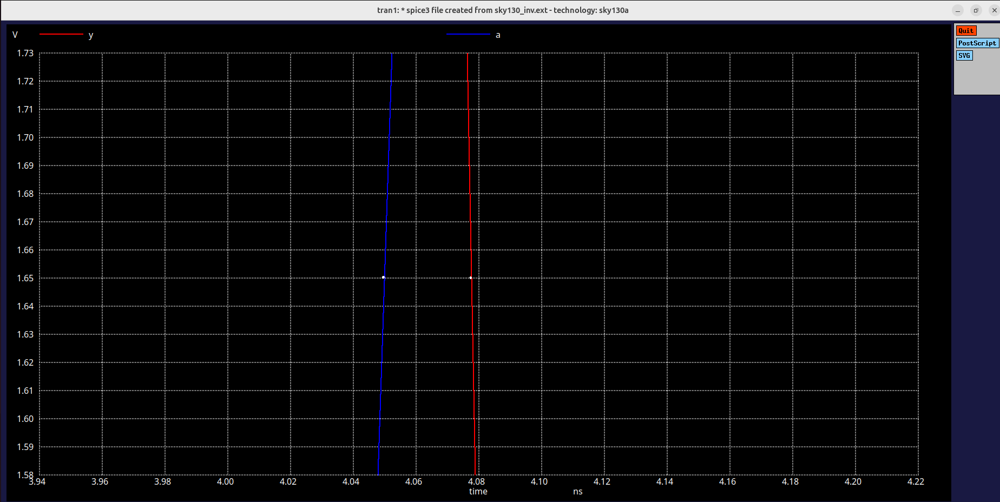

**terminal values**
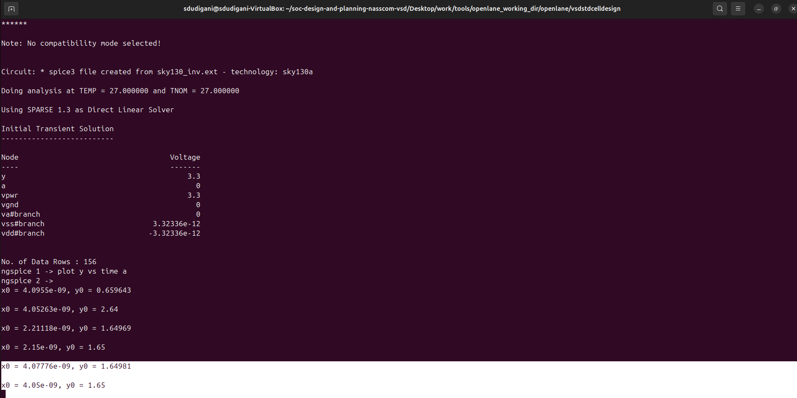

Fall Cell Delay = time(output@50%) - time(input@50%)
= 4.0777 ns - 4.05 ns
= 0.0277 ns = 27.7 ps

Rise Cell Delay = 27.7 ps

<a id="drc-lab"></a>
# Lab
### `Find problem in the DRC section of the old magic tech file for the skywater process and fix them`

Link to Sky130 Periphery rules: https://skywater-pdk.readthedocs.io/en/main/rules/periphery.html

Commands to download and view the corrupted skywater process magic tech file and associated files to perform drc corrections

```shell
# Change to home directory
cd ~

# Command to download the lab files
wget http://opencircuitdesign.com/open_pdks/archive/drc_tests.tgz

# Since lab file is compressed command to extract it
tar xfz drc_tests.tgz

# Change directory into the lab folder
cd drc_tests

# List all files and directories present in the current directory
ls -al

# Command to view .magicrc file
gvim .magicrc

# Command to open magic tool in better graphics
magic -d XR &
```
Screenshot of .magicrc file:

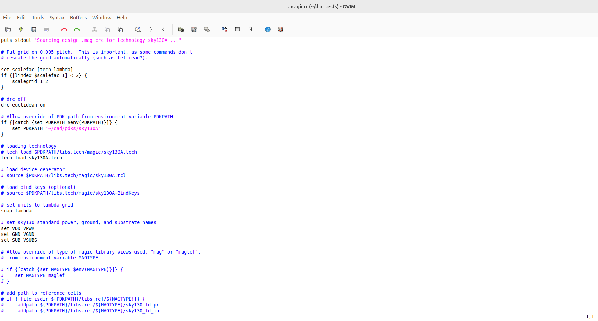

First load the poly file by using the cmd 'load poly' on tkcon window:

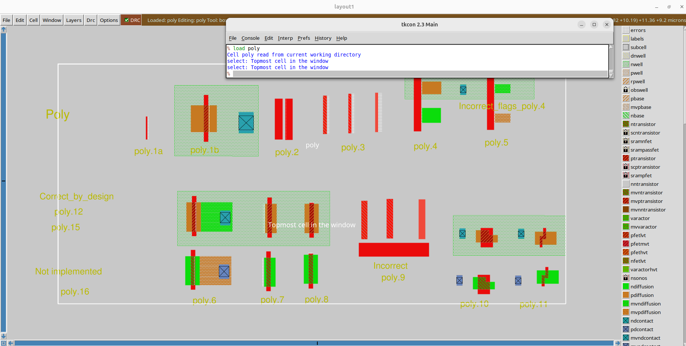

Incorrectly implemented poly.9 rule no drc violation even though spacing < 0.48u:

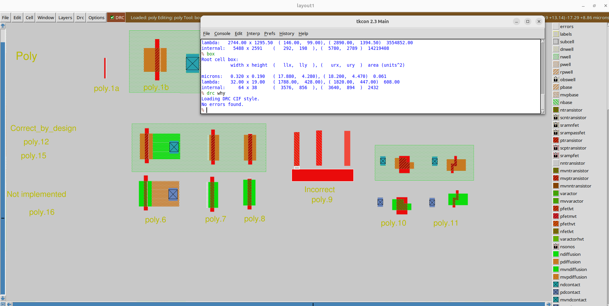

Screenshot of poly rules from the website:

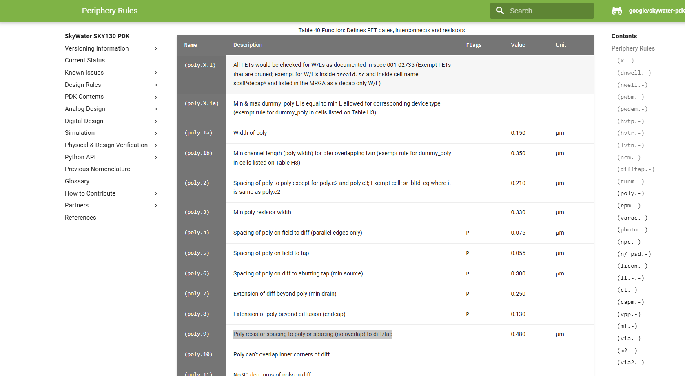

New commands inserted in `sky130A.tech` file to update drc:

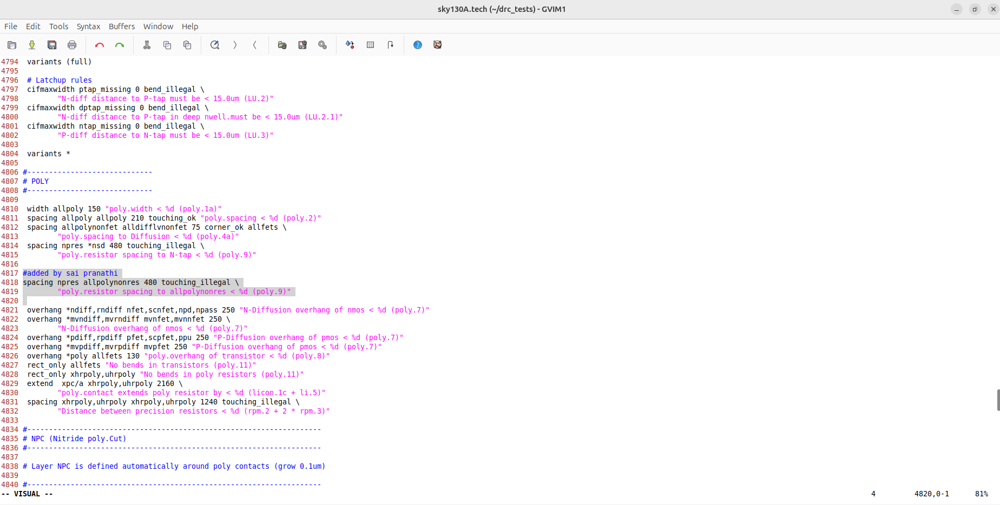

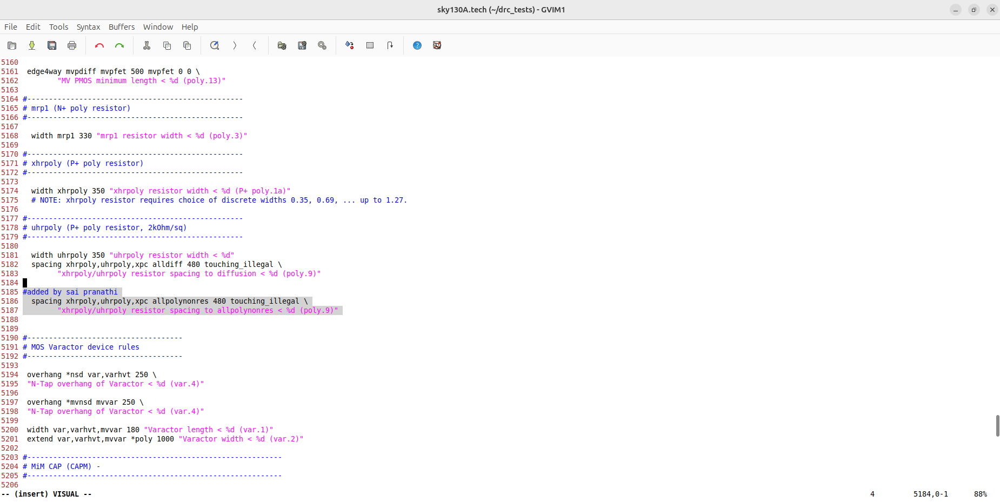

Commands to run in tkcon window:

```shell
# Loading updated tech file
tech load sky130A.tech

# Must re-run drc check to see updated drc errors
drc check

# Selecting region displaying the new errors and getting the error messages 
drc why
```

Screenshot of magic window with rule implemented:

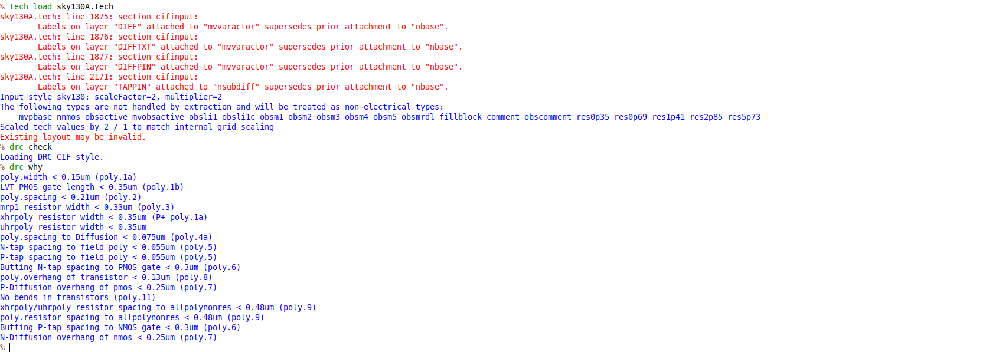

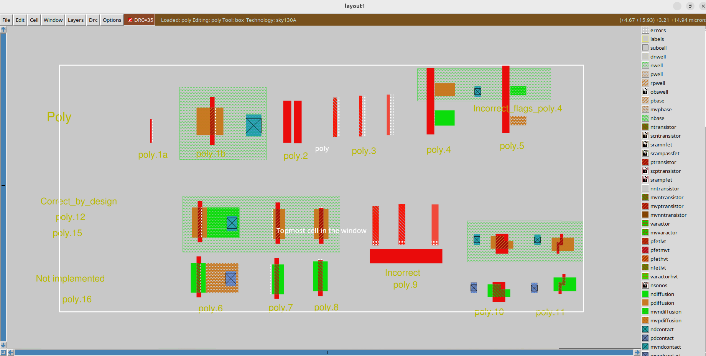

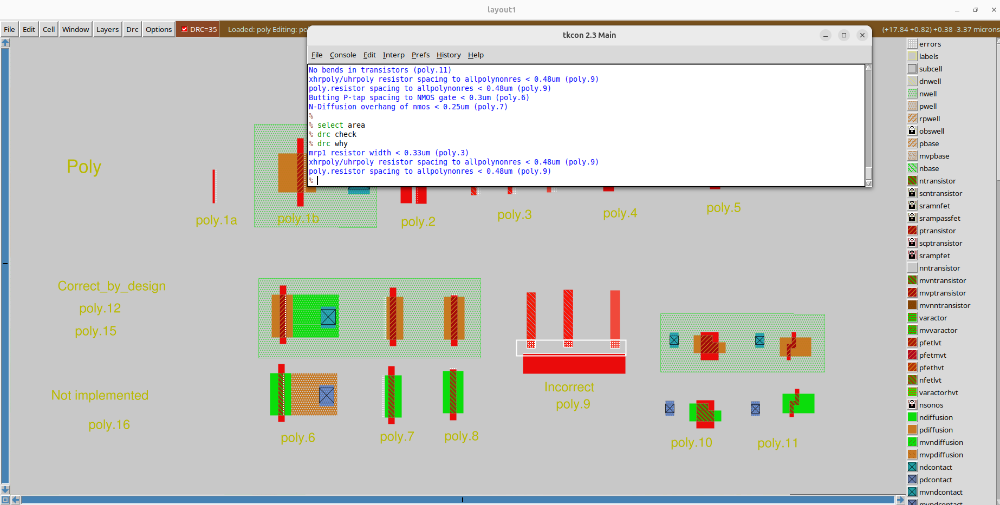

#### <ins>Summary:</ins>

To enforce the poly.9 design rule correctly—which specifies that poly resistors must maintain a minimum spacing of 0.48 µm (480 nm) from diffusion (alldiff) and non-resistor poly (allpolynonres) layers—new DRC rules were added to the sky130A.tech file. The original implementation did not flag violations even when spacing was below the required 0.48 µm, indicating the rule was either missing or incorrectly defined. To correct this, two new spacing rules were inserted: one between npres and alldiff, and another between npres and allpolynonres, both with touching_illegal condition and corresponding rule IDs referencing poly.9. After updating the .tech file, the following commands were executed in the Magic tool’s TkCon window: tech load sky130A.tech to reload the updated tech file, drc check to rerun the DRC engine, and drc why to inspect specific violations. As seen in the final Magic screenshot, the DRC now correctly flags violations where spacing is less than 0.48 µm, confirming that the poly.9 rule is implemented and functional.


</details>
