<details>
  <Summary><strong> Day 18 : Pre-layout Timing Analysis and Importance of Good Clock Tree</strong></summary>

# Contents
- [Step 1: Fix DRC errors and verify the design](#fix-drc-errors-and-verify-the-design)
- [Step 2: Save the final layout with custom name and open it](#save-final-layout)
- [Step 3: Generate lef from the Layout](#generate-lef-from-the-layout)
- [Step 4: Copy the newly generated lef and associated required lib files to 'picorv32a' design 'src' directory](#copy-new-lef-and-lib-files)
- [Step 5: Edit 'config.tcl'](#edit-config)
- [Step 6: Run openlane flow synthesis with newly inserted custom inverter cell](#run-openlane-flow-synthesis)
- [Step 7: Synthesis - Remove/reduce the newly introduced violations with the introduction of custom inverter cell by modifying design parameters](#synthesis)
- [Step 8: Run Floorplan and Placement](#run-fp-and-plc)
- [Step 9: Post-Synthesis timing analysis with OpenSTA tool](#post-synthesis-timing-analysis)
- [Step 10: Timing ECO Fixes to Remove Violations](#eco-fixes)

<a id="fix-drc-errors-and-verify-the-design"></a>
## Step 1: Fix up small DRC errors and verify the design is ready to be inserted into our flow

Before moving forward with custom designed cell layout verify following:
1. The input and output ports of the standard cell should lie on the intersection of the vertical and horizontal tracks.
2. Width of the standard cell should be odd multiples of the horizontal track pitch.
3. Height of the standard cell should be even multiples of the vertical track pitch.

**Open custom inverter layout**
```bash
cd Desktop/work/tools/openlane_working_dir/openlane/vsdstdcelldesign

# Open custom inverter layout in magic
magic -T sky130A.tech sky130_inv.mag &
```


**Convert Grid info to track info**

- press **g** in magic to activate grids.

**tracks.info of sky130_fd_sc_hd:**


- Commands to set grid as tracks of locali layer:

```bash
# Get syntax for grid command
help grid

# Set grid values accordingly
grid 0.46um 0.34um 0.23um 0.17um
```


**Verified ✅ --> The input and output ports of the standard cell should lie on the intersection of the vertical and horizontal tracks**


**Verified ✅ --> Width of the standard cell should be odd multiples of the horizontal track pitch**
Horizontal track pitch = 0.46 µm
Width of standard cell = 1.38 µm = 0.46 x 3


**Verified ✅ --> Height of the standard cell should be even multiples of the vertical track pitch**
Vertical track pitch = 0.34 µm
Height of standard cell = 2.72 µm = 0.34 × 8


<a id="save-final-layout"></a>
## Step 2: Save the final layout with custom name and open it

```bash
# Command to save as
save sky130_vsdinv.mag

# Command to open custom inverter layout in magic
magic -T sky130A.tech sky130_vsdinv.mag &
```

**newly saved layout**


<a id="generate-lef-from-the-layout"></a>
## Step 3: Generate lef from the Layout

```bash
# lef command
lef write

#open newly created lef file
gvim sky130_vsdinv.lef
```


**lef file**


<a id="copy-new-lef-and-lib-files"></a>
## Step 4: Copy the newly generated lef and associated required lib files to 'picorv32a' design 'src' directory

```bash
# Copy lef file
cp sky130_vsdinv.lef ~/soc-design-and-planning-nasscom-vsd/Desktop/work/tools/openlane_working_dir/openlane/designs/picorv32a/src/

# Copy lib files
cp libs/sky130_fd_sc_hd__* ~/soc-design-and-planning-nasscom-vsd/Desktop/work/tools/openlane_working_dir/openlane/designs/picorv32a/src/

# List and check whether they are copied
ls ~/soc-design-and-planning-nasscom-vsd/Desktop/work/tools/openlane_working_dir/openlane/designs/picorv32a/src/
```

<a id="edit-config"></a>
## Step 5: Edit 'config.tcl' 
- Edit `config.tcl` to change lib file and add the new extra lef into the openlane flow.

```bash
set ::env(LIB_SYNTH) "$::env(OPENLANE_ROOT)/designs/picorv32a/src/sky130_fd_sc_hd__typical.lib"
set ::env(LIB_FASTEST) "$::env(OPENLANE_ROOT)/designs/picorv32a/src/sky130_fd_sc_hd__fast.lib"
set ::env(LIB_SLOWEST) "$::env(OPENLANE_ROOT)/designs/picorv32a/src/sky130_fd_sc_hd__slow.lib"
set ::env(LIB_TYPICAL) "$::env(OPENLANE_ROOT)/designs/picorv32a/src/sky130_fd_sc_hd__typical.lib"
set ::env(EXTRA_LEFS) [glob $::env(OPENLANE_ROOT)/designs/$::env(DESIGN_NAME)/src/*.lef]
```

**Edited `config.tcl`**


<a id="run-openlane-flow-synthesis"></a>
## Step 6: Run openlane flow synthesis with newly inserted custom inverter cell

- invoke the OpenLANE flow include new lef and perform synthesis:

```bash
# Change directory to openlane flow directory
cd ~/soc-design-and-planning-nasscom-vsd/Desktop/work/tools/openlane_working_dir/openlane

export PDK_ROOT=/home/sdudigani/soc-design-and-planning-nasscom-vsd/Desktop/work/tools/openlane_working_dir/pdks

#optional
alias docker='docker run -it -v $(pwd):/openLANE_flow -v $PDK_ROOT:$PDK_ROOT -e PDK_ROOT=$PDK_ROOT -u $(id -u $USER):$(id -g $USER) efabless/openlane:v0.21'

# Since we have aliased the long command to 'docker' we can invoke the OpenLANE flow docker sub-system by just running this command
docker
```


- After entering openlane flow contained docker, run the following commands

```bash
# Now that we have entered the OpenLANE flow contained docker sub-system we can invoke the OpenLANE flow in the Interactive mode using the following command
./flow.tcl -interactive

# Now that OpenLANE flow is open we have to input the required packages for proper functionality of the OpenLANE flow
package require openlane 0.9

# Now the OpenLANE flow is ready to run any design and initially we have to prep the design creating some necessary files and directories for running a specific design which in our case is 'picorv32a'
prep -design picorv32a

# Adiitional commands to include newly added lef to openlane flow
set lefs [glob $::env(DESIGN_DIR)/src/*.lef]
add_lefs -src $lefs

# Now that the design is prepped and ready, we can run synthesis using following command
run_synthesis
```


**merged.lef after including newly added lef to openlane flow:**
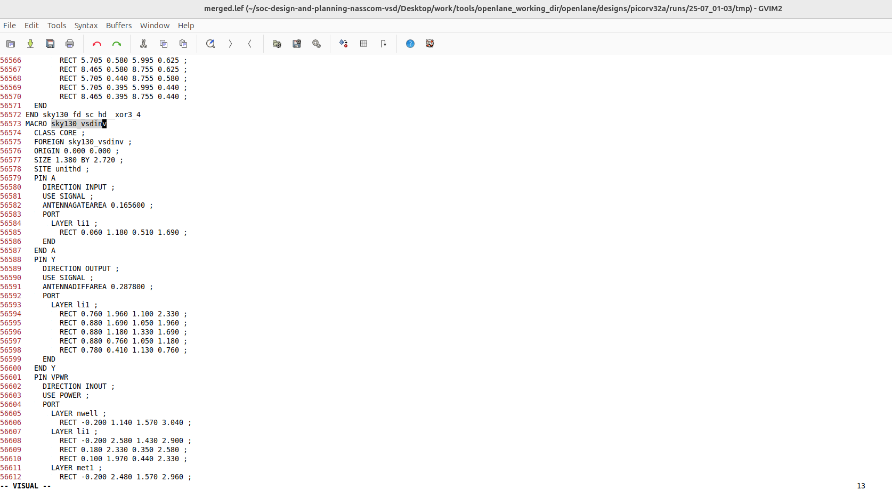


**current design values generated**


<a id="synthesis"></a>
## Step 7: Remove/reduce the newly introduced violations with the introduction of custom inverter cell by modifying design parameters

**Commands to view and change parameters to improve timing and run synthesis:**

<details>
  <Summary><strong> README</strong></summary>

| **Variable**      | **Description**                                                   | 
|---------------|---------------------------------------------------------------|
| `LIB_SYNTH` | The library used for synthesis by yosys. <br> (Default: `$::env(PDK_ROOT)/$::env(PDK)/libs.ref/$::env(STD_CELL_LIBRARY)/lib/sky130_fd_sc_hd__tt_025C_1v80.lib`)|
| `SYNTH_BIN` | The yosys binary used in the flow. <br> (Default: `yosys`) |
| **`SYNTH_DRIVING_CELL`**  | The cell to drive the input ports. <br>(Default: `sky130_fd_sc_hd__inv_8`)|
| `SYNTH_DRIVING_CELL_PIN`  | The name of the SYNTH_DRIVING_CELL output pin. <br>(Default: `Y`)|
| **`SYNTH_CAP_LOAD`** | The capacitive load on the output ports in femtofarads. <br> (Default: `17.65` ff)|
| `SYNTH_MAX_FANOUT`  | The max load that the output ports can drive. <br> (Default: `5` cells) |
| `SYNTH_MAX_TRAN` | The max transition time (slew) from high to low or low to high on cell inputs in ns. Used in synthesis <br> (Default: Calculated at runtime as `10%` of the provided clock period, unless this exceeds a set DEFAULT_MAX_TRAN, in which case it will be used as is). |
| **`SYNTH_STRATEGY`** | Strategies for abc logic synthesis and technology mapping <br> Possible values are `DELAY/AREA 0-3/0-2`; the first part refers to the optimization target of the synthesis strategy (area vs. delay) and the second one is an index. <br> (Default: `AREA 0`)|
| **`SYNTH_BUFFERING`** | Enables abc cell buffering <br> Enabled = 1, Disabled = 0 <br> (Default: `1`)|
| **`SYNTH_SIZING`** | Enables abc cell sizing (instead of buffering) <br> Enabled = 1, Disabled = 0 <br> (Default: `0`)|
| `SYNTH_READ_BLACKBOX_LIB` | A flag that enable reading the full(untrimmed) liberty file as a blackbox for synthesis. Please note that this is not used in technology mapping. This should only be used when trying to preserve gate instances in the rtl of the design.  <br> Enabled = 1, Disabled = 0 <br> (Default: `0`)|
| `SYNTH_NO_FLAT` | A flag that disables flattening the hierarchy during synthesis, only flattening it after synthesis, mapping and optimizations. <br> Enabled = 1, Disabled = 0 <br> (Default: `0`)|
| `SYNTH_SHARE_RESOURCES` | A flag that enables yosys to reduce the number of cells by determining shareable resources and merging them. <br> Enabled = 1, Disabled = 0 <br> (Default: `1`)|
| `SYNTH_ADDER_TYPE` | Adder type to which the $add and $sub operators are mapped to. <br> Possible values are `YOSYS/FA/RCA/CSA`; where `YOSYS` refers to using Yosys internal adder definition, `FA` refers to full-adder structure, `RCA` refers to ripple carry adder structure, and `CSA` refers to carry select adder. <br> (Default: `YOSYS`)|
| `LIB_SLOWEST` | Points to the lib file, corresponding to the slowest corner, for max delay calculation during STA. <br> (Default: `$::env(PDK_ROOT)/$::env(PDK)/libs.ref/$::env(STD_CELL_LIBRARY)/lib/sky130_fd_sc_hd__ff_n40C_1v95.lib`) |
| `LIB_FASTEST` | Points to the lib file, corresponding to the fastest corner, for min delay calculation during STA. <br> (Default: `$::env(PDK_ROOT)/$::env(PDK)/libs.ref/$::env(STD_CELL_LIBRARY)/lib/sky130_fd_sc_hd__ss_100C_1v60.lib`) |
| `LIB_TYPICAL` | Library used for typical delay calculation during STA. <br> (Default`LIB_SYNTH`) |
| `CLOCK_BUFFER_FANOUT` | Fanout of clock tree buffers. <br> (Default: `16`) |
| `ROOT_CLK_BUFFER` | Root clock buffer of the clock tree. <br> (Default: `sky130_fd_sc_hd__clkbuf_16`) |
| `CLK_BUFFER` | Clock buffer used for inner nodes of the clock tree. <br> (Default: `sky130_fd_sc_hd__clkbuf_4`) |
| `CLK_BUFFER_INPUT` | Input pin of the clock tree buffer. <br> (Default: `A`) |
| `CLK_BUFFER_OUTPUT` | Output pin of the clock tree buffer. <br> (Default: `X`) |
| `BASE_SDC_FILE` | Specifies the base sdc file to source before running Static Timing Analysis. <br> (Default: `$::env(OPENLANE_ROOT)/scripts/base.sdc`) |
| `VERILOG_INCLUDE_DIRS` | Specifies the verilog includes directories. <br> Optional. |
| `SYNTH_FLAT_TOP` | Specifies whether or not the top level should be flattened during elaboration. 1 = True, 0= False <br> Default: `0`. |
| `IO_PCT` | Specifies the percentage of the clock period used in the input/output delays. Ranges from 0 to 1.0. <br> (Default: `0.2`) |


</details>


### Steps to configure synthesis settings to fix slack and include vsdinv

```bash
# Now once again we have to prep design so as to update variables
prep -design picorv32a -tag new -overwrite

# Addiitional commands to include newly added lef to openlane flow merged.lef
set lefs [glob $::env(DESIGN_DIR)/src/*.lef]

add_lefs -src $lefs

# Command to display current value of variable SYNTH_STRATEGY
echo $::env(SYNTH_STRATEGY)

# Command to set new value for SYNTH_STRATEGY
set ::env(SYNTH_STRATEGY) "DELAY 3"

# Command to display current value of variable SYNTH_BUFFERING to check whether it's enabled
echo $::env(SYNTH_BUFFERING)

# Command to display current value of variable SYNTH_SIZING
echo $::env(SYNTH_SIZING)

# Command to set new value for SYNTH_SIZING
set ::env(SYNTH_SIZING) 1

# Command to display current value of variable SYNTH_DRIVING_CELL to check whether it's the proper cell or not
echo $::env(SYNTH_DRIVING_CELL)

# Now that the design is prepped and ready, we can run synthesis using following command
run_synthesis
```


- Comparing new run values with previous run--> **area has increased and worst negative slack has become 0**

✅ Synthesis has accepted our custom inverter

<a id="run-fp-and-plc"></a>
## Step 8: Run Floorplan and Placement to verify the cell is accepted in PnR flow

### Run Floorplan

```bash
# Now we can run floorplan
run_floorplan
```


The above image shows - unexpected un-explainable error while using run_floorplan command. We can instead use the following set of commands available based on information from

```bash
/home/sdudigani/soc-design-and-planning-nasscom-vsd/Desktop/work/tools/openlane_working_dir/openlane/scripts/tcl_commands/floorplan.tcl
```

and based on Floorplan commands section in

```bash
/home/sdudigani/soc-design-and-planning-nasscom-vsd/Desktop/work/tools/openlane_working_dir/openlane/docs/source/OpenLANE_commands.md
```

```bash
# Follwing commands are all-together sourced in "run_floorplan" command
init_floorplan
place_io
tap_decap_or
```


### Run Placement

```bash
# Now we are ready to run placement
run_placement
```

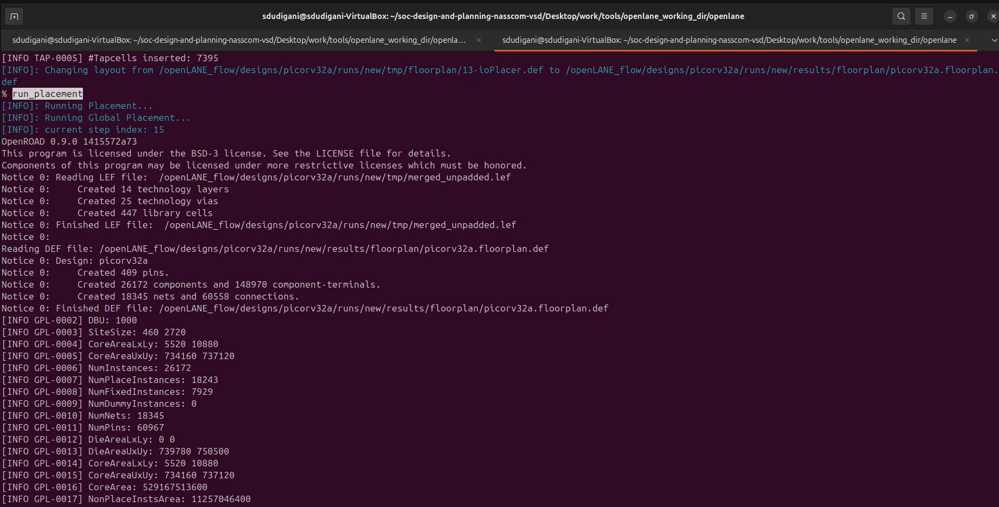
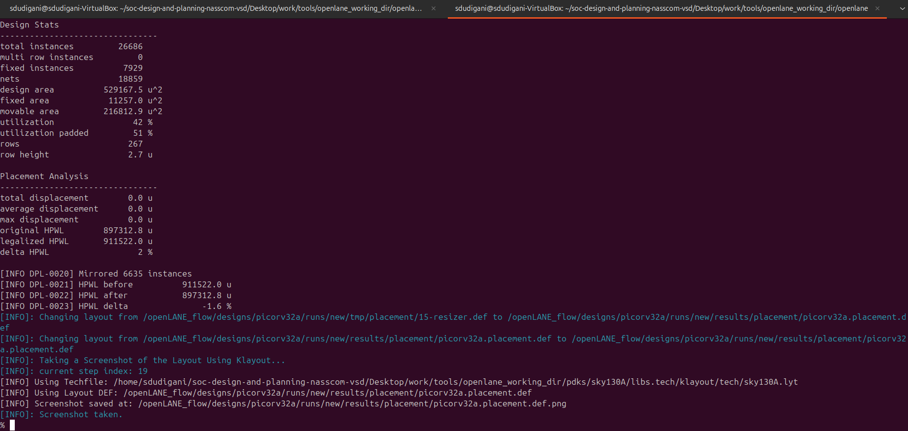

**load placement def in magic in another terminal:**

```bash
# Change directory to path containing generated placement def
cd ~/soc-design-and-planning-nasscom-vsd/Desktop/work/tools/openlane_working_dir/openlane/designs/picorv32a/runs/new/results/placement/

# Command to load the placement def in magic tool
magic -T ~/soc-design-and-planning-nasscom-vsd/Desktop/work/tools/openlane_working_dir/pdks/sky130A/libs.tech/magic/sky130A.tech lef read ../../tmp/merged.lef def read picorv32a.placement.def &
```

**placement def in magic:**
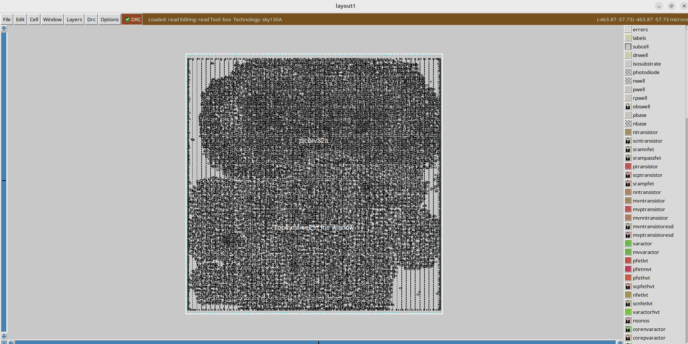

**Custom inverter inserted in placement def with proper abutment:**
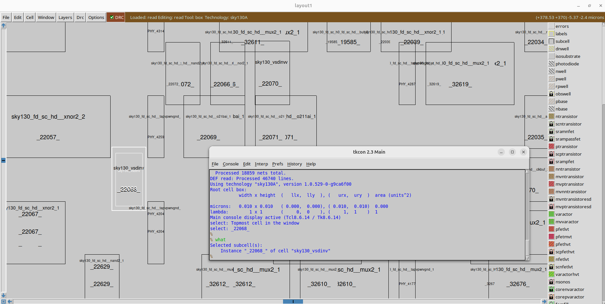

**view internal layers of cells:**

```bash
# Command to view internal connectivity layers in tkcon window
expand
```

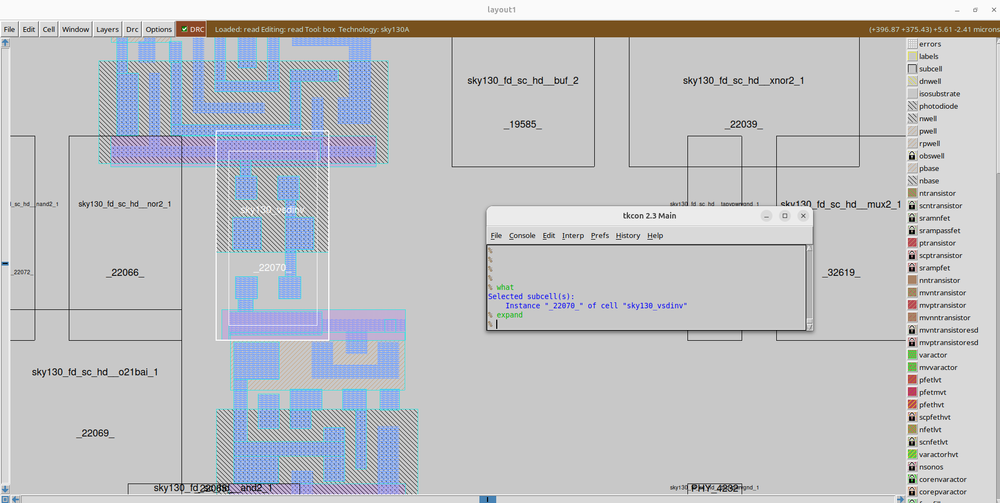

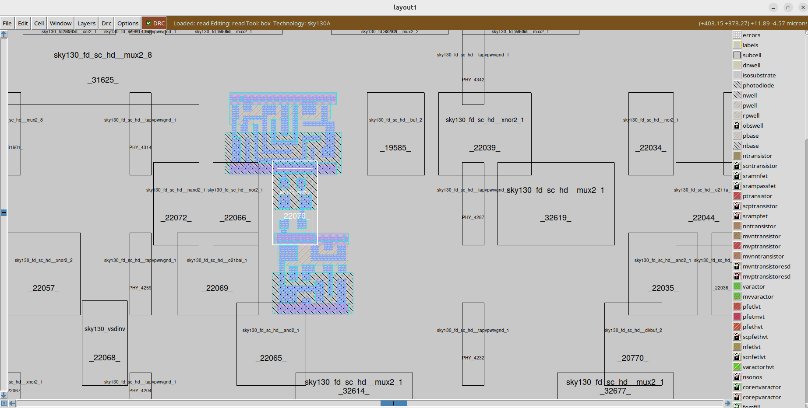

<a id="post-synthesis-timing-analysis"></a>
## Step 9: Post-Synthesis timing analysis with OpenSTA tool

- We are having 0 wns after improved timing run. So, we are going to do timing analysis on the initial synthesis run which had a lot of violations and no parameters were added to improve timing.

### Steps to optimize synthesis to reduce setup violations

**Commands to invoke the OpenLANE flow include new lef and perform synthesis:**

```bash
# Change directory to openlane flow directory
cd ~/soc-design-and-planning-nasscom-vsd/Desktop/work/tools/openlane_working_dir/openlane

export PDK_ROOT=/home/sdudigani/soc-design-and-planning-nasscom-vsd/Desktop/work/tools/openlane_working_dir/pdks

#optional
alias docker='docker run -it -v $(pwd):/openLANE_flow -v $PDK_ROOT:$PDK_ROOT -e PDK_ROOT=$PDK_ROOT -u $(id -u $USER):$(id -g $USER) efabless/openlane:v0.21'

# Since we have aliased the long command to 'docker' we can invoke the OpenLANE flow docker sub-system by just running this command
docker
```

```bash
# Now that we have entered the OpenLANE flow contained docker sub-system we can invoke the OpenLANE flow in the Interactive mode using the following command
./flow.tcl -interactive

# Now that OpenLANE flow is open we have to input the required packages for proper functionality of the OpenLANE flow
package require openlane 0.9

# Now the OpenLANE flow is ready to run any design and initially we have to prep the design creating some necessary files and directories for running a specific design which in our case is 'picorv32a'
prep -design picorv32a

# Adiitional commands to include newly added lef to openlane flow
set lefs [glob $::env(DESIGN_DIR)/src/*.lef]
add_lefs -src $lefs

# Command to set new value for SYNTH_SIZING
set ::env(SYNTH_SIZING) 1

# Now that the design is prepped and ready, we can run synthesis using following command
run_synthesis
```

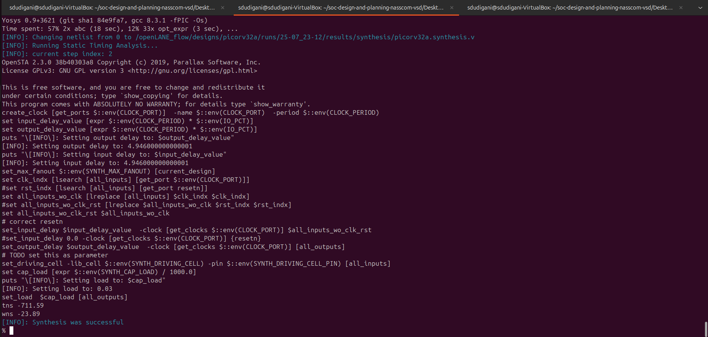

**Newly created `pre_sta.conf` for STA analysis in openlane directory:**
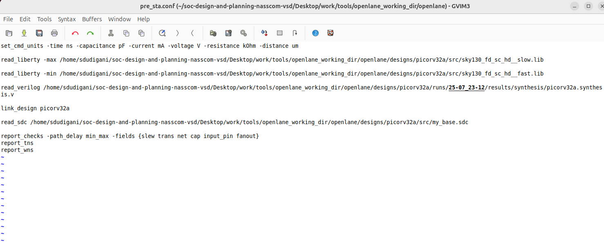

**capacitance value of driving cell `sky130_fd_sc_hs__inv_8` defined in `my_base.sdc` from `sky130_fd_sc_hd__typical.lib`**
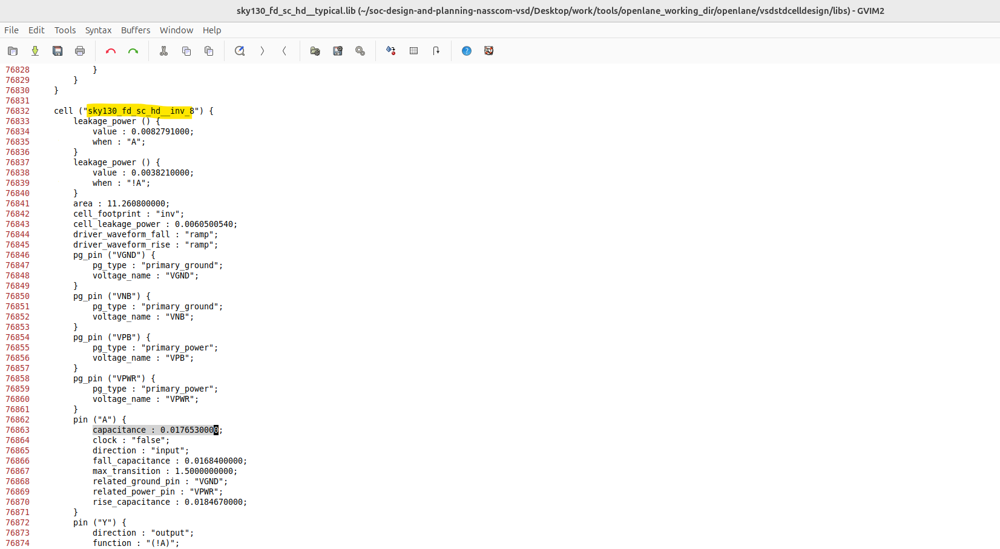

**Newly created my_base.sdc for STA analysis in openlane/designs/picorv32a/src directory based on the file openlane/scripts/base.sdc:**
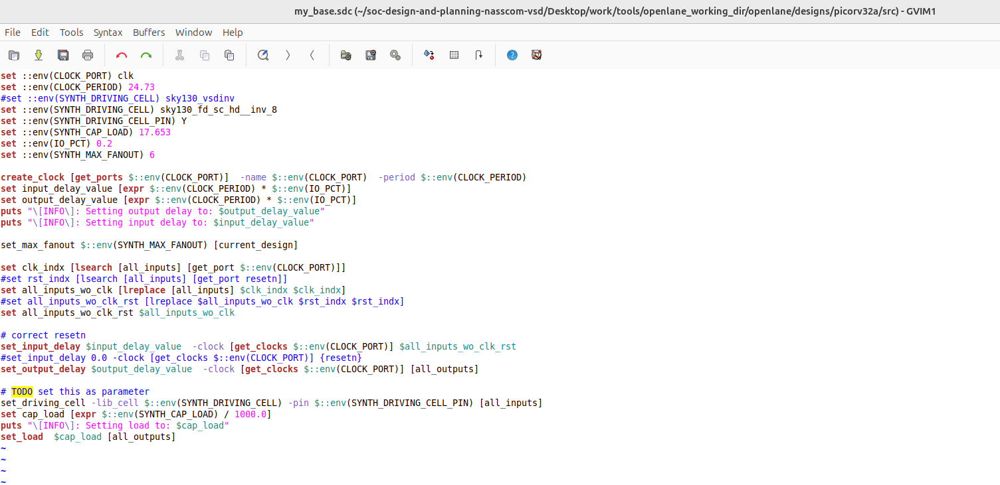

**Note:** Before running STA, ensure you have installed and built [OpenSTA](https://github.com/parallaxsw/OpenSTA) as per the instructions in the official repository.

**Commands to run STA in new terminal:**
```bash
# Change directory to openlane
cd /home/sdudigani/soc-design-and-planning-nasscom-vsd/Desktop/work/tools/openlane_working_dir/openlane

# Command to invoke OpenSTA tool with script
~/OpenSTA/build/sta pre_sta.conf
```

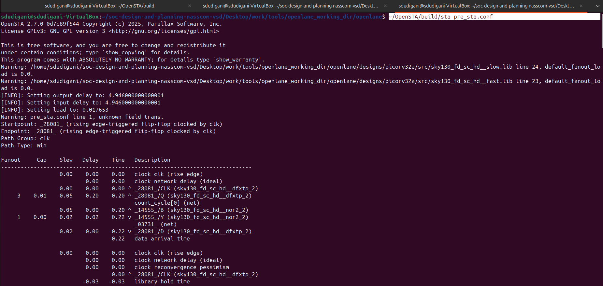

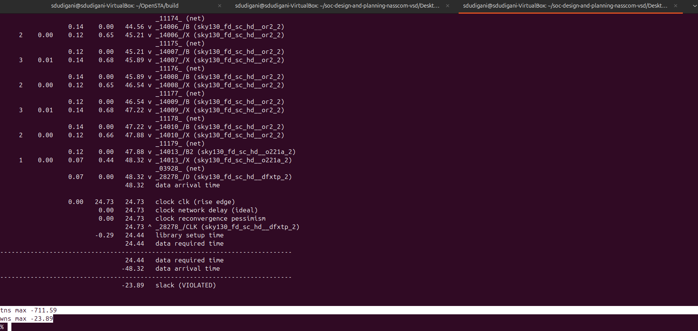


- From the generated sta report above, one reason for negative setup slack could be high fanout (which may cause more delay). So, we can add a parameter to reduce fanout and run synthesis again.
  - High fanout from driving cells results in **greater capacitive load**, hence **slower signal propagation**.
  - Slack reported = -23.89 ps
  - TNS = -711.59 ps
  - Does not meet timing constraints

- Adjust `SYNTH_MAX_FANOUT` parameter in the `.sdc` file and rerun synthesis to reduce loading effects.

```bash
prep -design picorv32a -tag 25-07_23-12 -overwrite
set lefs [glob $::env(DESIGN_DIR)/src/*.lef]
add_lefs -src $lefs
```

```bash
% echo $::env(SYNTH_SIZING)
0
% set ::env(SYNTH_SIZING) 1
1
% echo $::env(SYNTH_MAX_FANOUT)
6
% set ::env(SYNTH_MAX_FANOUT) 4
4
% echo $::env(SYNTH_DRIVING_CELL)
sky130_fd_sc_hd__inv_2
% run_synthesis
```

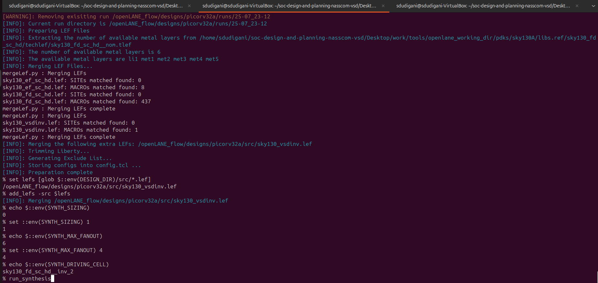

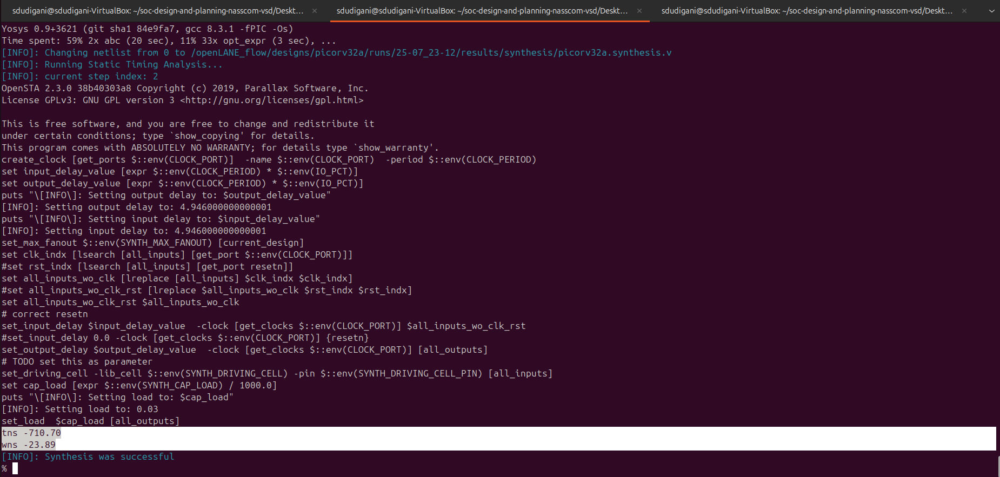


**Commands to run STA in another terminal:**

```bash
# Change directory to openlane
cd Desktop/work/tools/openlane_working_dir/openlane

# Command to invoke OpenSTA tool with script
~/OpenSTA/build/sta pre_sta.conf
```

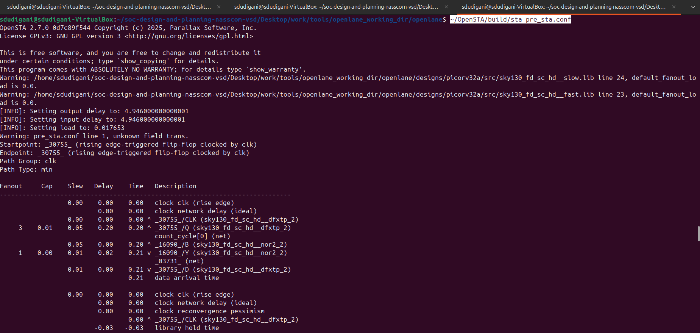


**Observations:** Despite reducing the fanout and inserting buffers, the design still fails to meet timing after synthesis, as shown in the updated PrimeTime report.
  - Slack = -23.89 --> **remains same**
  - TNS = -710.70
  - WNS = -23.89 

Since basic optimizations during synthesis were insufficient, we proceed with **Engineering Change Order (ECO)** fixes — a common post-synthesis method to fix critical timing issues without a complete re-synthesis.

<a id="eco-fixes"></a>
## Step 10: Timing ECO Fixes to Remove Violations

#### Standard cell naming Convention
- **cell name: : `sky130_fd_sc_hd__or3_4`**
  - `sky130_fd_sc_hd__` → SkyWater 130nm process, Foundry Design (FD), Standard Cell (SC), High Density (HD) library
  - `or3` → 3-input OR gate
  - `_4` → Drive strength 4 (higher drive capability than `_2`)

- From the following timing analysis report, we observe that an OR gate with drive strength 2 `sky130_fd_sc_hd__or3_2` is driving 4 fanout loads.
```bash
OR gate: sky130_fd_sc_hd__or3_2
Fanouts: 4
Net: _11873_
```

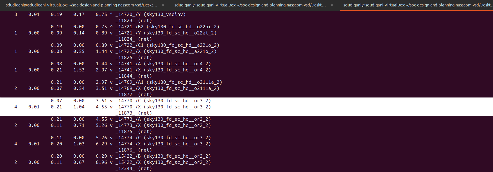

- Replacing the **OR3** gate of drive strength 2 with a **drive strength 4** version (`sky130_fd_sc_hd__or3_4`) to improve timing

**Note:** *Since higher drive strength cells offer faster transitions and better timing but consume more area and power — use judiciously on critical paths.*

**Commands to perform analysis and optimize timing by replacing with OR gate of drive strength 4:**
```bash
# Report all the connections (fanouts) of the net _11873_ to identify the load
report_net -connections _11873_

# Display help info for the 'replace_cell' command to understand its usage
help replace_cell

# Replace instance _14770_ with a higher drive strength OR3 gate (drive strength 4)
replace_cell _14770_ sky130_fd_sc_hd__or3_4

# Re-run timing checks to observe updated capacitance, slew, and arrival times after replacement
report_checks -fields {net cap slew input_pins fanout} -digits 4
```

**Result:** `Slack reduced`
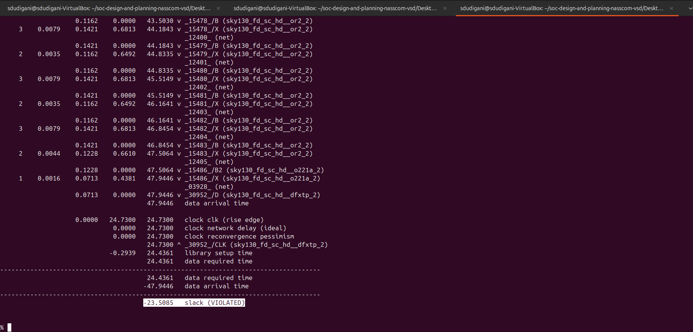

- In the timing report, we observe that an OR gate with drive strength 2 (`sky130_fd_sc_hd__or4_2`) is driving an OA (OR-AND) gate (`sky130_fd_sc_hd__o2111a_2`). This introduces significant delay on the net due to high capacitive load and insufficient driving strength.

```bash
Driver: sky130_fd_sc_hd__or4_2
Load:   sky130_fd_sc_hd__o2111a_2
Delay:  1.5344 + 2.9746 = 4.509 ns (approx)
```

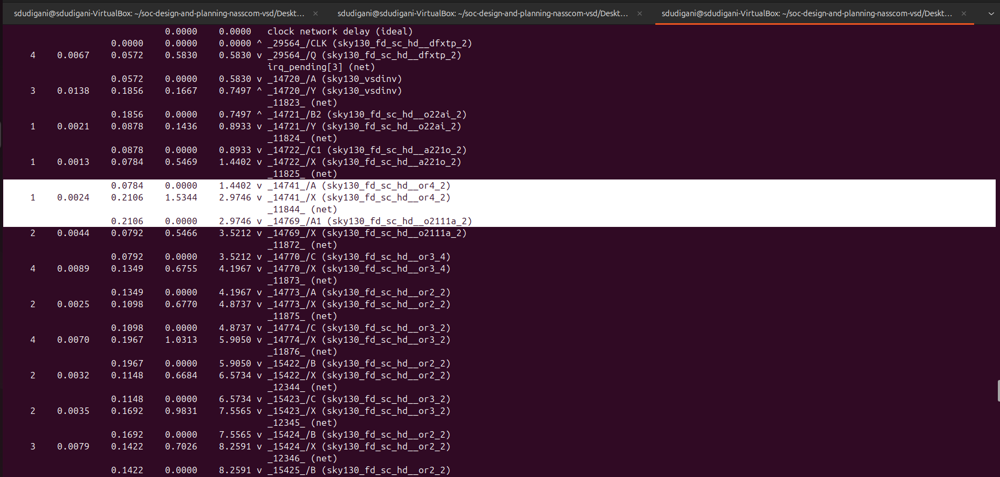

- To reduce delay and improve slack, we will replace the weak OR gate with a higher drive-strength version (`sky130_fd_sc_hd__or4_4`).

**Commands to perform analysis and optimize timing by replacing with OR gate of drive strength 4:**
```bash
# Reports all the connections to a net
report_net -connections _11844_

# Replacing cell
replace_cell _14741_ sky130_fd_sc_hd__or4_4

# Generating custom timing report
report_checks -fields {net cap slew input_pins fanout} -digits 4
```

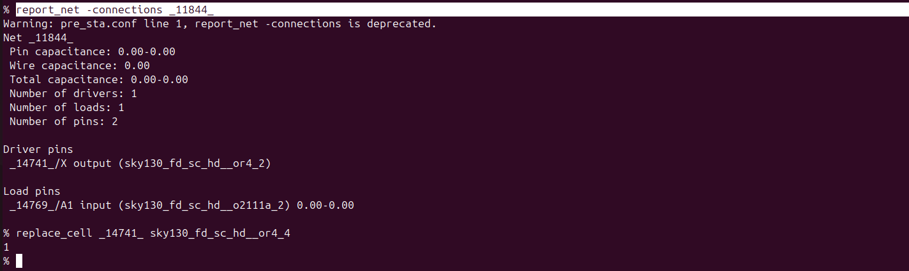

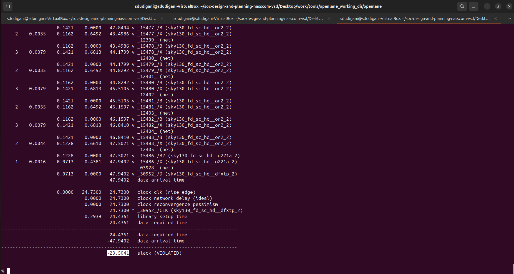


