<details>
  <Summary><strong> Day 18 : Pre-layout Timing Analysis and Importance of Good Clock Tree</strong></summary>

# Contents
- [Step 1: Fix DRC errors and verify the design](#fix-drc-errors-and-verify-the-design)
- [Step 2: Save the final layout with custom name and open it](#save-final-layout)
- [Step 3: Generate lef from the Layout](#generate-lef-from-the-layout)
- [Step 4: Copy the newly generated lef and associated required lib files to 'picorv32a' design 'src' directory](#copy-new-lef-and-lib-files)
- [Step 5: Edit 'config.tcl'](#edit-config)
- [Step 6: Run openlane flow synthesis with newly inserted custom inverter cell](#run-openlane-flow-synthesis)
- [Step 7: Synthesis - Remove/reduce the newly introduced violations with the introduction of custom inverter cell by modifying design parameters](#synthesis)
- [Step 8: Run Floorplan and Placement](#run-fp-and-plc)
- [Step 9: Post-Synthesis timing analysis with OpenSTA tool](#post-synthesis-timing-analysis)
- [Step 10: Timing ECO Fixes to Remove Violations](#eco-fixes)

<a id="fix-drc-errors-and-verify-the-design"></a>
## Step 1: Fix up small DRC errors and verify the design is ready to be inserted into our flow

Before moving forward with custom designed cell layout verify following:
1. The input and output ports of the standard cell should lie on the intersection of the vertical and horizontal tracks.
2. Width of the standard cell should be odd multiples of the horizontal track pitch.
3. Height of the standard cell should be even multiples of the vertical track pitch.

**Open custom inverter layout**
```bash
cd Desktop/work/tools/openlane_working_dir/openlane/vsdstdcelldesign

# Open custom inverter layout in magic
magic -T sky130A.tech sky130_inv.mag &
```


**Convert Grid info to track info**

- press **g** in magic to activate grids.

**tracks.info of sky130_fd_sc_hd:**


- Commands to set grid as tracks of locali layer:

```bash
# Get syntax for grid command
help grid

# Set grid values accordingly
grid 0.46um 0.34um 0.23um 0.17um
```


**Verified ✅ --> The input and output ports of the standard cell should lie on the intersection of the vertical and horizontal tracks**


**Verified ✅ --> Width of the standard cell should be odd multiples of the horizontal track pitch**
Horizontal track pitch = 0.46 µm
Width of standard cell = 1.38 µm = 0.46 x 3


**Verified ✅ --> Height of the standard cell should be even multiples of the vertical track pitch**
Vertical track pitch = 0.34 µm
Height of standard cell = 2.72 µm = 0.34 × 8


<a id="save-final-layout"></a>
## Step 2: Save the final layout with custom name and open it

```bash
# Command to save as
save sky130_vsdinv.mag

# Command to open custom inverter layout in magic
magic -T sky130A.tech sky130_vsdinv.mag &
```

**newly saved layout**


<a id="generate-lef-from-the-layout"></a>
## Step 3: Generate lef from the Layout

```bash
# lef command
lef write

#open newly created lef file
gvim sky130_vsdinv.lef
```


**lef file**


<a id="copy-new-lef-and-lib-files"></a>
## Step 4: Copy the newly generated lef and associated required lib files to 'picorv32a' design 'src' directory

```bash
# Copy lef file
cp sky130_vsdinv.lef ~/soc-design-and-planning-nasscom-vsd/Desktop/work/tools/openlane_working_dir/openlane/designs/picorv32a/src/

# Copy lib files
cp libs/sky130_fd_sc_hd__* ~/soc-design-and-planning-nasscom-vsd/Desktop/work/tools/openlane_working_dir/openlane/designs/picorv32a/src/

# List and check whether they are copied
ls ~/soc-design-and-planning-nasscom-vsd/Desktop/work/tools/openlane_working_dir/openlane/designs/picorv32a/src/
```

<a id="edit-config"></a>
## Step 5: Edit 'config.tcl' 
- Edit `config.tcl` to change lib file and add the new extra lef into the openlane flow.

```bash
set ::env(LIB_SYNTH) "$::env(OPENLANE_ROOT)/designs/picorv32a/src/sky130_fd_sc_hd__typical.lib"
set ::env(LIB_FASTEST) "$::env(OPENLANE_ROOT)/designs/picorv32a/src/sky130_fd_sc_hd__fast.lib"
set ::env(LIB_SLOWEST) "$::env(OPENLANE_ROOT)/designs/picorv32a/src/sky130_fd_sc_hd__slow.lib"
set ::env(LIB_TYPICAL) "$::env(OPENLANE_ROOT)/designs/picorv32a/src/sky130_fd_sc_hd__typical.lib"
set ::env(EXTRA_LEFS) [glob $::env(OPENLANE_ROOT)/designs/$::env(DESIGN_NAME)/src/*.lef]
```

**Edited `config.tcl`**


<a id="run-openlane-flow-synthesis"></a>
## Step 6: Run openlane flow synthesis with newly inserted custom inverter cell

- invoke the OpenLANE flow include new lef and perform synthesis:

```bash
# Change directory to openlane flow directory
cd ~/soc-design-and-planning-nasscom-vsd/Desktop/work/tools/openlane_working_dir/openlane

export PDK_ROOT=/home/sdudigani/soc-design-and-planning-nasscom-vsd/Desktop/work/tools/openlane_working_dir/pdks

#optional
alias docker='docker run -it -v $(pwd):/openLANE_flow -v $PDK_ROOT:$PDK_ROOT -e PDK_ROOT=$PDK_ROOT -u $(id -u $USER):$(id -g $USER) efabless/openlane:v0.21'

# Since we have aliased the long command to 'docker' we can invoke the OpenLANE flow docker sub-system by just running this command
docker
```


- After entering openlane flow contained docker, run the following commands

```bash
# Now that we have entered the OpenLANE flow contained docker sub-system we can invoke the OpenLANE flow in the Interactive mode using the following command
./flow.tcl -interactive

# Now that OpenLANE flow is open we have to input the required packages for proper functionality of the OpenLANE flow
package require openlane 0.9

# Now the OpenLANE flow is ready to run any design and initially we have to prep the design creating some necessary files and directories for running a specific design which in our case is 'picorv32a'
prep -design picorv32a

# Adiitional commands to include newly added lef to openlane flow
set lefs [glob $::env(DESIGN_DIR)/src/*.lef]
add_lefs -src $lefs

# Now that the design is prepped and ready, we can run synthesis using following command
run_synthesis
```


**merged.lef after including newly added lef to openlane flow:**


**current design values generated**


<a id="synthesis"></a>
## Step 7: Remove/reduce the newly introduced violations with the introduction of custom inverter cell by modifying design parameters

**Commands to view and change parameters to improve timing and run synthesis:**

<details>
  <Summary><strong> README</strong></summary>

| **Variable**      | **Description**                                                   | 
|---------------|---------------------------------------------------------------|
| `LIB_SYNTH` | The library used for synthesis by yosys. <br> (Default: `$::env(PDK_ROOT)/$::env(PDK)/libs.ref/$::env(STD_CELL_LIBRARY)/lib/sky130_fd_sc_hd__tt_025C_1v80.lib`)|
| `SYNTH_BIN` | The yosys binary used in the flow. <br> (Default: `yosys`) |
| **`SYNTH_DRIVING_CELL`**  | The cell to drive the input ports. <br>(Default: `sky130_fd_sc_hd__inv_8`)|
| `SYNTH_DRIVING_CELL_PIN`  | The name of the SYNTH_DRIVING_CELL output pin. <br>(Default: `Y`)|
| **`SYNTH_CAP_LOAD`** | The capacitive load on the output ports in femtofarads. <br> (Default: `17.65` ff)|
| `SYNTH_MAX_FANOUT`  | The max load that the output ports can drive. <br> (Default: `5` cells) |
| `SYNTH_MAX_TRAN` | The max transition time (slew) from high to low or low to high on cell inputs in ns. Used in synthesis <br> (Default: Calculated at runtime as `10%` of the provided clock period, unless this exceeds a set DEFAULT_MAX_TRAN, in which case it will be used as is). |
| **`SYNTH_STRATEGY`** | Strategies for abc logic synthesis and technology mapping <br> Possible values are `DELAY/AREA 0-3/0-2`; the first part refers to the optimization target of the synthesis strategy (area vs. delay) and the second one is an index. <br> (Default: `AREA 0`)|
| **`SYNTH_BUFFERING`** | Enables abc cell buffering <br> Enabled = 1, Disabled = 0 <br> (Default: `1`)|
| **`SYNTH_SIZING`** | Enables abc cell sizing (instead of buffering) <br> Enabled = 1, Disabled = 0 <br> (Default: `0`)|
| `SYNTH_READ_BLACKBOX_LIB` | A flag that enable reading the full(untrimmed) liberty file as a blackbox for synthesis. Please note that this is not used in technology mapping. This should only be used when trying to preserve gate instances in the rtl of the design.  <br> Enabled = 1, Disabled = 0 <br> (Default: `0`)|
| `SYNTH_NO_FLAT` | A flag that disables flattening the hierarchy during synthesis, only flattening it after synthesis, mapping and optimizations. <br> Enabled = 1, Disabled = 0 <br> (Default: `0`)|
| `SYNTH_SHARE_RESOURCES` | A flag that enables yosys to reduce the number of cells by determining shareable resources and merging them. <br> Enabled = 1, Disabled = 0 <br> (Default: `1`)|
| `SYNTH_ADDER_TYPE` | Adder type to which the $add and $sub operators are mapped to. <br> Possible values are `YOSYS/FA/RCA/CSA`; where `YOSYS` refers to using Yosys internal adder definition, `FA` refers to full-adder structure, `RCA` refers to ripple carry adder structure, and `CSA` refers to carry select adder. <br> (Default: `YOSYS`)|
| `LIB_SLOWEST` | Points to the lib file, corresponding to the slowest corner, for max delay calculation during STA. <br> (Default: `$::env(PDK_ROOT)/$::env(PDK)/libs.ref/$::env(STD_CELL_LIBRARY)/lib/sky130_fd_sc_hd__ff_n40C_1v95.lib`) |
| `LIB_FASTEST` | Points to the lib file, corresponding to the fastest corner, for min delay calculation during STA. <br> (Default: `$::env(PDK_ROOT)/$::env(PDK)/libs.ref/$::env(STD_CELL_LIBRARY)/lib/sky130_fd_sc_hd__ss_100C_1v60.lib`) |
| `LIB_TYPICAL` | Library used for typical delay calculation during STA. <br> (Default`LIB_SYNTH`) |
| `CLOCK_BUFFER_FANOUT` | Fanout of clock tree buffers. <br> (Default: `16`) |
| `ROOT_CLK_BUFFER` | Root clock buffer of the clock tree. <br> (Default: `sky130_fd_sc_hd__clkbuf_16`) |
| `CLK_BUFFER` | Clock buffer used for inner nodes of the clock tree. <br> (Default: `sky130_fd_sc_hd__clkbuf_4`) |
| `CLK_BUFFER_INPUT` | Input pin of the clock tree buffer. <br> (Default: `A`) |
| `CLK_BUFFER_OUTPUT` | Output pin of the clock tree buffer. <br> (Default: `X`) |
| `BASE_SDC_FILE` | Specifies the base sdc file to source before running Static Timing Analysis. <br> (Default: `$::env(OPENLANE_ROOT)/scripts/base.sdc`) |
| `VERILOG_INCLUDE_DIRS` | Specifies the verilog includes directories. <br> Optional. |
| `SYNTH_FLAT_TOP` | Specifies whether or not the top level should be flattened during elaboration. 1 = True, 0= False <br> Default: `0`. |
| `IO_PCT` | Specifies the percentage of the clock period used in the input/output delays. Ranges from 0 to 1.0. <br> (Default: `0.2`) |


</details>


### Steps to configure synthesis settings to fix slack and include vsdinv

```bash
# Now once again we have to prep design so as to update variables
prep -design picorv32a -tag new -overwrite

# Addiitional commands to include newly added lef to openlane flow merged.lef
set lefs [glob $::env(DESIGN_DIR)/src/*.lef]

add_lefs -src $lefs

# Command to display current value of variable SYNTH_STRATEGY
echo $::env(SYNTH_STRATEGY)

# Command to set new value for SYNTH_STRATEGY
set ::env(SYNTH_STRATEGY) "DELAY 3"

# Command to display current value of variable SYNTH_BUFFERING to check whether it's enabled
echo $::env(SYNTH_BUFFERING)

# Command to display current value of variable SYNTH_SIZING
echo $::env(SYNTH_SIZING)

# Command to set new value for SYNTH_SIZING
set ::env(SYNTH_SIZING) 1

# Command to display current value of variable SYNTH_DRIVING_CELL to check whether it's the proper cell or not
echo $::env(SYNTH_DRIVING_CELL)

# Now that the design is prepped and ready, we can run synthesis using following command
run_synthesis
```


- Comparing new run values with previous run--> **area has increased and worst negative slack has become 0**

✅ Synthesis has accepted our custom inverter

<a id="run-fp-and-plc"></a>
## Step 8: Run Floorplan and Placement to verify the cell is accepted in PnR flow

### Run Floorplan

```bash
# Now we can run floorplan
run_floorplan
```


The above image shows - unexpected un-explainable error while using run_floorplan command. We can instead use the following set of commands available based on information from

```bash
/home/sdudigani/soc-design-and-planning-nasscom-vsd/Desktop/work/tools/openlane_working_dir/openlane/scripts/tcl_commands/floorplan.tcl
```

and based on Floorplan commands section in

```bash
/home/sdudigani/soc-design-and-planning-nasscom-vsd/Desktop/work/tools/openlane_working_dir/openlane/docs/source/OpenLANE_commands.md
```

```bash
# Follwing commands are all-together sourced in "run_floorplan" command
init_floorplan
place_io
tap_decap_or
```


### Run Placement

```bash
# Now we are ready to run placement
run_placement
```


**load placement def in magic in another terminal:**

```bash
# Change directory to path containing generated placement def
cd ~/soc-design-and-planning-nasscom-vsd/Desktop/work/tools/openlane_working_dir/openlane/designs/picorv32a/runs/new/results/placement/

# Command to load the placement def in magic tool
magic -T ~/soc-design-and-planning-nasscom-vsd/Desktop/work/tools/openlane_working_dir/pdks/sky130A/libs.tech/magic/sky130A.tech lef read ../../tmp/merged.lef def read picorv32a.placement.def &
```

**placement def in magic:**


**Custom inverter inserted in placement def with proper abutment:**


**view internal layers of cells:**

```bash
# Command to view internal connectivity layers in tkcon window
expand
```


<a id="post-synthesis-timing-analysis"></a>
## Step 9: Post-Synthesis timing analysis with OpenSTA tool

- We are having 0 wns after improved timing run. So, we are going to do timing analysis on the initial synthesis run which had a lot of violations and no parameters were added to improve timing.

### Steps to optimize synthesis to reduce setup violations

**Commands to invoke the OpenLANE flow include new lef and perform synthesis:**

```bash
# Change directory to openlane flow directory
cd ~/soc-design-and-planning-nasscom-vsd/Desktop/work/tools/openlane_working_dir/openlane

export PDK_ROOT=/home/sdudigani/soc-design-and-planning-nasscom-vsd/Desktop/work/tools/openlane_working_dir/pdks

#optional
alias docker='docker run -it -v $(pwd):/openLANE_flow -v $PDK_ROOT:$PDK_ROOT -e PDK_ROOT=$PDK_ROOT -u $(id -u $USER):$(id -g $USER) efabless/openlane:v0.21'

# Since we have aliased the long command to 'docker' we can invoke the OpenLANE flow docker sub-system by just running this command
docker
```

```bash
# Now that we have entered the OpenLANE flow contained docker sub-system we can invoke the OpenLANE flow in the Interactive mode using the following command
./flow.tcl -interactive

# Now that OpenLANE flow is open we have to input the required packages for proper functionality of the OpenLANE flow
package require openlane 0.9

# Now the OpenLANE flow is ready to run any design and initially we have to prep the design creating some necessary files and directories for running a specific design which in our case is 'picorv32a'
prep -design picorv32a

# Adiitional commands to include newly added lef to openlane flow
set lefs [glob $::env(DESIGN_DIR)/src/*.lef]
add_lefs -src $lefs

# Command to set new value for SYNTH_SIZING
set ::env(SYNTH_SIZING) 1

# Now that the design is prepped and ready, we can run synthesis using following command
run_synthesis
```


**Newly created `pre_sta.conf` for STA analysis in openlane directory:**


**capacitance value of driving cell `sky130_fd_sc_hs__inv_8` defined in `my_base.sdc` from `sky130_fd_sc_hd__typical.lib`**


**Newly created my_base.sdc for STA analysis in openlane/designs/picorv32a/src directory based on the file openlane/scripts/base.sdc:**


**Note:** Before running STA, ensure you have installed and built [OpenSTA](https://github.com/parallaxsw/OpenSTA) as per the instructions in the official repository.

**Commands to run STA in new terminal:**
```bash
# Change directory to openlane
cd /home/sdudigani/soc-design-and-planning-nasscom-vsd/Desktop/work/tools/openlane_working_dir/openlane

# Command to invoke OpenSTA tool with script
~/OpenSTA/build/sta pre_sta.conf
```


- From the generated sta report above, one reason for negative setup slack could be high fanout (which may cause more delay). So, we can add a parameter to reduce fanout and run synthesis again.
  - High fanout from driving cells results in **greater capacitive load**, hence **slower signal propagation**.
  - Slack reported = -23.89 ps
  - TNS = -711.59 ps
  - Does not meet timing constraints

- Adjust `SYNTH_MAX_FANOUT` parameter in the `.sdc` file and rerun synthesis to reduce loading effects.

```bash
prep -design picorv32a -tag 25-07_23-12 -overwrite
set lefs [glob $::env(DESIGN_DIR)/src/*.lef]
add_lefs -src $lefs
```

```bash
% echo $::env(SYNTH_SIZING)
0
% set ::env(SYNTH_SIZING) 1
1
% echo $::env(SYNTH_MAX_FANOUT)
6
% set ::env(SYNTH_MAX_FANOUT) 4
4
% echo $::env(SYNTH_DRIVING_CELL)
sky130_fd_sc_hd__inv_2
% run_synthesis
```


**Commands to run STA in another terminal:**

```bash
# Change directory to openlane
cd Desktop/work/tools/openlane_working_dir/openlane

# Command to invoke OpenSTA tool with script
~/OpenSTA/build/sta pre_sta.conf
```


**Observations:** Despite reducing the fanout and inserting buffers, the design still fails to meet timing after synthesis, as shown in the updated PrimeTime report.
  - Slack = -23.89 --> **remains same**
  - TNS = -710.70
  - WNS = -23.89 

Since basic optimizations during synthesis were insufficient, we proceed with **Engineering Change Order (ECO)** fixes — a common post-synthesis method to fix critical timing issues without a complete re-synthesis.

<a id="eco-fixes"></a>
## Step 10: Timing ECO Fixes to Remove Violations

### Standard cell naming Convention
- **cell name: : `sky130_fd_sc_hd__or3_4`**
  - `sky130_fd_sc_hd__` → SkyWater 130nm process, Foundry Design (FD), Standard Cell (SC), High Density (HD) library
  - `or3` → 3-input OR gate
  - `_4` → Drive strength 4 (higher drive capability than `_2`)

### From the following timing analysis report, we observe that an OR gate with drive strength 2 `sky130_fd_sc_hd__or3_2` is driving 4 fanout loads.
```bash
OR gate: sky130_fd_sc_hd__or3_2
Fanouts: 4
Net: _11873_
```


- Replacing the **OR3** gate of drive strength 2 with a **drive strength 4** version (`sky130_fd_sc_hd__or3_4`) to improve timing

**Note:** *Since higher drive strength cells offer faster transitions and better timing but consume more area and power — use judiciously on critical paths.*

**Commands to perform analysis and optimize timing by replacing with OR gate of drive strength 4:**
```bash
# Report all the connections (fanouts) of the net _11873_ to identify the load
report_net -connections _11873_

# Display help info for the 'replace_cell' command to understand its usage
help replace_cell

# Replace instance _14770_ with a higher drive strength OR3 gate (drive strength 4)
replace_cell _14770_ sky130_fd_sc_hd__or3_4

# Re-run timing checks to observe updated capacitance, slew, and arrival times after replacement
report_checks -fields {net cap slew input_pins fanout} -digits 4
```

**Result:** Slack reduced from -23.89 to **-23.5085**


### In the timing report, we observe that an OR gate with drive strength 2 (`sky130_fd_sc_hd__or4_2`) is driving an OA (OR-AND) gate (`sky130_fd_sc_hd__o2111a_2`). This introduces significant delay on the net due to high capacitive load and insufficient driving strength.

```bash
Driver: sky130_fd_sc_hd__or4_2
Load:   sky130_fd_sc_hd__o2111a_2
Delay:  1.5344 + 2.9746 = 4.509 ns (approx)
```


- To reduce delay and improve slack, we will replace the weak OR gate with a higher drive-strength version (`sky130_fd_sc_hd__or4_4`).

**Commands to perform analysis and optimize timing by replacing with OR gate of drive strength 4:**
```bash
# Reports all the connections to a net
report_net -connections _11844_

# Replacing cell
replace_cell _14741_ sky130_fd_sc_hd__or4_4

# Generating custom timing report
report_checks -fields {net cap slew input_pins fanout} -digits 4
```


**Result:** Slack reduced from -23.5085 to **-23.5041**


### OR gate of drive strength 2 driving OA gate has more delay
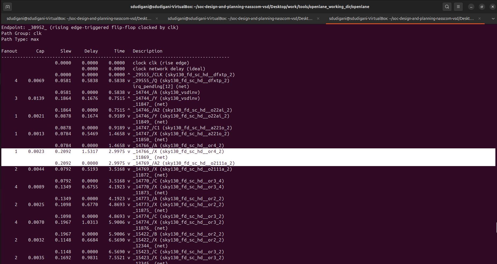

**Commands to perform analysis and optimize timing by replacing with OR gate of drive strength 4:**
```bash
# Reports all the connections to a net
report_net -connections _11869_

# Replacing cell
replace_cell _14766_ sky130_fd_sc_hd__or4_4

# Generating custom timing report
report_checks -fields {net cap slew input_pins fanout} -digits 4
```

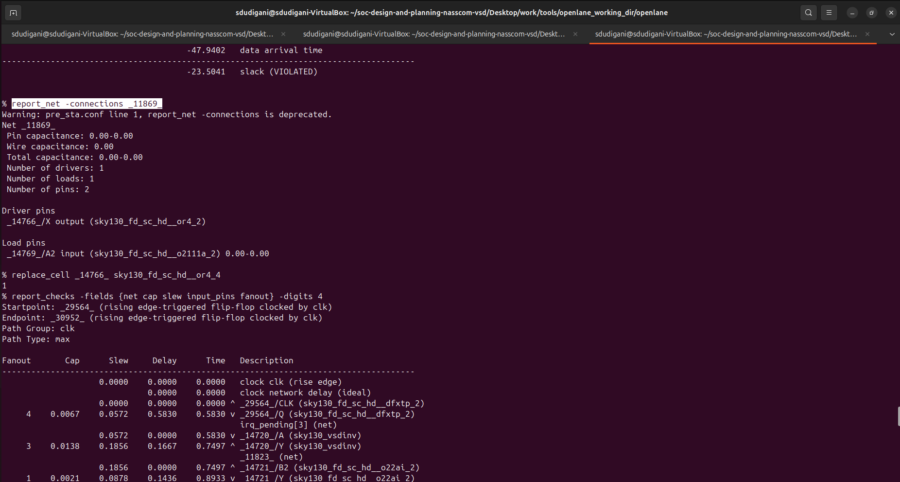

**Result:** Slack reduced from -23.5041 to **-22.9852**
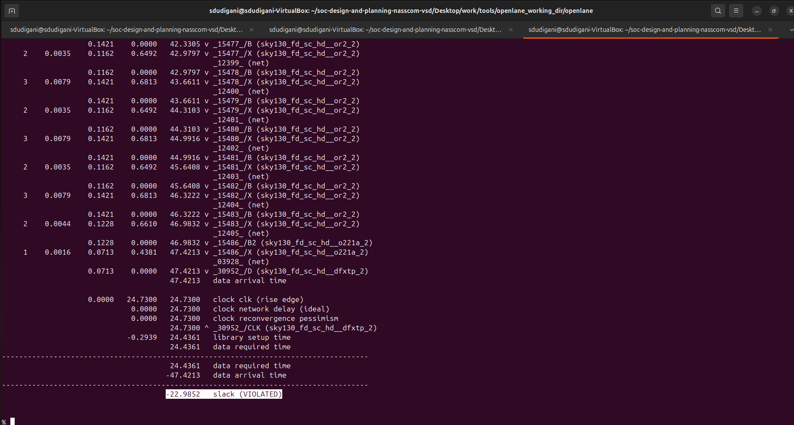

**Commands to verify instance 14766 is replaced with sky130_fd_sc_hd__or4_4:**
```bash
report_checks -from _29555_ -to _30952_ -through _14766_
```

*Note: Make sure that the and are the same as those reported in the previous full timing report. This ensures you're analyzing timing improvements or regressions on the exact same critical path, especially after making ECO changes like gate replacements.*

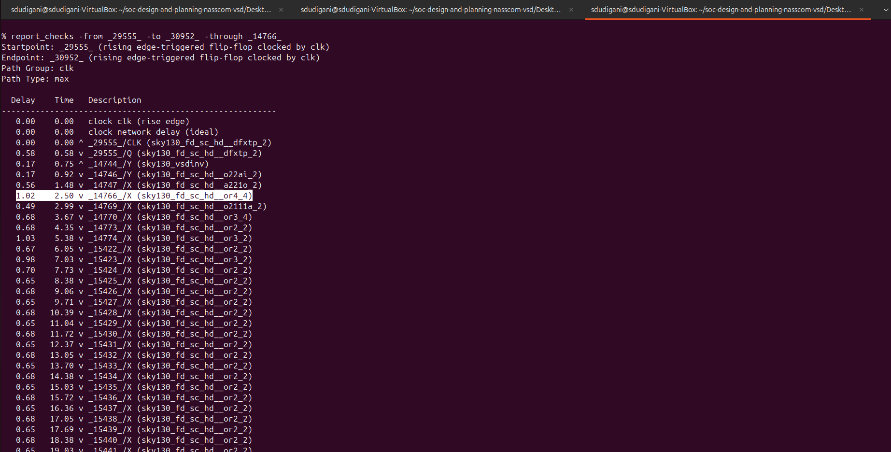

### Commands to perform analysis and optimize timing by replacing with OR gate of drive strength 4:

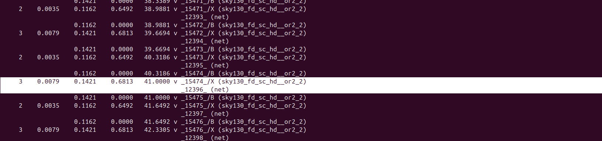

```bash
%  report_net -connections _12396_
Warning: pre_sta.conf line 1, report_net -connections is deprecated.
Net _12396_
 Pin capacitance: 0.01-0.01
 Wire capacitance: 0.00
 Total capacitance: 0.01-0.01
 Number of drivers: 1
 Number of loads: 3
 Number of pins: 4

Driver pins
 _15474_/X output (sky130_fd_sc_hd__or2_2)

Load pins
 _15475_/B input (sky130_fd_sc_hd__or2_2) 0.00-0.00
 _15505_/A2 input (sky130_fd_sc_hd__a211oi_2) 0.00-0.00
 _15507_/C1 input (sky130_fd_sc_hd__o211a_2) 0.00-0.00

% replace_cell _15474_ sky130_fd_sc_hd__or2_4
1
% 
```

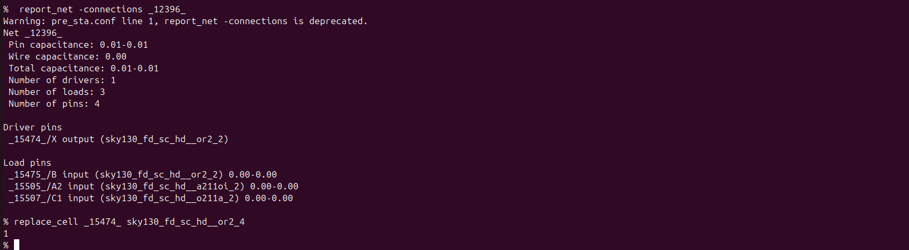

**Result:** Slack reduced from 22.9852 ns to **-22.7650 ns**
```bash
 report_checks -fields {net cap slew input_pins fanout} -digits 4
```
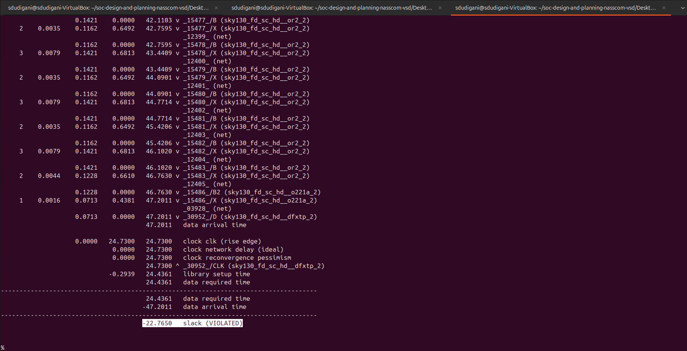


**Conclusion:**  
*We started ECO fixes at WNS = -23.8900 ns, and have now improved it to WNS = -22.7650 ns, achieving a reduction of approximately 1.1250 ns in WNS.*

## Step 11: Replace the old netlist with the new netlist generated after timing ECO fix and implement the floorplan, placement and cts

- Now to insert this updated netlist to PnR flow and we can use `write_verilog` and overwrite the synthesis netlist but before that we are going to make a copy of the old old netlist

**Commands to make copy of netlist:**
```bash
# Change from home directory to synthesis results directory
cd  /home/sdudigani/soc-design-and-planning-nasscom-vsd/Desktop/work/tools/openlane_working_dir/openlane/designs/picorv32a/runs/25-07_23-12/results/synthesis

# List contents of the directory
ls

# Copy and rename the netlist
cp picorv32a.synthesis.v picorv32a.synthesis_old.v

# List contents of the directory
ls
```
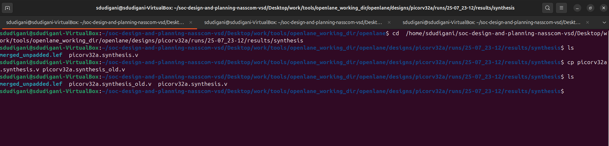

**Commands to `write verilog`:**
```bash
# Check syntax
help write_verilog

# Overwriting current synthesis netlist
write_verilog /home/sdudigani/soc-design-and-planning-nasscom-vsd/Desktop/work/tools/openlane_working_dir/openlane/designs/picorv32a/runs/25-07_23-12/results/synthesis/picorv32a.synthesis.v

# Exit from OpenSTA since timing analysis is done
exit
```
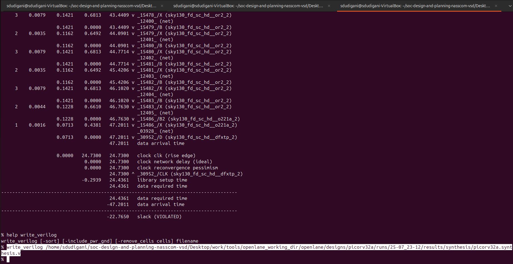

- Verified that the netlist is overwritten by checking that instance `_14506_` is replaced with `sky130_fd_sc_hd__or4_4`

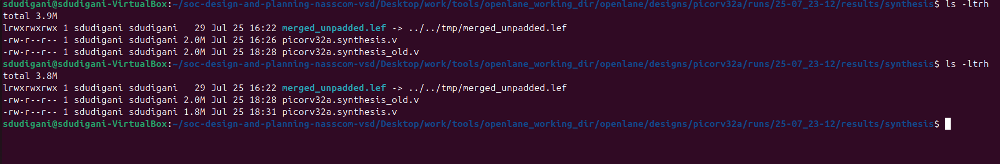
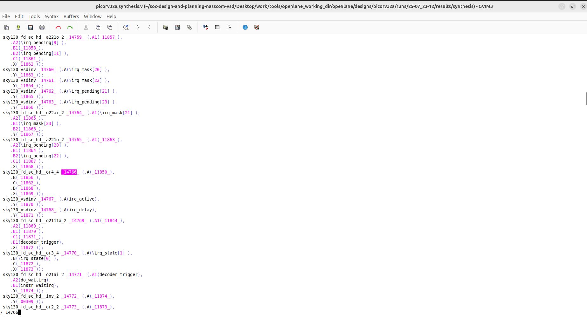

- Since we confirmed that netlist is replaced and will be loaded in PnR but since we want to follow up on the earlier 0 violation design we are continuing with the clean design to further stages.

*Note: The or_cts.tcl script requires the environment variables CTS_SQR_CAP (square capacitance in pF/µm²) and CTS_SQR_RES (square resistance in kΩ/µm²) for clock tree characterization, but they are not set in your config.tcl or environment.*

**Add the following two lines to your config.tcl before initiating the runs:**
```bash
set ::env(CTS_SQR_CAP) 0.024   ;# Square capacitance in pF/µm²
set ::env(CTS_SQR_RES) 0.075   ;# Square resistance in kΩ/µm²
```

```bash
# Now once again we have to prep design so as to update variables
prep -design picorv32a -tag 25-07_23-12 -overwrite

# Addiitional commands to include newly added lef to openlane flow merged.lef
set lefs [glob $::env(DESIGN_DIR)/src/*.lef]
add_lefs -src $lefs

# Command to set new value for SYNTH_STRATEGY
set ::env(SYNTH_STRATEGY) "DELAY 3"

# Command to set new value for SYNTH_SIZING
set ::env(SYNTH_SIZING) 1

# Now that the design is prepped and ready, we can run synthesis using following command
run_synthesis

# Follwing commands are alltogather sourced in "run_floorplan" command
init_floorplan
place_io
tap_decap_or

# Now we are ready to run placement
run_placement

# Incase getting error
unset ::env(LIB_CTS)

# With placement done we are now ready to run CTS
run_cts
```
**Synthesis**
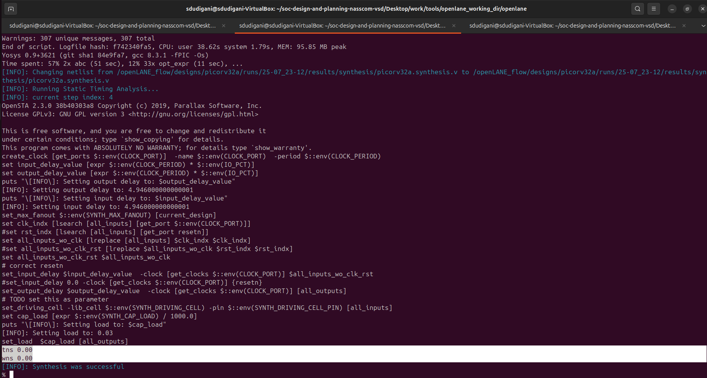

**Floorplan**
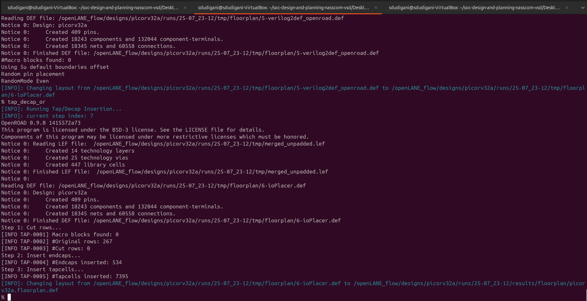

**Placement**
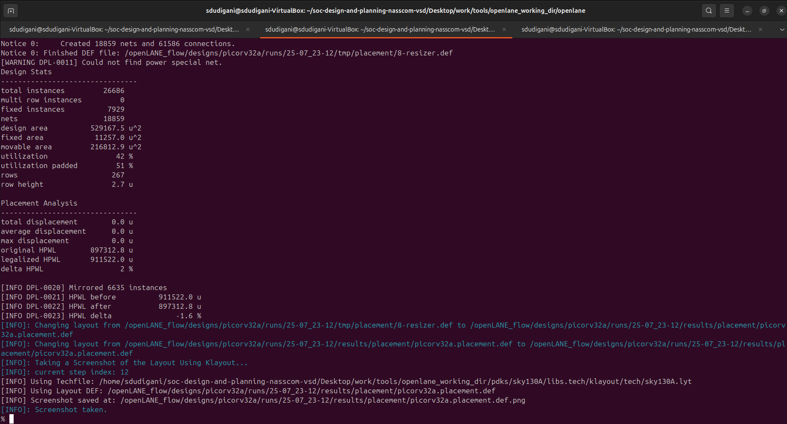

**CTS**


- After completing CTS in OpenLane, the following files are generated in the `results/synthesis/` directory:

```bash
sdudigani@sdudigani-VirtualBox:~/soc-design-and-planning-nasscom-vsd/Desktop/work/tools/openlane_working_dir/openlane/designs/picorv32a/runs/25-07_23-12/results/synthesis$ ls -ltrh
total 6.1M
lrwxrwxrwx 1 sdudigani sdudigani   29 Jul 25 18:44 merged_unpadded.lef -> ../../tmp/merged_unpadded.lef
-rw-r--r-- 1 sdudigani sdudigani 2.1M Jul 25 18:46 picorv32a.synthesis.v
-rw-r--r-- 1 sdudigani sdudigani 2.0M Jul 25 18:49 picorv32a.synthesis_optimized.v
-rw-r--r-- 1 sdudigani sdudigani 2.1M Jul 25 18:52 picorv32a.synthesis_cts.v
sdudigani@sdudigani-VirtualBox:~/soc-design-and-planning-nasscom-vsd/Desktop/work/tools/openlane_working_dir/openlane/designs/picorv32a/runs/25-07_23-12/results/synthesis$
```

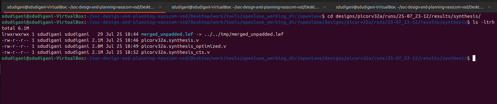


- **picorv32a.synthesis.v** : Gate-level netlist generated after initial synthesis of the RTL
- **picorv32a.synthesis_cts.v** : Generated after running Clock Tree Synthesis (CTS). This netlist includes inserted clock buffers and CTS-aware hierarchy.

## Timing analysis using real clocks
### Setup timing analysis using real clocks
- Setup timing analysis ensures that data launched from a source flop reaches the destination flop before the active clock edge, with enough time to meet the setup time requirement.

- In practical designs, the clock signal experiences delay and uncertainty due to the following:
  - **Clock Skew (Δ₂):** The difference in clock arrival times at the launch and capture flip-flops. Positive skew can help setup timing, but negative skew can tighten the timing window.
  - **Clock Jitter (S):** Variability in clock edge arrival due to noise, voltage, and temperature fluctuations. Jitter introduces uncertainty into the timing budget.
  - **Setup Time (SU):** The minimum time before the clock edge by which data must be stable at the capture flop.

**✅ Setup Timing Condition:**
The following condition must be met to avoid setup violations:

```bash
θ + Δ₁ < (T + Δ₂) - S - SU
```

Where:
- **θ** is the data path delay
- **Δ₁** is the delay in the launch path
- **T** is the clock period
- **Δ₂** is the delay in the capture clock path
- **S** is clock uncertainty (jitter)
- **SU** is setup time of the capture flop

**`Slack = Data Required Time − Data Arrival Time`**

*Slack should be ≥ 0 to meet timing.*


### Hold Timing Analysis using Real Clocks

- Hold timing analysis with real clocks considers practical effects like clock skew and clock jitter, both of which can critically impact data stability at the receiving flip-flop.

- **Clock Skew:** This is the variation in clock arrival time between the launch and capture flip-flops due to differing clock tree paths. For hold analysis, negative skew (capture clock arrives earlier) can lead to hold violations, as data might arrive too soon at the capture flop.

- **Clock Jitter:** Random variations in clock edges caused by noise, temperature fluctuations, and power supply instability. Jitter reduces the minimum delay margin, making it harder to ensure data holds stable long enough.

- In hold analysis, the objective is to make sure that the data launched by the clock does not reach the capture flop too early, violating the minimum hold time required for proper latching.

**✅ Goal: Ensure that `Data Arrival Time > Capture Clock Edge + Hold Time`, accounting for skew and jitter.**

## Step 12: Post-CTS OpenROAD timing analysis
**Commands to be run in OpenLANE flow to do OpenROAD timing analysis with integrated OpenSTA in OpenROAD:**
```bash
openroad

#reading the lef file
read_lef /openLANE_flow/designs/picorv32a/runs/25-07_23-12/tmp/merged.lef

#reading def file
read_def /openLANE_flow/designs/picorv32a/runs/25-07_23-12/results/cts/picorv32a.cts.def

# Creating an OpenROAD database to work with
write_db pico_cts.db

# Loading the created database in OpenROAD
read_db pico_cts.db

# Read netlist post CTS
read_verilog /openLANE_flow/designs/picorv32a/runs/25-07_23-12/results/synthesis/picorv32a.synthesis_cts.v

# Read library for design
read_liberty $::env(LIB_SYNTH_COMPLETE)

# Link design and library
link_design picorv32a

# Read in the custom sdc we created
read_sdc /openLANE_flow/designs/picorv32a/src/my_base.sdc

# Setting all cloks as propagated clocks
set_propagated_clock [all_clocks]

# Check syntax of 'report_checks' command
help report_checks

# Generating custom timing report
report_checks -path_delay min_max -fields {slew trans net cap input_pins} -format full_clock_expanded -digits 4

# Exit to OpenLANE flow
exit
```
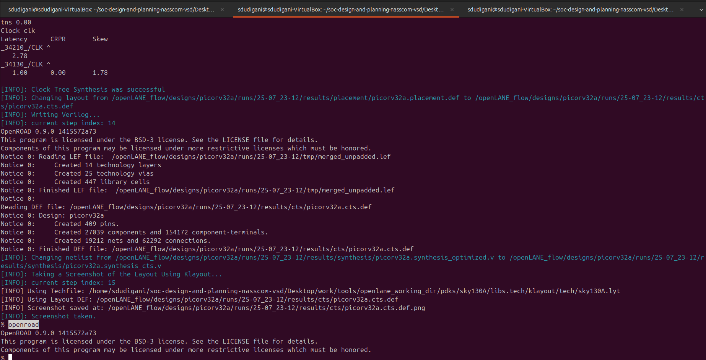
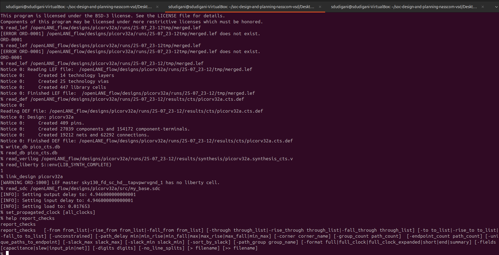

<details>
  <Summary><strong> Timing Report</strong></summary>
% report_checks -path_delay min_max -fields {slew trans net cap input_pins} -format full_clock_expanded -digits 4
Startpoint: _33189_ (rising edge-triggered flip-flop clocked by clk)
Endpoint: _33154_ (rising edge-triggered flip-flop clocked by clk)
Path Group: clk
Path Type: min

Fanout       Cap      Slew     Delay      Time   Description
-------------------------------------------------------------------------------------
                              0.0000    0.0000   clock clk (rise edge)
                              0.0000    0.0000   clock source latency
                    0.0225    0.0100    0.0100 ^ clk (in)
     1    0.0079                                 clk (net)
                    0.0225    0.0000    0.0100 ^ clkbuf_0_clk/A (sky130_fd_sc_hd__clkbuf_16)
                    0.0322    0.1061    0.1161 ^ clkbuf_0_clk/X (sky130_fd_sc_hd__clkbuf_16)
     2    0.0083                                 clknet_0_clk (net)
                    0.0322    0.0000    0.1161 ^ clkbuf_1_1_0_clk/A (sky130_fd_sc_hd__clkbuf_8)
                    0.0283    0.1027    0.2188 ^ clkbuf_1_1_0_clk/X (sky130_fd_sc_hd__clkbuf_8)
     1    0.0042                                 clknet_1_1_0_clk (net)
                    0.0283    0.0000    0.2188 ^ clkbuf_1_1_1_clk/A (sky130_fd_sc_hd__clkbuf_8)
                    0.0283    0.1012    0.3200 ^ clkbuf_1_1_1_clk/X (sky130_fd_sc_hd__clkbuf_8)
     1    0.0042                                 clknet_1_1_1_clk (net)
                    0.0283    0.0000    0.3200 ^ clkbuf_1_1_2_clk/A (sky130_fd_sc_hd__clkbuf_8)
                    0.0349    0.1083    0.4283 ^ clkbuf_1_1_2_clk/X (sky130_fd_sc_hd__clkbuf_8)
     2    0.0083                                 clknet_1_1_2_clk (net)
                    0.0349    0.0000    0.4283 ^ clkbuf_2_3_0_clk/A (sky130_fd_sc_hd__clkbuf_8)
                    0.0283    0.1036    0.5319 ^ clkbuf_2_3_0_clk/X (sky130_fd_sc_hd__clkbuf_8)
     1    0.0042                                 clknet_2_3_0_clk (net)
                    0.0283    0.0000    0.5319 ^ clkbuf_2_3_1_clk/A (sky130_fd_sc_hd__clkbuf_8)
                    0.0283    0.1012    0.6332 ^ clkbuf_2_3_1_clk/X (sky130_fd_sc_hd__clkbuf_8)
     1    0.0042                                 clknet_2_3_1_clk (net)
                    0.0283    0.0000    0.6332 ^ clkbuf_2_3_2_clk/A (sky130_fd_sc_hd__clkbuf_8)
                    0.0349    0.1083    0.7415 ^ clkbuf_2_3_2_clk/X (sky130_fd_sc_hd__clkbuf_8)
     2    0.0083                                 clknet_2_3_2_clk (net)
                    0.0349    0.0000    0.7415 ^ clkbuf_3_7_0_clk/A (sky130_fd_sc_hd__clkbuf_8)
                    0.0349    0.1107    0.8522 ^ clkbuf_3_7_0_clk/X (sky130_fd_sc_hd__clkbuf_8)
     2    0.0083                                 clknet_3_7_0_clk (net)
                    0.0349    0.0000    0.8522 ^ clkbuf_4_14_0_clk/A (sky130_fd_sc_hd__clkbuf_8)
                    0.0349    0.1107    0.9629 ^ clkbuf_4_14_0_clk/X (sky130_fd_sc_hd__clkbuf_8)
     2    0.0083                                 clknet_4_14_0_clk (net)
                    0.0349    0.0000    0.9629 ^ clkbuf_5_28_0_clk/A (sky130_fd_sc_hd__clkbuf_8)
                    0.1209    0.1816    1.1445 ^ clkbuf_5_28_0_clk/X (sky130_fd_sc_hd__clkbuf_8)
     8    0.0632                                 clknet_5_28_0_clk (net)
                    0.1209    0.0000    1.1445 ^ clkbuf_leaf_148_clk/A (sky130_fd_sc_hd__clkbuf_16)
                    0.0278    0.1371    1.2816 ^ clkbuf_leaf_148_clk/X (sky130_fd_sc_hd__clkbuf_16)
     2    0.0038                                 clknet_leaf_148_clk (net)
                    0.0278    0.0000    1.2816 ^ _33189_/CLK (sky130_fd_sc_hd__dfxtp_1)
                    0.0353    0.2871    1.5686 ^ _33189_/Q (sky130_fd_sc_hd__dfxtp_1)
     1    0.0020                                 alu_add_sub[5] (net)
                    0.0353    0.0000    1.5686 ^ _31698_/A1 (sky130_fd_sc_hd__mux2_1)
                    0.0339    0.1049    1.6735 ^ _31698_/X (sky130_fd_sc_hd__mux2_1)
     1    0.0017                                 alu_out[5] (net)
                    0.0339    0.0000    1.6735 ^ _33154_/D (sky130_fd_sc_hd__dfxtp_2)
                                        1.6735   data arrival time

                              0.0000    0.0000   clock clk (rise edge)
                              0.0000    0.0000   clock source latency
                    0.0225    0.0100    0.0100 ^ clk (in)
     1    0.0079                                 clk (net)
                    0.0225    0.0000    0.0100 ^ clkbuf_0_clk/A (sky130_fd_sc_hd__clkbuf_16)
                    0.0322    0.1061    0.1161 ^ clkbuf_0_clk/X (sky130_fd_sc_hd__clkbuf_16)
     2    0.0083                                 clknet_0_clk (net)
                    0.0322    0.0000    0.1161 ^ clkbuf_1_1_0_clk/A (sky130_fd_sc_hd__clkbuf_8)
                    0.0283    0.1027    0.2188 ^ clkbuf_1_1_0_clk/X (sky130_fd_sc_hd__clkbuf_8)
     1    0.0042                                 clknet_1_1_0_clk (net)
                    0.0283    0.0000    0.2188 ^ clkbuf_1_1_1_clk/A (sky130_fd_sc_hd__clkbuf_8)
                    0.0283    0.1012    0.3200 ^ clkbuf_1_1_1_clk/X (sky130_fd_sc_hd__clkbuf_8)
     1    0.0042                                 clknet_1_1_1_clk (net)
                    0.0283    0.0000    0.3200 ^ clkbuf_1_1_2_clk/A (sky130_fd_sc_hd__clkbuf_8)
                    0.0349    0.1083    0.4283 ^ clkbuf_1_1_2_clk/X (sky130_fd_sc_hd__clkbuf_8)
     2    0.0083                                 clknet_1_1_2_clk (net)
                    0.0349    0.0000    0.4283 ^ clkbuf_2_2_0_clk/A (sky130_fd_sc_hd__clkbuf_8)
                    0.0283    0.1036    0.5319 ^ clkbuf_2_2_0_clk/X (sky130_fd_sc_hd__clkbuf_8)
     1    0.0042                                 clknet_2_2_0_clk (net)
                    0.0283    0.0000    0.5319 ^ clkbuf_2_2_1_clk/A (sky130_fd_sc_hd__clkbuf_8)
                    0.0283    0.1012    0.6332 ^ clkbuf_2_2_1_clk/X (sky130_fd_sc_hd__clkbuf_8)
     1    0.0042                                 clknet_2_2_1_clk (net)
                    0.0283    0.0000    0.6332 ^ clkbuf_2_2_2_clk/A (sky130_fd_sc_hd__clkbuf_8)
                    0.0349    0.1083    0.7415 ^ clkbuf_2_2_2_clk/X (sky130_fd_sc_hd__clkbuf_8)
     2    0.0083                                 clknet_2_2_2_clk (net)
                    0.0349    0.0000    0.7415 ^ clkbuf_3_5_0_clk/A (sky130_fd_sc_hd__clkbuf_8)
                    0.0349    0.1107    0.8522 ^ clkbuf_3_5_0_clk/X (sky130_fd_sc_hd__clkbuf_8)
     2    0.0083                                 clknet_3_5_0_clk (net)
                    0.0349    0.0000    0.8522 ^ clkbuf_4_11_0_clk/A (sky130_fd_sc_hd__clkbuf_8)
                    0.0349    0.1107    0.9629 ^ clkbuf_4_11_0_clk/X (sky130_fd_sc_hd__clkbuf_8)
     2    0.0083                                 clknet_4_11_0_clk (net)
                    0.0349    0.0000    0.9629 ^ clkbuf_5_22_0_clk/A (sky130_fd_sc_hd__clkbuf_8)
                    0.1590    0.2097    1.1726 ^ clkbuf_5_22_0_clk/X (sky130_fd_sc_hd__clkbuf_8)
    11    0.0868                                 clknet_5_22_0_clk (net)
                    0.1590    0.0000    1.1726 ^ clkbuf_leaf_144_clk/A (sky130_fd_sc_hd__clkbuf_16)
                    0.0413    0.1620    1.3346 ^ clkbuf_leaf_144_clk/X (sky130_fd_sc_hd__clkbuf_16)
     9    0.0169                                 clknet_leaf_144_clk (net)
                    0.0413    0.0000    1.3346 ^ _33154_/CLK (sky130_fd_sc_hd__dfxtp_2)
                              0.0000    1.3346   clock reconvergence pessimism
                             -0.0294    1.3052   library hold time
                                        1.3052   data required time
-------------------------------------------------------------------------------------
                                        1.3052   data required time
                                       -1.6735   data arrival time
-------------------------------------------------------------------------------------
                                        0.3683   slack (MET)


Startpoint: resetn (input port clocked by clk)
Endpoint: mem_la_read (output port clocked by clk)
Path Group: clk
Path Type: max

Fanout       Cap      Slew     Delay      Time   Description
-------------------------------------------------------------------------------------
                              0.0000    0.0000   clock clk (rise edge)
                              0.0000    0.0000   clock network delay (propagated)
                              4.9460    4.9460 ^ input external delay
                    0.0172    0.0055    4.9515 ^ resetn (in)
     1    0.0042                                 resetn (net)
                    0.0172    0.0000    4.9515 ^ input101/A (sky130_fd_sc_hd__clkbuf_8)
                    0.0593    0.1273    5.0788 ^ input101/X (sky130_fd_sc_hd__clkbuf_8)
     7    0.0240                                 net101 (net)
                    0.0593    0.0000    5.0788 ^ _18399_/C (sky130_fd_sc_hd__nand3_4)
                    0.1261    0.1187    5.1975 v _18399_/Y (sky130_fd_sc_hd__nand3_4)
     4    0.0273                                 _14568_ (net)
                    0.1261    0.0000    5.1975 v _20942_/B1 (sky130_fd_sc_hd__a21oi_4)
                    0.0766    0.1207    5.3182 ^ _20942_/Y (sky130_fd_sc_hd__a21oi_4)
     1    0.0018                                 net199 (net)
                    0.0766    0.0000    5.3182 ^ output199/A (sky130_fd_sc_hd__buf_2)
                    0.0951    0.1550    5.4732 ^ output199/X (sky130_fd_sc_hd__buf_2)
     1    0.0177                                 mem_la_read (net)
                    0.0951    0.0000    5.4732 ^ mem_la_read (out)
                                        5.4732   data arrival time

                             24.7300   24.7300   clock clk (rise edge)
                              0.0000   24.7300   clock network delay (propagated)
                              0.0000   24.7300   clock reconvergence pessimism
                             -4.9460   19.7840   output external delay
                                       19.7840   data required time
-------------------------------------------------------------------------------------
                                       19.7840   data required time
                                       -5.4732   data arrival time
-------------------------------------------------------------------------------------
                                       14.3108   slack (MET)

</details>

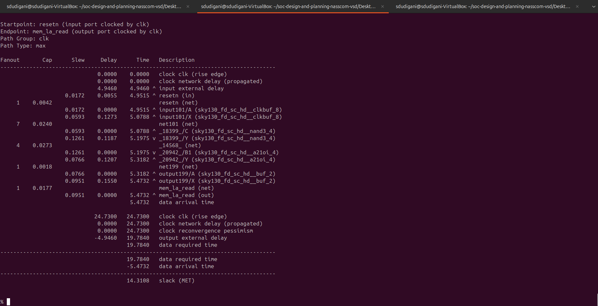

## Step 13: Explore post-CTS OpenROAD timing analysis by removing `sky130_fd_sc_hd__clkbuf_1` cell from clock buffer list variable 'CTS_CLK_BUFFER_LIST'
**Commands to be run in OpenLANE flow to do OpenROAD timing analysis after changing `CTS_CLK_BUFFER_LIST`:**

```bash
# Checking current value of 'CTS_CLK_BUFFER_LIST'
echo $::env(CTS_CLK_BUFFER_LIST)

# Removing 'sky130_fd_sc_hd__clkbuf_1' from the list
set ::env(CTS_CLK_BUFFER_LIST) [lreplace $::env(CTS_CLK_BUFFER_LIST) 0 0]

# Checking current value of 'CTS_CLK_BUFFER_LIST'
echo $::env(CTS_CLK_BUFFER_LIST)

# Checking current value of 'CURRENT_DEF'
echo $::env(CURRENT_DEF)

# Setting def as placement def
set ::env(CURRENT_DEF) /openLANE_flow/designs/picorv32a/runs/25-07_23-12/results/placement/picorv32a.placement.def

# Run CTS again
run_cts

# Checking current value of 'CTS_CLK_BUFFER_LIST'
echo $::env(CTS_CLK_BUFFER_LIST)

# Command to run OpenROAD tool
openroad

# Reading lef file
read_lef /openLANE_flow/designs/picorv32a/runs/25-07_23-12/tmp/merged.lef

# Reading def file
read_def /openLANE_flow/designs/picorv32a/runs/25-07_23-12/results/cts/picorv32a.cts.def

# Creating an OpenROAD database to work with
write_db pico_cts1.db

# Loading the created database in OpenROAD
read_db pico_cts.db

# Read netlist post CTS
read_verilog /openLANE_flow/designs/picorv32a/runs/25-07_23-12/results/synthesis/picorv32a.synthesis_cts.v

# Read library for design
read_liberty $::env(LIB_SYNTH_COMPLETE)

# Link design and library
link_design picorv32a

# Read in the custom sdc we created
read_sdc /openLANE_flow/designs/picorv32a/src/my_base.sdc

# Setting all cloks as propagated clocks
set_propagated_clock [all_clocks]

# Generating custom timing report
report_checks -path_delay min_max -fields {slew trans net cap input_pins} -format full_clock_expanded -digits 4

# Report hold skew
report_clock_skew -hold

# Report setup skew
report_clock_skew -setup

# Exit to OpenLANE flow
exit

# Checking current value of 'CTS_CLK_BUFFER_LIST'
echo $::env(CTS_CLK_BUFFER_LIST)

# Inserting 'sky130_fd_sc_hd__clkbuf_1' to first index of list
set ::env(CTS_CLK_BUFFER_LIST) [linsert $::env(CTS_CLK_BUFFER_LIST) 0 sky130_fd_sc_hd__clkbuf_1]

# Checking current value of 'CTS_CLK_BUFFER_LIST'
echo $::env(CTS_CLK_BUFFER_LIST)
```

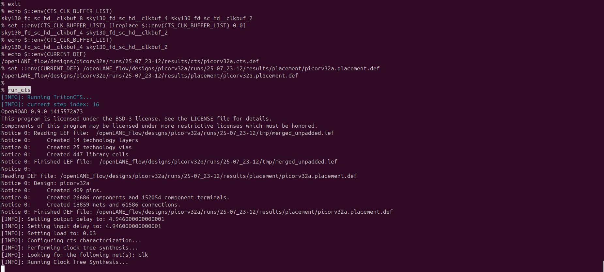
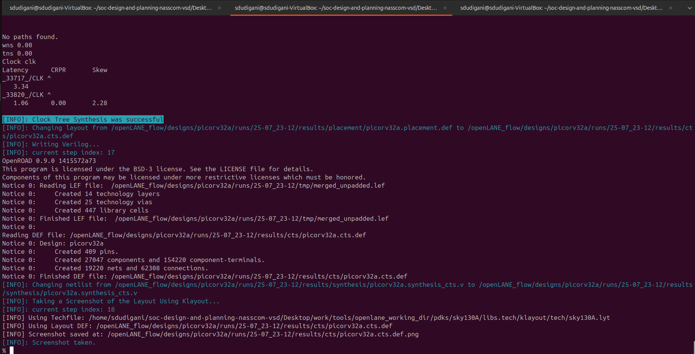
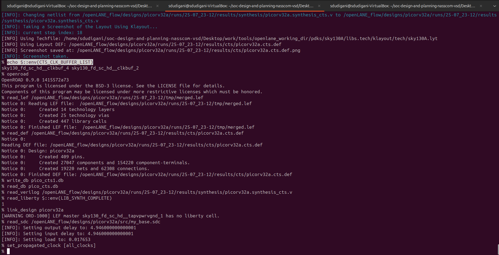

<details>
  <Summary><strong> Timing Report 2</strong></summary>

% report_checks -path_delay min_max -fields {slew trans net cap input_pins} -format full_clock_expanded -digits 4
Startpoint: _33189_ (rising edge-triggered flip-flop clocked by clk)
Endpoint: _33154_ (rising edge-triggered flip-flop clocked by clk)
Path Group: clk
Path Type: min

Fanout       Cap      Slew     Delay      Time   Description
-------------------------------------------------------------------------------------
                              0.0000    0.0000   clock clk (rise edge)
                              0.0000    0.0000   clock source latency
                    0.0225    0.0100    0.0100 ^ clk (in)
     1    0.0079                                 clk (net)
                    0.0225    0.0000    0.0100 ^ clkbuf_0_clk/A (sky130_fd_sc_hd__clkbuf_16)
                    0.0284    0.1017    0.1117 ^ clkbuf_0_clk/X (sky130_fd_sc_hd__clkbuf_16)
     2    0.0045                                 clknet_0_clk (net)
                    0.0284    0.0000    0.1117 ^ clkbuf_1_1_0_clk/A (sky130_fd_sc_hd__clkbuf_4)
                    0.0273    0.1043    0.2161 ^ clkbuf_1_1_0_clk/X (sky130_fd_sc_hd__clkbuf_4)
     1    0.0022                                 clknet_1_1_0_clk (net)
                    0.0273    0.0000    0.2161 ^ clkbuf_1_1_1_clk/A (sky130_fd_sc_hd__clkbuf_4)
                    0.0273    0.1039    0.3200 ^ clkbuf_1_1_1_clk/X (sky130_fd_sc_hd__clkbuf_4)
     1    0.0022                                 clknet_1_1_1_clk (net)
                    0.0273    0.0000    0.3200 ^ clkbuf_1_1_2_clk/A (sky130_fd_sc_hd__clkbuf_4)
                    0.0335    0.1112    0.4312 ^ clkbuf_1_1_2_clk/X (sky130_fd_sc_hd__clkbuf_4)
     2    0.0045                                 clknet_1_1_2_clk (net)
                    0.0335    0.0000    0.4312 ^ clkbuf_2_3_0_clk/A (sky130_fd_sc_hd__clkbuf_4)
                    0.0273    0.1062    0.5374 ^ clkbuf_2_3_0_clk/X (sky130_fd_sc_hd__clkbuf_4)
     1    0.0022                                 clknet_2_3_0_clk (net)
                    0.0273    0.0000    0.5374 ^ clkbuf_2_3_1_clk/A (sky130_fd_sc_hd__clkbuf_4)
                    0.0273    0.1039    0.6414 ^ clkbuf_2_3_1_clk/X (sky130_fd_sc_hd__clkbuf_4)
     1    0.0022                                 clknet_2_3_1_clk (net)
                    0.0273    0.0000    0.6414 ^ clkbuf_2_3_2_clk/A (sky130_fd_sc_hd__clkbuf_4)
                    0.0335    0.1112    0.7526 ^ clkbuf_2_3_2_clk/X (sky130_fd_sc_hd__clkbuf_4)
     2    0.0045                                 clknet_2_3_2_clk (net)
                    0.0335    0.0000    0.7526 ^ clkbuf_3_7_0_clk/A (sky130_fd_sc_hd__clkbuf_4)
                    0.0273    0.1062    0.8588 ^ clkbuf_3_7_0_clk/X (sky130_fd_sc_hd__clkbuf_4)
     1    0.0022                                 clknet_3_7_0_clk (net)
                    0.0273    0.0000    0.8588 ^ clkbuf_3_7_1_clk/A (sky130_fd_sc_hd__clkbuf_4)
                    0.0335    0.1112    0.9700 ^ clkbuf_3_7_1_clk/X (sky130_fd_sc_hd__clkbuf_4)
     2    0.0045                                 clknet_3_7_1_clk (net)
                    0.0335    0.0000    0.9700 ^ clkbuf_4_14_0_clk/A (sky130_fd_sc_hd__clkbuf_4)
                    0.0335    0.1135    1.0834 ^ clkbuf_4_14_0_clk/X (sky130_fd_sc_hd__clkbuf_4)
     2    0.0045                                 clknet_4_14_0_clk (net)
                    0.0335    0.0000    1.0834 ^ clkbuf_5_28_0_clk/A (sky130_fd_sc_hd__clkbuf_4)
                    0.1963    0.2401    1.3235 ^ clkbuf_5_28_0_clk/X (sky130_fd_sc_hd__clkbuf_4)
     8    0.0632                                 clknet_5_28_0_clk (net)
                    0.1963    0.0000    1.3235 ^ clkbuf_leaf_148_clk/A (sky130_fd_sc_hd__clkbuf_16)
                    0.0300    0.1594    1.4830 ^ clkbuf_leaf_148_clk/X (sky130_fd_sc_hd__clkbuf_16)
     2    0.0038                                 clknet_leaf_148_clk (net)
                    0.0300    0.0000    1.4830 ^ _33189_/CLK (sky130_fd_sc_hd__dfxtp_1)
                    0.0353    0.2879    1.7709 ^ _33189_/Q (sky130_fd_sc_hd__dfxtp_1)
     1    0.0020                                 alu_add_sub[5] (net)
                    0.0353    0.0000    1.7709 ^ _31698_/A1 (sky130_fd_sc_hd__mux2_1)
                    0.0339    0.1049    1.8758 ^ _31698_/X (sky130_fd_sc_hd__mux2_1)
     1    0.0017                                 alu_out[5] (net)
                    0.0339    0.0000    1.8758 ^ _33154_/D (sky130_fd_sc_hd__dfxtp_2)
                                        1.8758   data arrival time

                              0.0000    0.0000   clock clk (rise edge)
                              0.0000    0.0000   clock source latency
                    0.0225    0.0100    0.0100 ^ clk (in)
     1    0.0079                                 clk (net)
                    0.0225    0.0000    0.0100 ^ clkbuf_0_clk/A (sky130_fd_sc_hd__clkbuf_16)
                    0.0284    0.1017    0.1117 ^ clkbuf_0_clk/X (sky130_fd_sc_hd__clkbuf_16)
     2    0.0045                                 clknet_0_clk (net)
                    0.0284    0.0000    0.1117 ^ clkbuf_1_1_0_clk/A (sky130_fd_sc_hd__clkbuf_4)
                    0.0273    0.1043    0.2161 ^ clkbuf_1_1_0_clk/X (sky130_fd_sc_hd__clkbuf_4)
     1    0.0022                                 clknet_1_1_0_clk (net)
                    0.0273    0.0000    0.2161 ^ clkbuf_1_1_1_clk/A (sky130_fd_sc_hd__clkbuf_4)
                    0.0273    0.1039    0.3200 ^ clkbuf_1_1_1_clk/X (sky130_fd_sc_hd__clkbuf_4)
     1    0.0022                                 clknet_1_1_1_clk (net)
                    0.0273    0.0000    0.3200 ^ clkbuf_1_1_2_clk/A (sky130_fd_sc_hd__clkbuf_4)
                    0.0335    0.1112    0.4312 ^ clkbuf_1_1_2_clk/X (sky130_fd_sc_hd__clkbuf_4)
     2    0.0045                                 clknet_1_1_2_clk (net)
                    0.0335    0.0000    0.4312 ^ clkbuf_2_2_0_clk/A (sky130_fd_sc_hd__clkbuf_4)
                    0.0273    0.1062    0.5374 ^ clkbuf_2_2_0_clk/X (sky130_fd_sc_hd__clkbuf_4)
     1    0.0022                                 clknet_2_2_0_clk (net)
                    0.0273    0.0000    0.5374 ^ clkbuf_2_2_1_clk/A (sky130_fd_sc_hd__clkbuf_4)
                    0.0273    0.1039    0.6414 ^ clkbuf_2_2_1_clk/X (sky130_fd_sc_hd__clkbuf_4)
     1    0.0022                                 clknet_2_2_1_clk (net)
                    0.0273    0.0000    0.6414 ^ clkbuf_2_2_2_clk/A (sky130_fd_sc_hd__clkbuf_4)
                    0.0335    0.1112    0.7526 ^ clkbuf_2_2_2_clk/X (sky130_fd_sc_hd__clkbuf_4)
     2    0.0045                                 clknet_2_2_2_clk (net)
                    0.0335    0.0000    0.7526 ^ clkbuf_3_5_0_clk/A (sky130_fd_sc_hd__clkbuf_4)
                    0.0273    0.1062    0.8588 ^ clkbuf_3_5_0_clk/X (sky130_fd_sc_hd__clkbuf_4)
     1    0.0022                                 clknet_3_5_0_clk (net)
                    0.0273    0.0000    0.8588 ^ clkbuf_3_5_1_clk/A (sky130_fd_sc_hd__clkbuf_4)
                    0.0335    0.1112    0.9700 ^ clkbuf_3_5_1_clk/X (sky130_fd_sc_hd__clkbuf_4)
     2    0.0045                                 clknet_3_5_1_clk (net)
                    0.0335    0.0000    0.9700 ^ clkbuf_4_11_0_clk/A (sky130_fd_sc_hd__clkbuf_4)
                    0.0335    0.1135    1.0834 ^ clkbuf_4_11_0_clk/X (sky130_fd_sc_hd__clkbuf_4)
     2    0.0045                                 clknet_4_11_0_clk (net)
                    0.0335    0.0000    1.0834 ^ clkbuf_5_22_0_clk/A (sky130_fd_sc_hd__clkbuf_4)
                    0.2645    0.2877    1.3712 ^ clkbuf_5_22_0_clk/X (sky130_fd_sc_hd__clkbuf_4)
    11    0.0868                                 clknet_5_22_0_clk (net)
                    0.2645    0.0000    1.3712 ^ clkbuf_leaf_144_clk/A (sky130_fd_sc_hd__clkbuf_16)
                    0.0440    0.1936    1.5648 ^ clkbuf_leaf_144_clk/X (sky130_fd_sc_hd__clkbuf_16)
     9    0.0169                                 clknet_leaf_144_clk (net)
                    0.0440    0.0000    1.5648 ^ _33154_/CLK (sky130_fd_sc_hd__dfxtp_2)
                              0.0000    1.5648   clock reconvergence pessimism
                             -0.0290    1.5358   library hold time
                                        1.5358   data required time
-------------------------------------------------------------------------------------
                                        1.5358   data required time
                                       -1.8758   data arrival time
-------------------------------------------------------------------------------------
                                        0.3400   slack (MET)


Startpoint: resetn (input port clocked by clk)
Endpoint: mem_la_read (output port clocked by clk)
Path Group: clk
Path Type: max

Fanout       Cap      Slew     Delay      Time   Description
-------------------------------------------------------------------------------------
                              0.0000    0.0000   clock clk (rise edge)
                              0.0000    0.0000   clock network delay (propagated)
                              4.9460    4.9460 ^ input external delay
                    0.0172    0.0055    4.9515 ^ resetn (in)
     1    0.0042                                 resetn (net)
                    0.0172    0.0000    4.9515 ^ input101/A (sky130_fd_sc_hd__clkbuf_8)
                    0.0593    0.1273    5.0788 ^ input101/X (sky130_fd_sc_hd__clkbuf_8)
     7    0.0240                                 net101 (net)
                    0.0593    0.0000    5.0788 ^ _18399_/C (sky130_fd_sc_hd__nand3_4)
                    0.1261    0.1187    5.1975 v _18399_/Y (sky130_fd_sc_hd__nand3_4)
     4    0.0273                                 _14568_ (net)
                    0.1261    0.0000    5.1975 v _20942_/B1 (sky130_fd_sc_hd__a21oi_4)
                    0.0766    0.1207    5.3182 ^ _20942_/Y (sky130_fd_sc_hd__a21oi_4)
     1    0.0018                                 net199 (net)
                    0.0766    0.0000    5.3182 ^ output199/A (sky130_fd_sc_hd__buf_2)
                    0.0951    0.1550    5.4732 ^ output199/X (sky130_fd_sc_hd__buf_2)
     1    0.0177                                 mem_la_read (net)
                    0.0951    0.0000    5.4732 ^ mem_la_read (out)
                                        5.4732   data arrival time

                             24.7300   24.7300   clock clk (rise edge)
                              0.0000   24.7300   clock network delay (propagated)
                              0.0000   24.7300   clock reconvergence pessimism
                             -4.9460   19.7840   output external delay
                                       19.7840   data required time
-------------------------------------------------------------------------------------
                                       19.7840   data required time
                                       -5.4732   data arrival time
-------------------------------------------------------------------------------------
                                       14.3108   slack (MET)

</details>

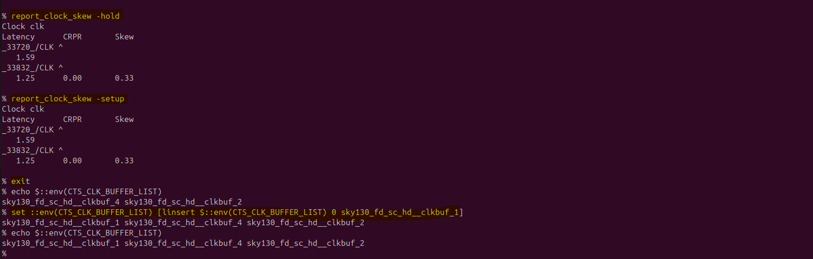


</details>
