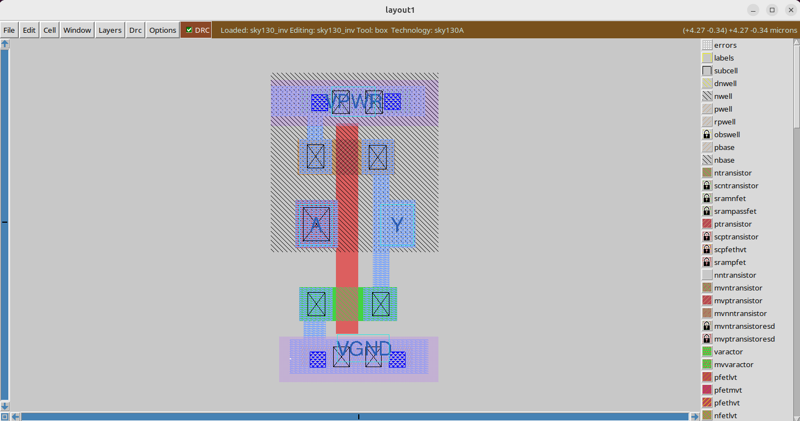

<details>
  <Summary><strong> Day 18 : Pre-layout Timing Analysis and Importance of Good Clock Tree</strong></summary>

# Contents
- [Step 1: Fix DRC errors and verify the design](#fix-drc-errors-and-verify-the-design)
- [Step 2: Save the final layout with custom name and open it](#save-final-layout)
- [Step 3: Generate lef from the Layout](#generate-lef-from-the-layout)
- [Step 4: Copy the newly generated lef and associated required lib files to 'picorv32a' design 'src' directory](#copy-new-lef-and-lib-files)
- [Step 5: Edit 'config.tcl'](#edit-config)
- [Step 6: Run openlane flow synthesis with newly inserted custom inverter cell](#run-openlane-flow-synthesis)
- [Step 7: Synthesis - Remove/reduce the newly introduced violations with the introduction of custom inverter cell by modifying design parameters](#synthesis)
- [Step 8: Run Floorplan and Placement](#run-fp-and-plc)

<a id="fix-drc-errors-and-verify-the-design"></a>
# Step 1: Fix up small DRC errors and verify the design is ready to be inserted into our flow

Before moving forward with custom designed cell layout verify following:
1. The input and output ports of the standard cell should lie on the intersection of the vertical and horizontal tracks.
2. Width of the standard cell should be odd multiples of the horizontal track pitch.
3. Height of the standard cell should be even multiples of the vertical track pitch.

**Open custom inverter layout**
```bash
cd Desktop/work/tools/openlane_working_dir/openlane/vsdstdcelldesign

# Open custom inverter layout in magic
magic -T sky130A.tech sky130_inv.mag &
```




**Convert Grid info to track info**

- press **g** in magic to activate grids.

**tracks.info of sky130_fd_sc_hd:**


- Commands to set grid as tracks of locali layer:

```bash
# Get syntax for grid command
help grid

# Set grid values accordingly
grid 0.46um 0.34um 0.23um 0.17um
```


**Verified ✅ --> The input and output ports of the standard cell should lie on the intersection of the vertical and horizontal tracks**


**Verified ✅ --> Width of the standard cell should be odd multiples of the horizontal track pitch**
Horizontal track pitch = 0.46 µm
Width of standard cell = 1.38 µm = 0.46 x 3


**Verified ✅ --> Height of the standard cell should be even multiples of the vertical track pitch**
Vertical track pitch = 0.34 µm
Height of standard cell = 2.72 µm = 0.34 × 8


<a id="save-final-layout"></a>
# Step 2: Save the final layout with custom name and open it

```bash
# Command to save as
save sky130_vsdinv.mag

# Command to open custom inverter layout in magic
magic -T sky130A.tech sky130_vsdinv.mag &
```

**newly saved layout**


<a id="save-final-layout"></a>
# Step 3: Generate lef from the Layout

```bash
# lef command
lef write

#open newly created lef file
gvim sky130_vsdinv.lef
```


**lef file**


<a id="copy-new-lef-and-lib-files"></a>
# Step 4: Copy the newly generated lef and associated required lib files to 'picorv32a' design 'src' directory

```bash
# Copy lef file
cp sky130_vsdinv.lef ~/soc-design-and-planning-nasscom-vsd/Desktop/work/tools/openlane_working_dir/openlane/designs/picorv32a/src/

# Copy lib files
cp libs/sky130_fd_sc_hd__* ~/soc-design-and-planning-nasscom-vsd/Desktop/work/tools/openlane_working_dir/openlane/designs/picorv32a/src/

# List and check whether they are copied
ls ~/soc-design-and-planning-nasscom-vsd/Desktop/work/tools/openlane_working_dir/openlane/designs/picorv32a/src/
```

<a id="edit-config"></a>
# Step 5: Edit 'config.tcl' 
- Edit `config.tcl` to change lib file and add the new extra lef into the openlane flow.

```bash
set ::env(LIB_SYNTH) "$::env(OPENLANE_ROOT)/designs/picorv32a/src/sky130_fd_sc_hd__typical.lib"
set ::env(LIB_FASTEST) "$::env(OPENLANE_ROOT)/designs/picorv32a/src/sky130_fd_sc_hd__fast.lib"
set ::env(LIB_SLOWEST) "$::env(OPENLANE_ROOT)/designs/picorv32a/src/sky130_fd_sc_hd__slow.lib"
set ::env(LIB_TYPICAL) "$::env(OPENLANE_ROOT)/designs/picorv32a/src/sky130_fd_sc_hd__typical.lib"
set ::env(EXTRA_LEFS) [glob $::env(OPENLANE_ROOT)/designs/$::env(DESIGN_NAME)/src/*.lef]
```

**Edited `config.tcl`**


<a id="run-openlane-flow-synthesis"></a>
# Step 6: Run openlane flow synthesis with newly inserted custom inverter cell

- invoke the OpenLANE flow include new lef and perform synthesis:

```bash
# Change directory to openlane flow directory
cd ~/soc-design-and-planning-nasscom-vsd/Desktop/work/tools/openlane_working_dir/openlane

export PDK_ROOT=/home/sdudigani/soc-design-and-planning-nasscom-vsd/Desktop/work/tools/openlane_working_dir/pdks

#optional
alias docker='docker run -it -v $(pwd):/openLANE_flow -v $PDK_ROOT:$PDK_ROOT -e PDK_ROOT=$PDK_ROOT -u $(id -u $USER):$(id -g $USER) efabless/openlane:v0.21'

# Since we have aliased the long command to 'docker' we can invoke the OpenLANE flow docker sub-system by just running this command
docker
```

- After entering openlane flow contained docker, run the following commands

```bash
# Now that we have entered the OpenLANE flow contained docker sub-system we can invoke the OpenLANE flow in the Interactive mode using the following command
./flow.tcl -interactive

# Now that OpenLANE flow is open we have to input the required packages for proper functionality of the OpenLANE flow
package require openlane 0.9

# Now the OpenLANE flow is ready to run any design and initially we have to prep the design creating some necessary files and directories for running a specific design which in our case is 'picorv32a'
prep -design picorv32a

# Adiitional commands to include newly added lef to openlane flow
set lefs [glob $::env(DESIGN_DIR)/src/*.lef]
add_lefs -src $lefs

# Now that the design is prepped and ready, we can run synthesis using following command
run_synthesis
```


**current design values generated**


<a id="synthesis"></a>
# Step 7: Remove/reduce the newly introduced violations with the introduction of custom inverter cell by modifying design parameters

**Commands to view and change parameters to improve timing and run synthesis:**

```bash
# Now once again we have to prep design so as to update variables
prep -design picorv32a -tag new -overwrite

# Addiitional commands to include newly added lef to openlane flow merged.lef
set lefs [glob $::env(DESIGN_DIR)/src/*.lef]

add_lefs -src $lefs

# Command to display current value of variable SYNTH_STRATEGY
echo $::env(SYNTH_STRATEGY)

# Command to set new value for SYNTH_STRATEGY
set ::env(SYNTH_STRATEGY) "DELAY 3"

# Command to display current value of variable SYNTH_BUFFERING to check whether it's enabled
echo $::env(SYNTH_BUFFERING)

# Command to display current value of variable SYNTH_SIZING
echo $::env(SYNTH_SIZING)

# Command to set new value for SYNTH_SIZING
set ::env(SYNTH_SIZING) 1

# Command to display current value of variable SYNTH_DRIVING_CELL to check whether it's the proper cell or not
echo $::env(SYNTH_DRIVING_CELL)

# Now that the design is prepped and ready, we can run synthesis using following command
run_synthesis
```


- Comparing new run values with previous run--> **area has increased and worst negative slack has become 0**

✅ Synthesis has accepted our custom inverter

<a id="run-fp-and-plc"></a>
# Step 8: Run Floorplan and Placement to verify the cell is accepted in PnR flow

## Run Floorplan

```bash
# Now we can run floorplan
run_floorplan
```


The above image shows - unexpected un-explainable error while using run_floorplan command. we can instead use the following set of commands available based on information from

```bash
/home/spatha/soc-design-and-planning-nasscom-vsd/Desktop/work/tools/openlane_working_dir/openlane/scripts/tcl_commands/floorplan.tcl
```

and based on Floorplan Commands section in

```bash
/home/spatha/soc-design-and-planning-nasscom-vsd/Desktop/work/tools/openlane_working_dir/openlane/docs/source/OpenLANE_commands.md
```

```bash
# Follwing commands are all-togather sourced in "run_floorplan" command
init_floorplan
place_io
tap_decap_or
```


## Run Placement

```bash
# Now we are ready to run placement
run_placement
```


**load placement def in magic in another terminal:**

```bash
# Change directory to path containing generated placement def
cd ~/soc-design-and-planning-nasscom-vsd/Desktop/work/tools/openlane_working_dir/openlane/designs/picorv32a/runs/new/results/placement/

# Command to load the placement def in magic tool
magic -T ~/soc-design-and-planning-nasscom-vsd/Desktop/work/tools/openlane_working_dir/pdks/sky130A/libs.tech/magic/sky130A.tech lef read ../../tmp/merged.lef def read picorv32a.placement.def &
```


