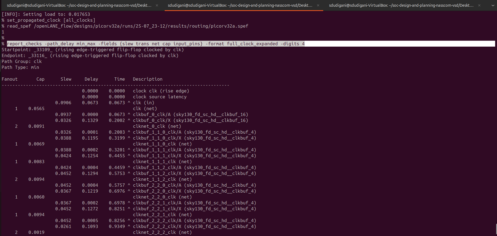

<details>
  <Summary><strong> Day 19: Final Steps for RTL2GDS using tritonRoute and openSTA</strong></summary>

# Contents
- [Routing & Design Rule Check (DRC)](#routing-and-drc)
  - [Routing](#routing) 
    - [Maze Routing and Lee’s Algorithm](#maze-routing)
  - [Design Rule Check](#drc)
- [Step 14: Perform detailed routing using TritonRoute and explore the routed layout](#detailed-routing-using-tritonroute)
- [Step 15: Post-Route parasitic extraction using SPEF extractor](#spef)
- [Step 16: Post-Route OpenSTA timing analysis with the extracted parasitics of the route](#post-route-opensta)

<a id="routing-and-drc"></a>
# Routing & Design Rule Check (DRC)
<a id="routing"></a>
## Routing

- Routing is the process of creating physical electrical connections between standard cells, macros, and I/O pins using metal layers and vias. It transforms the logical connections (netlist) into actual wires on silicon after placement and Clock Tree Synthesis (CTS). This is a crucial step that directly impacts the chip’s functionality, timing, signal integrity, and manufacturability.

**Goals of Routing:**
  - Establish all signal connections defined in the netlist.
  - Avoid DRC (Design Rule Check) violations.
  - Minimize routing congestion and via count.
  - Improve timing performance by optimizing critical paths.
  - Ensure LVS (Layout vs Schematic) and Signal Integrity compliance.
  - Maintain clear separation of signal and power/ground routing.


- The routing process is divided into following phases:
  - **Global Routing (Fast Routing)**
    - Uses high-speed algorithms to divide the chip area into tiles or rectangles (coarse grid cells).
    - Provides an initial routing framework to guide detailed routing (by assigning rough paths for nets avoiding congestion and blockages)
    - Steers clear of P/G routes and macro blockages
  - **Track Assignemt**
      - Maps each net to specific routing tracks.
      - Optimizes for fewer vias and longer straight segments.
      - Physical DRCs are not enforced yet.
  - **Detailed Routing**
      - Fine-tunes the routing paths, ensuring proper connectivity and compliance with DRC constraints (fixes DRC violations).
      - Uses precise tracking techniques to resolve congestion, timing violations, and layer assignment issues.

<a id="maze-routing"></a>
### Maze Routing and Lee’s Algorithm
- A routing algorithm determines the optimal path to connect two circuit elements, such as clocks, flip-flops, or logic gates.
- Several routing strategies exist, including the **Steiner Tree Algorithm** and the **Line Search Algorithm**. One of the fundamental routing techniques is Lee's **Maze Routing** Algorithm (Lee, 1961).


- Consider a scenario where two points, **source** and **target**, need to be connected. The goal is to determine the shortest and most efficient path, avoiding excessive bends or zig-zags, while favoring L-shaped connections.
- From an algorithmic perspective, the software needs to explore and determine this route, whereas from a physical design standpoint, this path represents the actual metal wire that facilitates signal transmission.
- **Lee’s Algorithm** is widely utilized in **grid-based routing**, making it well-suited for integrated circuit (IC) design. It systematically finds a path in a **maze-like grid** using a wave-expansion method.

#### Steps in Lee’s Algorithm:
- `Initialization:` The algorithm begins by setting up a **routing grid** or **matrix** over the routing area. Each grid cell is classified as one of the following:
  - Source (S) - starting point
  - Target (T) - destination to be reached
  - Obstacle - blocked areas like macros, hard IPs
  - Empty space - available for routing
  - Visited cell - explored during wave propagation


- `Wave Expansion:` The algorithm starts at the source cell (S) and expands outward in all directions. Neighboring cells (up, down, left, and right) are examined, and each newly visited cell is assigned a value one greater than the lowest neighboring cell (excluding obstacles). This expansion continues until it reaches the target (T) or no further movement is possible.


- `Backtracking & Path Reconstruction:` Once the target is reached, the algorithm traces back through the cell values to reconstruct the shortest route to the source. If multiple paths exist, the algorithm selects the one with the fewest bends for an optimized connection. The final path follows a non-diagonal approach, ensuring it does not overlap any obstacles such as macros or HIPs.


**best possible route to connect source and target**


**Limitations:**
- Requires large memory for dense layout.
- Slow

<a id="drc"></a>
### Design Rule Check 
- Routing is not simply about connecting two points—it must also adhere to specific design rules to ensure manufacturability and reliability.
- For example, certain rules specify:
  - **Minimum wire spacing** between two adjacent interconnects.
  - **Minimum wire width and pitch** for different metal layers.
  - **Via placement constraints** such as via width, via spacing, and metal layer hierarchy (higher metal layers should be wider than lower layers).

**Why is DRC Important?**
- Ensures the design can be fabricated correctly on silicon.
- Prevents critical errors such as signal shorts, which can cause functional failures.
- If a signal short is detected, the route can be adjusted by moving it to a different metal layer, though this can introduce additional DRC challenges.

<a id="detailed-routing-using-tritonroute"></a>
## Step 14: Perform detailed routing using TritonRoute and explore the routed layout
**Commands to perform routing:**
```bash
# Check value of 'CURRENT_DEF'
echo $::env(CURRENT_DEF)

# Check value of 'ROUTING_STRATEGY'
echo $::env(ROUTING_STRATEGY)

# Command for detailed route using TritonRoute
run_routing
```


**Commands to load routed def in magic in another terminal:**
```bash
# Change directory to path containing routed def
cd ~/soc-design-and-planning-nasscom-vsd/Desktop/work/tools/openlane_working_dir/openlane/designs/picorv32a/runs/25-07_23-12/results/routing

# Command to load the routed def in magic tool
magic -T /home/sdudigani/soc-design-and-planning-nasscom-vsd/Desktop/work/tools/openlane_working_dir/pdks/sky130A/libs.tech/magic/sky130A.tech lef read ../../tmp/merged.lef def read picorv32a.def &
```


**fast route guide present in `openlane/designs/picorv32a/runs/25-07_23-12/tmp/routing` directory:**


<a id="spef"></a>
## Step 15: Post-Route parasitic extraction using SPEF extractor
**Commands for SPEF extraction Post-Route parasitic extraction using SPEF extractor:**
```bash
cd ~/soc-design-and-planning-nasscom-vsd/Desktop/work/tools/openlane_working_dir/openlane/scripts/spef_extractor

python3 main.py -l /home/sdudigani/soc-design-and-planning-nasscom-vsd/Desktop/work/tools/openlane_working_dir/openlane/designs/picorv32a/runs/25-07_23-12/tmp/merged.lef -d /home/sdudigani/soc-design-and-planning-nasscom-vsd/Desktop/work/tools/openlane_working_dir/openlane/designs/picorv32a/runs/25-07_23-12/results/routing/picorv32a.def
```


**Contents of extracted spef:**


<a id="post-route-opensta"></a>
## Step 16: Post-Route OpenSTA timing analysis with the extracted parasitics of the route
**Commands to be run in OpenLANE flow to do OpenROAD timing analysis with integrated OpenSTA in OpenROAD:**
```bash
# Launch OpenROAD shell
openroad

# Load technology and cell LEF (used for physical layout)
read_lef /openLANE_flow/designs/picorv32a/runs/25-07_23-12/tmp/merged.lef

# Load routed DEF (final physical layout including routing)
read_def /openLANE_flow/designs/picorv32a/runs/25-07_23-12/results/routing/picorv32a.def

# Save OpenROAD database state (optional, for reuse/debug)
write_db pico_route.db

# Reload the previously saved OpenROAD database (optional)
read_db pico_route.db

# Load pre-route synthesized netlist
read_verilog /openLANE_flow/designs/picorv32a/runs/25-07_23-12/results/synthesis/picorv32a.synthesis_preroute.v

# Load full liberty timing models
read_liberty $::env(LIB_SYNTH_COMPLETE)

# Link design with top module name
link_design picorv32a

# Load custom timing constraints
read_sdc /openLANE_flow/designs/picorv32a/src/my_base.sdc

# Set all clocks as propagated (real clock tree delays will be used)
set_propagated_clock [all_clocks]

# Read in extracted parasitics for post-route timing accuracy
read_spef /openLANE_flow/designs/picorv32a/runs/25-07_23-12/results/routing/picorv32a.spef

# Generate detailed setup/hold timing report (with slew, capacitance, fanout etc.)
report_checks -path_delay min_max -fields {slew trans net cap input_pins} -format full_clock_expanded -digits 4

# Exit OpenROAD
exit
```




<details>
  <Summary><strong> post route timing report</strong></summary>

```bash
% report_checks -path_delay min_max -fields {slew trans net cap input_pins} -format full_clock_expanded -digits 4
Startpoint: _33109_ (rising edge-triggered flip-flop clocked by clk)
Endpoint: _33116_ (rising edge-triggered flip-flop clocked by clk)
Path Group: clk
Path Type: min

Fanout       Cap      Slew     Delay      Time   Description
-------------------------------------------------------------------------------------
                              0.0000    0.0000   clock clk (rise edge)
                              0.0000    0.0000   clock source latency
                    0.0906    0.0673    0.0673 ^ clk (in)
     1    0.0565                                 clk (net)
                    0.0937    0.0000    0.0673 ^ clkbuf_0_clk/A (sky130_fd_sc_hd__clkbuf_16)
                    0.0326    0.1329    0.2002 ^ clkbuf_0_clk/X (sky130_fd_sc_hd__clkbuf_16)
     2    0.0091                                 clknet_0_clk (net)
                    0.0326    0.0001    0.2003 ^ clkbuf_1_1_0_clk/A (sky130_fd_sc_hd__clkbuf_4)
                    0.0388    0.1195    0.3199 ^ clkbuf_1_1_0_clk/X (sky130_fd_sc_hd__clkbuf_4)
     1    0.0069                                 clknet_1_1_0_clk (net)
                    0.0388    0.0002    0.3201 ^ clkbuf_1_1_1_clk/A (sky130_fd_sc_hd__clkbuf_4)
                    0.0424    0.1254    0.4455 ^ clkbuf_1_1_1_clk/X (sky130_fd_sc_hd__clkbuf_4)
     1    0.0083                                 clknet_1_1_1_clk (net)
                    0.0424    0.0004    0.4459 ^ clkbuf_1_1_2_clk/A (sky130_fd_sc_hd__clkbuf_4)
                    0.0452    0.1294    0.5753 ^ clkbuf_1_1_2_clk/X (sky130_fd_sc_hd__clkbuf_4)
     2    0.0094                                 clknet_1_1_2_clk (net)
                    0.0452    0.0004    0.5757 ^ clkbuf_2_2_0_clk/A (sky130_fd_sc_hd__clkbuf_4)
                    0.0367    0.1219    0.6976 ^ clkbuf_2_2_0_clk/X (sky130_fd_sc_hd__clkbuf_4)
     1    0.0060                                 clknet_2_2_0_clk (net)
                    0.0367    0.0002    0.6978 ^ clkbuf_2_2_1_clk/A (sky130_fd_sc_hd__clkbuf_4)
                    0.0452    0.1272    0.8251 ^ clkbuf_2_2_1_clk/X (sky130_fd_sc_hd__clkbuf_4)
     1    0.0094                                 clknet_2_2_1_clk (net)
                    0.0452    0.0005    0.8256 ^ clkbuf_2_2_2_clk/A (sky130_fd_sc_hd__clkbuf_4)
                    0.0261    0.1093    0.9349 ^ clkbuf_2_2_2_clk/X (sky130_fd_sc_hd__clkbuf_4)
     2    0.0019                                 clknet_2_2_2_clk (net)
                    0.0261    0.0000    0.9349 ^ clkbuf_3_4_0_clk/A (sky130_fd_sc_hd__clkbuf_4)
                    0.0335    0.1117    1.0466 ^ clkbuf_3_4_0_clk/X (sky130_fd_sc_hd__clkbuf_4)
     1    0.0048                                 clknet_3_4_0_clk (net)
                    0.0335    0.0002    1.0468 ^ clkbuf_3_4_1_clk/A (sky130_fd_sc_hd__clkbuf_4)
                    0.0653    0.1450    1.1917 ^ clkbuf_3_4_1_clk/X (sky130_fd_sc_hd__clkbuf_4)
     2    0.0172                                 clknet_3_4_1_clk (net)
                    0.0653    0.0003    1.1921 ^ clkbuf_4_9_0_clk/A (sky130_fd_sc_hd__clkbuf_4)
                    0.0332    0.1256    1.3177 ^ clkbuf_4_9_0_clk/X (sky130_fd_sc_hd__clkbuf_4)
     2    0.0046                                 clknet_4_9_0_clk (net)
                    0.0332    0.0000    1.3177 ^ clkbuf_5_18_0_clk/A (sky130_fd_sc_hd__clkbuf_4)
                    0.0603    0.1399    1.4576 ^ clkbuf_5_18_0_clk/X (sky130_fd_sc_hd__clkbuf_4)
    10    0.0150                                 clknet_5_18_0_clk (net)
                    0.0603    0.0000    1.4576 ^ _33109_/CLK (sky130_fd_sc_hd__dfxtp_2)
                    0.0535    0.3308    1.7884 ^ _33109_/Q (sky130_fd_sc_hd__dfxtp_2)
     6    0.0082                                 irq_pending[1] (net)
                    0.0535    0.0000    1.7884 ^ _31961_/A1 (sky130_fd_sc_hd__mux2_1)
                    0.0349    0.1131    1.9015 ^ _31961_/X (sky130_fd_sc_hd__mux2_1)
     1    0.0019                                 _16326_ (net)
                    0.0349    0.0000    1.9015 ^ _33116_/D (sky130_fd_sc_hd__dfxtp_1)
                                        1.9015   data arrival time

                              0.0000    0.0000   clock clk (rise edge)
                              0.0000    0.0000   clock source latency
                    0.0906    0.0673    0.0673 ^ clk (in)
     1    0.0565                                 clk (net)
                    0.0937    0.0000    0.0673 ^ clkbuf_0_clk/A (sky130_fd_sc_hd__clkbuf_16)
                    0.0326    0.1329    0.2002 ^ clkbuf_0_clk/X (sky130_fd_sc_hd__clkbuf_16)
     2    0.0091                                 clknet_0_clk (net)
                    0.0326    0.0001    0.2003 ^ clkbuf_1_0_0_clk/A (sky130_fd_sc_hd__clkbuf_4)
                    0.0398    0.1205    0.3209 ^ clkbuf_1_0_0_clk/X (sky130_fd_sc_hd__clkbuf_4)
     1    0.0073                                 clknet_1_0_0_clk (net)
                    0.0398    0.0003    0.3212 ^ clkbuf_1_0_1_clk/A (sky130_fd_sc_hd__clkbuf_4)
                    0.0437    0.1269    0.4481 ^ clkbuf_1_0_1_clk/X (sky130_fd_sc_hd__clkbuf_4)
     1    0.0088                                 clknet_1_0_1_clk (net)
                    0.0437    0.0005    0.4486 ^ clkbuf_1_0_2_clk/A (sky130_fd_sc_hd__clkbuf_4)
                    0.0443    0.1288    0.5774 ^ clkbuf_1_0_2_clk/X (sky130_fd_sc_hd__clkbuf_4)
     2    0.0091                                 clknet_1_0_2_clk (net)
                    0.0443    0.0008    0.5782 ^ clkbuf_2_0_0_clk/A (sky130_fd_sc_hd__clkbuf_4)
                    0.0389    0.1238    0.7021 ^ clkbuf_2_0_0_clk/X (sky130_fd_sc_hd__clkbuf_4)
     1    0.0069                                 clknet_2_0_0_clk (net)
                    0.0389    0.0003    0.7024 ^ clkbuf_2_0_1_clk/A (sky130_fd_sc_hd__clkbuf_4)
                    0.0429    0.1259    0.8283 ^ clkbuf_2_0_1_clk/X (sky130_fd_sc_hd__clkbuf_4)
     1    0.0085                                 clknet_2_0_1_clk (net)
                    0.0429    0.0004    0.8287 ^ clkbuf_2_0_2_clk/A (sky130_fd_sc_hd__clkbuf_4)
                    0.0260    0.1084    0.9371 ^ clkbuf_2_0_2_clk/X (sky130_fd_sc_hd__clkbuf_4)
     2    0.0018                                 clknet_2_0_2_clk (net)
                    0.0260    0.0000    0.9371 ^ clkbuf_3_1_0_clk/A (sky130_fd_sc_hd__clkbuf_4)
                    0.0314    0.1093    1.0464 ^ clkbuf_3_1_0_clk/X (sky130_fd_sc_hd__clkbuf_4)
     1    0.0040                                 clknet_3_1_0_clk (net)
                    0.0314    0.0001    1.0465 ^ clkbuf_3_1_1_clk/A (sky130_fd_sc_hd__clkbuf_4)
                    0.0383    0.1185    1.1650 ^ clkbuf_3_1_1_clk/X (sky130_fd_sc_hd__clkbuf_4)
     2    0.0066                                 clknet_3_1_1_clk (net)
                    0.0383    0.0002    1.1652 ^ clkbuf_4_3_0_clk/A (sky130_fd_sc_hd__clkbuf_4)
                    0.0454    0.1282    1.2934 ^ clkbuf_4_3_0_clk/X (sky130_fd_sc_hd__clkbuf_4)
     2    0.0095                                 clknet_4_3_0_clk (net)
                    0.0454    0.0001    1.2935 ^ clkbuf_5_7_0_clk/A (sky130_fd_sc_hd__clkbuf_4)
                    0.1374    0.2031    1.4966 ^ clkbuf_5_7_0_clk/X (sky130_fd_sc_hd__clkbuf_4)
    10    0.0432                                 clknet_5_7_0_clk (net)
                    0.1374    0.0010    1.4976 ^ clkbuf_leaf_234_clk/A (sky130_fd_sc_hd__clkbuf_16)
                    0.0425    0.1586    1.6562 ^ clkbuf_leaf_234_clk/X (sky130_fd_sc_hd__clkbuf_16)
     7    0.0203                                 clknet_leaf_234_clk (net)
                    0.0425    0.0002    1.6564 ^ _33116_/CLK (sky130_fd_sc_hd__dfxtp_1)
                              0.0000    1.6564   clock reconvergence pessimism
                             -0.0295    1.6270   library hold time
                                        1.6270   data required time
-------------------------------------------------------------------------------------
                                        1.6270   data required time
                                       -1.9015   data arrival time
-------------------------------------------------------------------------------------
                                        0.2745   slack (MET)


Startpoint: resetn (input port clocked by clk)
Endpoint: mem_la_read (output port clocked by clk)
Path Group: clk
Path Type: max

Fanout       Cap      Slew     Delay      Time   Description
-------------------------------------------------------------------------------------
                              0.0000    0.0000   clock clk (rise edge)
                              0.0000    0.0000   clock network delay (propagated)
                              4.9460    4.9460 ^ input external delay
                    0.0172    0.0055    4.9515 ^ resetn (in)
     1    0.0042                                 resetn (net)
                    0.0172    0.0000    4.9515 ^ input101/A (sky130_fd_sc_hd__clkbuf_8)
                    0.0842    0.1440    5.0955 ^ input101/X (sky130_fd_sc_hd__clkbuf_8)
     8    0.0410                                 net101 (net)
                    0.0842    0.0000    5.0955 ^ _18399_/C (sky130_fd_sc_hd__nand3_4)
                    0.1387    0.1355    5.2310 v _18399_/Y (sky130_fd_sc_hd__nand3_4)
     4    0.0327                                 _14568_ (net)
                    0.1387    0.0006    5.2316 v _20942_/B1 (sky130_fd_sc_hd__a21oi_4)
                    0.4255    0.3872    5.6188 ^ _20942_/Y (sky130_fd_sc_hd__a21oi_4)
     2    0.0587                                 net199 (net)
                    0.4255    0.0000    5.6188 ^ output199/A (sky130_fd_sc_hd__buf_2)
                    0.1018    0.2413    5.8601 ^ output199/X (sky130_fd_sc_hd__buf_2)
     1    0.0177                                 mem_la_read (net)
                    0.1018    0.0003    5.8604 ^ mem_la_read (out)
                                        5.8604   data arrival time

                             24.7300   24.7300   clock clk (rise edge)
                              0.0000   24.7300   clock network delay (propagated)
                              0.0000   24.7300   clock reconvergence pessimism
                             -4.9460   19.7840   output external delay
                                       19.7840   data required time
-------------------------------------------------------------------------------------
                                       19.7840   data required time
                                       -5.8604   data arrival time
-------------------------------------------------------------------------------------
                                       13.9236   slack (MET)
```

</details>


</details>
