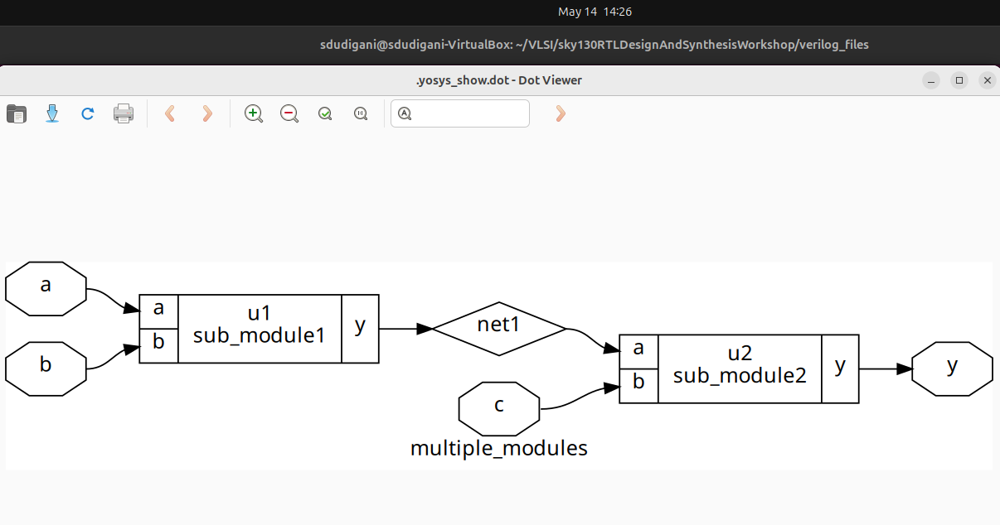
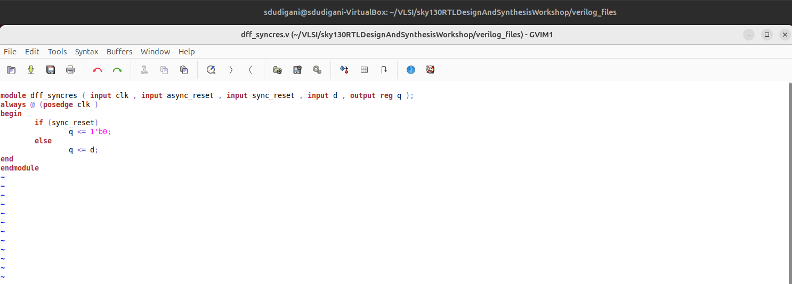
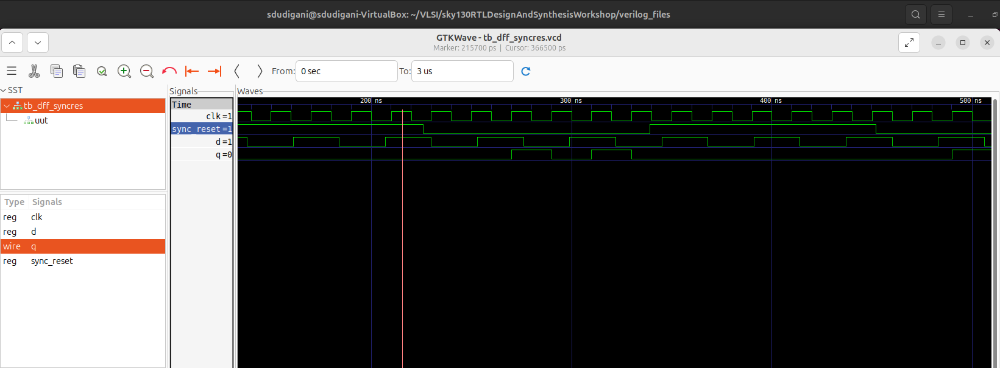

<details>
  <Summary><strong> Day 2: Timing libs, hierarchical vs flat synthesis and efficient flop coding styles</strong></summary>

## Contents
1. [Introduction to timing .libs](#1-introduction-to-timing-libs)
2. [Hierarchical vs Flat Synthesis](#2-hierarchical-vs-flat-synthesis)
3. [Various Flop Coding Styles and optimization](#3-various-flop-coding-styles-and-optimization)

## Lab 4
## 1. Introduction to timing .libs

### Liberty File
- A .lib file, also known as a Liberty Timing File, is a critical component in ASIC design flows.
- It serves as an ASCII-format timing model that describes the timing, power, and functional characteristics of standard cells or macros used in a particular technology node. This file adheres to the Liberty syntax and is generated by either the standard cell library vendor or the foundry (if they provide the cell library).
- The .lib file provides detailed electrical behavior of each cell and contains some information which is common for all the standard cells and also cell-specific information.
- The ```common part``` of .lib file contains :
    - Library Name
    - Technology Name
    - Units (of time, power, voltage, current, resistance and capacitance)
    - Value of operating condition (process, voltage and temperature)


- The ```Cell-specific information``` of .lib file includes:
    - cell name
    - PG pin name
    - Area of the cell
    - Leakage power w.r.t the input pins of logic state
    - Pin details
    - Pin name, pin direction, internal power, capacitance (rise and fall), Fanout load
<strong> Example: Standard Cell ```a2111o_1``` </strong>


#### Cell Comaprison between 3 different variants of 2-input AND from ```sky130_fd_sc_hd``` .lib


## Lab 5
## 2. Hierarchical vs Flat Synthesis
### Design: multiple_modules.v


#### Generate hierarchical netlist-
```bash
read_liberty -lib ../lib/sky130_fd_sc_hd__tt_025C_1v80.lib
read_verilog multiple_modules.v
synth -top multiple_modules
abc -liberty ../lib/sky130_fd_sc_hd__tt_025C_1v80.lib 
write_verilog -noattr multiple_modules_hier.v
```


#### Generate flat netlist-
```bash
flatten
write_verilog -noattr multiple_modules_flat.v
```


#### Hierarchical vs Flat Netlist


## 3. Various Flop Coding Styles and optimization
### Why Flops and Flop Coding Styles?
In digital design, combinational circuits are prone to producing glitches — brief, unintended transitions in output values. These occur when multiple input signals arrive at slightly different times due to unequal propagation delays, causing the logic to temporarily settle to incorrect states.


⚠️ The Problem:
- These glitches are usually harmless in isolation.
- However, if another part of the circuit captures these unstable outputs (e.g., in a downstream register), it can lead to functional failures or incorrect data being latched.

✅ The Solution: Insert Flip-Flops
- Flip-flops are edge-triggered sequential elements.
- They only capture input data on a specific clock edge (rising or falling).
- This means any transient glitches occurring before the clock edge are ignored.
- As a result, only stable, clean data is passed between pipeline stages or functional blocks.

### D Flip-Flop with Asynchronous Reset


### D Flip-Flop with Asynchronous set


### D Flip-Flop with Synchronous Reset




### D Flip-Flop with Both Asynchronous and Synchronous Reset


### Synthesis of D Flip-Flop with Asynchronous set
```bash
yosys
read_liberty -lib ../lib/sky130_fd_sc_hd__tt_025C_1v80.lib
read_verilog dff_async_set.v
synth -top dff_async_set
dfflibmap -liberty ../lib/sky130_fd_sc_hd__tt_025C_1v80.lib
abc -liberty ../lib/sky130_fd_sc_hd__tt_025C_1v80.lib
show
```


### Synthesis of D Flip-Flop with Asynchronous Reset
```bash
yosys
read_liberty -lib ../lib/sky130_fd_sc_hd__tt_025C_1v80.lib
read_verilog dff_asyncres.v 
synth -top dff_asyncres
dfflibmap -liberty ../lib/sky130_fd_sc_hd__tt_025C_1v80.lib
abc -liberty ../lib/sky130_fd_sc_hd__tt_025C_1v80.lib
show
```


### Synthesis of D Flip-Flop with Synchronous Reset
```bash
yosys
read_liberty -lib ../lib/sky130_fd_sc_hd__tt_025C_1v80.lib
read_verilog dff_syncres.v 
synth -top dff_syncres
dfflibmap -liberty ../lib/sky130_fd_sc_hd__tt_025C_1v80.lib
abc -liberty ../lib/sky130_fd_sc_hd__tt_025C_1v80.lib
show
```


### Synthesis of D Flip-Flop with Both Asynchronous and Synchronous Reset
```bash
yosys
read_liberty -lib ../lib/sky130_fd_sc_hd__tt_025C_1v80.lib
read_verilog dff_asyncres_syncres.v
synth -top dff_asyncres_syncres
dfflibmap -liberty ../lib/sky130_fd_sc_hd__tt_025C_1v80.lib
abc -liberty ../lib/sky130_fd_sc_hd__tt_025C_1v80.lib
show
```


### Lab - Flop Synthesis Simulations
### Interesting Optimizations

</details>  

