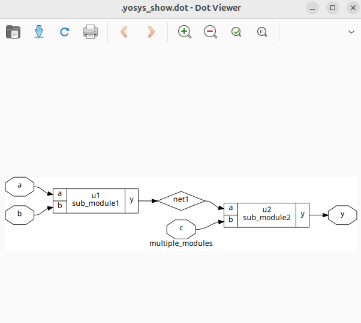
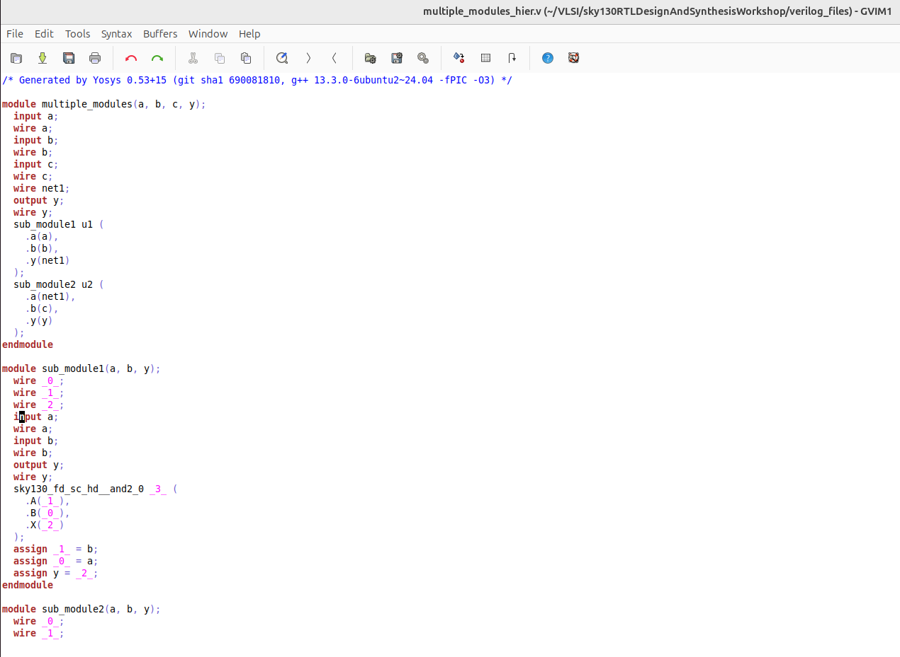
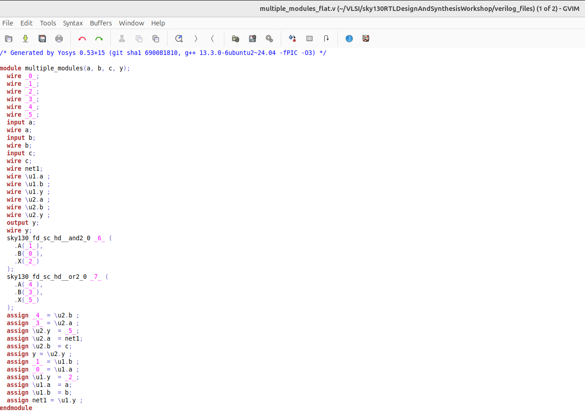

<details>
  <Summary><strong> Day 2: Timing libs, hierarchical vs flat synthesis and efficient flop coding styles</strong></summary>

## Contents
1. [Introduction to timing .libs](#1-introduction-to-timing-libs)
2. [Hierarchical vs Flat Synthesis](#2-hierarchical-vs-flat-synthesis)
3. [Various Flop Coding Styles and optimization](#3-various-flop-coding-styles-and-optimization)

## Lab 4
## 1. Introduction to timing .libs

### Liberty File
- A .lib file, also known as a Liberty Timing File, is a critical component in ASIC design flows.
- It serves as an ASCII-format timing model that describes the timing, power, and functional characteristics of standard cells or macros used in a particular technology node. This file adheres to the Liberty syntax and is generated by either the standard cell library vendor or the foundry (if they provide the cell library).
- The .lib file provides detailed electrical behavior of each cell and contains some information which is common for all the standard cells and also cell-specific information.
- The ```common part``` of .lib file contains :
    - Library Name
    - Technology Name
    - Units (of time, power, voltage, current, resistance and capacitance)
    - Value of operating condition (process, voltage and temperature)


- The ```Cell-specific information``` of .lib file includes:
    - cell name
    - PG pin name
    - Area of the cell
    - Leakage power w.r.t the input pins of logic state
    - Pin details
    - Pin name, pin direction, internal power, capacitance (rise and fall), Fanout load


#### Cell Comaprison between 3 different variants of 2-input AND from ```sky130_fd_sc_hd``` .lib


## Lab 5
## 2. Hierarchical vs Flat Synthesis
### Design: multiple_modules.v



#### Generate hierarchical netlist-
```bash
read_liberty -lib ../lib/sky130_fd_sc_hd__tt_025C_1v80.lib
read_verilog multiple_modules.v
synth -top multiple_modules
abc -liberty ../lib/sky130_fd_sc_hd__tt_025C_1v80.lib 
write_verilog -noattr multiple_modules_hier.v
```


#### Generate flat netlist-
```bash
flatten
write_verilog -noattr multiple_modules_flat.v
```



## 3. Various Flop Coding Styles and optimization
### Why Flops and Flop Coding Styles?
### Lab - Flop Synthesis Simulations
### Interesting Optimizations

</details>  

