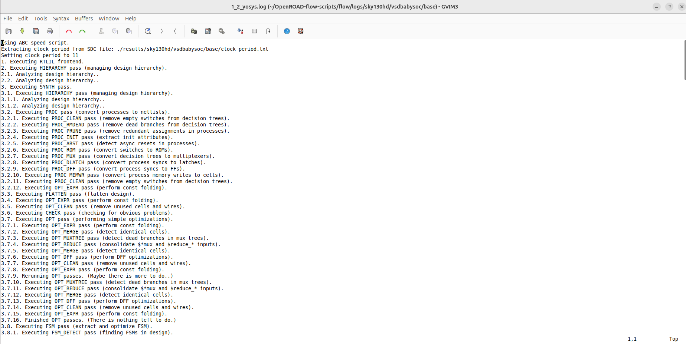

<details>
  <Summary><strong> Day 20 : Physical Design Flow for VSDBabySoC using OpenROAD</strong></summary>

# Contents
- [`Synthesis`](#syn)
- [`Floorplan`](#fp)
- [`Placement`](#plc)
- [`Clock Tree Synthesis`](#cts)

<a id="syn"></a>
# `Synthesis`

<details>
  <Summary><strong>   config.mk contents</strong></summary>

```bash
export DESIGN_HOME = /home/sdudigani/OpenROAD-flow-scripts/flow/designs
export DESIGN_NICKNAME = vsdbabysoc
export DESIGN_NAME = vsdbabysoc
export PLATFORM    = sky130hd

# export VERILOG_FILES_BLACKBOX = $(DESIGN_HOME)/src/$(DESIGN_NICKNAME)/IPs/*.v
# export VERILOG_FILES = $(sort $(wildcard $(DESIGN_HOME)/src/$(DESIGN_NICKNAME)/*.v))
# Explicitly list the Verilog files for synthesis
export VERILOG_FILES = $(DESIGN_HOME)/src/$(DESIGN_NICKNAME)/vsdbabysoc.v \
                       $(DESIGN_HOME)/src/$(DESIGN_NICKNAME)/rvmyth.v \
                       $(DESIGN_HOME)/src/$(DESIGN_NICKNAME)/clk_gate.v

export SDC_FILE      = $(DESIGN_HOME)/$(PLATFORM)/$(DESIGN_NICKNAME)/vsdbabysoc_synthesis.sdc

export vsdbabysoc_DIR = $(DESIGN_HOME)/$(PLATFORM)/$(DESIGN_NICKNAME)

export VERILOG_INCLUDE_DIRS = $(wildcard $(vsdbabysoc_DIR)/include/)

export ADDITIONAL_GDS = $(wildcard $(vsdbabysoc_DIR)/gds/*.gds)
export ADDITIONAL_LEFS = $(wildcard $(vsdbabysoc_DIR)/lef/*.lef)
#export ADDITIONAL_LIBS = $(wildcard $(vsdbabysoc_DIR)/lib/*.lib)
# export PDN_TCL = $(DESIGN_HOME)/$(PLATFORM)/$(DESIGN_NICKNAME)/pdn.tcl


# Clock Configuration
#export CLOCK_PERIOD = 11.00
export CLOCK_PORT = CLK
export CLOCK_NET  = $(CLOCK_PORT)


# Pin Order and Macro Placement Configurations
export FP_PIN_ORDER_CFG = $(vsdbabysoc_DIR)/pin_order.cfg
export MACRO_PLACEMENT_CFG = $(vsdbabysoc_DIR)/macro.cfg

# Floorplanning Configuration
export DIE_AREA   = 0 0 1600 1600
export CORE_AREA  = 20 20 1590 1590

# Placement Configuration
export PLACE_PINS_ARGS = -exclude left:0-600 -exclude left:1000-1600 -exclude right:* -exclude top:* -exclude bottom:*

# Tuning for Timing and Buffers
export TNS_END_PERCENT     = 100
export REMOVE_ABC_BUFFERS  = 1

# CTS tuning
export CTS_BUF_DISTANCE = 600
export SKIP_GATE_CLONING = 1

# Magic Tool Configuration
export MAGIC_ZEROIZE_ORIGIN = 0
export MAGIC_EXT_USE_GDS    = 1

# export CORE_UTILIZATION=0.1  # Reduce this value to allow more whitespace for routing.
```
  
</details>


```bash
cd OpenROAD-flow-scripts/flow
source env.sh
cd flow

# remove any previously generated results, logs, and intermediate files
make DESIGN_CONFIG=./designs/sky130hd/vsdbabysoc/config.mk clean_all

# Run Synthesis
make DESIGN_CONFIG=./designs/sky130hd/vsdbabysoc/config.mk synth
```


```bash
# view synthesiszed netlist
gvim results/sky130hd/vsdbabysoc/base/1_2_yosys.v

# view synthesis log
gvim logs/sky130hd/vsdbabysoc/base/1_2_yosys.log

# view statistics
gvim reports/sky130hd/vsdbabysoc/base/synth_stat.txt
```

**Synthesiszed netlist:**


**Synthesis log**


**Synthesis Stat**


<a id="fp"></a>
# `Floorplan`

```bash
make DESIGN_CONFIG=./designs/sky130hd/vsdbabysoc/config.mk floorplan
```


```bash
# run floorplan and view result with gui
make DESIGN_CONFIG=./designs/sky130hd/vsdbabysoc/config.mk gui_floorplan
```


<a id="plc"></a>
# `Placement`

```bash
make DESIGN_CONFIG=./designs/sky130hd/vsdbabysoc/config.mk place
```

```bash
# run placement and view result with gui
make DESIGN_CONFIG=./designs/sky130hd/vsdbabysoc/config.mk gui_place
```

<a id="cts"></a>
# `Clock Tree Synthesis`

```bash
make DESIGN_CONFIG=./designs/sky130hd/vsdbabysoc/config.mk cts
```

```bash
# run cts and view result with gui
make DESIGN_CONFIG=./designs/sky130hd/vsdbabysoc/config.mk gui_cts
```
