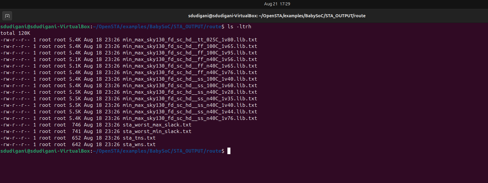

<details>
  <Summary><strong> Day 21 : Post-layout STA</strong></summary>

##  Contents
- [Required Files](#files)
- [Post-Synthesis vs Post-Route Timing Analysis](#post-synthesis-vs-post-route-timing-analysis)
- [Post-Route STA](#sta)
- [Results](#results)
- [Graphs](#graphs)
- [Observations](#obs)
  
<a id="files"></a>
### `Required Files`
1. **`sta_across_pvt_route.tcl`** : This script automates STA across multiple PVT corners.
2. **`vsdbabysoc_post_cts.sdc`** : Provides the design-specific timing constraints generated after CTS stage.


#### `sta_across_pvt_route.tcl`

```bash
 set list_of_lib_files(1) "sky130_fd_sc_hd__tt_025C_1v80.lib"
 set list_of_lib_files(2) "sky130_fd_sc_hd__ff_100C_1v65.lib"
 set list_of_lib_files(3) "sky130_fd_sc_hd__ff_100C_1v95.lib"
 set list_of_lib_files(4) "sky130_fd_sc_hd__ff_n40C_1v56.lib"
 set list_of_lib_files(5) "sky130_fd_sc_hd__ff_n40C_1v65.lib"
 set list_of_lib_files(6) "sky130_fd_sc_hd__ff_n40C_1v76.lib"
 set list_of_lib_files(7) "sky130_fd_sc_hd__ss_100C_1v40.lib"
 set list_of_lib_files(8) "sky130_fd_sc_hd__ss_100C_1v60.lib"
 set list_of_lib_files(9) "sky130_fd_sc_hd__ss_n40C_1v28.lib"
 set list_of_lib_files(10) "sky130_fd_sc_hd__ss_n40C_1v35.lib"
 set list_of_lib_files(11) "sky130_fd_sc_hd__ss_n40C_1v40.lib"
 set list_of_lib_files(12) "sky130_fd_sc_hd__ss_n40C_1v44.lib"
 set list_of_lib_files(13) "sky130_fd_sc_hd__ss_n40C_1v76.lib"

 read_liberty /data/OpenSTA/examples/timing_libs/avsdpll.lib
 read_liberty /data/OpenSTA/examples/timing_libs/avsddac.lib

 for {set i 1} {$i <= [array size list_of_lib_files]} {incr i} {
 read_liberty /data/OpenSTA/examples/timing_libs/$list_of_lib_files($i)
 read_verilog /data/OpenROAD-flow-scripts/flow/results/sky130hd/vsdbabysoc/base/5_route.v
 link_design vsdbabysoc
 current_design
 read_sdc /data/OpenSTA/examples/BabySoC/vsdbabysoc_post_cts.sdc
 check_setup -verbose
 report_checks -path_delay min_max -fields {nets cap slew input_pins fanout} -digits {4} > /data/OpenSTA/examples/BabySoC/STA_OUTPUT/route/min_max_$list_of_lib_files($i).txt

 exec echo "$list_of_lib_files($i)" >> /data/OpenSTA/examples/BabySoC/STA_OUTPUT/route/sta_worst_max_slack.txt
 report_worst_slack -max -digits {4} >> /data/OpenSTA/examples/BabySoC/STA_OUTPUT/route/sta_worst_max_slack.txt

 exec echo "$list_of_lib_files($i)" >> /data/OpenSTA/examples/BabySoC/STA_OUTPUT/route/sta_worst_min_slack.txt
 report_worst_slack -min -digits {4} >> /data/OpenSTA/examples/BabySoC/STA_OUTPUT/route/sta_worst_min_slack.txt

 exec echo "$list_of_lib_files($i)" >> /data/OpenSTA/examples/BabySoC/STA_OUTPUT/route/sta_tns.txt
 report_tns -digits {4} >> /data/OpenSTA/examples/BabySoC/STA_OUTPUT/route/sta_tns.txt

 exec echo "$list_of_lib_files($i)" >> /data/OpenSTA/examples/BabySoC/STA_OUTPUT/route/sta_wns.txt
 report_wns -digits {4} >> /data/OpenSTA/examples/BabySoC/STA_OUTPUT/route/sta_wns.txt
 }
```


This `vsdbabysoc_post_cts.sdc` file is an auto-generated SDC created after clock tree synthesis. It sets the current design to `vsdbabysoc` and defines the basic timing environment. The file specifies a clock named `clk` with an `11 ns` period, driven from the pin `pll/CLK`, and marks it as a propagated clock for STA. Sections for environment and design rules are also included for adding further constraints if needed.

```shell
###############################################################################
# Created by write_sdc
###############################################################################
current_design vsdbabysoc
###############################################################################
# Timing Constraints
###############################################################################
create_clock -name clk -period 11.0000 [get_pins {pll/CLK}]
set_propagated_clock [get_clocks {clk}]
###############################################################################
# Environment
###############################################################################
###############################################################################
# Design Rules
###############################################################################
```

<a id="post-synthesis-vs-post-route-timing-analysis"></a>
## `Post-Synthesis vs Post-Route Timing Analysis`

| Aspect             | Post-Synthesis Analysis                            | Post-Route Analysis                                           |
| ------------------ | -------------------------------------------------- | ------------------------------------------------------------- |
| **Timing Model**   | Wire-load models (fanout/cell-based estimation)    | Extracted parasitics (RC) from routed layout                  |
| **Clock Network**  | Ideal clock, zero skew, no latency                 | Real clock tree with buffer delays, skew, and insertion delay |
| **Interconnect**   | Delay estimated from fanout-based lookup tables    | Delay calculated from actual metal routing and vias           |
| **Accuracy**       | \~70–80% correlation with sign-off                 | \~95–98% correlation with sign-off                            |
| **Critical Paths** | Critical paths may differ due to estimation errors | Matches actual layout critical paths                          |


<a id="sta"></a>
## `Post-Route STA`
- Run the post-route STA using Docker with following steps to execute the `sta_across_pvt_route.tcl` script.
- Launch a Docker container with your local directory mounted, run the script inside the container, and it will generate all `min_max` timing reports for 13 PVTs along WNS and TNS in the mounted `/data` folder i.e `~/OpenSTA/examples/BabySoC/STA_OUTPUT/route`.

```shell
docker run -it -v $HOME:/data opensta /data/OpenSTA/examples/BabySoC/sta_across_pvt_route.tcl
```


This `min_max` reports include detailed path delay information for each library corner (`min_max_*.txt`), while `sta_worst_max_slack.txt and sta_worst_min_slack.txt` has worst setup and hold slack summaries. The other 2 files reports total negative slack (sta_tns.txt) and worst negative slack (`sta_wns.txt`). 

<a id="results"></a>
## `Results`

- Tabulated view of the timing results generated by the STA script.


<a id="graphs"></a>
## `Graphs`
- The graphs below compare post-synthesis and post-route results, highlighting the impact of routing parasitics on timing closure.

Graph showing the comparison of `worst-case hold slack` post-synthesis vs post-routing for the BabySoC design.


Graph showing the comparison of `worst-case setup slack` post-synthesis vs post-routing for the BabySoC design.


Graph showing the comparison of `WNS` post-synthesis vs post-routing for the BabySoC design.


Graph showing the comparison of `TNS` post-synthesis vs post-routing for the BabySoC design.


<a id="obs"></a>
## `Observations`

| **Category**     | **Pre-Routing (Synthesis)**   | **Post-Routing (Parasitic-Aware)** | **Improvement** |
|------------------|--------------------------------|-------------------------------------|------------------|
| **TNS**         | Highly negative in SS corners | Significantly reduced             | ✔ Yes           |
| **WNS**         | Severe violations             | Much improved                     | ✔ Yes           |
| **Hold Slack**  | Positive                      | Positive                          | Stable          |
| **Setup Slack** | Severe fails at low V         | Reduced violations post-route     | Partial         |


