<details>
  <Summary><strong> Day 3 : Combinational and Sequential optmizations</strong></summary>

## Contents
1. [Introduction to Optimisations](#1-introduction-to-optimisations)
2. [Combinational Logic Optimisation Lab 06](#2-combinational-logic-optimisation-lab-06)
3. [Sequential Logic Optimisation Lab 07](#3-sequential-logic-optimisation-lab-07)
4. [Sequential Optimisations for Unused Outputs](#4-sequential-optimisations-for-unused-outputs)


## 1. Introduction to Optimisations
### Combinational Logic Optimisations
- Combinational logic optimisation focuses on refining logic circuits to achieve a more efficient design in terms of area and power.
#### Key techniques include:
- <strong> Constant Propagation:</strong> Directly simplifying logic paths when input constants are known.
  ```bash
    Example:
    Y = ((A·B) + C)'
    If A = 0 → Y = (0 + C)' = C'
  ```
  
- <strong> Boolean Optimisation:</strong> Using formal methods like:
    - K-Map (Karnaugh Map)
    - Quine-McCluskey Algorithm
  to minimize Boolean expressions and reduce gate count.
  ```bash
    Example: 
    assign y = a ? (b ? c : (c ? a : 0)) : (!c);
    Optimized expression: y = a ⊕ c
  ```

### Sequential Logic Optimisations
- <strong> Basic</strong>
  - Sequential Constant Propogation : Propagates known constant values through flip-flops during synthesis.
  
- <strong> Advanced</strong>
  - State Optimization : Minimizes the number of states in Finite State Machines (FSMs), reducing area and transition overhead.
  - Retiming : Relocates registers across combinational logic boundaries to balance path delays and improve overall timing performance.
  - Sequential Logic Cloning : Duplicates logic paths in floorplan-aware synthesis to meet timing constraints and reduce routing congestion.

## 2. Combinational Logic Optimisation Lab 06
### Optimisation 1


```bash
yosys
read_liberty -lib ../lib/sky130_fd_sc_hd__tt_025C_1v80.lib
read_verilog opt_check.v 
synth -top opt_check
opt_clean -purge # to remove unused or redundant logic 
abc -liberty ../lib/sky130_fd_sc_hd__tt_025C_1v80.lib
show
```


### Optimisation 2
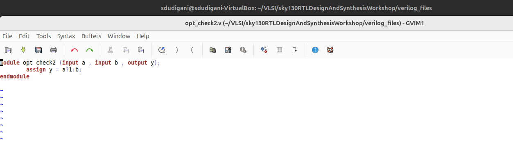


```bash
yosys
read_liberty -lib ../lib/sky130_fd_sc_hd__tt_025C_1v80.lib
read_verilog opt_check2.v 
synth -top opt_check2
opt_clean -purge # to remove unused or redundant logic 
abc -liberty ../lib/sky130_fd_sc_hd__tt_025C_1v80.lib
show
```


### Optimisation 3


```bash
yosys
read_liberty -lib ../lib/sky130_fd_sc_hd__tt_025C_1v80.lib
read_verilog opt_check3.v 
synth -top opt_check3
opt_clean -purge # to remove unused or redundant logic 
abc -liberty ../lib/sky130_fd_sc_hd__tt_025C_1v80.lib
show
```


### Optimisation 4

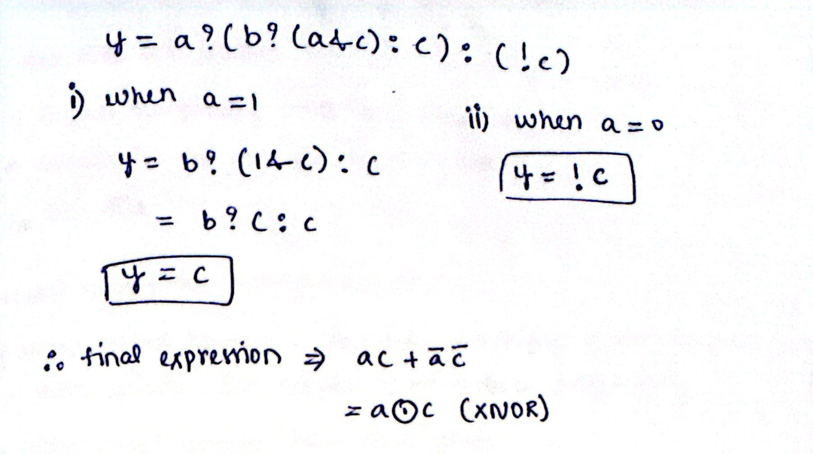


```bash
yosys
read_liberty -lib ../lib/sky130_fd_sc_hd__tt_025C_1v80.lib
read_verilog opt_check4.v 
synth -top opt_check4
opt_clean -purge # to remove unused or redundant logic 
abc -liberty ../lib/sky130_fd_sc_hd__tt_025C_1v80.lib
show
```


### Optimisation 5


```bash
yosys
read_liberty -lib ../lib/sky130_fd_sc_hd__tt_025C_1v80.lib
read_verilog opt_check5.v 
synth -top opt_check5
opt_clean -purge # to remove unused or redundant logic 
abc -liberty ../lib/sky130_fd_sc_hd__tt_025C_1v80.lib
show
```


### Optimisation 6


```bash
yosys
read_liberty -lib ../lib/sky130_fd_sc_hd__tt_025C_1v80.lib
read_verilog opt_check5.v 
synth -top opt_check5
opt_clean -purge # to remove unused or redundant logic 
abc -liberty ../lib/sky130_fd_sc_hd__tt_025C_1v80.lib
show
```


## 3. Sequential Logic Optimisation Lab 07
### Optimisation 1
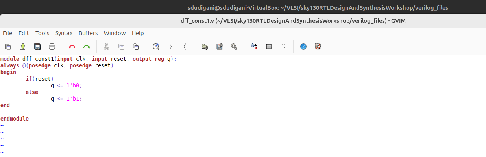
#### Simulation for ```dff_const1.v```
```bash
iverilog dff_const1.v
./a.out
gtkwave tb_dff_const1.vcd
```

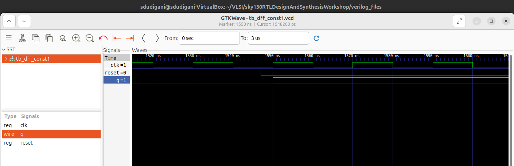
#### Synthesis
```bash
read_liberty -lib ../lib/sky130_fd_sc_hd__tt_025C_1v80.lib
read_verilog dff_const1.v
synth -top dff_const1
dfflibmap -liberty  ../lib/sky130_fd_sc_hd__tt_025C_1v80.lib
abc -liberty ../lib/sky130_fd_sc_hd__tt_025C_1v80.lib 
show
```

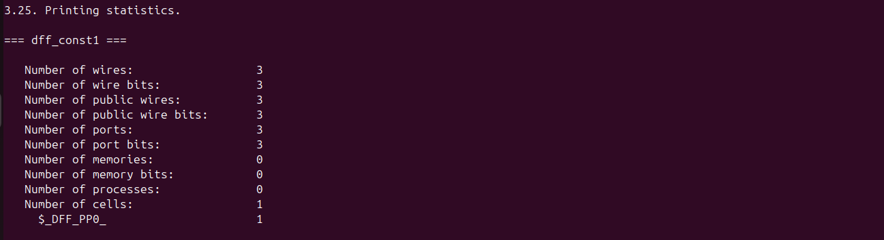
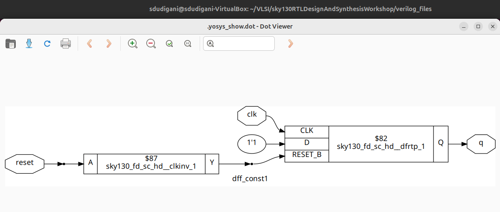
### Optimisation 2
#### Simulation for ```dff_const2.v```
```bash
iverilog dff_const2.v
./a.out
gtkwave tb_dff_const2.vcd
```

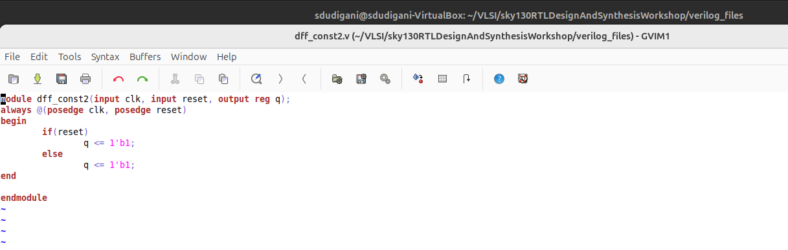
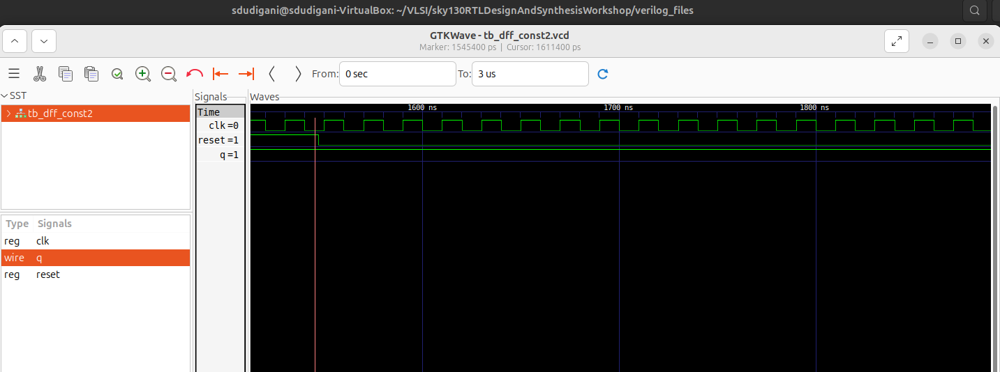
#### Synthesis
```bash
read_liberty -lib ../lib/sky130_fd_sc_hd__tt_025C_1v80.lib
read_verilog dff_const2.v
synth -top dff_const2
dfflibmap -liberty  ../lib/sky130_fd_sc_hd__tt_025C_1v80.lib
abc -liberty ../lib/sky130_fd_sc_hd__tt_025C_1v80.lib 
show
```

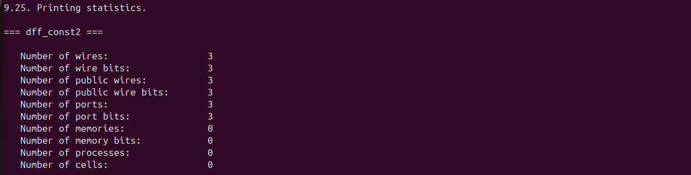
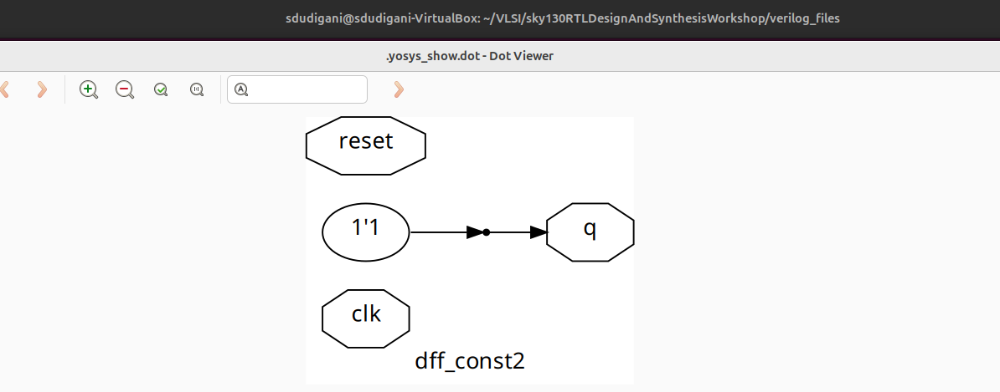
### Optimisation 3
#### Simulation for ```dff_const3.v```
```bash
iverilog dff_const3.v
./a.out
gtkwave tb_dff_const3.vcd
```

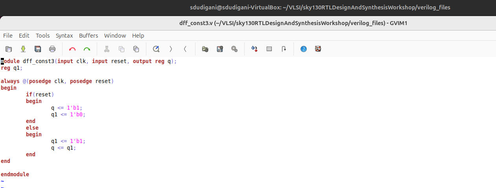
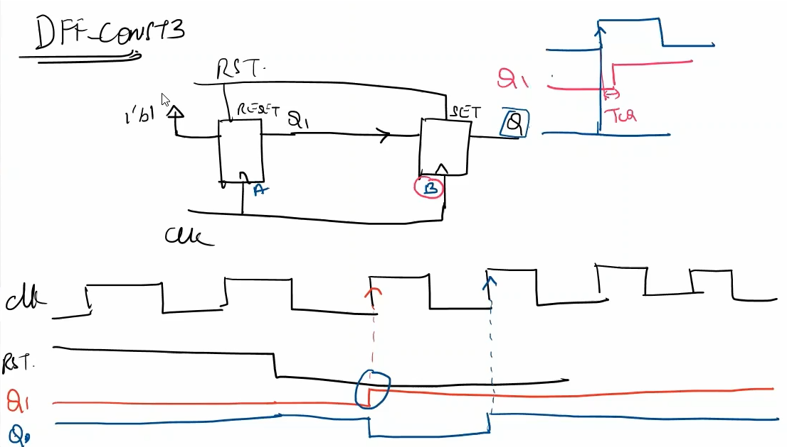
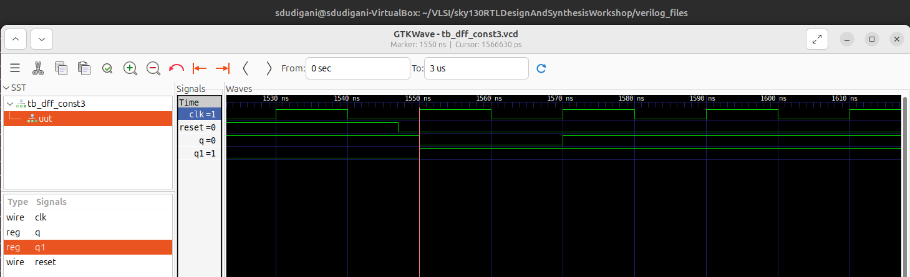
#### Synthesis
```bash
read_liberty -lib ../lib/sky130_fd_sc_hd__tt_025C_1v80.lib
read_verilog dff_const3.v
synth -top dff_const3
dfflibmap -liberty  ../lib/sky130_fd_sc_hd__tt_025C_1v80.lib
abc -liberty ../lib/sky130_fd_sc_hd__tt_025C_1v80.lib 
show
```
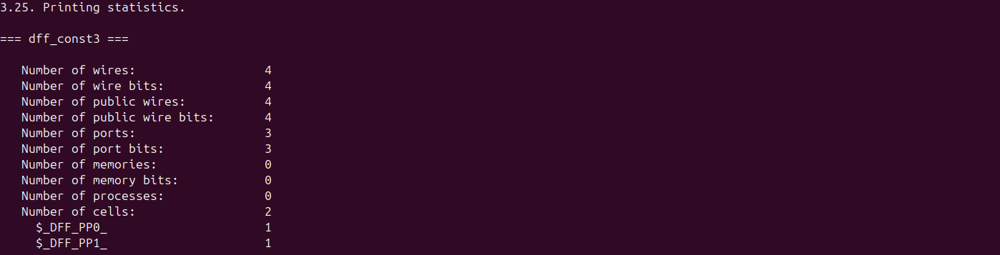
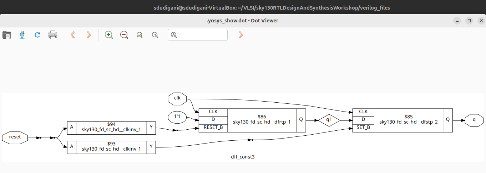

### Optimisation 4
#### Simulation for ```dff_const1.v```
```bash
iverilog dff_const4.v
./a.out
gtkwave tb_dff_const4.vcd
```

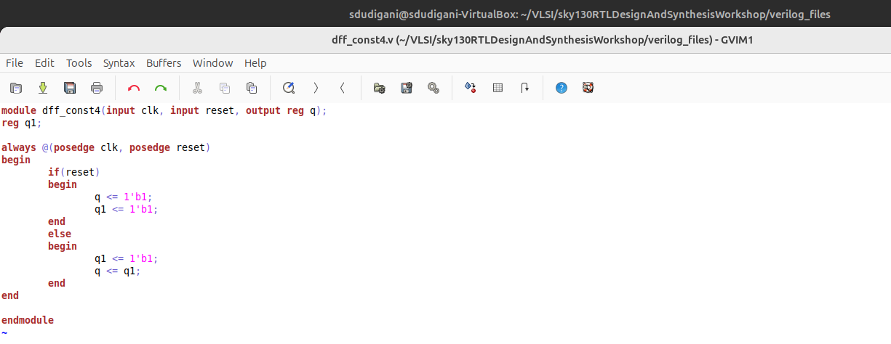
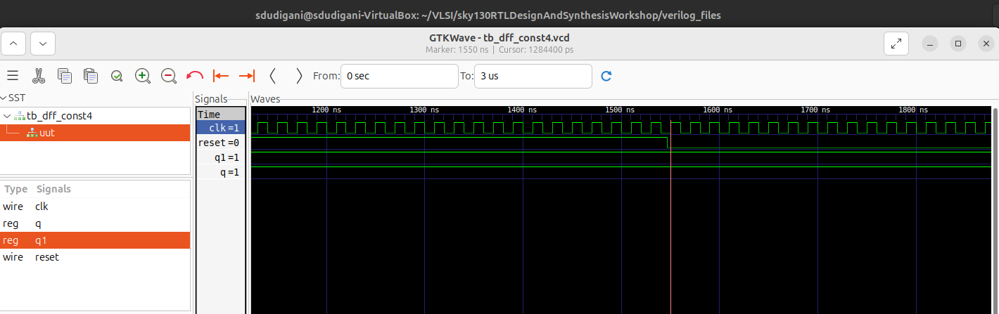
#### Synthesis
```bash
read_liberty -lib ../lib/sky130_fd_sc_hd__tt_025C_1v80.lib
read_verilog dff_const4.v
synth -top dff_const4
dfflibmap -liberty  ../lib/sky130_fd_sc_hd__tt_025C_1v80.lib
abc -liberty ../lib/sky130_fd_sc_hd__tt_025C_1v80.lib 
show
```
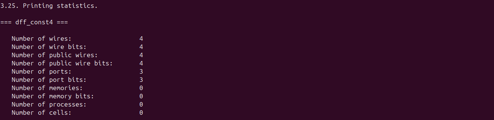
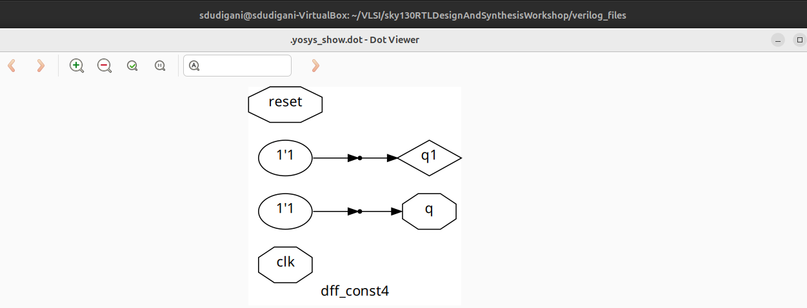

### Optimisation 5
#### Simulation for ```dff_const1.v```
```bash
iverilog dff_const5.v
./a.out
gtkwave tb_dff_const5.vcd
```

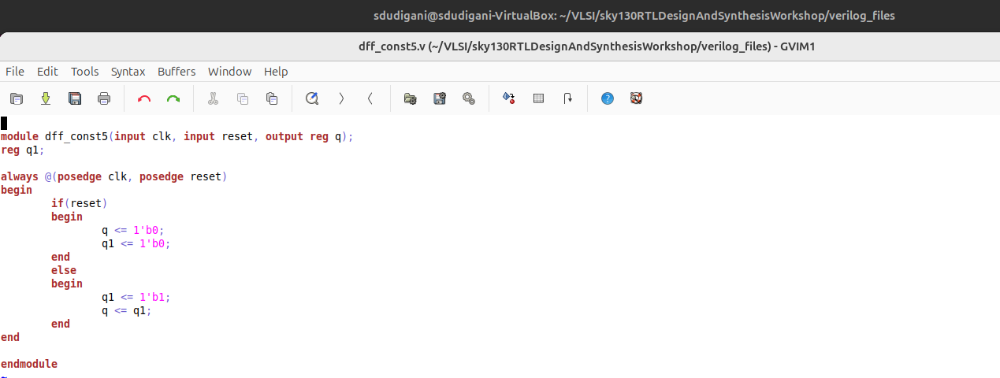
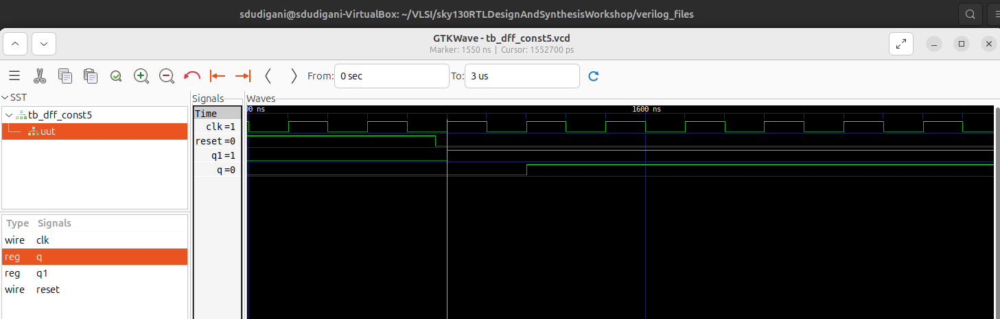
#### Synthesis
  ```bash
  # --------Phase 1: Flatten the hierarchical RTL design---------------
  yosys
  read_liberty -lib ../lib/sky130_fd_sc_hd__tt_025C_1v80.lib
  read_verilog multiple_module_opt.v
  synth -top multiple_module_opt
  abc -liberty ../lib/sky130_fd_sc_hd__tt_025C_1v80.lib
  # Flatten design hierarchy 
  # 🔸Essential before performing optimization on multi-module RTLs
  flatten
  write_verilog -noattr multiple_module_opt_flat.v
  ```

  ```bash
  # ----------Phase 2: Optimize the flattened netlist-------------
  yosys
  read_liberty -lib ../lib/sky130_fd_sc_hd__tt_025C_1v80.lib
  read_verilog multiple_module_opt_flat.v
  synth -top multiple_module_opt
  opt_clean -purge   # Cleans up redundant gates and wires after flattening
  abc -liberty ../lib/sky130_fd_sc_hd__tt_025C_1v80.lib
  show
  ```

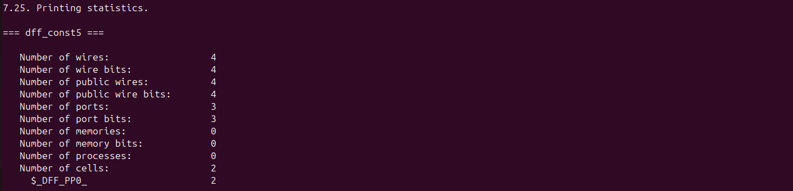
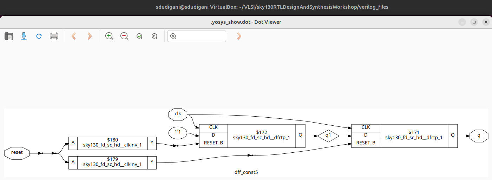

## 4. Sequential Optimisations for Unused Outputs
### Design : ```counter_opt.v```
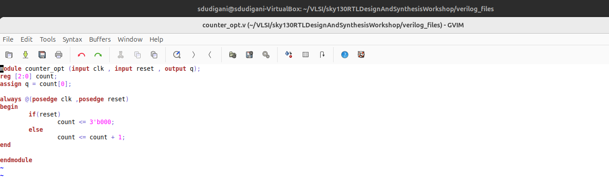

#### Synthesis
```bash
read_liberty -lib ../lib/sky130_fd_sc_hd__tt_025C_1v80.lib
read_verilog counter_opt.v.v
synth -top counter_opt
dfflibmap -liberty  ../lib/sky130_fd_sc_hd__tt_025C_1v80.lib
abc -liberty ../lib/sky130_fd_sc_hd__tt_025C_1v80.lib 
show
```
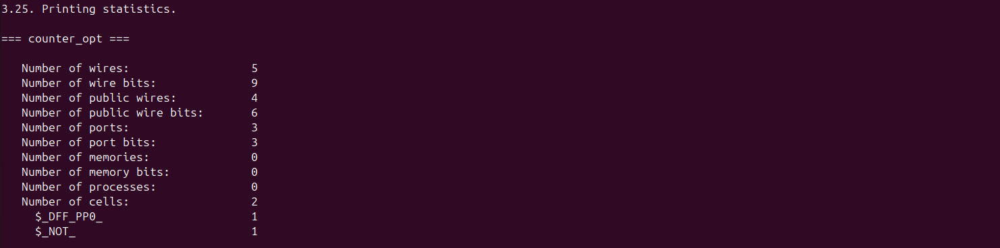
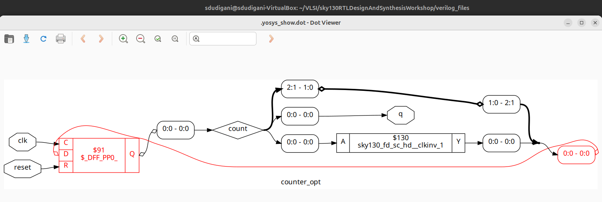

### Design : ```counter_opt2.v```
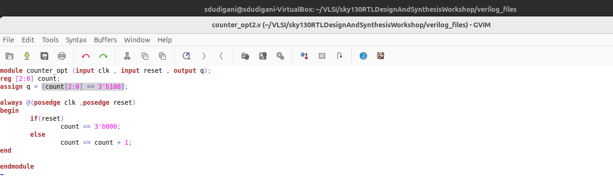
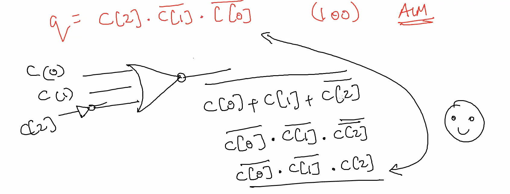

#### Synthesis
```bash
read_liberty -lib ../lib/sky130_fd_sc_hd__tt_025C_1v80.lib
read_verilog counter_opt2.v.v
synth -top counter_opt
dfflibmap -liberty  ../lib/sky130_fd_sc_hd__tt_025C_1v80.lib
abc -liberty ../lib/sky130_fd_sc_hd__tt_025C_1v80.lib 
show
```
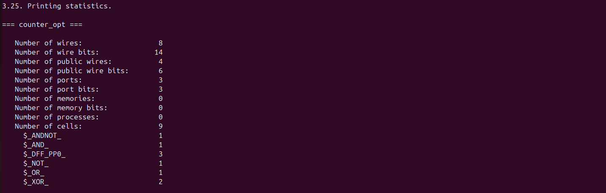
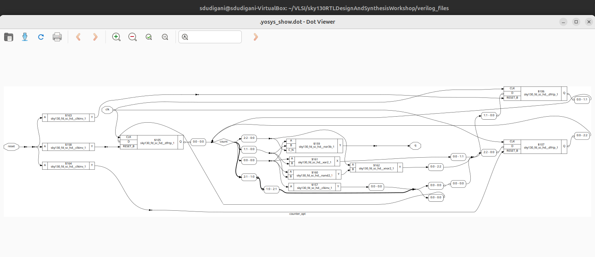

