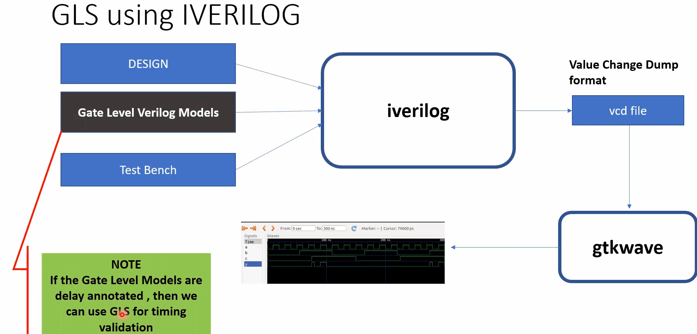
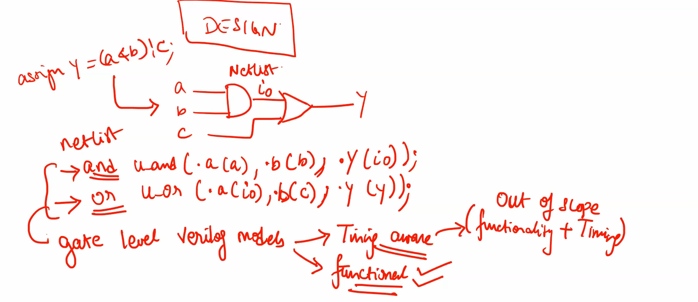
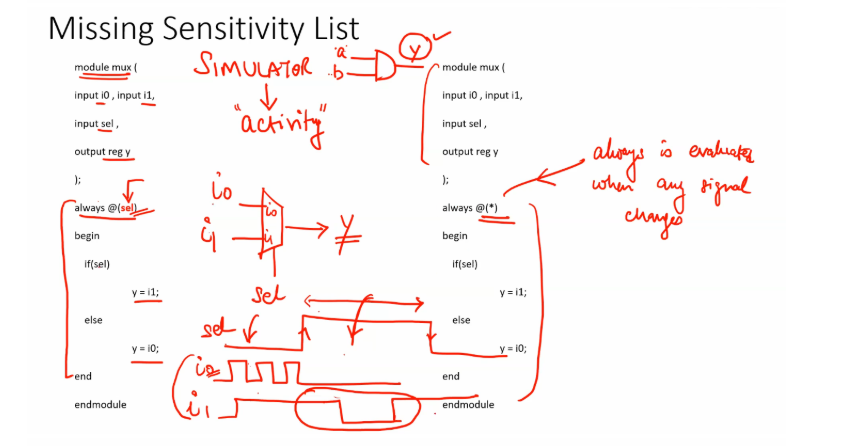
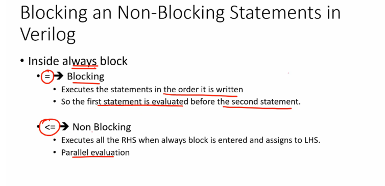
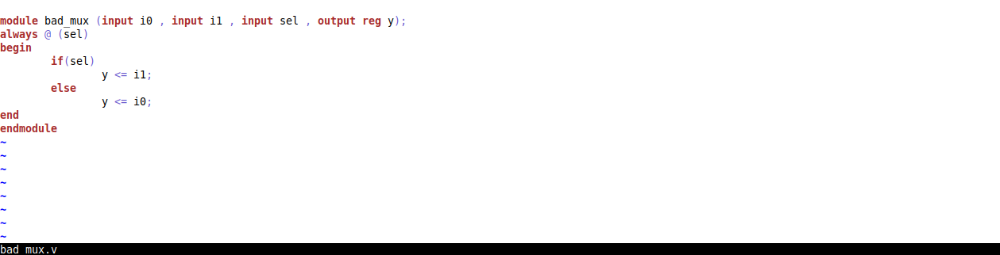
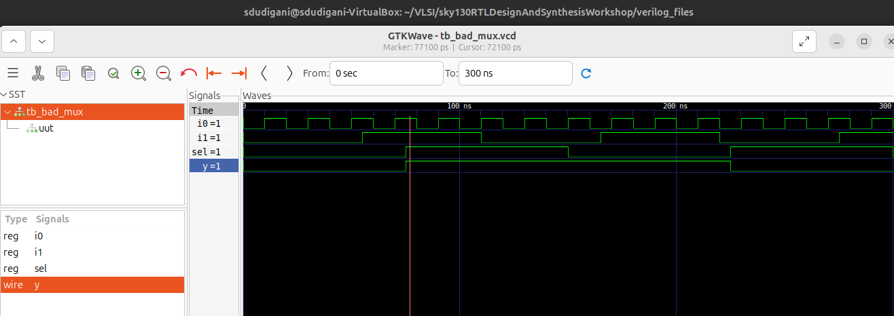
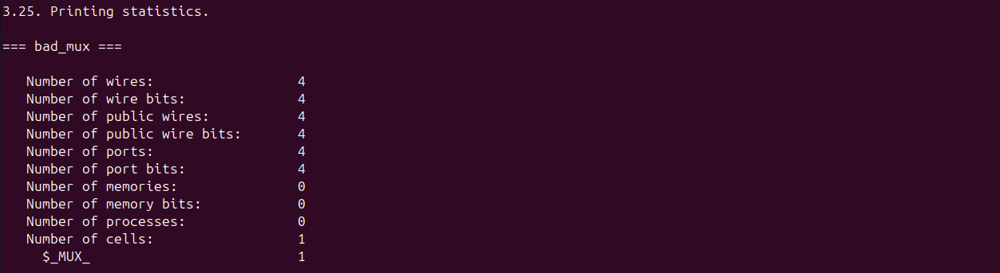
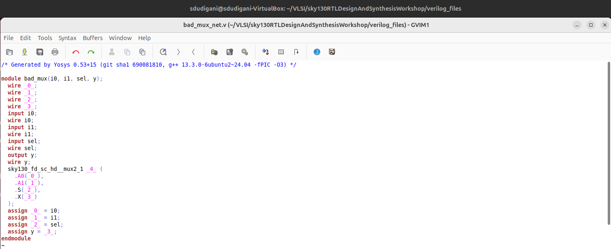
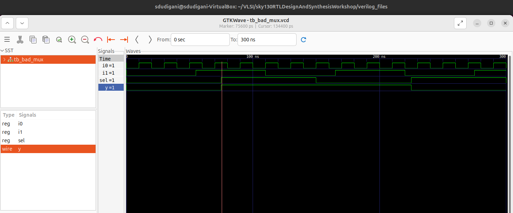

<details>
  <Summary><strong> Day 4 : GLS, Blocking vs Non-Blocking and Synthesis-Simulation Mismatch</strong></summary>

## Contents
1. [GLS Concepts and Optimisation Overview](#1-gls-concepts-and-optimisation-overview)
2. [Labs on GLS and Synthesis-Simulation Mismatch](#2-labs-on-gls-and-synthesis-simulation-mismatch)
3. [Labs on Synthesis Mismatch for Blocking Statement](#3-labs-on-synthesis-mismatch-for-blocking-statement)

## 1. GLS Concepts and Optimisation Overview
### Gate Level Simulation Concepts and Flow Using iverilog
#### What is GLS?
- Running the test bench with Netlist as Design Under Test.
- Netlist is logically same as RTL code --> so same test bench will align with the design.

#### Why GLS?
- Verify the logical correctness of design after synthesis.
- Ensuring the timing of the design is met.
  - For this GLS needs to be run with delay annotation.

#### GLS using iverilog


### Synthesis Simulation Mismatch
Some of the common reasons for Synthesis - Simulation mismatch (mismatch between pre- and post-synthesis simulations) :  
  * Incomplete sensitivity list
  * Use of blocking assignments inside always block vs. non-blocking assignments
    * Blocking assignments ("=") inside always block are executed sequentially by the simulator.
    * The RHS of non-blocking assignments ("<=") are evaluated first and then assigned to the LHS at the same simulation clock tick by the simulator. 
    * Synthesis will yield the same circuit with blocking and non-blocking assignments, with the synthesis output being that of the non-blocking case for both.
    * Hence, if the RTL was written assuming one functionality using blocking assignments, a simulation mismatch can occur in GLS.
  * Non-standard verilog coding




### Blocking and Non-Blocking Statements in Verilog


### Caveats with Blocking Statements


## 2. Labs on GLS and Synthesis-Simulation Mismatch
### Design: ```ternary_operator_mux.v```
#### RTL Simulation


```bash
iverilog ternary_operator_mux.v tb_ternary_operator_mux.v
./a.out
gtkwave tb_ternary_operator_mux.vcd
```


#### Synthesis
```bash
yosys
read_liberty -lib ../lib/sky130_fd_sc_hd__tt_025C_1v80.lib
read_verilog ternary_operator_mux.v 
synth -top ternary_operator_mux
abc -liberty ../lib/sky130_fd_sc_hd__tt_025C_1v80.lib 
show
write_verilog -noattr ternary_operator_mux_net.v
```


#### GLS
```bash
iverilog ../my_lib/verilog_model/primitives.v ../my_lib/verilog_model/sky130_fd_sc_hd.v ternary_operator_mux_net.v tb_ternary_operator_mux.v
/a.out 
gtkwave tb_ternary_operator_mux.vcd
```


### Design: ```bad_mux.v```
#### RTL Simulation


```bash
iverilog bad_mux.v tb_bad_mux.v
./a.out
gtkwave tb_bad_mux.vcd
```



#### Synthesis
```bash
yosys
read_liberty -lib ../lib/sky130_fd_sc_hd__tt_025C_1v80.lib
read_verilog bad_mux.v 
synth -top bad_mux
abc -liberty ../lib/sky130_fd_sc_hd__tt_025C_1v80.lib 
show
write_verilog -noattr bad_mux_net.v
```




#### GLS
```bash
iverilog ../my_lib/verilog_model/primitives.v ../my_lib/verilog_model/sky130_fd_sc_hd.v bad_mux_net.v tb_bad_mux.v
/a.out 
gtkwave tb_bad_mux.vcd
```



### Design: ```good_mux.v```
#### RTL Simulation
#### Synthesis
#### GLS

## 3. Labs on Synthesis Mismatch for Blocking Statement
### part1
### part2
