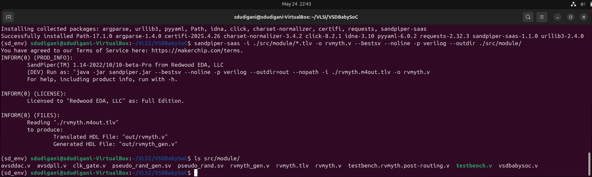
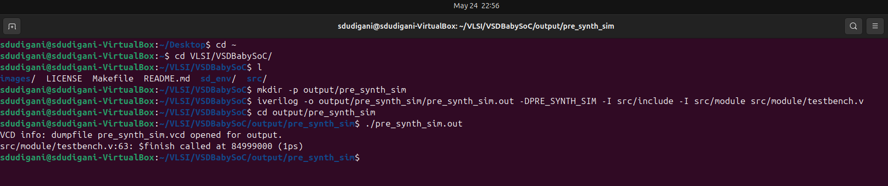
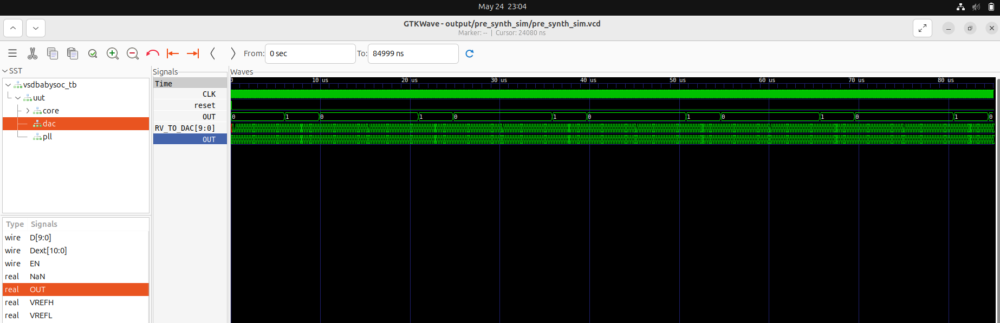
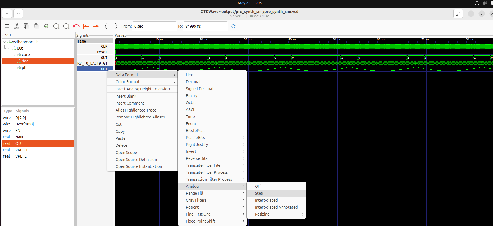
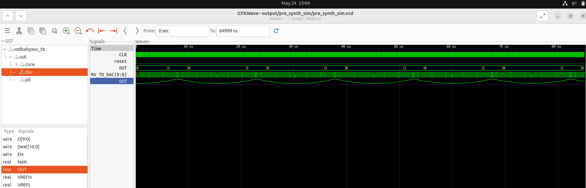

<details>
  <Summary><strong> Day 5 : Introduction to BabySoC</strong></summary>
  
# Introduction
- BabySoC is a minimal, RISC-V-based System on Chip that brings together essential open-source components to form a functional mixed-signal platform.
- The primary motivation behind this project is to combine and verify the behavior of three distinct IP blocks in a single design -> a processor, a clock generator, and an analog interface, while offering an accessible learning environment.
- This SoC integrates the RVMYTH core (a RISC-V CPU), an 8x Phase-Locked Loop (PLL) for clock management, and a 10-bit Digital-to-Analog Converter (DAC) for analog signal generation and communication.

## What is BabySoC?
- BabySoC is a lightweight, educational SoC that brings together three critical IPs in a unified design:
  - RVMYTH: A basic yet functional RISC-V CPU.
  - PLL: A Phase-Locked Loop that multiplies the clock frequency by 8× for internal system use.
  - DAC: A Digital-to-Analog Converter that enables communication with analog systems and external hardware.
- The system is designed to validate these IPs when integrated and provide a platform for observing digital-to-analog behavior in a controlled environment.

  

### Problem Statement
This project delves into designing a compact, open-source System on Chip (SoC) based on RVMYTH, a RISC-V-based processor core. The SoC integrates a Phase-Locked Loop (PLL) for precise clock generation and control, alongside a 10-bit Digital-to-Analog Converter (DAC) for interfacing with external analog systems. By converting digital signals into analog, this DAC allows BabySoC to communicate with devices that accept analog inputs, such as televisions and mobile phones, enabling output in the form of audio or video. Ultimately, this Sky130-technology-based SoC aims to provide a highly documented, educational platform for learning and experimentation in digital-analog interfacing.

### What is an SoC?
A System on Chip (SoC) is a complete system embedded onto a single silicon chip. It usually contains several integrated IP cores, such as CPUs, memory blocks, peripherals, and communication interfaces and can include both digital and analog subsystems depending on the application.

### What is RVMYTH?
RVMYTH is a simplified RISC-V-based processor core originally developed for educational workshops. It illustrates fundamental CPU architecture concepts and is small enough to be implemented easily using open-source flows. It handles instruction execution, memory operations, and basic control logic.

### What is a PLL?
A Phase-Locked Loop (PLL) is a feedback-driven circuit that locks the output frequency in sync with a reference clock. In this SoC, it is used to multiply the input clock frequency to generate a high-speed internal clock, essential for running the digital logic efficiently and with low jitter.

### What is a DAC?
A Digital-to-Analog Converter (DAC) transforms digital values into analog voltages or currents. The 10-bit DAC in this SoC enables the system to interact with real-world analog devices, converting CPU-driven digital outputs into continuous signals for use in multimedia, sensing, or other analog domains.

## Project Directory Structure
- src/include/ Contains header files (*.vh) with necessary macros or parameter definitions.
- src/module/ Contains Verilog files for each module in the SoC design.
- output/ Directory where compiled outputs and simulation files will be generated.

### Setup the project directory
Clone or set up the directory structure as follows:
```txt
VSDBabySoC/
├── src/
│   ├── include/
│   │   ├── sandpiper.vh
│   │   └── other header files...
│   ├── module/
│   │   ├── vsdbabysoc.v      # Top-level module integrating all components
│   │   ├── rvmyth.v          # RISC-V core module
│   │   ├── avsdpll.v         # PLL module
│   │   ├── avsddac.v         # DAC module
│   │   └── testbench.v       # Testbench for simulation
└── output/
└── compiled_tlv/         # Holds compiled intermediate files if needed
```

clone the VSDBabySoC repository using the following command:
```bash
cd ~/VLSI
git clone https://github.com/manili/VSDBabySoC.git
```


### TLV to Verilog Conversion for RVMYTH
- Initially, the RVMYTH core is written in TL-Verilog.
- To convert `rvmyth.tlv` file inside `src/module/` into a `.v` file for simulation, follow the steps below:

```bash
# Step 1: Install python3-venv (if not already installed)
sudo apt update
sudo apt install python3-venv python3-pip

# Step 2: Create and activate a virtual environment
cd VSDBabySoC
python3 -m venv sd_env
source sd_env/bin/activate

# Step 3: Install SandPiper-SaaS inside the virtual environment
pip install pyyaml click sandpiper-saas

# Step 4: Convert rvmyth.tlv to Verilog
sandpiper-saas -i ./src/module/*.tlv -o rvmyth.v --bestsv --noline -p verilog --outdir ./src/module/
```

- After running the above command, rvmyth.v will be generated in the src/module/ directory.

You can confirm this by listing the files:
 

#### Note 
To use this environment in future sessions, always activate it first:
```bash
dudigani@sdudigani-VirtualBox:~$ source sd_env/bin/activate
```

To exit:
```bash
dudigani@sdudigani-VirtualBox:~$ deactivate
```

## Simulation

### <ins>Pre-Synthesis Simulation</ins>

Commands to perform a pre-synthesis simulation:

```bash
cd ~/VLSI/VSDBabySoC/
mkdir -p output/pre_synth_sim
iverilog -o output/pre_synth_sim/pre_synth_sim.out -DPRE_SYNTH_SIM \
  -I src/include -I src/module \
  src/module/testbench.v
```

Then run:
```bash
cd output/pre_synth_sim
./pre_synth_sim.out
```

Explanation:

- DPRE_SYNTH_SIM: Defines the PRE_SYNTH_SIM macro for conditional compilation in the testbench.
- The resulting pre_synth_sim.vcd file can be viewed in GTKWave.

 

#### Viewing Waveform in GTKWave
- After running the simulation, open the VCD file in GTKWave: 

```bash
cd ~/VLSI/VSDBabySoC/
gtkwave output/pre_synth_sim/pre_synth_sim.vcd
```

- Drag and drop the CLK, reset, OUT (DAC), and RV TO DAC [9:0] signals to their respective locations in the simulation tool

 

#### Viewing DAC output in analog mode






### <ins>Post-Synthesis Simulation</ins>
</details>


