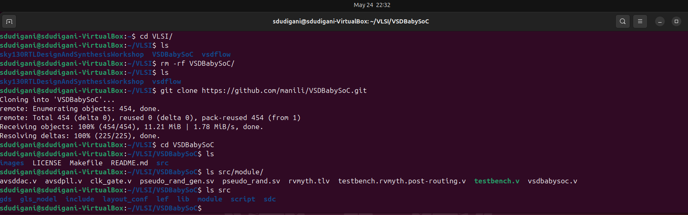

<details>
  <Summary><strong> Day 5 : Introduction to BabySoC</strong></summary>
  
# Introduction
- BabySoC is a minimal, RISC-V-based System on Chip that brings together essential open-source components to form a functional mixed-signal platform.
- The primary motivation behind this project is to combine and verify the behavior of three distinct IP blocks in a single design -> a processor, a clock generator, and an analog interface, while offering an accessible learning environment.
- This SoC integrates the RVMYTH core (a RISC-V CPU), an 8x Phase-Locked Loop (PLL) for clock management, and a 10-bit Digital-to-Analog Converter (DAC) for analog signal generation and communication.

## What is BabySoC?
- BabySoC is a lightweight, educational SoC that brings together three critical IPs in a unified design:
  - RVMYTH: A basic yet functional RISC-V CPU.
  - PLL: A Phase-Locked Loop that multiplies the clock frequency by 8× for internal system use.
  - DAC: A Digital-to-Analog Converter that enables communication with analog systems and external hardware.
- The system is designed to validate these IPs when integrated and provide a platform for observing digital-to-analog behavior in a controlled environment.

  

### Problem Statement
- This project focuses on building a streamlined System on Chip (SoC) using open-source IP cores. The design includes the RVMYTH RISC-V CPU, a PLL for stable and faster clock generation, and a DAC to output analog-equivalent signals.
- Together, these components demonstrate how digital logic can interact with analog devices, such as audio systems or display controllers, by translating binary outputs into continuous analog signals.
- Fabricated using Sky130 technology, this project also serves as a reference model for future SoC learners and developers aiming to explore mixed-signal design techniques using accessible, open hardware.

### What is an SoC?
A System on Chip (SoC) is a complete system embedded onto a single silicon chip. It usually contains several integrated IP cores, such as CPUs, memory blocks, peripherals, and communication interfaces and can include both digital and analog subsystems depending on the application.

### What is RVMYTH?
RVMYTH is a simplified RISC-V-based processor core originally developed for educational workshops. It illustrates fundamental CPU architecture concepts and is small enough to be implemented easily using open-source flows. It handles instruction execution, memory operations, and basic control logic.

### What is a PLL?
A Phase-Locked Loop (PLL) is a feedback-driven circuit that locks the output frequency in sync with a reference clock. In this SoC, it is used to multiply the input clock frequency to generate a high-speed internal clock, essential for running the digital logic efficiently and with low jitter.

### What is a DAC?
A Digital-to-Analog Converter (DAC) transforms digital values into analog voltages or currents. The 10-bit DAC in this SoC enables the system to interact with real-world analog devices, converting CPU-driven digital outputs into continuous signals for use in multimedia, sensing, or other analog domains.

## Project Directory Structure
- src/include/ Contains header files (*.vh) with necessary macros or parameter definitions.
- src/module/ Contains Verilog files for each module in the SoC design.
- output/ Directory where compiled outputs and simulation files will be generated.

### Setup the project directory
Clone or set up the directory structure as follows:
```txt
VSDBabySoC/
├── src/
│   ├── include/
│   │   ├── sandpiper.vh
│   │   └── other header files...
│   ├── module/
│   │   ├── vsdbabysoc.v      # Top-level module integrating all components
│   │   ├── rvmyth.v          # RISC-V core module
│   │   ├── avsdpll.v         # PLL module
│   │   ├── avsddac.v         # DAC module
│   │   └── testbench.v       # Testbench for simulation
└── output/
└── compiled_tlv/         # Holds compiled intermediate files if needed
```

clone the VSDBabySoC repository using the following command:
```bash
cd ~/VLSI
git clone https://github.com/manili/VSDBabySoC.git
```


### TLV to Verilog Conversion for RVMYTH

</details>


