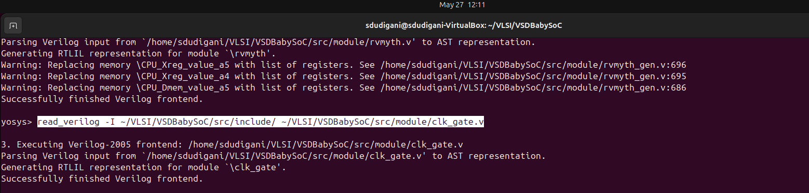

<details>
  <Summary><strong> Day 6 : VSDBabySoC Post-Synthesis Simulation</strong></summary>

## Introduction
- Post-synthesis simulation is an essential step in the digital design flow where we verify the functionality and timing of the design after synthesis. While pre-synthesis simulation checks the RTL code for logical correctness, post-synthesis simulation ensures that the synthesized gate-level netlist still behaves as intended.

- In this stage, the RTL is already transformed into a netlist composed of logic gates mapped to a specific technology library. Simulating this netlist helps identify:
  - Functional consistency: Confirms that synthesis has not altered the design's intended behavior.
  - Timing characteristics: Includes realistic gate delays to check for potential timing issues.
  - Synthesis-induced issues: Detects problems like glitches, race conditions, or unintended latches that might not appear in RTL simulation.

- For the VSDBabySoC design, we perform synthesis using Yosys to generate the gate-level netlist, and then simulate this netlist using a same testbench. The goal is to compare the post-synthesis simulation output with the pre-synthesis results. If both match, it validates that the design's logic and functionality are preserved through the synthesis process.

- This step is critical for catching low-level issues early and ensuring the design is ready for downstream physical implementation.

## Synthesis using Yosys

The following cp commands copy essential header files from the src/include directory into the working directory. These include:
  - sp_verilog.vh – contains Verilog definitions and macros
  - sandpiper.vh – holds integration-related definitions for SandPiper
  - sandpiper_gen.vh – may include auto-generated or tool-generated parameters

```bash
cd ~/VLSI/VSDBabySoC/
cp -r src/include/sp_verilog.vh .
cp -r src/include/sandpiper.vh .
cp -r src/include/sandpiper_gen.vh .
```

```bash
sdudigani@sdudigani-VirtualBox:~/VLSI/VSDBabySoC$ c
total 100K
-rw-rw-r--  1 sdudigani sdudigani  12K May 24 22:31 LICENSE
-rw-rw-r--  1 sdudigani sdudigani  49K May 24 22:31 README.md
-rw-rw-r--  1 sdudigani sdudigani 6.5K May 24 22:31 Makefile
drwxrwxr-x  2 sdudigani sdudigani 4.0K May 24 22:31 images
drwxrwxr-x 11 sdudigani sdudigani 4.0K May 24 22:31 src
drwxrwxr-x  5 sdudigani sdudigani 4.0K May 24 22:40 sd_env
drwxrwxr-x  4 sdudigani sdudigani 4.0K May 27 11:45 output
-rw-rw-r--  1 sdudigani sdudigani 2.4K May 27 12:02 sp_verilog.vh
-rw-rw-r--  1 sdudigani sdudigani 2.6K May 27 12:02 sandpiper.vh
-rw-rw-r--  1 sdudigani sdudigani  164 May 27 12:03 sandpiper_gen.vh
```

#### ✅ Step 1: Load the Top-Level Design and Supporting Modules
- Launch the Yosys synthesis tool from your working directory.
  ```bash
  cd ~/VLSI/VSDBabySoC/
  yosys
  ```

  
- Read the main vsdbabysoc.v RTL file into the Yosys environment.
  ```bash
   yosys> read_verilog src/module/vsdbabysoc.v
  ```


- Read the rvmyth.v file with the include path using -I option.
  ```bash
  yosys> read_verilog -I ~/VLSI/VSDBabySoC/src/include/ ~/VLSI/VSDBabySoC/src/module/rvmyth.v
  ```


- Read the clk_gate.v file with the include path using -I option.
  ```bash
  yosys> read_verilog -I ~/VLSI/VSDBabySoC/src/include/ ~/VLSI/VSDBabySoC/src/module/clk_gate.v
  ```


#### ✅ Step 2: Load the Liberty Files for Synthesis
Inside the same Yosys shell, run:
```bash
yosys> read_liberty -lib ~/VLSI/VSDBabySoC/src/lib/avsdpll.lib 
yosys> read_liberty -lib ~/VLSI/VSDBabySoC/src/lib/avsddac.lib 
yosys> read_liberty -lib ~/VLSI/VSDBabySoC/src/lib/sky130_fd_sc_hd__tt_025C_1v80.lib
```


#### ✅ Step 3: Run Synthesis Targeting vsdbabysoc
```bash
yosys> synth -top vsdbabysoc
```


#### ✅ Step 4: Map D Flip-Flops to Standard Cells
```bash
yosys> dfflibmap -liberty ~/VLSI/VSDBabySoC/src/lib/sky130_fd_sc_hd__tt_025C_1v80.lib
```


#### ✅ Step 5: Perform Optimization and Technology Mapping
```bash
yosys> opt
yosys> abc -liberty ~/VLSI/VSDBabySoC/src/lib/sky130_fd_sc_hd__tt_025C_1v80.lib -script +strash;scorr;ifraig;retime;{D};strash;dch,-f;map,-M,1,{D}
```


#### ✅ Step 6: Perform Final Clean-Up and Renaming
```bash
yosys> flatten
yosys> setundef -zero
yosys> clean -purge
yosys> rename -enumerate
```


#### ✅ Step 7: Check Statistics

```bash
yosys> stat

13. Printing statistics.

=== vsdbabysoc ===

   Number of wires:               4736
   Number of wire bits:           6210
   Number of public wires:        4736
   Number of public wire bits:    6210
   Number of ports:                  7
   Number of port bits:              7
   Number of memories:               0
   Number of memory bits:            0
   Number of processes:              0
   Number of cells:               5920
     $scopeinfo                      8
     avsddac                         1
     avsdpll                         1
     sky130_fd_sc_hd__a2111oi_0     10
     sky130_fd_sc_hd__a211o_2        1
     sky130_fd_sc_hd__a211oi_1      26
     sky130_fd_sc_hd__a21boi_0       4
     sky130_fd_sc_hd__a21o_2         1
     sky130_fd_sc_hd__a21oi_1      672
     sky130_fd_sc_hd__a221o_2        1
     sky130_fd_sc_hd__a221oi_1     163
     sky130_fd_sc_hd__a22o_2         4
     sky130_fd_sc_hd__a22oi_1      123
     sky130_fd_sc_hd__a311oi_1       4
     sky130_fd_sc_hd__a31o_2         1
     sky130_fd_sc_hd__a31oi_1      344
     sky130_fd_sc_hd__a32oi_1        2
     sky130_fd_sc_hd__a41oi_1       26
     sky130_fd_sc_hd__and2_2        12
     sky130_fd_sc_hd__and3_2         1
     sky130_fd_sc_hd__clkinv_1     597
     sky130_fd_sc_hd__dfxtp_1     1144
     sky130_fd_sc_hd__lpflow_inputiso0p_1      1
     sky130_fd_sc_hd__mux2i_1       12
     sky130_fd_sc_hd__nand2_1      839
     sky130_fd_sc_hd__nand3_1      249
     sky130_fd_sc_hd__nand3b_1       1
     sky130_fd_sc_hd__nand4_1       41
     sky130_fd_sc_hd__nor2_1       403
     sky130_fd_sc_hd__nor3_1        35
     sky130_fd_sc_hd__nor4_1         2
     sky130_fd_sc_hd__o2111ai_1     20
     sky130_fd_sc_hd__o211a_1        1
     sky130_fd_sc_hd__o211ai_1      49
     sky130_fd_sc_hd__o21a_1         6
     sky130_fd_sc_hd__o21ai_0      866
     sky130_fd_sc_hd__o21ba_2        1
     sky130_fd_sc_hd__o21bai_1      18
     sky130_fd_sc_hd__o221a_2        1
     sky130_fd_sc_hd__o221ai_1       7
     sky130_fd_sc_hd__o22ai_1      155
     sky130_fd_sc_hd__o2bb2ai_1      1
     sky130_fd_sc_hd__o311ai_0       2
     sky130_fd_sc_hd__o31ai_1        3
     sky130_fd_sc_hd__o32ai_1        1
     sky130_fd_sc_hd__o41ai_1        1
     sky130_fd_sc_hd__or2_2         12
     sky130_fd_sc_hd__or3_2          1
     sky130_fd_sc_hd__or4_2          1
     sky130_fd_sc_hd__xnor2_1       13
     sky130_fd_sc_hd__xor2_1        32
yosys> 
```

#### ✅ Step 8: Write the Synthesized Netlist
```bash
yosys> write_verilog -noattr ~/VLSI/VSDBabySoC/output/post_synth_sim/vsdbabysoc.synth.v
```


## Post-Synthesis Simulation
#### ✅ Step 1: Compile the Testbench
#### ✅ Step 2: Navigate to the Post-Synthesis Simulation Output Directory
#### ✅ Step 3: Run the Simulation
#### ✅ Step 4: View the Waveforms in GTKWave

### Comparing Pre-Synthesis and Post-Synthesis Output

</details>
