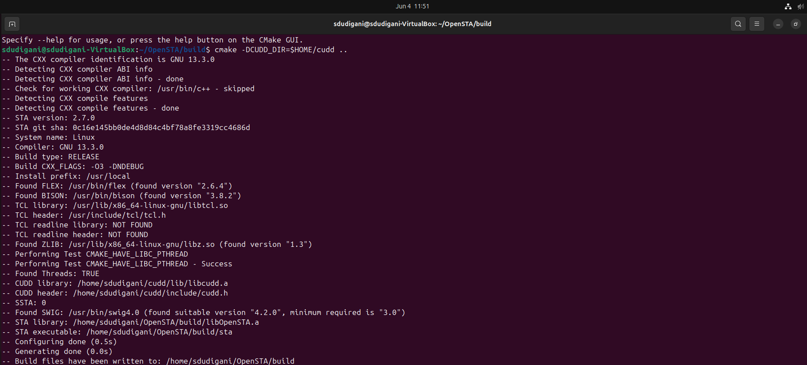
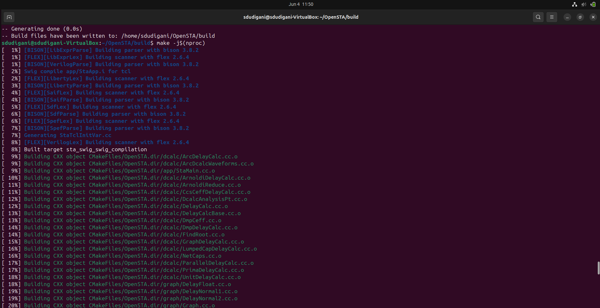
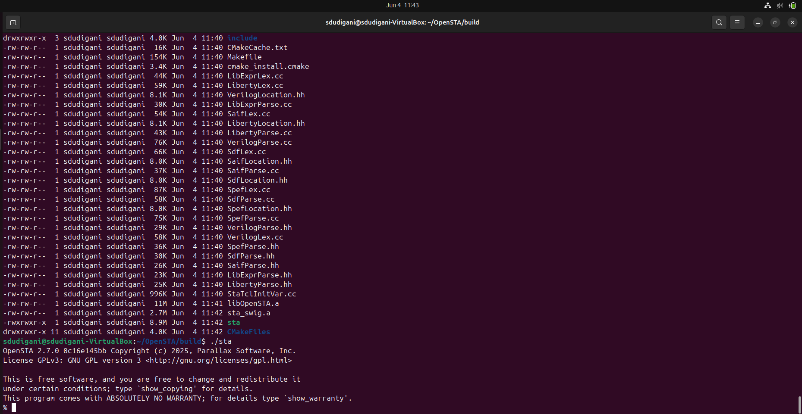
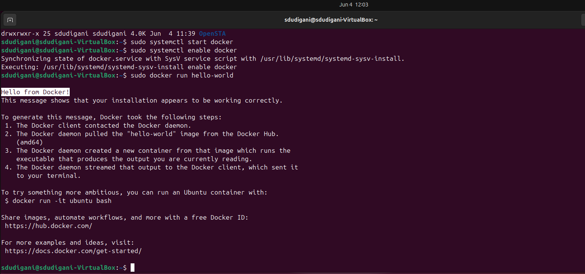
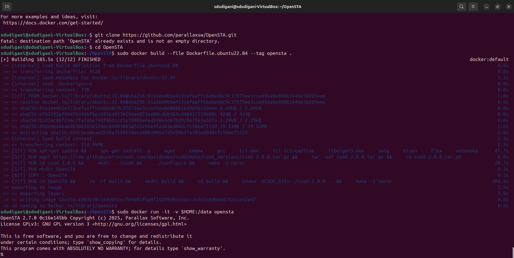
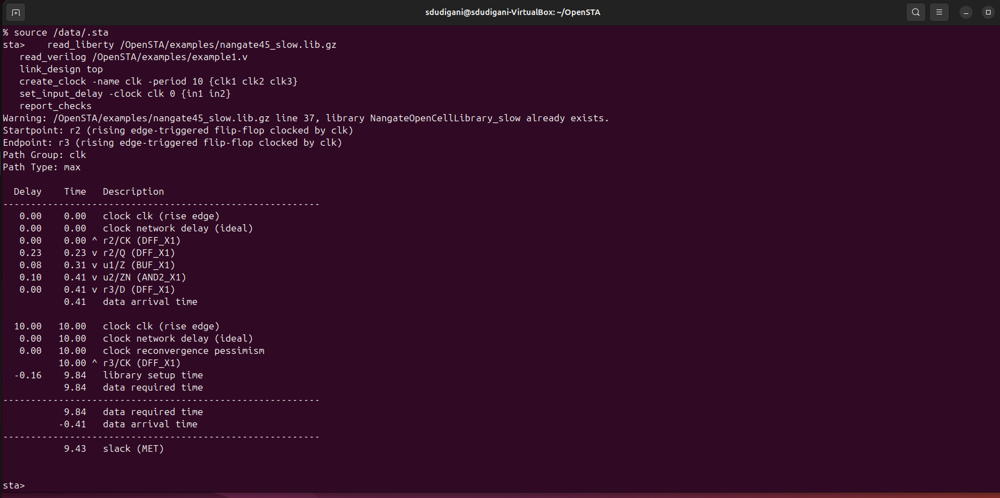
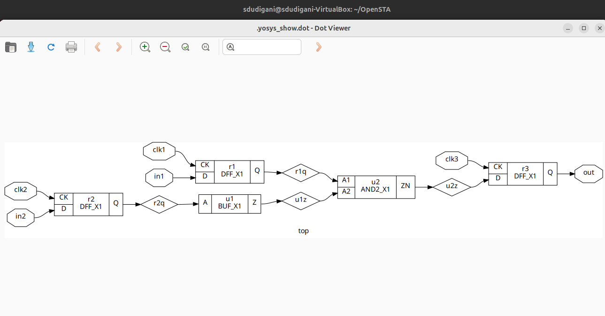
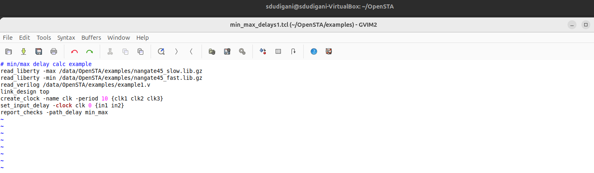
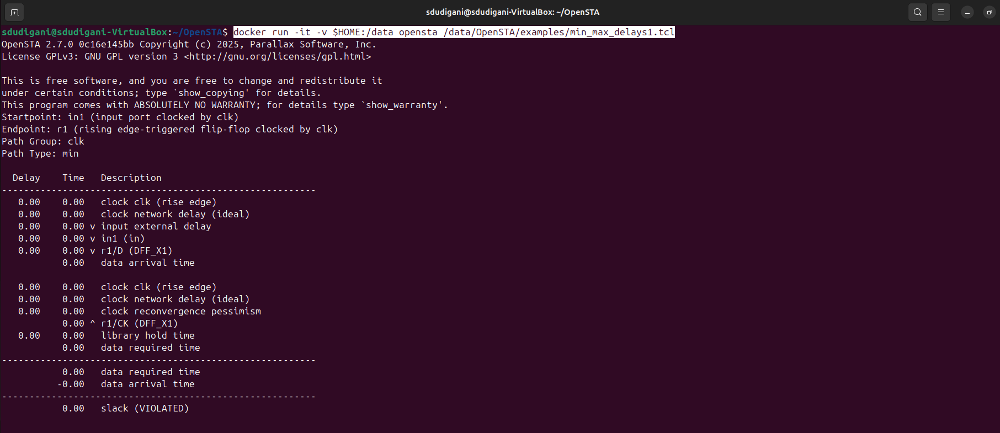
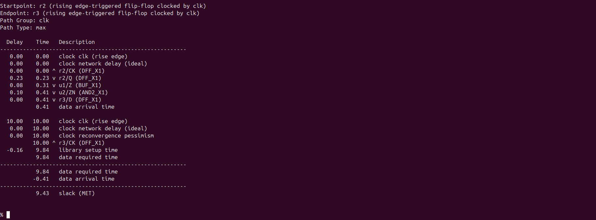

<details>
  <Summary><strong> Day 7 : Timing Graphs using OpenSTA</strong></summary>

## 📚 Contents
- [Introduction to STA](#introduction-to-sta)
- [OpenSTA Tool Installation](#opensta-tool-installation)
- [Timing Analysis using In-line Commands](#timing-analysis-using-in-line-commands)
- [Timing Analysis using TCL File](#timing-analysis-using-tcl-file)
- [SPEF-Based Timing Analysis](#spef-based-timing-analysis)
- [VSDBabySoC Basic Timing Analysis](#vsdbabysoc-basic-timing-analysis)

## Introduction to STA
Static Timing Analysis (STA) is a crucial method in digital design used to verify the timing performance of a circuit without requiring simulation or input stimulus. It checks all possible paths in a design for timing violations, ensuring that signals propagate within acceptable time limits and meet the design’s setup and hold requirements.

Unlike dynamic timing analysis, which simulates input vectors and observes the behavior over time, STA is static, it does not depend on input values or functional simulation. This makes it extremely fast and exhaustive, making it the industry standard for sign-off timing verification in ASIC and SoC flows.

## OpenSTA Tool Installation

OpenSTA is an open-source gate-level Static Timing Analysis tool developed by Parallax Software. 

- You can install OpenSTA using two different methods:
  - Native Installation with Local CUDD: This method involves installing OpenSTA directly on your system using a manually built CUDD.
  - Docker-based Installation: This method involves installing OpenSTA inside a Docker container, which can be self-contained and clean.

### 🔹 Method 1: Native Installation with Local CUDD
This method provides full control and is suitable for script automation.

#### Steps:

##### Step 1: Install prerequisites:
  
```bash
sudo apt update
sudo apt install -y build-essential cmake git \
  tcl-dev swig bison flex zlib1g-dev libeigen3-dev
```
  
##### Step 2: Build and install CUDD:
  
```bash
wget https://github.com/davidkebo/cudd/raw/main/cudd_versions/cudd-3.0.0.tar.gz
tar -xvzf cudd-3.0.0.tar.gz
cd cudd-3.0.0
./configure --prefix=$HOME/cudd
make -j$(nproc)
make install
cd ..
```


  
##### Step3: Build OpenSTA with CMake:
  
  ```bash
  git clone https://github.com/parallaxsw/OpenSTA.git
  cd OpenSTA
  mkdir build && cd build
  cmake -DCUDD_DIR=$HOME/cudd ..
  make -j$(nproc)
  ./sta
  ```



### 🔹 Method 2: Docker-based Installation
This method offers a clean, isolated, ready-to-use environment.

#### Steps:

##### Step 1: Install Docker on Ubuntu
```bash
# 1. Remove any older Docker versions (optional)
sudo apt remove docker docker-engine docker.io containerd runc

# 2. Update and install prerequisites
sudo apt update
sudo apt install -y ca-certificates curl gnupg lsb-release

# 3. Add Docker’s official GPG key
sudo mkdir -p /etc/apt/keyrings
curl -fsSL https://download.docker.com/linux/ubuntu/gpg | \
  sudo gpg --dearmor -o /etc/apt/keyrings/docker.gpg

# 4. Set up the Docker stable repository
echo \
  "deb [arch=$(dpkg --print-architecture) signed-by=/etc/apt/keyrings/docker.gpg] \
  https://download.docker.com/linux/ubuntu $(lsb_release -cs) stable" | \
  sudo tee /etc/apt/sources.list.d/docker.list > /dev/null

# 5. Install Docker Engine
sudo apt update
sudo apt install -y docker-ce docker-ce-cli containerd.io docker-buildx-plugin docker-compose-plugin
```

##### Step 2: Start Docker
```bash
sudo systemctl start docker
sudo systemctl enable docker
```

##### Step 3: Verify Docker is working
```bash
sudo docker run hello-world
```

- This should print a "Hello from Docker!" message confirming Docker is installed correctly.


##### Step 4: Clone the OpenSTA Repository
```bash
git clone https://github.com/parallaxsw/OpenSTA.git
cd OpenSTA
```

##### Step 5: Build the OpenSTA Docker Image
```bash
sudo docker build --file Dockerfile.ubuntu22.04 --tag opensta .
```
- This will take a few minutes and install all dependencies (including CUDD) inside the Docker image.

##### Step 6: Run OpenSTA from Docker
```bash
sudo docker run -it -v $HOME:/data opensta
```
Here,
- -it: interactive terminal
- -v $HOME:/data: mounts your home directory inside the container so you can access files



**Once inside, you’ll see the sta> prompt — you're ready to use OpenSTA.**

## Timing Analysis using In line Commands
- Basic timing analysis using in-line commands within OpenSTA shell (%).

```bash
# Load the Liberty timing library (standard cell delays, arcs, etc.)
read_liberty /OpenSTA/examples/nangate45_slow.lib.gz

# Read the synthesized gate-level Verilog netlist
read_verilog /OpenSTA/examples/example1.v

# Set the top-level module of the design (as defined in the Verilog)
link_design top

# Create a clock named 'clk' with a 10 ns period, connected to clk1, clk2, and clk3
create_clock -name clk -period 10 {clk1 clk2 clk3}

# Define input delays of 0 ns for inputs in1 and in2, relative to the clk
set_input_delay -clock clk 0 {in1 in2}

# Report any timing violations (setup/hold) across the design
report_checks
```



- The report shows analysis for a <strong> maximum delay path (i.e setup check)</strong> from register `r2` to `r3` on the clock `clk`.
- The default behavior of the `report_checks` in OpenSTA is to report maximum delay paths (`report_checks -path_delay max`) , unless explicitly asked for minumum (hold) analysis (i.e `report_checks -path_delay min`).
- To report both setup (max) and hold (min) paths we can use `report_checks -path_delay min_max` 
- Here, the path starts at the <strong> Q output of reg r2</strong> (a DFF) and the path ends at the <strong> D input of reg r3</strong> (another DFF).

#### Analyzing report output:
the netlist we used for the analysis here is <strong> `example1.v`</strong>
```bash
module top (in1, in2, clk1, clk2, clk3, out);
  input in1, in2, clk1, clk2, clk3;
  output out;
  wire r1q, r2q, u1z, u2z;

  DFF_X1 r1 (.D(in1), .CK(clk1), .Q(r1q));
  DFF_X1 r2 (.D(in2), .CK(clk2), .Q(r2q));
  BUF_X1 u1 (.A(r2q), .Z(u1z));
  AND2_X1 u2 (.A1(r1q), .A2(u1z), .ZN(u2z));
  DFF_X1 r3 (.D(u2z), .CK(clk3), .Q(out));
endmodule // top
```

##### Netlist diagram for example1.v generated using yosys


##### Delay Breakdown

📌 Arrival Time
| **Delay (ns)** | **Time (ns)** | **Description**                          |
|----------------|---------------|------------------------------------------|
| 0.00           | 0.00          | Clock clk (rise edge) → start           |
| 0.00           | 0.00          | Clock network delay (ideal)             |
| 0.23           | 0.23          | r2/Q → r2/Q (output of DFF r2)          |
| 0.08           | 0.31          | Through u1 (BUF_X1)                      |
| 0.10           | 0.41          | Through u2 (AND2_X1)                     |
| 0.00           | 0.41          | r3/D (input of DFF r3) → data arrival   |

so, the arrival time = 0.41ns

📌 Required Time
| **Delay (ns)** | **Time (ns)** | **Description**                |
|----------------|---------------|--------------------------------|
| 10.00          | 10.00         | Next rising edge of clk        |
| 10.00          | 10.00         | Ideal clock delay              |
| 10.00          | 10.00         | r3/CK clock edge               |
| -0.16          | 9.84          | Setup time requirement         |

so, the data required time = 9.84ns

✅ Result
Slack = Data required time (9.84ns) - Data arrival time (0.41ns) 
Slack = 9.43ns (MET)

- Since the slack is positive, setup timing is met. 


## Timing Analysis using TCL file

**min_max_delays1.tcl**
```bash
# min/max delay calc example
read_liberty -max /data/OpenSTA/examples/nangate45_slow.lib.gz
read_liberty -min /data/OpenSTA/examples/nangate45_fast.lib.gz
read_verilog /data/OpenSTA/examples/example1.v
link_design top
create_clock -name clk -period 10 {clk1 clk2 clk3}
set_input_delay -clock clk 0 {in1 in2}
report_checks -path_delay min_max
```


#### 📝 TCL Script Breakdown

| **Command** | **Description** |
|-------------|-----------------|
| `read_liberty -max /data/OpenSTA/examples/nangate45_slow.lib.gz` | Loads the **slow timing corner** (used for setup checks / max delay analysis). |
| `read_liberty -min /data/OpenSTA/examples/nangate45_fast.lib.gz` | Loads the **fast timing corner** (used for hold checks / min delay analysis). |
| `read_verilog /data/OpenSTA/examples/example1.v` | Reads in the **gate-level netlist** for your synthesized design. |
| `link_design top` | Specifies the **top module** of your design and connects it to the loaded libraries. |
| `create_clock -name clk -period 10 {clk1 clk2 clk3}` | Creates a clock named `clk` with a **10 ns period**, applied to nets `clk1`, `clk2`, and `clk3`. |
| `set_input_delay -clock clk 0 {in1 in2}` | Sets an **input arrival delay of 0 ns** relative to `clk` for input ports `in1` and `in2` (helps avoid false hold violations). |
| `report_checks -path_delay min_max` | Reports **both min (hold) and max (setup)** timing paths for verification. |


- to execute the above tcl script in OpenSTA shell, run the follwoing command in terminal
```bash
docker run -it -v $HOME:/data opensta /data/OpenSTA/examples/min_max_delays1.tcl
```

##### Generated Timing Report
```bash
Startpoint: in1 (input port clocked by clk)
Endpoint: r1 (rising edge-triggered flip-flop clocked by clk)
Path Group: clk
Path Type: min

  Delay    Time   Description
---------------------------------------------------------
   0.00    0.00   clock clk (rise edge)
   0.00    0.00   clock network delay (ideal)
   0.00    0.00 v input external delay
   0.00    0.00 v in1 (in)
   0.00    0.00 v r1/D (DFF_X1)
           0.00   data arrival time

   0.00    0.00   clock clk (rise edge)
   0.00    0.00   clock network delay (ideal)
   0.00    0.00   clock reconvergence pessimism
           0.00 ^ r1/CK (DFF_X1)
   0.00    0.00   library hold time
           0.00   data required time
---------------------------------------------------------
           0.00   data required time
          -0.00   data arrival time
---------------------------------------------------------
           0.00   slack (VIOLATED)


Startpoint: r2 (rising edge-triggered flip-flop clocked by clk)
Endpoint: r3 (rising edge-triggered flip-flop clocked by clk)
Path Group: clk
Path Type: max

  Delay    Time   Description
---------------------------------------------------------
   0.00    0.00   clock clk (rise edge)
   0.00    0.00   clock network delay (ideal)
   0.00    0.00 ^ r2/CK (DFF_X1)
   0.23    0.23 v r2/Q (DFF_X1)
   0.08    0.31 v u1/Z (BUF_X1)
   0.10    0.41 v u2/ZN (AND2_X1)
   0.00    0.41 v r3/D (DFF_X1)
           0.41   data arrival time

  10.00   10.00   clock clk (rise edge)
   0.00   10.00   clock network delay (ideal)
   0.00   10.00   clock reconvergence pessimism
          10.00 ^ r3/CK (DFF_X1)
  -0.16    9.84   library setup time
           9.84   data required time
---------------------------------------------------------
           9.84   data required time
          -0.41   data arrival time
---------------------------------------------------------
           9.43   slack (MET)

```



## SPEF-Based Timing Analysis

## VSDBabySoC Basic timing Analysis


