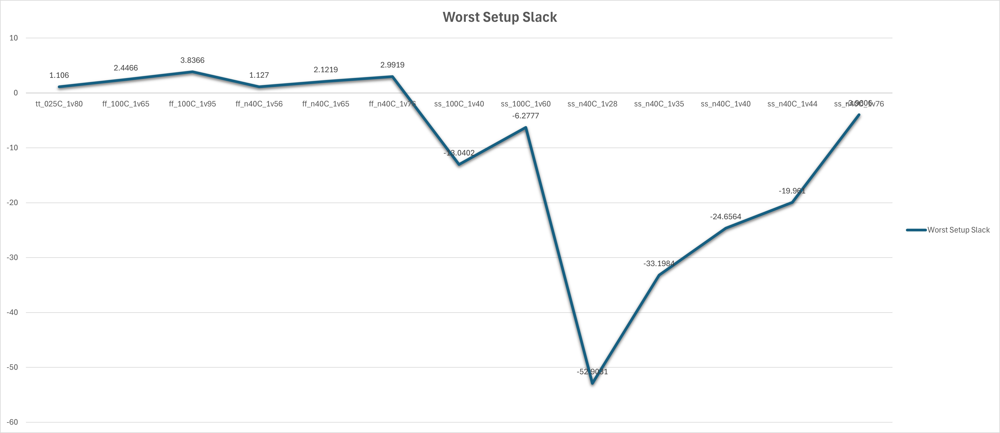

<details>
  <Summary><strong> Day 7 : Timing Graphs using OpenSTA</strong></summary>

## 📚 Contents
- [Introduction to STA](#introduction-to-sta)
- [OpenSTA Tool Installation](#opensta-tool-installation)
- [Timing Analysis using In-line Commands](#timing-analysis-using-in-line-commands)
- [Timing Analysis using TCL File](#timing-analysis-using-tcl-file)
- [SPEF-Based Timing Analysis](#spef-based-timing-analysis)
- [VSDBabySoC Basic Timing Analysis](#vsdbabysoc-basic-timing-analysis)
- [VSDBabySoC PVT Corner Analysis (Post-Synthesis Timing)](#vsdbabysoc-pvt-corner-analysis-post-synthesis-timing)

## Introduction to STA
### 📌 What is STA?
Static Timing Analysis (STA) is a vital technique used in digital design to evaluate whether a circuit meets its timing requirements—without needing test vectors or simulation. Instead of checking design behavior with input data, STA inspects all possible timing paths in the circuit and ensures that signals travel through them within defined time constraints.

It does this by:
- Adding cell delays (from gates) and net delays (from interconnects) to compute path delays.
- Comparing these delays against setup and hold requirements to detect timing violations.

This method is especially useful for complex, high-speed designs where accurate timing verification is critical. Although analog simulations like SPICE are highly accurate, they are often too slow for large digital designs—this is where STA becomes indispensable due to its speed, coverage, and efficiency.

Whether you're an architect, RTL designer, or backend engineer:
- **Design engineers** use simulation for functionality and define timing constraints.
- **Synthesis and PnR engineers** use STA to optimize and validate that the design meets timing across all paths and conditions.

### 🎯 Why is STA Important?
STA plays two major roles in the design flow:
1. Guiding Design Optimization : During synthesis and place-and-route, STA calculates delays and helps the tool select optimal cells from the library to meet timing requirements (e.g., choosing faster cells where needed).

2. Verifying Timing Closure: After building the netlist or completing layout, STA ensures the circuit can operate correctly at the target frequency under various conditions.

By ensuring all paths meet setup and hold timing, STA helps ensure that the final silicon will function reliably and at the desired speed.

STA is used multiple times throughout the digital design cycle - during synthesis, placement and routing, and again for final signoff—to verify that the design meets timing constraints under different operating conditions. The diagram below illustrates where STA is applied in a typical RTL-to-GDSII flow:


### Timing Paths
Timing paths represent the route a signal takes from one point in the circuit to another — typically from a flip-flop (or input port) through a series of logic gates and nets, to another flip-flop (or output port). STA tools break these paths down into two primary components:
- Cell Delays: Time it takes for a signal to propagate through a logic gate.
- Net Delays: Delay introduced by the interconnect (wires) between cells.

These delays are combined to compute the total path delay and are compared against the required timing constraints (setup and hold times).

### Timing Libraries
Timing libraries, usually provided in .lib format, are technology files that describe the behavior and delays of standard cells used in a digital design. These libraries include:
- Cell delays
- Output transition data (slew)
- Power usage
- Pin capacitance
- Setup/Hold checks
- Timing arcs and their attributes

STA tools rely heavily on this library data to accurately model and verify the timing behavior of the design.

### Timing Arcs
A timing arc defines a relationship between an input and an output pin of a cell. It models how a change on an input pin affects an output pin. Timing arcs are the basic units used by STA tools to trace signal transitions through the logic gates.

There are two main types:
- Cell timing arcs (within gates)
- Net timing arcs (between cells)

Each arc includes characteristics like delay, slew, and unateness.

### Timing Arc Characteristics
Every timing arc is described by several key properties:
- **Unateness**: Defines the logical relationship between input and output transitions.
  - *Positive unate*: Rising input → Rising output (e.g., Buffer)
  - *Negative unate*: Rising input → Falling output (e.g., Inverter)
  - *Non-unate*: Output behavior varies depending on logic
- **Slew (Transition Time)**: Describes how fast the signal transitions from low to high (rise) or high to low (fall). It's affected by the driving strength and load on the pin.
- **Delay**: Time taken for a signal to propagate through the cell, influenced by input slew and output load.

🧱 Cell Delay
Caused by the transistors and logic within a standard cell (like AND, OR, INV). Affected by:
  - Input slew (how fast the input changes)
  - Output load (capacitance the output drives)

Measured using Lookup Tables (LUTs) in the library.

🔌 Net Delay
Caused by the resistance and capacitance of interconnects (wires) between cells. Often estimated using:
- Wire Load Models (WLMs) during synthesis
- Extracted parasitics (SPEF) after place and route for accurate analysis

Net delay becomes more dominant than cell delay in advanced technology nodes (<90nm).

## OpenSTA Tool Installation

OpenSTA is an open-source gate-level Static Timing Analysis tool developed by Parallax Software. 

- You can install OpenSTA using two different methods:
  - Native Installation with Local CUDD: This method involves installing OpenSTA directly on your system using a manually built CUDD.
  - Docker-based Installation: This method involves installing OpenSTA inside a Docker container, which can be self-contained and clean.

### 🔹 Method 1: Native Installation with Local CUDD
This method provides full control and is suitable for script automation.

#### Steps:

##### Step 1: Install prerequisites:
  
```bash
sudo apt update
sudo apt install -y build-essential cmake git \
  tcl-dev swig bison flex zlib1g-dev libeigen3-dev
```
  
##### Step 2: Build and install CUDD:
  
```bash
wget https://github.com/davidkebo/cudd/raw/main/cudd_versions/cudd-3.0.0.tar.gz
tar -xvzf cudd-3.0.0.tar.gz
cd cudd-3.0.0
./configure --prefix=$HOME/cudd
make -j$(nproc)
make install
cd ..
```


  
##### Step3: Build OpenSTA with CMake:
  
  ```bash
  git clone https://github.com/parallaxsw/OpenSTA.git
  cd OpenSTA
  mkdir build && cd build
  cmake -DCUDD_DIR=$HOME/cudd ..
  make -j$(nproc)
  ./sta
  ```


### 🔹 Method 2: Docker-based Installation
This method offers a clean, isolated, ready-to-use environment.

#### Steps:

##### Step 1: Install Docker on Ubuntu
```bash
# 1. Remove any older Docker versions (optional)
sudo apt remove docker docker-engine docker.io containerd runc

# 2. Update and install prerequisites
sudo apt update
sudo apt install -y ca-certificates curl gnupg lsb-release

# 3. Add Docker’s official GPG key
sudo mkdir -p /etc/apt/keyrings
curl -fsSL https://download.docker.com/linux/ubuntu/gpg | \
  sudo gpg --dearmor -o /etc/apt/keyrings/docker.gpg

# 4. Set up the Docker stable repository
echo \
  "deb [arch=$(dpkg --print-architecture) signed-by=/etc/apt/keyrings/docker.gpg] \
  https://download.docker.com/linux/ubuntu $(lsb_release -cs) stable" | \
  sudo tee /etc/apt/sources.list.d/docker.list > /dev/null

# 5. Install Docker Engine
sudo apt update
sudo apt install -y docker-ce docker-ce-cli containerd.io docker-buildx-plugin docker-compose-plugin
```

##### Step 2: Start Docker
```bash
sudo systemctl start docker
sudo systemctl enable docker
```

##### Step 3: Verify Docker is working
```bash
sudo docker run hello-world
```

- This should print a "Hello from Docker!" message confirming Docker is installed correctly.


##### Step 4: Clone the OpenSTA Repository
```bash
git clone https://github.com/parallaxsw/OpenSTA.git
cd OpenSTA
```

##### Step 5: Build the OpenSTA Docker Image
```bash
sudo docker build --file Dockerfile.ubuntu22.04 --tag opensta .
```
- This will take a few minutes and install all dependencies (including CUDD) inside the Docker image.

##### Step 6: Run OpenSTA from Docker
```bash
sudo docker run -it -v $HOME:/data opensta
```
Here,
- -it: interactive terminal
- -v $HOME:/data: mounts your home directory inside the container so you can access files


**Once inside, you’ll see the % prompt — you're ready to use OpenSTA.**

## Timing Analysis using In line Commands
- Basic timing analysis using in-line commands within OpenSTA shell (%).

```bash
# Load the Liberty timing library (standard cell delays, arcs, etc.)
read_liberty /OpenSTA/examples/nangate45_slow.lib.gz

# Read the synthesized gate-level Verilog netlist
read_verilog /OpenSTA/examples/example1.v

# Set the top-level module of the design (as defined in the Verilog)
link_design top

# Create a clock named 'clk' with a 10 ns period, connected to clk1, clk2, and clk3
create_clock -name clk -period 10 {clk1 clk2 clk3}

# Define input delays of 0 ns for inputs in1 and in2, relative to the clk
set_input_delay -clock clk 0 {in1 in2}

# Report any timing violations (setup/hold) across the design
report_checks
```


- The report shows analysis for a <strong> maximum delay path (i.e setup check)</strong> from register `r2` to `r3` on the clock `clk`.
- The default behavior of the `report_checks` in OpenSTA is to report maximum delay paths (`report_checks -path_delay max`) , unless explicitly asked for minumum (hold) analysis (i.e `report_checks -path_delay min`).
- To report both setup (max) and hold (min) paths we can use `report_checks -path_delay min_max` 
- Here, the path starts at the <strong> Q output of reg r2</strong> (a DFF) and the path ends at the <strong> D input of reg r3</strong> (another DFF).

#### Analyzing report output:
the netlist we used for the analysis here is <strong> `example1.v`</strong>
```bash
module top (in1, in2, clk1, clk2, clk3, out);
  input in1, in2, clk1, clk2, clk3;
  output out;
  wire r1q, r2q, u1z, u2z;

  DFF_X1 r1 (.D(in1), .CK(clk1), .Q(r1q));
  DFF_X1 r2 (.D(in2), .CK(clk2), .Q(r2q));
  BUF_X1 u1 (.A(r2q), .Z(u1z));
  AND2_X1 u2 (.A1(r1q), .A2(u1z), .ZN(u2z));
  DFF_X1 r3 (.D(u2z), .CK(clk3), .Q(out));
endmodule // top
```

##### Netlist diagram for example1.v generated using yosys


##### Delay Breakdown

📌 Arrival Time
| **Delay (ns)** | **Time (ns)** | **Description**                          |
|----------------|---------------|------------------------------------------|
| 0.00           | 0.00          | Clock clk (rise edge) → start           |
| 0.00           | 0.00          | Clock network delay (ideal)             |
| 0.23           | 0.23          | r2/Q → r2/Q (output of DFF r2)          |
| 0.08           | 0.31          | Through u1 (BUF_X1)                      |
| 0.10           | 0.41          | Through u2 (AND2_X1)                     |
| 0.00           | 0.41          | r3/D (input of DFF r3) → data arrival   |

so, the arrival time = 0.41ns

📌 Required Time
| **Delay (ns)** | **Time (ns)** | **Description**                |
|----------------|---------------|--------------------------------|
| 10.00          | 10.00         | Next rising edge of clk        |
| 10.00          | 10.00         | Ideal clock delay              |
| 10.00          | 10.00         | r3/CK clock edge               |
| -0.16          | 9.84          | Setup time requirement         |

so, the data required time = 9.84ns

✅ Result
Slack = Data required time (9.84ns) - Data arrival time (0.41ns) 
Slack = 9.43ns (MET)

- Since the slack is positive, setup timing is met. 


## Timing Analysis using TCL file

**min_max_delays1.tcl**
```bash
# min/max delay calc example
read_liberty -max /data/OpenSTA/examples/nangate45_slow.lib.gz
read_liberty -min /data/OpenSTA/examples/nangate45_fast.lib.gz
read_verilog /data/OpenSTA/examples/example1.v
link_design top
create_clock -name clk -period 10 {clk1 clk2 clk3}
set_input_delay -clock clk 0 {in1 in2}
report_checks -path_delay min_max
```


#### 📝 TCL Script Breakdown

| **Command** | **Description** |
|-------------|-----------------|
| `read_liberty -max /data/OpenSTA/examples/nangate45_slow.lib.gz` | Loads the **slow timing corner** (used for setup checks / max delay analysis). |
| `read_liberty -min /data/OpenSTA/examples/nangate45_fast.lib.gz` | Loads the **fast timing corner** (used for hold checks / min delay analysis). |
| `read_verilog /data/OpenSTA/examples/example1.v` | Reads in the **gate-level netlist** for your synthesized design. |
| `link_design top` | Specifies the **top module** of your design and connects it to the loaded libraries. |
| `create_clock -name clk -period 10 {clk1 clk2 clk3}` | Creates a clock named `clk` with a **10 ns period**, applied to nets `clk1`, `clk2`, and `clk3`. |
| `set_input_delay -clock clk 0 {in1 in2}` | Sets an **input arrival delay of 0 ns** relative to `clk` for input ports `in1` and `in2` (helps avoid false hold violations). |
| `report_checks -path_delay min_max` | Reports **both min (hold) and max (setup)** timing paths for verification. |


- to execute the above tcl script in OpenSTA shell, run the follwoing command in terminal
```bash
docker run -it -v $HOME:/data opensta /data/OpenSTA/examples/min_max_delays1.tcl
```

##### Generated Timing Report
```bash
Startpoint: in1 (input port clocked by clk)
Endpoint: r1 (rising edge-triggered flip-flop clocked by clk)
Path Group: clk
Path Type: min

  Delay    Time   Description
---------------------------------------------------------
   0.00    0.00   clock clk (rise edge)
   0.00    0.00   clock network delay (ideal)
   0.00    0.00 v input external delay
   0.00    0.00 v in1 (in)
   0.00    0.00 v r1/D (DFF_X1)
           0.00   data arrival time

   0.00    0.00   clock clk (rise edge)
   0.00    0.00   clock network delay (ideal)
   0.00    0.00   clock reconvergence pessimism
           0.00 ^ r1/CK (DFF_X1)
   0.00    0.00   library hold time
           0.00   data required time
---------------------------------------------------------
           0.00   data required time
          -0.00   data arrival time
---------------------------------------------------------
           0.00   slack (VIOLATED)


Startpoint: r2 (rising edge-triggered flip-flop clocked by clk)
Endpoint: r3 (rising edge-triggered flip-flop clocked by clk)
Path Group: clk
Path Type: max

  Delay    Time   Description
---------------------------------------------------------
   0.00    0.00   clock clk (rise edge)
   0.00    0.00   clock network delay (ideal)
   0.00    0.00 ^ r2/CK (DFF_X1)
   0.23    0.23 v r2/Q (DFF_X1)
   0.08    0.31 v u1/Z (BUF_X1)
   0.10    0.41 v u2/ZN (AND2_X1)
   0.00    0.41 v r3/D (DFF_X1)
           0.41   data arrival time

  10.00   10.00   clock clk (rise edge)
   0.00   10.00   clock network delay (ideal)
   0.00   10.00   clock reconvergence pessimism
          10.00 ^ r3/CK (DFF_X1)
  -0.16    9.84   library setup time
           9.84   data required time
---------------------------------------------------------
           9.84   data required time
          -0.41   data arrival time
---------------------------------------------------------
           9.43   slack (MET)

```


## SPEF-Based Timing Analysis

## VSDBabySoC Basic timing Analysis
- This section documents the process of performing **static timing analysis (STA)** on the VSDBabySoC design using OpenSTA.
- It includes preparing Liberty libraries, netlist, and constraints, followed by executing min/max delay checks.

**Directory Preparation**
```bash
# Create directory to store Liberty timing libraries
mkdir -p OpenSTA/examples/timing_libs/

#Create directory to store synthesized netlist and SDC constraint files
mkdir -p OpenSTA/examples/BabySoC/

# Copy all Liberty (.lib) files (standard cell + IPs) to timing_libs folder
cp /home/sdudigani/VLSI/VSDBabySoC/src/lib/* /home/sdudigani/OpenSTA/examples/timing_libs/

# Copy SDC file containing clock and I/O timing constraints
cp /home/sdudigani/VLSI/VSDBabySoC/src/sdc/vsdbabysoc_synthesis.sdc /home/sdudigani/OpenSTA/examples/BabySoC/

# Copy synthesized gate-level Verilog netlist of VSDBabySoC
cp /home/sdudigani/VLSI/VSDBabySoC/src/module/vsdbabysoc.synth.v /home/sdudigani/OpenSTA/examples/BabySoC/

# (Optional) Copy GCD SDC file if used for testing or comparison
cp examples/gcd_sky130hd.sdc /home/sdudigani/OpenSTA/examples/BabySoC/
```

```bash
sdudigani@sdudigani-VirtualBox:~/OpenSTA$ pwd
/home/sdudigani/OpenSTA
sdudigani@sdudigani-VirtualBox:~/OpenSTA$ ls examples/BabySoC/
gcd_sky130hd.sdc  vsdbabysoc_synthesis.sdc  vsdbabysoc.synth.v
sdudigani@sdudigani-VirtualBox:~/OpenSTA$ ls examples/timing_libs/
avsddac.lib  avsdpll.lib  sky130_fd_sc_hd__tt_025C_1v80.lib
sdudigani@sdudigani-VirtualBox:~/OpenSTA$ 
```

**TCL Script to run complete min/max timing checks on the SoC**
```bash
# Load Liberty Libraries (standard cell + IPs)
read_liberty -min /data/OpenSTA/examples/timing_libs/sky130_fd_sc_hd__tt_025C_1v80.lib
read_liberty -max /data/OpenSTA/examples/timing_libs/sky130_fd_sc_hd__tt_025C_1v80.lib

read_liberty -min /data/OpenSTA/examples/timing_libs/avsdpll.lib
read_liberty -max /data/OpenSTA/examples/timing_libs/avsdpll.lib

read_liberty -min /data/OpenSTA/examples/timing_libs/avsddac.lib
read_liberty -max /data/OpenSTA/examples/timing_libs/avsddac.lib

# Read Synthesized Netlist
read_verilog /data/OpenSTA/examples/BabySoC/vsdbabysoc.synth.v

# Link the Top-Level Design
link_design vsdbabysoc

# Apply SDC Constraints
read_sdc /data/OpenSTA/examples/BabySoC/vsdbabysoc_synthesis.sdc

# Generate Timing Report
report_checks
```

**save the above script as vsdbabysoc_min_max_delays.tcl within ~/OpenSTA/examples/BabySoC directory**


- **Now run the above script inside the Docker container with the following command**
  ```bash
  docker run -it -v $HOME:/data opensta /data/OpenSTA/examples/BabySoC/min_max_delays.tcl
  ```

- **❌It reports the following error** 
  ```bash
  sdudigani@sdudigani-VirtualBox:~/OpenSTA$ sudo docker run -it -v $HOME:/data opensta /data/OpenSTA/examples/BabySoC/min_max_delays.tcl
  OpenSTA 2.7.0 0c16e145bb Copyright (c) 2025, Parallax Software, Inc.
  License GPLv3: GNU GPL version 3 <http://gnu.org/licenses/gpl.html>
  
  This is free software, and you are free to change and redistribute it
  under certain conditions; type `show_copying' for details. 
  This program comes with ABSOLUTELY NO WARRANTY; for details type `show_warranty'.
  Warning: /data/OpenSTA/examples/timing_libs/sky130_fd_sc_hd__tt_025C_1v80.lib line 23, default_fanout_load is 0.0.
  Warning: /data/OpenSTA/examples/timing_libs/sky130_fd_sc_hd__tt_025C_1v80.lib line 1, library sky130_fd_sc_hd__tt_025C_1v80 already exists.
  Warning: /data/OpenSTA/examples/timing_libs/sky130_fd_sc_hd__tt_025C_1v80.lib line 23, default_fanout_load is 0.0.
  Error: /data/OpenSTA/examples/timing_libs/avsdpll.lib line 54, syntax error
  % exit
  ```


- **✅To fix this syntax error:**
  - open the file
    ```bash
    gvim ~/OpenSTA/examples/timing_libs/avsdpll.lib
    ```
  - Go to line 54 as mentioned in error message and replace any lines like
      ```bash
        //pin (GND#2) {
        direction : input;
        ...
        //}
      ```

    to:
      ```bash
      /*
      pin (GND#2) {
      direction : input;
      ...
      }
      */
    ```
  - Save and close the file.
  - Rerun the tcl script
    ```bash
    sudo docker run -it -v $HOME:/data opensta /data/OpenSTA/examples/BabySoC/min_max_delays.tcl
    ```


**Generated Timing Report**
```bash
Startpoint: _10446_ (rising edge-triggered flip-flop clocked by clk)
Endpoint: _10034_ (rising edge-triggered flip-flop clocked by clk)
Path Group: clk
Path Type: max

  Delay    Time   Description
---------------------------------------------------------
   0.00    0.00   clock clk (rise edge)
   0.00    0.00   clock network delay (ideal)
   0.00    0.00 ^ _10446_/CLK (sky130_fd_sc_hd__dfxtp_1)
   4.13    4.13 ^ _10446_/Q (sky130_fd_sc_hd__dfxtp_1)
   5.06    9.19 v _8121_/Y (sky130_fd_sc_hd__clkinv_1)
   0.57    9.76 ^ _8684_/Y (sky130_fd_sc_hd__o211ai_1)
   0.00    9.76 ^ _10034_/D (sky130_fd_sc_hd__dfxtp_1)
           9.76   data arrival time

  11.00   11.00   clock clk (rise edge)
   0.00   11.00   clock network delay (ideal)
   0.00   11.00   clock reconvergence pessimism
          11.00 ^ _10034_/CLK (sky130_fd_sc_hd__dfxtp_1)
  -0.14   10.86   library setup time
          10.86   data required time
---------------------------------------------------------
          10.86   data required time
          -9.76   data arrival time
---------------------------------------------------------
           1.11   slack (MET)
```

## VSDBabySoC PVT Corner Analysis (Post-Synthesis Timing)
- STA is performed across all PVT corners to validate that the design meets timing requirements.
- The worst max path (Setup-critical) corners in sub-40nm nodes are generally:
  - ss_LowTemp_LowVolt
  - ss_HighTemp_LowVolt (Slowest corners)
- The worst min path (Hold-critical) corners are:
  - ff_LowTemp_HighVolt
  - ff_HighTemp_HighVolt (Fastest corners)

- The following TCL script <strong> (```pvt_corner_analysis.tcl```)</strong> can be executed to perform STA for the available PVT corners using the Sky130 timing libraries.
```bash
# Load IP-specific Liberty files once
read_liberty /data/OpenSTA/examples/timing_libs/avsdpll.lib
read_liberty /data/OpenSTA/examples/timing_libs/avsddac.lib

# List of PVT corner Liberty files
set list_of_lib_files(1) "sky130_fd_sc_hd__tt_025C_1v80.lib"
set list_of_lib_files(2) "sky130_fd_sc_hd__ff_100C_1v65.lib"
set list_of_lib_files(3) "sky130_fd_sc_hd__ff_100C_1v95.lib"
set list_of_lib_files(4) "sky130_fd_sc_hd__ff_n40C_1v56.lib"
set list_of_lib_files(5) "sky130_fd_sc_hd__ff_n40C_1v65.lib"
set list_of_lib_files(6) "sky130_fd_sc_hd__ff_n40C_1v76.lib"
set list_of_lib_files(7) "sky130_fd_sc_hd__ss_100C_1v40.lib"
set list_of_lib_files(8) "sky130_fd_sc_hd__ss_100C_1v60.lib"
set list_of_lib_files(9) "sky130_fd_sc_hd__ss_n40C_1v28.lib"
set list_of_lib_files(10) "sky130_fd_sc_hd__ss_n40C_1v35.lib"
set list_of_lib_files(11) "sky130_fd_sc_hd__ss_n40C_1v40.lib"
set list_of_lib_files(12) "sky130_fd_sc_hd__ss_n40C_1v44.lib"
set list_of_lib_files(13) "sky130_fd_sc_hd__ss_n40C_1v76.lib"

for {set i 1} {$i <= [array size list_of_lib_files]} {incr i} {
    read_liberty /data/OpenSTA/examples/timing_libs/$list_of_lib_files($i)
    read_verilog /data/OpenSTA/examples/BabySoC/vsdbabysoc.synth.v
    link_design vsdbabysoc
    read_sdc /data/OpenSTA/examples/BabySoC/vsdbabysoc_synthesis.sdc

    report_checks -path_delay min_max -fields {nets cap slew input_pins fanout} -digits {4} \
        > /data/OpenSTA/examples/BabySoC/sta_output/min_max_$list_of_lib_files($i).txt

    exec echo "$list_of_lib_files($i)" >> /data/OpenSTA/examples/BabySoC/sta_output/sta_worst_max_slack.txt
    report_worst_slack -max -digits {4} >> /data/OpenSTA/examples/BabySoC/sta_output/sta_worst_max_slack.txt

    exec echo "$list_of_lib_files($i)" >> /data/OpenSTA/examples/BabySoC/sta_output/sta_worst_min_slack.txt
    report_worst_slack -min -digits {4} >> /data/OpenSTA/examples/BabySoC/sta_output/sta_worst_min_slack.txt

    exec echo "$list_of_lib_files($i)" >> /data/OpenSTA/examples/BabySoC/sta_output/sta_tns.txt
    report_tns -digits {4} >> /data/OpenSTA/examples/BabySoC/sta_output/sta_tns.txt

    exec echo "$list_of_lib_files($i)" >> /data/OpenSTA/examples/BabySoC/sta_output/sta_wns.txt
    report_wns -digits {4} >> /data/OpenSTA/examples/BabySoC/sta_output/sta_wns.txt
}
```

- The timing libraries can be downloaded from: https://github.com/efabless/skywater-pdk-libs-sky130_fd_sc_hd/tree/master/timing

```bash
sdudigani@sdudigani-VirtualBox:~$ git clone https://github.com/efabless/skywater-pdk-libs-sky130_fd_sc_hd.git
sdudigani@sdudigani-VirtualBox:~$ cd ~/OpenSTA/examples/timing_libs/
sdudigani@sdudigani-VirtualBox:~$ cp ~/skywater-pdk-libs-sky130_fd_sc_hd/timing/* .
sdudigani@sdudigani-VirtualBox:~/OpenSTA/examples/timing_libs$ c
total 329M
-rw-rw-r-- 1 sdudigani sdudigani 1.9K Jun  4 18:29 avsddac.lib
-rw-rw-r-- 1 sdudigani sdudigani 1.6K Jun  4 19:06 avsdpll.lib
-rw-rw-r-- 1 sdudigani sdudigani  13M Jun  5 12:50 sky130_fd_sc_hd__ff_100C_1v65.lib
-rw-rw-r-- 1 sdudigani sdudigani  13M Jun  5 12:50 sky130_fd_sc_hd__ff_100C_1v95.lib
-rw-rw-r-- 1 sdudigani sdudigani  13M Jun  5 12:50 sky130_fd_sc_hd__ff_n40C_1v56.lib
-rw-rw-r-- 1 sdudigani sdudigani  13M Jun  5 12:50 sky130_fd_sc_hd__ff_n40C_1v76.lib
-rw-rw-r-- 1 sdudigani sdudigani  13M Jun  5 12:50 sky130_fd_sc_hd__ff_n40C_1v65.lib
-rw-rw-r-- 1 sdudigani sdudigani  25M Jun  5 12:50 sky130_fd_sc_hd__ff_n40C_1v95_ccsnoise.lib.part1
-rw-rw-r-- 1 sdudigani sdudigani  25M Jun  5 12:50 sky130_fd_sc_hd__ff_n40C_1v95_ccsnoise.lib.part2
-rw-rw-r-- 1 sdudigani sdudigani  18M Jun  5 12:50 sky130_fd_sc_hd__ff_n40C_1v95_ccsnoise.lib.part3
-rw-rw-r-- 1 sdudigani sdudigani  13M Jun  5 12:50 sky130_fd_sc_hd__ff_n40C_1v95.lib
-rw-rw-r-- 1 sdudigani sdudigani  13M Jun  5 12:50 sky130_fd_sc_hd__ss_100C_1v40.lib
-rw-rw-r-- 1 sdudigani sdudigani  13M Jun  5 12:50 sky130_fd_sc_hd__ss_100C_1v60.lib
-rw-rw-r-- 1 sdudigani sdudigani  13M Jun  5 12:50 sky130_fd_sc_hd__ss_n40C_1v28.lib
-rw-rw-r-- 1 sdudigani sdudigani  13M Jun  5 12:50 sky130_fd_sc_hd__ss_n40C_1v35.lib
-rw-rw-r-- 1 sdudigani sdudigani  13M Jun  5 12:50 sky130_fd_sc_hd__ss_n40C_1v40.lib
-rw-rw-r-- 1 sdudigani sdudigani  13M Jun  5 12:50 sky130_fd_sc_hd__ss_n40C_1v44.lib
-rw-rw-r-- 1 sdudigani sdudigani  25M Jun  5 12:50 sky130_fd_sc_hd__ss_n40C_1v60_ccsnoise.lib.part1
-rw-rw-r-- 1 sdudigani sdudigani  25M Jun  5 12:50 sky130_fd_sc_hd__ss_n40C_1v60_ccsnoise.lib.part2
-rw-rw-r-- 1 sdudigani sdudigani  15M Jun  5 12:50 sky130_fd_sc_hd__ss_n40C_1v60_ccsnoise.lib.part3
-rw-rw-r-- 1 sdudigani sdudigani  13M Jun  5 12:50 sky130_fd_sc_hd__ss_n40C_1v76.lib
-rw-rw-r-- 1 sdudigani sdudigani  13M Jun  5 12:50 sky130_fd_sc_hd__ss_n40C_1v60.lib
-rw-rw-r-- 1 sdudigani sdudigani  13M Jun  5 12:50 sky130_fd_sc_hd__tt_025C_1v80.lib
-rw-rw-r-- 1 sdudigani sdudigani  13M Jun  5 12:50 sky130_fd_sc_hd__tt_100C_1v80.lib
```

- Run the ```pvt_corner_analysis.tcl``` script to generate the output reports.
```bash
docker run -it -v $HOME:/data opensta /data/OpenSTA/examples/BabySoC/pvt_corner_analysis.tcl
```

- The script executed succesfully and reports are generated.
- 📂 All reports were saved in the /data/OpenSTA/examples/BabySoC/sta_output/ directory for post-processing and summary visualization.


#### Timing Summary Across PVT Corners (Post-Synthesis STA Results)
The table below summarizes the sta results for the vsdbabysoc synthesized design across various 13 PVT (Process-Voltage-Temperature) corners using the Sky130 standard cell libraries. These values were recorded from the generated reports in sta_output/ after executing custom Tcl script (```pvt_corner_analysis.tcl```) that iterates through multiple Liberty files.


#### Timing Plots Across PVT Corners





