<details>
  <Summary><strong> Day 8 : Circuit Design and Spice Simulation</strong></summary>

## Contents

- [SPICE Simulation](#spice-simulation)  
  - [Why Use SPICE?](#why-use-spice)  
  - [Common Spice Elements and Spice Units](#common-spice-elements-and-spice-units)  
  - [Inverter Circuit](#inverter-circuit)  
  - [SPICE Simulation Results of Inverter Circuit](#spice-simulation-results-of-inverter-circuit)  
  - [Understanding Delay Tables](#understanding-delay-tables)  
- [NMOS Transistor Basic Element in Circuit Design](#nmos-transistor-basic-element-in-circuit-design)
  - [Effect of Substrate or Body Bias on Threshold Voltage](#effect-of-substrate-or-body-bias-on-threshold-voltage)
  - [Resistive or Linear or Triode Region of Operation](#resistive-or-linear-or-triode-region-of-operation)
    - [Drift Current Theory](#drift-current-theory)  
    - [Drain Current Model for Linear Region of Operation](#drain-current-model-for-linear-region-of-operation)  
- [SPICE Conclusion to Resistive Operation](#spice-conclusion-to-resistive-operation)  
- [Saturation or Pinch-off Region of Operation](#saturation-or-pinch-off-region-of-operation)
  - [Drain Current Model for Saturation Region of Operation](#drain-current-model-for-saturation-region-of-operation)  
- [Basic SPICE Setup](#basic-spice-setup)
  - [Circuit Description in SPICE Syntax](#circuit-description-in-spice-syntax)

<a id="spice-simulation"></a>
## SPICE Simulation
SPICE (Simulation Program with Integrated Circuit Emphasis) is a powerful simulation tool developed at UC Berkeley in the early 1970’s, used in electronics design to model and analyze the behavior of electronic circuits before they are physically built.

The input file is often called a ***SPICE deck*** and each line is called a ***card*** because it was once provided to a mainframe as a deck of punch cards.

A circuit simulator is provided with an input file that contains:
- A *netlist* consisting of components and nodes detailing the circuit connectivity.
- The netlist can be entered by hand or extracted from a circuit schematic or layout in a CAD program.
- Component behaviour by means of *device models* and *model parameters*.
- The Initial state of the circuit -- *initial conditions*
- Inputs to the circuit, called *stimulus*
- *Simulation options* & *analysis commands* that explain the type of simulation to be run.

<a id="why-use-spice"></a>
### Why Use SPICE?  
- **Verify Correctness**: Check that every gate, bias network or feedback loop operates as intended under realistic device models—catching design errors early.  
- **Predict Performance**: Run DC sweeps and transient analyses to extract rise/fall times, propagation delays, bandwidth and short-circuit currents critical for digital timing closure and analog bandwidth planning. 
- **Assess Power**: Quantify dynamic and leakage power across supply-voltage, temperature and process corners to guide low-power design choices.
- **Explore Variability**: Use parametric and Monte Carlo studies to probe component tolerances, layout parasitics and manufacturing variation—refining margins before tape-out.


<a id="common-spice-elements-and-spice-units"></a>
### Common Spice Elements and Spice Units


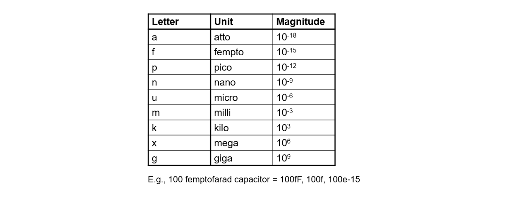


<a id="inverter-circuit"></a>
### Inverter Circuit

An inverter is a simple circuit that reverses the input signal:
- Uses two transistors: PMOS and NMOS.
- PMOS connects to the power supply (VDD), NMOS connects to ground (GND).
- Both transistors have their gates connected to the input and their drains connected to the output.

Operation:
- When the input is high, the NMOS transistor conducts, making the output low.
- When the input is low, the PMOS transistor conducts, making the output high.

Role of SPICE in Inverter Design
- Functionality Check: Verify that the inverter correctly flips the input signal.
- Timing Analysis: Measure how quickly the inverter responds to changes in the input.
- Power Analysis: Determine the power usage of the inverter during operation.

SPICE simulations are essential for designing circuits that are reliable and efficient. They help identify issues early and allow for optimization before the physical circuit is built.

**CMOS Inverter Circuit Diagram**

This schematic shows a standard CMOS inverter:

- Vin is applied to both PMOS and NMOS gates.
- Vout is taken at the common drain node.
- PMOS connects from VDD to the output.
- NMOS connects from the output to VSS (GND).
- C<sub>L</sub> represents the load capacitance, mimicking the next stage or parasitic load.


<a id="spice-simulation-results-of-inverter-circuit"></a>
### SPICE Simulation Results of Inverter Circuit

First graph shows the NMOS drain current (I<sub>D</sub>) versus output voltage (V<sub>out</sub>) for several gate‐to‐source biases (V<sub>in</sub>=0, 0.5, 1, 1.5, 2 V). Each curve is an I–V “slice” of the NMOS. While the second graph indicates voltage transfer charcteristics (V<sub>out</sub> vs V<sub>in</sub>)


<a id="understanding-delay-tables"></a>
### Understanding Delay Tables
In digital timing analysis cell delay is a function of input slew (input transition) and output load. The delay values are usually stored in 2D LUTs (Lookup Tables) or 3D LUTs.
- 2D LUT: Slew × Load → Delay
- 3D LUT: Slew × Load × Related‐Load → Delay (uses a third dimension called related output load (Capacitance load seen by the related output pin).
Example of a 2D LUT is shown below:

Here, each buffer (CBUF1 and CBUF2) has a delay table defined which is indexed by input slew as rows (eg: 20ps, 40ps, 60ps, 80ps) and output load as columns (eg: 10fF, 30fF, 50fF, 70fF, 90fF, 110fF) while the corresponding delay values are x1 to x24 for CBUF1, y1 to y24 for CBUF2.


<a id="nmos-transistor-basic-element-in-circuit-design"></a>
## NMOS Transistor Basic Element in Circuit Design


This diagram shows a cross-section of an n-channel MOSFET (NMOS) and labels its key regions and terminals:
- *P-substrate (Body, B)*: The bulk of the device is a p-type silicon wafer. It’s typically tied to the lowest potential (ground) in an NMOS circuit.
- *n⁺ Source (S)* and *Drain (D)* Regions: Heavily doped n-type diffusion areas implanted into the p-substrate. Source is where electrons enter; drain is where they exit when the device is on.
- *Gate (G) and Gate Oxide*: Gate Oxide is very thin insulating layer of SiO₂ that separates the gate electrode from the silicon while Poly-Si (or metal) Gate is a conductive layer deposited on top of the oxide; applying voltage here controls the channel.


This diagram illustrates the NMOS transistor in its off (zero‐gate‐bias) condition and how the threshold voltage is defined. 
-  Here, with *source, drain, and substrate are tied to ground*. With the gate-to-source voltage at zero, no inversion layer forms beneath the thin silicon oxide gate dielectric, so the channel remains *non-conductive*.
-  At the same time, the p–n junctions between the n⁺ source/drain regions and the p-type substrate behave like reverse-biased diodes, blocking any current path from source to drain. In effect, the transistor presents a very high resistance between its source and drain.

The **threshold voltage (Vₜ)**, is defined as the minimum gate-to-source voltage required to attract enough electrons to the oxide interface to invert the channel region; only when V<sub>gs</sub> rises above Vₜ does the device switch on and allow current to flow.


**Applying +V<sub>gs</sub>**  
  As the gate voltage rises above 0 V, the gate electrode becomes positively charged.  
- **Hole Depletion**: The electric field repels p-type holes away from the silicon–oxide interface, forming the depletion region beneath the gate.  
- **Electron Attraction**: Negative carriers (electrons) from the n⁺ source/drain diffuse toward the gate region, beginning to accumulate at the silicon surface.  
- **Onset of Inversion** : These accumulated electrons form the first *“inversion layer”* under the oxide setting the stage for a continuous channel once V<sub>gs</sub> reaches the threshold voltage.


**Further Increase in V<sub>gs</sub>**  
 As V<sub>gs</sub> continues to rise, the depletion region beneath the gate widens until the surface of the p-substrate between the n⁺ source and drain inverts to n-type material. This phenomenon is known as strong inversion (or surface inversion).

*The gate-to-source (V<sub>gs</sub>) potential at which strong inversion happens is called as Threshold Volatge.*

As V<sub>gs</sub> continues to rise above the threshold voltage V<sub>t</sub>, the depletion region beneath the gate reaches its maximum width - additional positive bias can no longer deepen it. At this point, the gate field begins to attract electrons (negative carriers) from the heavily doped n⁺ source and drain regions into the channel region under the gate oxide. As more electrons accumulate:

- **Channel formation** : The density of electrons grows until a continuous n-type channel forms between source and drain.
- **Stable depletion width** : Since the region is already fully depleted of holes, further increases in V<sub>gs</sub> no longer widen the depletion region.
- **Conductivity modulation** : The channel’s conductivity is proportional to (V<sub>gs</sub> – V<sub>t</sub>), so as V<sub>gs</sub> increases beyond V<sub>t</sub>, more electrons populate the channel, lowering its resistance and boosting drain current for a given V<sub>ds</sub>.

This strong-inversion condition—where the surface of the p-substrate between the n⁺ source and drain is inverted to n-type—is what enables the MOSFET to switch fully on.


<a id="effect-of-substrate-or-body-bias-on-threshold-voltage"></a>
### Effect of Substrate or Body Bias on Threshold Voltage
*What is Body Effect?*

Whenever there is a voltage (potential) difference between the source and substrate (body), this leads to an increase or decrease in the threshold voltage of the transistor. This is called a “body effect.”

The images shows the comparison of NMOS operation with V<sub>sb</sub> = 0 and V<sub>sb</sub> = positive value


When V<sub>sb</sub> = 0, normal channel formation happens as V<sub>gs</sub> increases.
When V<sub>sb</sub> > 0, an additional reverse bias is introduced between Source and Body (substrate).
- This increases the threshold voltage (V<sub>th</sub>).
- The depletion layer near Source becomes wider.
- More V<sub>gs</sub> is required to turn ON the transistor (stronger inversion).

This effect is known as the *Body Effect* or *Substrate Bias Effect*.


**Threshold Voltage Equation considering Body Bias:**


<a id="resistive-or-linear-or-triode-region-of-operation"></a>
### Resistive or Linear or Triode Region of Operation
Here, Gate-Source potential (V<sub>gs</sub> >= V<sub>th</sub>) and a small value of V<sub>ds</sub> is applied across the channel from Drain-to-Source.

At this stage:
- The channel is formed (strong inversion), and charge carriers flow from source to drain.
- V(x) is voltage at a point 'x' along the channel and gate-to-channel voltage at that point is: V<sub>gs</sub> - V(x).
- The induced charge density (Q<sub>i</sub>) in the channel is proportional to (V<sub>gs</sub> - V<sub>t</sub>).
- The *effective channel length (L)* and voltage V(x) profile along x-axis determine the current flow.
- This is the region where the transistor behaves like a voltage-controlled resistor.


<a id="drift-current-theory"></a>
#### Drift current theory
**Drift current** refers to the movement of charge carriers (electrons or holes) in response to an electric field. This phenomenon is driven by the force exerted by the electric field on the charged particles, leading them to 'drift' in the direction of the field.

- In the resistive region of NMOS operation (V<sub>gs</sub> > V<sub>t</sub>, small V<sub>t</sub>) current flow is mainly governed by **drift current** which arises due to the electric field created across the channel by the applied V<sub>ds</sub>.

- The induced charge in the channel at point x is given by:
  
  **Q<sub>i</sub>(x) = -C<sub>ox</sub> × [(V<sub>gs</sub> - V(x)) - V<sub>t</sub>]**

- The total drain current I<sub>D</sub> is:
  
  **I<sub>D</sub> = (velocity of charge carriers) X (available charge)X (channel width)**

where,
- I<sub>D</sub> is the **carrier drift** under the lateral electric field due to V<sub>ds</sub>
- C<sub>ox</sub> = Gate oxide capacitance
- V(x) = potential at point x along the channel
- L = Effective channel length
- W = Channel width

In this region NMOS behaved like a ```voltage-controlled resistor```. the drift current dominates due to the potential difference between source and drain.


<a id="drain-current-model-for-linear-region-of-operation"></a>
#### Drain current model for linear region of operation
The following images shows the derivation of I<sub>D</sub> equation for NMOS in linear region, starting from first-order analysis and device physics.


 - Let $V_{GS}$ be held constant at a value greater than $V_{TH}$.  
  - The applied $V_{DS}$ appears as a voltage drop across the length of the channel.  
  - As we travel along the channel from Source to Drain, the voltage (measured relative to the Source terminal) increases from zero to $V_{DS}$.
  - Thus the voltage between the gate and points along the channel decreases from $V_{GS}$ at the Source end to $V_{GD} = V_{GS}-V_{DS}$ at the Drain end.


  - At a point x along the channel, the voltage is $V(x)$, and the gate-to-channel voltage at that point equals $V_{GS} – V(x)$.

Under the assumption that this voltage exceeds the threshold voltage all along the channel, the induced channel charge per unit area at point x can be computed.

$Q_i(x) = -C_{ox} [V_{GS} - V(x) -V_{TH}]$  
$where:$  
$~~~~~~~~ C_{ox} = \dfrac{\epsilon_{ox}}{t_{ox}}$

The current is given as the product of the drift velocity of the carriers, $v_n$ and the
available charge. Due to charge conservation, it is a constant over the length of the channel.
W is the width of the channel in a direction perpendicular to the current flow.

$I_D = -v_n(x) * Q_i(x) * W$

The electron velocity is related to the electric field through a parameter called the mobility $\mu_n$ (expressed in $\dfrac{m^2}{V.s}$).  

Drift velocity, $v_n = -\mu_n \dfrac{dV}{dx}$

$\therefore I_D = -\mu_n \dfrac{dV}{dx} * -C_{ox} [V_{GS} - V(x) - V_{TH}] * W$  

$i.e., I_D dx = \mu_n C_{ox} W [V_{GS} - V(x) -V_{TH}] dV$

Integrating the equation over the length of the channel L yields the voltage-current relation of the transistor:  
$\boxed{I_D = {k_n}^\prime \dfrac{W}{L} \left[ (V_{GS}-V_{TH})V_{DS} - \dfrac{{V_{DS}}^2}{2} \right]
     = k_n \left[ (V_{GS}-V_{TH})V_{DS} - \dfrac{{V_{DS}}^2}{2} \right]}$

$where:$  
$~~~~~~~~ {k_n}^\prime$ is the _process transconductance parameter._  
$~~~~~~~~ {k_n}^\prime = \mu_nC_{ox}$

The product of process transconductance, ${k_n}^\prime$ and the $\dfrac{W}{L}$ ratio of the transistor is called the _gain factor_, $k_n$ of the device.

$~~~~~~~~ k_n = {k_n}^\prime * \left( \dfrac{W}{L} \right)$

Now, the above equation for Drain Current:  
$I_D = k_n * \left[(V_{GS} - V_{TH}) * V_{DS} - \dfrac{V_{DS}^2}{2}\right]$
is a quadratic function of $V_{DS}$.  

But at low values, the $\dfrac{V_{DS}^2}{2}$ term can be ignored as it is close to zero. Hence the equation for $I_D$ can be approximated to be a linear function of $V_{DS}$:  

$\boxed {i.e., I_D = k_n * (V_{GS} - V_{TH}) * V_{DS}} ~~~~ $
_Hence the name Linear Region_

For the example scenario we were discussing, this translates to:


<a id="spice-conclusion-to-resistive-operation"></a>
#### SPICE conclusion to resistive operation
- SPICE simulation allows us to determine the drain current (I<sub>D</sub>) by sweeping the drain-source voltage (V<sub>DS</sub>) across a range of gate-source voltages (V<sub>GS</sub>), stopping at V<sub>GS</sub> = V<sub>GS</sub> - V<sub>t</sub> for each case.

- This approach generates detailed ID-VDS curves and provides insight into how the transistor operates in the linear (resistive) region.


<a id="saturation-or-pinch-off-region-of-operation"></a>
### Saturation or Pinch-off Region of Operation
When we increase the drain voltage substantially (V<sub>ds</sub> > V<sub>gs</sub> - V<sub>t</sub>, called the saturation voltage), The drain voltage becomes large enough that the gate-to-substrate potential at the drain is smaller than the threshold. Therefore, the channel thickness at this end goes to zero, which is called as **“pinch-off”** condition. 

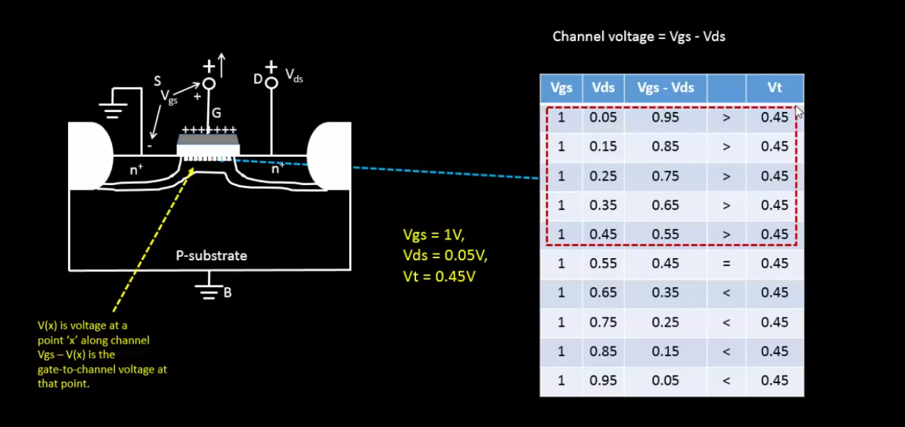


<a id="drain-current-model-for-saturation-region-of-operation"></a>
#### Drain Current Model for Saturation Region of Operation
These images show how the effective channel length reduces due to pinch-off and how the drain current (ID) becomes weakly dependent on VDS, leading to the saturation region equation with channel length modulation.


<a id="basic-spice-setup"></a>
### Basic SPICE Setup
Fabricating ICs is very expensive and time-consuming, so designers need simulation tools to explore the design space and verify designs before they are fabricated. Simulation is cheap, but silicon revisions (even a single Metal layer change) are prohibitively expensive.  

Simulators operate at many levels of abstraction, from process through architecture.
  - Process simulators such as SUPREME predict how factors in the process recipe such as time and temperature affect device physical and electrical characteristics.
  - Circuit simulators such as SPICE and Spectre use device models and a circuit netlist to predict circuit voltages and currents, which indicate performance and power consumption.
  - Logic simulators such as VCS and ModelSim are widely used to verify correct logical operation of designs specified in a hardware description language (HDL).
  - Architecture simulators, sometimes offered with a processor’s development toolkit, work at the level of instructions and registers to predict throughput and memory access patterns, which influence design decisions such as pipelining and cache memory organization.

The various levels of abstraction offer trade-offs between degree of detail and the size of the system that can be simulated. VLSI designers are primarily concerned with circuit and logic simulation.

SPICE (Simulation Program with Integrated Circuit Emphasis) was originally developed in the 1970s at University of California, Berkeley. It solves the nonlinear differential equations describing components such as transistors, resistors, capacitors, and voltage sources.  

Based on the original SPICE, there are many SPICE versions available - both free (like Ngspice, Xyce, LTSpice, TINA-TI) as well as commercial (HSPICE, PSPICE). All versions of SPICE read an input file and generate an output  with results, warnings, and error messages. The input file is often called a _**SPICE deck**_ and each line is called a _**card**_ because it was once provided to a mainframe as a deck of punch cards.  

A circuit simulator is provided with an input file that contains:
  - A _**netlist**_ consisting of components and nodes detailing the circuit connectivity.  
    The netlist can be entered by hand or extracted from a circuit schematic or layout in a CAD program.
  - Component behaviour by means of _**device models**_ and _**model parameters**_.
  - The Initial state of the circuit -- _**initial conditions**_ 
  - Inputs to the circuit, called _**stimulus**_
  - _**Simulation options**_ & _**analysis commands**_ that explain the type of simulation to be run.


**Analysis Types supported by SPICE:**
| Analysis Type | Details |
|:---|:---|
| DC Analysis | Find the DC operating point of the circuit i.e., all voltages and currents |
| AC Small-Signal Analysis | AC analysis is limited to analog nodes and represents the small signal, sinusoidal solution of the analog system described at a particular frequency or set of frequencies.
| Transient Analysis | Transient analysis is an extension of DC analysis to the time domain. In other words, it solves a DC Analysis for each timestep based on initial conditions. |
| Pole-Zero Analysis | Computes the poles and/or zeros in the small-signal ac transfer function. |
| Small-Signal Distortion Analysis | Computes steady-state harmonic and intermodulation products for small input signal magnitudes. |
| Sensitivity Analysis | Calculate either the DC operating-point sensitivity or the AC small-signal sensitivity of an output variable with respect to all circuit variables, including model parameters. |
| Noise Analysis | Measures the device-generated noise for a given circuit. |
<br>

The following images show how a SPICE deck is written to perform DC analysis of an NMOS transistor:
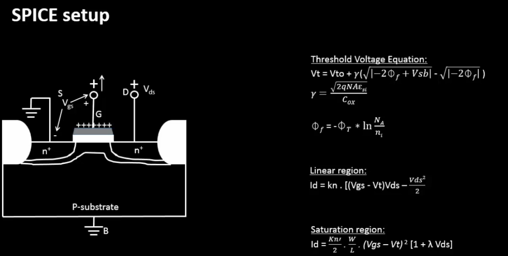


#### Circuit Description in SPICE Syntax

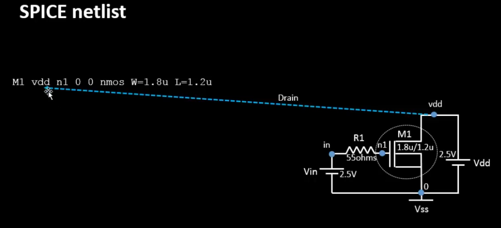
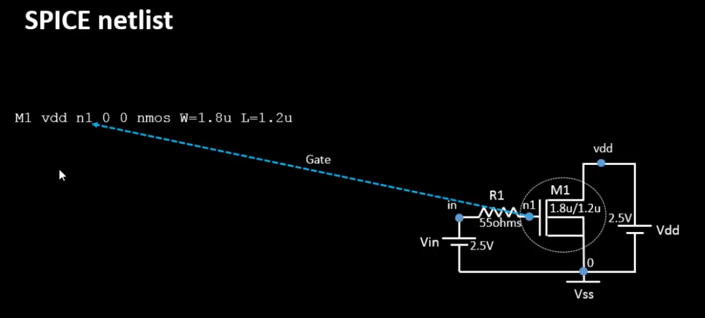
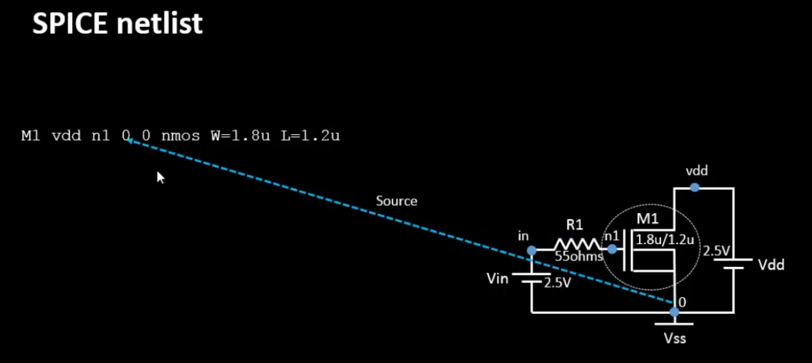
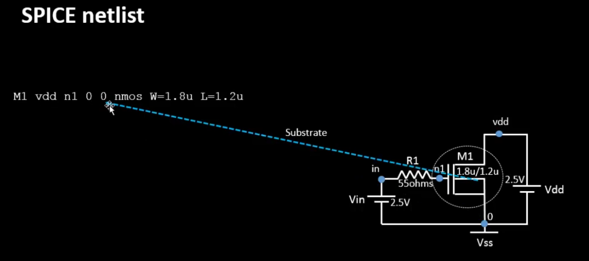

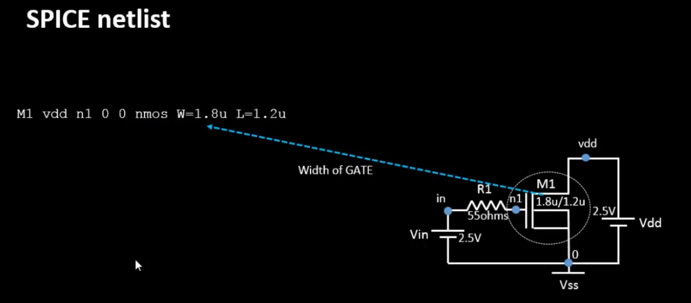
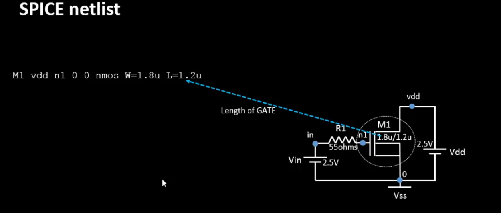

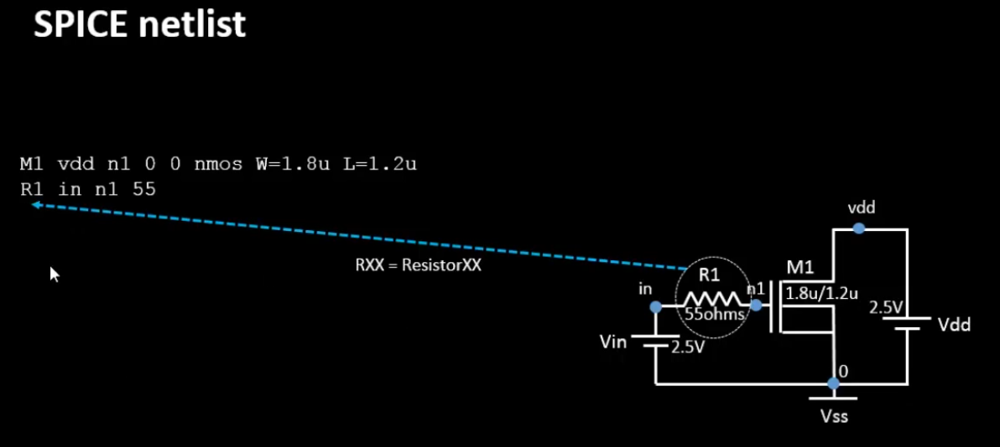
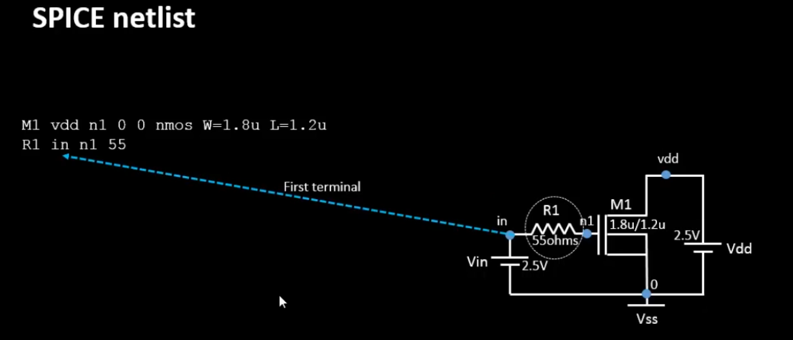
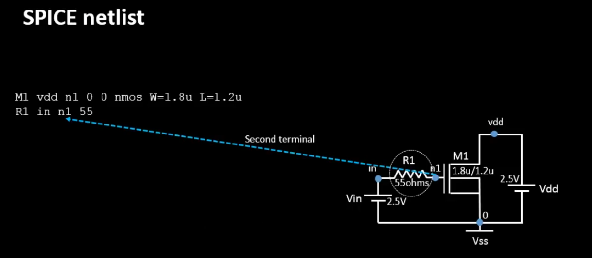
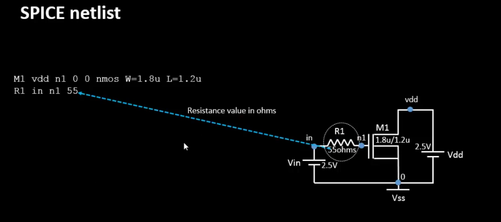


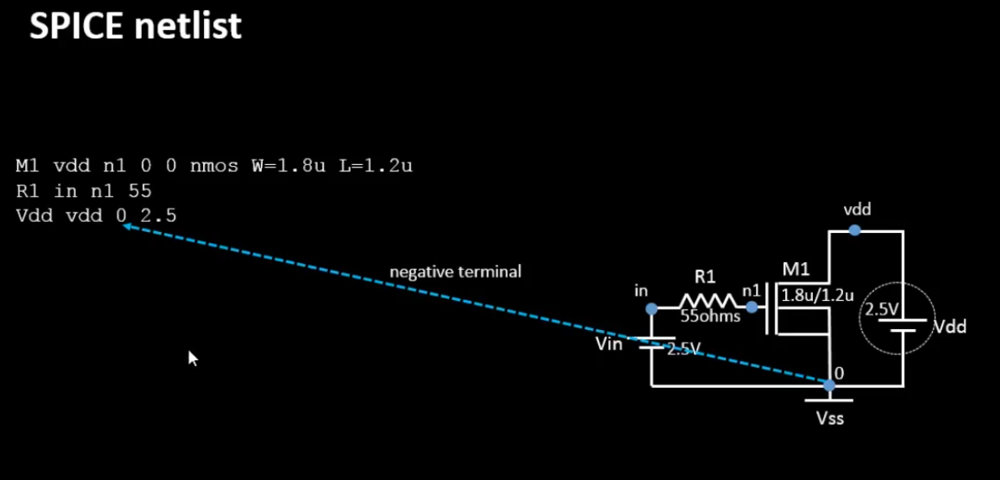
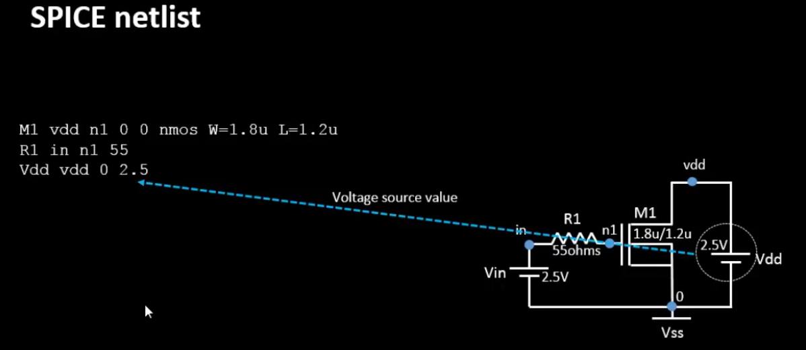

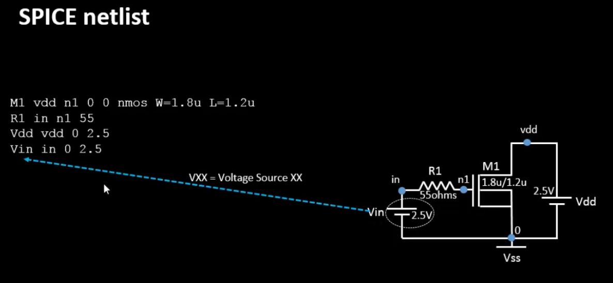
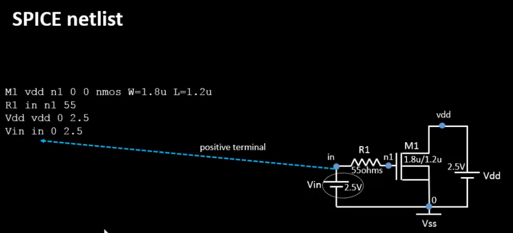
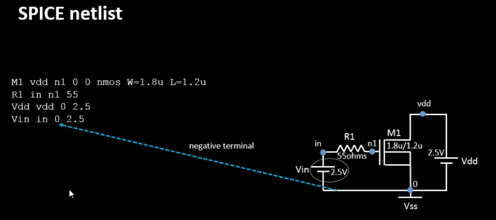
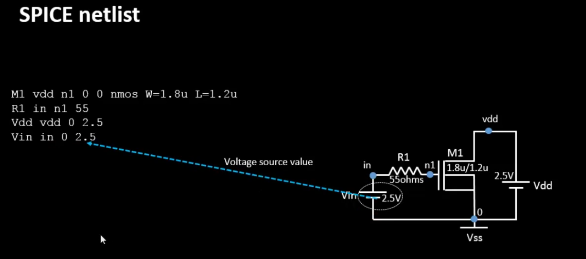


