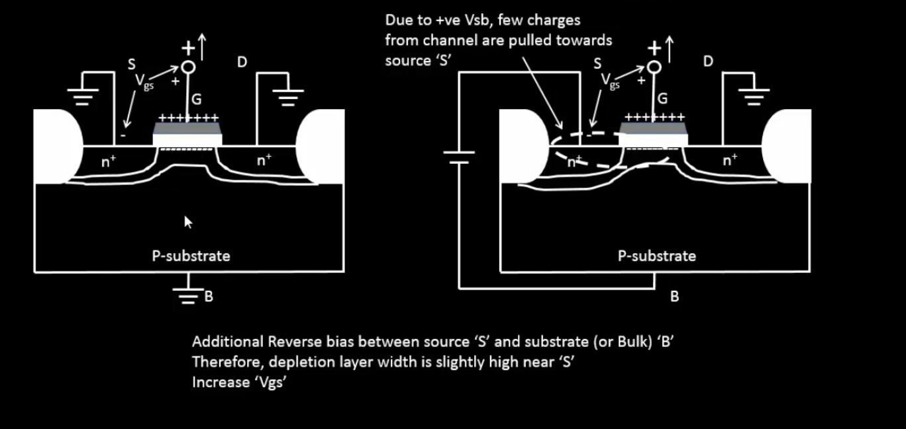

  
<strong> Day 8 : Circuit Design and Spice Simulation</strong>

## SPICE Simulation
SPICE (Simulation Program with Integrated Circuit Emphasis) is a powerful simulation tool developed at UC Berkeley in the early 1970’s, used in electronics design to model and analyze the behavior of electronic circuits before they are physically built.

The input file is often called a ***SPICE deck*** and each line is called a ***card*** because it was once provided to a mainframe as a deck of punch cards.

A circuit simulator is provided with an input file that contains:
- A *netlist* consisting of components and nodes detailing the circuit connectivity.
- The netlist can be entered by hand or extracted from a circuit schematic or layout in a CAD program.
- Component behaviour by means of *device models* and *model parameters*.
- The Initial state of the circuit -- *initial conditions*
- Inputs to the circuit, called *stimulus*
- *Simulation options* & *analysis commands* that explain the type of simulation to be run.

### Why Use SPICE?  
- **Verify Correctness**: Check that every gate, bias network or feedback loop operates as intended under realistic device models—catching design errors early.  
- **Predict Performance**: Run DC sweeps and transient analyses to extract rise/fall times, propagation delays, bandwidth and short-circuit currents critical for digital timing closure and analog bandwidth planning. 
- **Assess Power**: Quantify dynamic and leakage power across supply-voltage, temperature and process corners to guide low-power design choices.
- **Explore Variability**: Use parametric and Monte Carlo studies to probe component tolerances, layout parasitics and manufacturing variation—refining margins before tape-out.

### Common Spice Elements and Spice Units

### Inverter Circuit

An inverter is a simple circuit that reverses the input signal:
- Uses two transistors: PMOS and NMOS.
- PMOS connects to the power supply (VDD), NMOS connects to ground (GND).
- Both transistors have their gates connected to the input and their drains connected to the output.

Operation:
- When the input is high, the NMOS transistor conducts, making the output low.
- When the input is low, the PMOS transistor conducts, making the output high.

Role of SPICE in Inverter Design
- Functionality Check: Verify that the inverter correctly flips the input signal.
- Timing Analysis: Measure how quickly the inverter responds to changes in the input.
- Power Analysis: Determine the power usage of the inverter during operation.

SPICE simulations are essential for designing circuits that are reliable and efficient. They help identify issues early and allow for optimization before the physical circuit is built.

**CMOS Inverter Circuit Diagram**

This schematic shows a standard CMOS inverter:

- Vin is applied to both PMOS and NMOS gates.
- Vout is taken at the common drain node.
- PMOS connects from VDD to the output.
- NMOS connects from the output to VSS (GND).
- CL represents the load capacitance, mimicking the next stage or parasitic load.

### SPICE Simulation Results of Inverter Circuit

First graph shows the NMOS drain current (ID) versus output voltage (Vout) for several gate‐to‐source biases (Vin=0, 0.5, 1, 1.5, 2 V). Each curve is an I–V “slice” of the NMOS. While the second graph indicates voltage transfer charcteristics (Vout vs Vin)

### Understanding Delay Tables
In digital timing analysis cell delay is a function of input slew (input transition) and output load. The delay values are usually stored in 2D LUTs (Lookup Tables) or 3D LUTs.
- 2D LUT: Slew × Load → Delay
- 3D LUT: Slew × Load × Related‐Load → Delay (uses a third dimension called related output load (Capacitance load seen by the related output pin).
Example of a 2D LUT is shown below:

Here, each buffer (CBUF1 and CBUF2) has a delay table defined which is indexed by input slew as rows (eg: 20ps, 40ps, 60ps, 80ps) and output load as columns (eg: 10fF, 30fF, 50fF, 70fF, 90fF, 110fF) while the corresponding delay values are x1 to x24 for CBUF1, y1 to y24 for CBUF2.
## NMOS Transistor - Basic Element in Circuit Design

This diagram shows a cross-section of an n-channel MOSFET (NMOS) and labels its key regions and terminals:
- *P-substrate (Body, B)*: The bulk of the device is a p-type silicon wafer. It’s typically tied to the lowest potential (ground) in an NMOS circuit.
- *n⁺ Source (S)* and *Drain (D)* Regions: Heavily doped n-type diffusion areas implanted into the p-substrate. Source is where electrons enter; drain is where they exit when the device is on.
- *Gate (G) and Gate Oxide*: Gate Oxide is very thin insulating layer of SiO₂ that separates the gate electrode from the silicon while Poly-Si (or metal) Gate is a conductive layer deposited on top of the oxide; applying voltage here controls the channel.

This diagram illustrates the NMOS transistor in its off (zero‐gate‐bias) condition and how the threshold voltage is defined. 
-  Here, with *all four terminals gate, source, drain, and substrate are tied to ground*. With the gate-to-source voltage at zero, no inversion layer forms beneath the thin silicon oxide gate dielectric, so the channel remains *non-conductive*.
-  At the same time, the p–n junctions between the n⁺ source/drain regions and the p-type substrate behave like reverse-biased diodes, blocking any current path from source to drain. In effect, the transistor presents a very high resistance between its source and drain.

The **threshold voltage (Vₜ)**, is defined as the minimum gate-to-source voltage required to attract enough electrons to the oxide interface to invert the channel region; only when Vgs rises above Vₜ does the device switch on and allow current to flow.

**Applying +Vgs**  
  As the gate voltage rises above 0 V, the gate electrode becomes positively charged.  
- **Hole Depletion**: The electric field repels p-type holes away from the silicon–oxide interface, widening the depletion region beneath the gate.  
- **Electron Attraction**: Negative carriers (electrons) from the n⁺ source/drain diffuse toward the gate region, beginning to accumulate at the silicon surface.  
- **Onset of Inversion** : These accumulated electrons form the first *“inversion layer”* under the oxide setting the stage for a continuous channel once Vgs reaches the threshold voltage.

**Further Increase in Vgs**  
  Once Vgs exceeds Vt, the inversion channel is already established.  
- **Stable Depletion Width** : The depletion region under the gate stops widening additional gate bias doesn’t deepen depletion.  
- **Electron Supply from Source/Drain** : Electrons from the heavily doped n⁺ source/drain regions fill the channel region beneath the gate.  
- **Conductivity ∝ (Vgs − Vt)** : The density of mobile electrons in the channel increases with Vgs, lowering channel resistance and boosting drain current for a given VDS.

### Effect of Subtrate/ Body Bias on Threshold Voltage
*What is Body Effect?*

Whenever there is a voltage (potential) difference between the source and substrate (body), this leads to an increase or decrease in the threshold voltage of the transistor. This is called a “body effect.”

The images shows the comparison of NMOS operation with Vsb = 0 and Vsb = positive value

When Vsb = 0, normal channel formation happens as Vgs increases.
When Vsb > 0, an additional reverse bias is introduced between Source and Body (substrate).
- This increases the threshold voltage (Vth).
- The depletion layer near Source becomes wider.
- More Vgs is required to turn ON the transistor (stronger inversion).
This effect is known as the *Body Effect* or *Substrate Bias Effect*.

**Threshold Voltage Equation considering Body Bias:**

### Resistive/ Linear/ Triode Region of Operation
#### Drift current theory

### Saturation/ Pinch-Off Region of Operation

