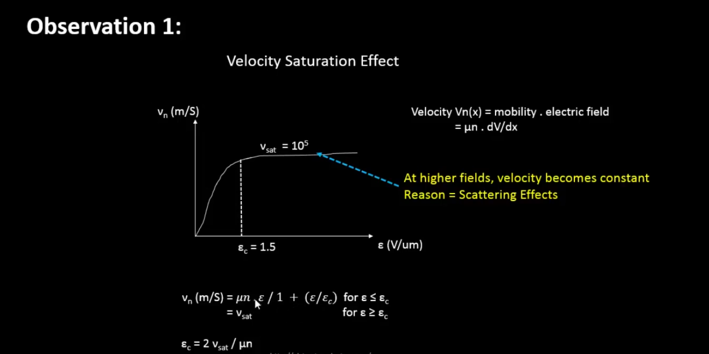

  
<strong> Day 9 : Velocity Saturation and basics of CMOS inverter VTC</strong>

## Contents
- [SPICE Simulation for lower nodes](#spice-simulation-for-lower-nodes)
  - [Drain Current vs Gate Voltage for long and short channel device](#drain-current-vs-gate-voltage-for-long-and-short-channel-device)
  - [Velocity Saturation at lower and higher electric fields](#velocity-saturation-at-lower-and-higher-electric-fields)

## SPICE Simulation for lower nodes
- The behavior of transistors with very short channel lengths (called short-channel devices) deviates considerably from the resistive and saturated models. The main reason for this deviation is the velocity saturation effect.
- We had seen previously that the drift velocity is modelled by:

  *Drift velocity,  v = -u (dV/dx)* i.e., the velocity of the carriers is proportional to the electrical field, independent of the value of that field. In other words, the carrier mobility is a constant.
- However, at high electric field strengths, the carriers fail to follow this linear model.
- When the electrical field along the channel reaches a critical value  Ec, the velocity of the carriers tends to saturate due to scattering effects (collisions suffered by the carriers).
- The plot below shows the output characteristics of an NMOS device with W=1.8μm, L=1.2μm (W/L = 1.5).

**Linear Region**: *The region before Vds = Vgs - Vt, where Id varies linearly with Vds.* The drain current (Id) is a linear function of Vds in this region. It is defined for Vds < (Vgs - Vt).

**Saturation Region**:  *The region after Vds = Vgs - Vt, where Id is influenced by channel length modulation and Vds.* The drain current (Id) depends on channel length modulation and Vds. It is defined for Vds ≥ (Vgs - Vt).

### Drain Current vs Gate Voltage for long and short channel device

**Observation 1: SPICE Simulation for 2 different devices (Long Channel vs SHort Channel Characteristics)**
- Device1: W=1.8u, L=1.2u
- Device2: W=0.375u, L=0.25u

The plot below compares NMOS output characteristics for long channel and short channel devices with same W/L ratio

- In the above figures, the left plot corresponds to a device1 with W = 1.8μm and L = 1.2μm (long-channel device), and the right plot corresponds to device2 with W = 0.375μm and L = 0.25μm (short-channel device).
- Since the channel length is < 0.25μm in the second case, it is classified as a short-channel device.
- Both devices have the same W/L ratio, but different absolute Width (W) and Length (L), allowing us to compare their electrical behavior directly.
- When we apply a constant Vds and sweep Vgs:
  - In long-channel devices, the drain current (Id) shows an ideal quadratic dependence on Vgs.
  - In short-channel devices, Id remains quadratic at low Vgs but gradually becomes linear at higher Vgs. This is due to velocity saturation, which limits carrier velocity as the electric field increases. Once the carrier velocity reaches its maximum limit (velocity saturation), the Id-Vgs curve flattens into a linear region.

Thus, this plot clearly demonstrates how velocity saturation alters the Id behavior in short-channel devices — causing a transition from quadratic to linear dependence at higher Vgs.

- For long-channel devices, drain current shows a quadratic dependence on gate voltage.
- For short-channel devices, it is quadratic at low gate voltage but becomes linear at higher voltages due to velocity saturation.

### Velocity Saturation at lower and higher electric fields
- At lower electric fields, carrier velocity increases linearly with the electric field.
- At higher electric fields, velocity saturates and becomes constant due to velocity saturation.

