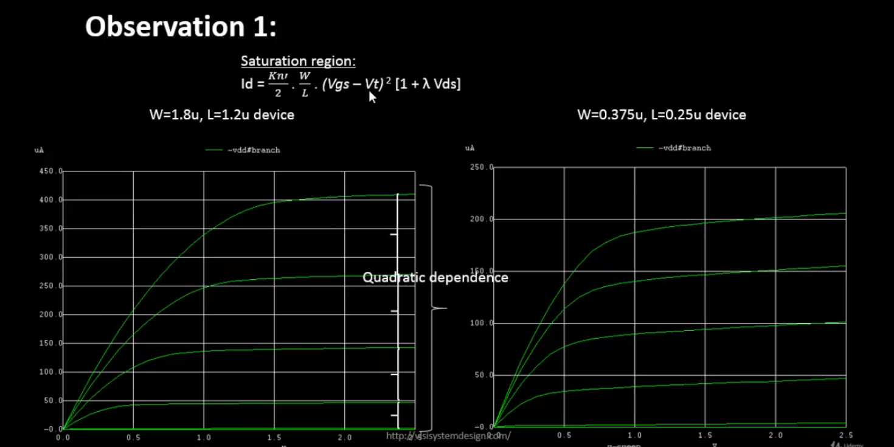
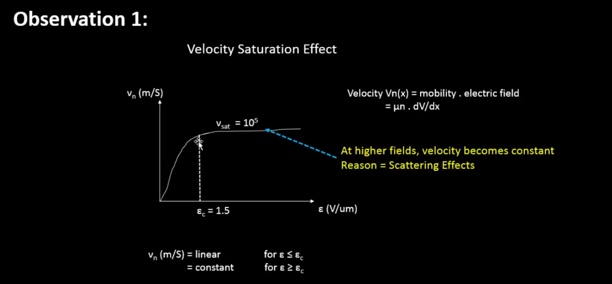
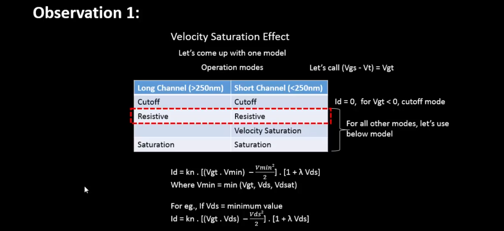

<details>
  <Summary><strong> Day 9 : Velocity Saturation and basics of CMOS inverter VTC</strong></summary>

## Contents
- [SPICE Simulation for lower nodes](#spice-simulation-for-lower-nodes)
  - [Drain Current vs Gate Voltage for long and short channel device](#drain-current-vs-gate-voltage-for-long-and-short-channel-device)
  - [Velocity Saturation at lower and higher electric fields](#velocity-saturation-at-lower-and-higher-electric-fields)
  - [Velocity Saturation Drain Current Model](#velocity-saturation-drain-current-model)
  - [Lab Sky130 Id-Vgs](#lab-sky130-id-vgs)
- [CMOS Voltage Transfer Characteristics](#cmos-voltage-transfer-characteristics)
  - [MOSFET as a Switch](#mosfet-as-a-switch)
  - [Load Line Curves for NMOS and PMOS](#load-line-curves-for-nmos-and-pmos)

<a id="spice-simulation-for-lower-nodes"></a>
## SPICE Simulation for lower nodes
- The behavior of transistors with very short channel lengths (called short-channel devices) deviates considerably from the resistive and saturated models. The main reason for this deviation is the velocity saturation effect.
- We had seen previously that the drift velocity is modelled by:

  *Drift velocity,  v = -u (dV/dx)* i.e., the velocity of the carriers is proportional to the electrical field, independent of the value of that field. In other words, the carrier mobility is a constant.
- However, at high electric field strengths, the carriers fail to follow this linear model.
- When the electrical field along the channel reaches a critical value  E<sub>c</sub>, the velocity of the carriers tends to saturate due to scattering effects (collisions suffered by the carriers).
- The plot below shows the output characteristics of an NMOS device with W=1.8μm, L=1.2μm (W/L = 1.5).


**Linear Region**: *The region before V<sub>ds</sub> = V<sub>gs</sub> - V<sub>t</sub>, where I<sub>d</sub> varies linearly with V<sub>ds</sub>.* The drain current (I<sub>d</sub>) is a linear function of V<sub>ds</sub> in this region. It is defined for V<sub>ds</sub> < (V<sub>gs</sub> - V<sub>t</sub>).

**Saturation Region**:  *The region after V<sub>ds</sub> = V<sub>gs</sub> - V<sub>t</sub>, where I<sub>d</sub> is influenced by channel length modulation and V<sub>ds</sub>.* The drain current (I<sub>d</sub>) depends on channel length modulation and V<sub>ds</sub>. It is defined for V<sub>ds</sub> ≥ (V<sub>gs</sub> - V<sub>t</sub>).

<a id="drain-current-vs-gate-voltage-for-long-and-short-channel-device"></a>
### Drain Current vs Gate Voltage for long and short channel device

**Observation 1: SPICE Simulation for 2 different devices (Long Channel vs SHort Channel Characteristics)**
- Device1: W=1.8u, L=1.2u
- Device2: W=0.375u, L=0.25u

The plot below compares NMOS output characteristics for long channel and short channel devices with same W/L ratio




- In the above figures, the left plot corresponds to a device1 with W = 1.8μm and L = 1.2μm (long-channel device), and the right plot corresponds to device2 with W = 0.375μm and L = 0.25μm (short-channel device).
- Since the channel length is < 0.25μm in the second case, it is classified as a short-channel device.
- Both devices have the same W/L ratio, but different absolute Width (W) and Length (L), allowing us to compare their electrical behavior directly.
- When we apply a constant V<sub>ds</sub> and sweep V<sub>gs</sub>:
  - In long-channel devices, the drain current (I<sub>d</sub>) shows an ideal quadratic dependence on V<sub>gs</sub>.
  - In short-channel devices, I<sub>d</sub> remains quadratic at low V<sub>gs</sub> but gradually becomes linear at higher V<sub>gs</sub>. This is due to velocity saturation, which limits carrier velocity as the electric field increases. Once the carrier velocity reaches its maximum limit (velocity saturation), the I<sub>d</sub>-Vgs curve flattens into a linear region.

Thus, this plot clearly demonstrates how velocity saturation alters the I<sub>d</sub> behavior in short-channel devices — causing a transition from quadratic to linear dependence at higher V<sub>gs</sub>.

- For long-channel devices, drain current shows a quadratic dependence on gate voltage.
- For short-channel devices, it is quadratic at low gate voltage but becomes linear at higher voltages due to velocity saturation.


<a id="velocity-saturation-at-lower-and-higher-electric-fields"></a>
### Velocity Saturation at lower and higher electric fields
- At lower electric fields, carrier velocity increases linearly with the electric field.
- At higher electric fields, velocity saturates and becomes constant due to velocity saturation.




Short Channel devices (with *channel length<250nm*), has 4 modes of operation:
- Cutoff Region
- Resistive Region
- **Velocity Saturation Region** (Additional mode due to *velocity saturation* effect in short channel devices)
- Saturation Region

<a id="velocity-saturation-drain-current-model"></a>
### Velocity Saturation Drain Current Model


V<sub>dsat</sub> - Saturation voltage i.e. voltage at which device velocity saturates and is independent of V<sub>gs</sub> or V<sub>ds</sub>. It is a Technology Parameter.



**Observation 2: Peak Current Comparison - Long Channel vs Short Channel devices**

- The figure above compares the peak drain current (I<sub>d</sub>) between a long-channel and short-channel NMOS device.
- Peak current of Long-channel device (I<sub>d</sub>) = 410 μA (Left plot)
- Peak current of Short-channel device (I<sub>d</sub>) = 210 μA (Right plot)
- Even though short-channel devices allow for faster switching and smaller sizes, their peak drain current (I<sub>d</sub>) is lower than long-channel devices. The reduction in peak current is due to velocity saturation — which limits carrier velocity in short-channel devices. In long-channel devices, carriers accelerate freely, giving higher I<sub>d</sub>.

<a id="lab-sky130-id-vgs"></a>
### Lab Sky130 Id-Vgs
  <details>
      <Summary><strong> SPICE file: day2_nfet_idvds_L015_W039.spice</strong></summary>
          
          *Model Description
          .param temp=27
          
          *Including sky130 library files
          .lib "sky130_fd_pr/models/sky130.lib.spice" tt
          
          *Netlist Description
          XM1 Vdd n1 0 0 sky130_fd_pr__nfet_01v8 w=0.39 l=0.15
          R1 n1 in 55
          Vdd vdd 0 1.8V
          Vin in 0 1.8V
          
          *simulation commands
          .op
          .dc Vdd 0 1.8 0.1 Vin 0 1.8 0.2
          
          .control
          
          run
          display
          setplot dc1
          .endc
          .end
  </details>

**to plot the waveforms in ngspice:**

```bash
ngspice day2_nfet_idvds_L015_W039.spice 
plot -vdd#branch
```

**The plot of Ids vs Vds over constant Vgs:**

Peak current = 196uA

  <details>
      <Summary><strong> SPICE file: day2_nfet_idvds_L015_W039.spice</strong></summary>
          
          *Model Description
          .param temp=27
          
          *Including sky130 library files
          .lib "sky130_fd_pr/models/sky130.lib.spice" tt
          
          *Netlist Description
          XM1 Vdd n1 0 0 sky130_fd_pr__nfet_01v8 w=0.39 l=0.15
          R1 n1 in 55
          Vdd vdd 0 1.8V
          Vin in 0 1.8V
          
          *simulation commands
          .op
          .dc Vin 0 1.8 0.1 
          
          .control
          
          run
          display
          setplot dc1
          .endc
          .end
  </details>

**to plot the waveforms in ngspice:**

```bash
ngspice day2_nfet_idvgs_L015_W039.spice
plot -vdd#branch
```

**The plot of Ids vs Vgs over constant Vds:**


<a id="cmos-voltage-transfer-characteristics"></a>
## CMOS Voltage Transfer Characteristics

<a id="mosfet-as-a-switch"></a>
### MOSFET as a Switch

- OFF State: The MOSFET behaves as an open switch (infinite OFF resistance) when: |V<sub>gs</sub>| < |V<sub>th</sub>|
- ON State: The MOSFET behaves as a closed switch (finite ON resistance) when: |V<sub>gs</sub>| > |V<sub>th</sub>|


<a id="introduction-to-standard-mos-voltage-current-parameters"></a>
### Introduction to standard MOS voltage current parameters
- The figure below shows the CMOS inverter in both transistor-level and switch-level representations:


<a id="pmos/nmos-drain-current-v/s-drain-voltage"></a>
### PMOS/NMOS drain current v/s drain voltage


<a id="load-line-curves-for-nmos-and-pmos"></a>
### Load Line Curves for NMOS and PMOS
Step 1: Convert the PMOS gate-source voltage (VgsP) into an equivalent Vin.

Replace all internal node voltages with Vin, Vdd, Vss, and Vout.


Step 2 & 3: Convert PMOS and NMOS drain-source voltages to Vout.


Step 4: Merge the NMOS and PMOS load curves by equating their Ids characteristics with respect to Vout.

Plot the Voltage Transfer Characteristic (VTC) by sweeping Vin and mapping the corresponding Vout, showing the inverter switching behavior from logic HIGH to LOW.


</details>
