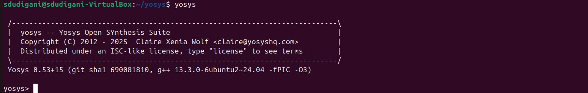
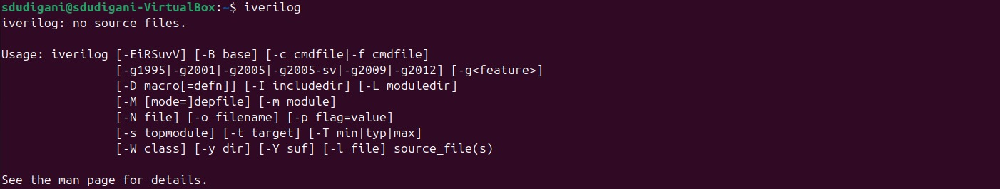
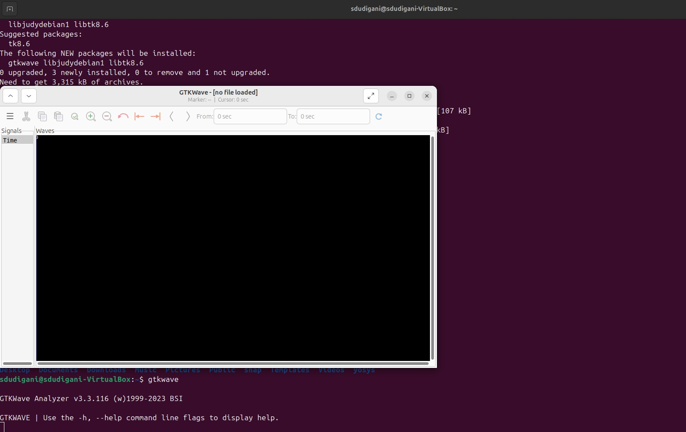
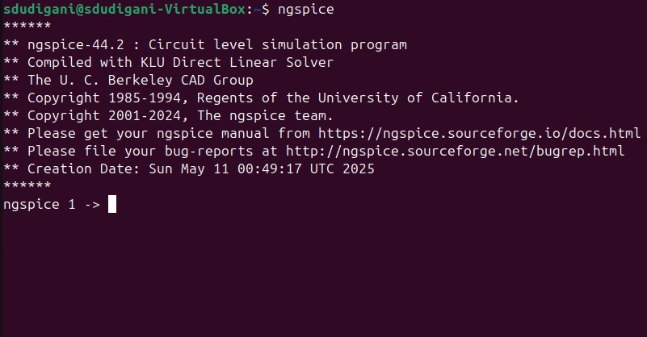
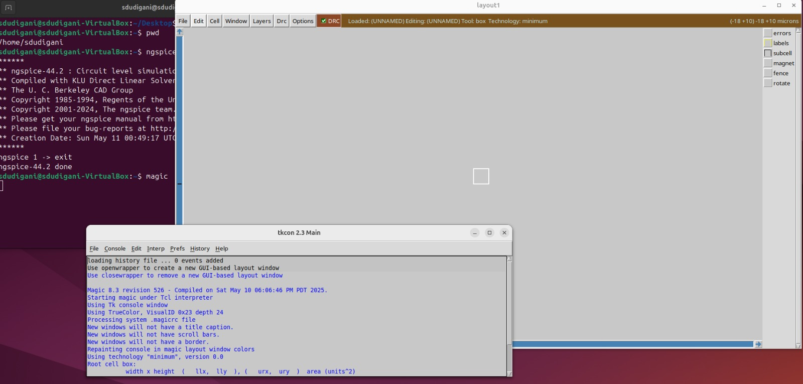

# VSD Hardware Design Program

  
 Week 0 - Day 0 - Tools Installation

## System Check
      - 6 GB RAM  
      - 50 GB HDD  
      - Ubuntu 20.04+  
      - 4 vCPU  
      
## Tool Check
  #### 1. Yosys
    $ sudo apt-get update
    $ git clone https://github.com/YosysHQ/yosys.git
    $ cd yosys
    $ sudo apt install make  # If make is not installed
    $ sudo apt-get install build-essential clang bison flex \
        libreadline-dev gawk tcl-dev libffi-dev git \
        graphviz xdot pkg-config python3 libboost-system-dev \
        libboost-python-dev libboost-filesystem-dev zlib1g-dev
    $ make config-gcc
    $ make
    $ sudo make install

  #### 2. iverilog
    $ sudo apt-get update
    $ sudo apt-get install iverilog

  #### 3. gtkwave
    $ sudo apt-get update
    $ sudo apt install gtkwave

  #### 4. ngspice
  ##### After downloading the tarball from https://sourceforge.net/projects/ngspice/files/ to a local directory, unpack it using:
    $ tar -zxvf ngspice-37.tar.gz
    $ cd ngspice-37
    $ mkdir release
    $ cd release
    $ ../configure --with-x --with-readline=yes --disable-debug
    $ make
    $ sudo make install

  #### 5. magic
  ##### Install the required dependencies:
    $ sudo apt-get install m4
    $ sudo apt-get install tcsh
    $ sudo apt-get install csh
    $ sudo apt-get install libx11-dev
    $ sudo apt-get install tcl-dev tk-dev
    $ sudo apt-get install libcairo2-dev
    $ sudo apt-get install mesa-common-dev libglu1-mesa-dev
    $ sudo apt-get install libncurses-dev
  ##### Clone and build Magic:
    $ git clone https://github.com/RTimothyEdwards/magic
    $ cd magic
    $ ./configure
    $ make
    $ sudo make install

  
